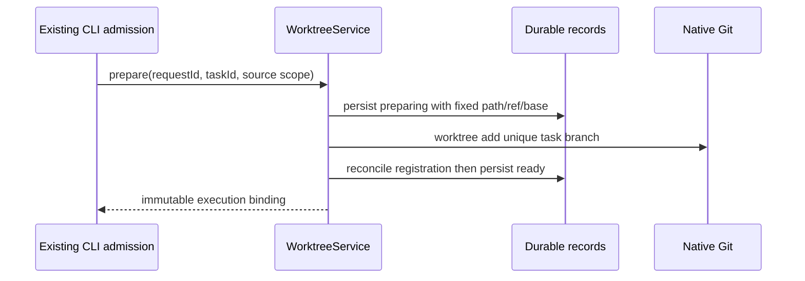

# Worktree service

WorktreeService is the only owner of bindings, archive snapshots and integration operations.
Review draft text, file exclusions and browsing stages are owned separately by the target
Host GitReviewWorkspaceState, exposed through the existing Git RPC contract. They never
authorize source commits or target publication. UI approvals remain local to the device,
and all execution still passes this service's candidate/checkout/version checks.
The host supplies its existing application data directory and Git command port. The storage
management service is not a business persistence API. Each record is an atomic private JSON
file; commands take an inter-process file lock before re-reading and writing it.

Task identity determines one binding. Repeated creation reconciles the original operation;
it never creates another checkout or silently falls back to the source directory. Only
committed code is used for ordinary new sessions; explicit forks capture current files as
described below. Source folders must reside in the same repository. Managed paths
are checked against canonical roots, symlinks and native Git registration before removal.

Explicit setup commands and ignored-file allowlists run before a binding becomes ready.
The service records completed steps; an interrupted or failed command requires explicit
retry. The creation fingerprint freezes source scope, project membership and requested
base independently from retryable setup configuration. Absent explicit setup, the Host
selects bounded dependency commands from unambiguous lockfiles; explicit empty setup
disables detection. Setup copies reject traversals and links, with 10,000-file / 64-MiB limits.

Preparation stages, bounded logs and cancellation are durable Host facts, queried by
original workspace identity and request ID. Cancel and ready share a short decision lock;
cancellation waits for the current step, then prevents first input. A cancelled request
cannot be retried. The renderer preserves the original input for manual resubmission.

A same-directory fork keeps its existing checkout. `prepare(parentBinding)` writes only a durable
child-to-owner alias after validating the real parent chain and original workspace. It
does not clone lifecycle state or create another directory. A child cannot switch trees,
and `getBinding` resolves both original and actual execution scopes through the same
root owner, including after restart. Archive and alias registration serialize against
that root binding. A new-worktree fork snapshots source HEAD, index and non-ignored
working files under the source checkout permit, then restores them once into a new
binding. It rejects busy, conflicted or changed sources without changing the source index.

Integration freezes source and target commits, merges in a separate detached checkout,
and exposes conflicts there. Manual or explicitly requested AI changes must be committed
in that checkout and their exact candidate reviewed before validation/publication.
The candidate detects conventional project checks before review unless explicitly
configured; unavailable checks require explicit UI skip acknowledgement. Target
publication obtains the same checkout permit used by runtime, rechecks branch/HEAD and
uses native read-tree dry-run to reject unsafe overwrites before and after validation.
Unrelated working changes remain intact; no automatic stash or target commit is performed.
It persists publishing and runs native fast-forward. Lost replies reconcile by exact
commit ancestry; unknown states retain files and fail without resetting user changes.

The target can be explicitly selected for a new request, but must already be checked out
in the original directory. `continueIntegration(cancel: true)` persists cancellation
without removing commits, receipts or checkout files. Cancelled operations cannot be
validated or published. Publishing/published facts cannot be cancelled or rolled back.

Archive saves a snapshot commit (working files plus non-ignored untracked files) and the
original index tree behind a durable ref before removing the managed checkout. Ignored
omissions require explicit acknowledgement. Restore reconstructs the original HEAD,
working files and index without overwriting an existing directory. Snapshot and task refs
remain reachable. There is no automatic deletion or ref garbage collection.

Checkout permits are canonical-directory locks across Host processes. Live owners never
expire by elapsed time. Runtime releases only after its writers stop; UI state is not a
writer proof. External editors remain outside the application permit boundary.

Validation: isolated real Git repositories cover idempotency, directory/index isolation,
restart, conflict isolation, stale/dirty publication, archive/restore and crash recovery.
