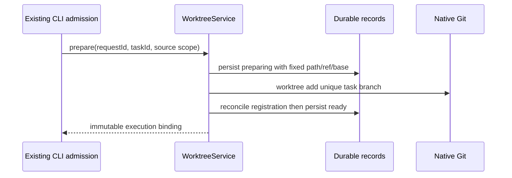

# Worktree service

Upgrade recovery preserves the original requestId and expected reference in the binding journal. Settled cancellation adds `environmentUpgrade.cancelled=true` and keeps updating; an explicit new request can continue only after verifying the old cancellation under the binding lock. Any already-published new reference must finish the old session CAS/consumer migration under a checkout writer before the new upgrade starts. UI remount/reconnect restores uncancelled intents from this journal. Failed candidate preparation also persists revision-zero cleanup references; only positive references may authorize execution, validation evidence or publication.

WorktreeService is the only owner of bindings, archive snapshots, integration operations and the deletion journal. Runtime-environment facts, consumers, service receipts and environment resources remain owned by the target Host RuntimeEnvironmentService; WorktreeService can only call them through injected lifecycle ports. It must not infer an environment from a path, PID or UI state.

The Host-only `stopWorktreeExecution(binding)` port runs after lifecycle fencing and before checkout removal, including local bindings without an environment reference. It stops owned execution scopes within the canonical checkout with the same identity, waits for pending startup and retired process cleanup, and closes owned file watchers before filesystem removal. Consumer release remains tied to exact owner exit receipts. EBUSY preserves the original deletion journal and all path / branch / session guards on retry; unknown execution owners remain blocked.

Confirmed discard also authorizes the bounded legacy migration in specs/worktree-discard.md: only old bridge process IDs for the exact collected sessions, binding and revision, with no persisted process owner receipt, may remain pending at stop. After an exclusive checkout writer, branch recheck and successful precise session purge, the Host-only retirement port records confirmed-worktree-discard audit then retires those exact leases. New owner receipts and every other consumer remain protected; archive/upgrade/release/GC never authorize this migration. No extra UI operation or public protocol field is added.

Public environment requests and recovered upgrade intents use the binding execution scope (`workspacePath` and `workspaceIdentity`); the Host facade alone maps it to `checkoutPath` storage scope. Explicit creation cancellation can accept an already-settled failed preparation receipt only for the original request and known environment, preserving its cancellation marker and cleanup reference. It neither replays installation nor makes the environment ready.

The public binding may contain an additive `environmentRef` (`environmentId`, non-negative preparation revision and optional manifest digest). A preparation revision of `0` is not executable, but remains a valid cleanup reference for an allocated, failed environment. Before managed execution the target Host re-reads identity, binding, positive revision, digest, canonical cwd and attachment; stale or missing facts fail closed. New `environmentPolicy: managed` requests require runtime ports and never fall back; absent/inherit/local requests retain local behavior even when ports are installed. Existing bindings and same-tree aliases cannot switch policy on retry. `list` accepts both origin and execution scopes, matching identity and canonical path together.

`WorktreeRuntimePorts` is the single injected Host contract. Preparation borrows an existing exclusive checkout writer and returns the frozen env overlay plus exact manifest reference. `dependenciesPrepared` suppresses only detected duplicate dependency installation, never explicit setup commands. Failed preparation preserves revision-zero environment references and bounded structured `preparation.runtimeError`. `createWorktreeService` returns trusted Host actions; RPC registration must use the explicit `createPublicWorktreeService` whitelist, excluding `upgradeRuntimeEnvironment`. Upgrade owns its stable request journal, fence/stop, writer, new binding reference and session CAS; cancellation uses a separate short decision lock and never restores ready.

Review draft text, file exclusions and browsing stages are owned separately by the target
Host GitReviewWorkspaceState, exposed through the existing Git RPC contract. They never
authorize source commits or target publication. UI approvals remain local to the device,
and all execution still passes this service's candidate/checkout/version checks.
The host supplies its existing application data directory and Git command port. The storage
management service is not a business persistence API. Each record is an atomic private JSON
file; commands take an inter-process file lock before re-reading and writing it.

Task identity determines one binding. Repeated creation reconciles the original operation;
it never creates another checkout or silently falls back to the source directory. Only
committed code is used for ordinary new sessions; explicit forks capture current files as
described below. Source folders must reside in the same repository. Managed paths
are checked against canonical roots, symlinks and native Git registration before removal.

`prepare.taskName` is an optional bounded naming hint, semantically summarized by the CLI
before creation from frozen input or a fork source title. The Host does not make model
requests: its normalization and length limit are Git safety boundaries. Existing callers
without a hint remain compatible. The service preserves Chinese in
`lcode/task-<name>` and allocates numeric suffixes (`-2`, `-3`) under a common-directory
inter-process naming lock, considering native Git refs and persisted binding reservations.
The chosen name is saved before checkout creation and never changes on retry or restore.
Existing bindings retain their names; display text never replaces stable task identity.

Explicit setup commands and ignored-file allowlists run before a binding becomes ready.
The service records completed steps; an interrupted or failed command requires explicit
retry. The creation fingerprint freezes source scope, project membership and requested
base independently from retryable setup configuration. Absent explicit setup, the Host
selects bounded dependency commands from unambiguous lockfiles; explicit empty setup
disables detection. Setup copies reject traversals and links, with 10,000-file / 64-MiB limits.

Preparation stages, bounded logs and cancellation are durable Host facts, queried by
original workspace identity and request ID. Cancel and ready share a short decision lock;
cancellation waits for the current step, then prevents first input. A cancelled request
cannot be retried. The renderer preserves the original input for manual resubmission.

A same-directory fork keeps its existing checkout. `prepare(parentBinding)` writes only a durable
child-to-owner alias after validating the real parent chain and original workspace. It
does not clone lifecycle state or create another directory. A child cannot switch trees,
and `getBinding` resolves both original and actual execution scopes through the same
root owner, including after restart. Archive and alias registration serialize against
that root binding. A new-worktree fork snapshots source HEAD, index and non-ignored
working files under the source checkout permit, then restores them once into a new
binding. It rejects busy, conflicted or changed sources without changing the source index.

Integration freezes source and target commits, merges in a separate detached checkout,
and exposes conflicts there. Manual or explicitly requested AI changes must be committed
in that checkout and their exact candidate reviewed before validation/publication.
The candidate detects conventional project checks before review unless explicitly
configured; unavailable checks require explicit UI skip acknowledgement. Target
publication obtains the same checkout permit used by runtime, rechecks branch/HEAD and
uses native read-tree dry-run to reject unsafe overwrites before and after validation.
Every candidate validation must persist a bounded `ValidationReceipt` linked to candidate
HEAD/tree, source/target HEAD, candidate environment reference or explicit non-managed fact,
manifest/declaration digest, command, exit code, output truncation and verified time. A
missing, stale or failed prerequisite never becomes publishable `ready`; an explicit skip
is a durable unverified fact. Candidate environment changes, lock/declaration changes or
target changes invalidate prior receipts. Unrelated working changes remain intact; no
automatic stash or target commit is performed.
It persists publishing and runs native fast-forward. Lost replies reconcile by exact
commit ancestry; unknown states retain files and fail without resetting user changes.

The target is an explicit local branch. Native worktree registration resolves its actual
checkout. Unchecked targets use a detached managed temporary checkout; only final
confirmation checks out that branch and fast-forwards it under the checkout permit.
The original project branch is never switched. Successful temporary targets are safely
removed; a cleanup failure retains the published fact and diagnostic. Operations record
repositoryPath and targetTemporary, with old records preserving their original semantics.
Remote publication reads the explicit target branch ref from repositoryPath, so it does
not depend on the temporary checkout or the original directory current branch. `continueIntegration(cancel: true)` persists cancellation
without removing commits, receipts or source/candidate checkout files; its owned clean temporary
target can be removed. Cancelled operations cannot be
validated or published. Publishing/published facts cannot be cancelled or rolled back.

Archive saves a snapshot commit (working files plus non-ignored untracked files) and the
original index tree behind a durable ref before removing the managed checkout. Ignored
omissions require explicit acknowledgement. Restore reconstructs the original HEAD,
working files and index without overwriting an existing directory. Snapshot and task refs
remain reachable. A removed task branch can be recreated from the saved HEAD on restore;
an existing changed branch is never moved. Ignored directories are recorded as ranges
instead of enumerating every dependency file.

Restore is not complete when Git files are restored. After the snapshot/index/HEAD step,
WorktreeService must request an environment `restore` operation on the actual target Host,
obtain a new environmentId/revision and digest, persist the new binding reference, and
rebind all same-tree sessions. Old service receipts, PIDs, URLs, running state and private
data are never copied. If private data cannot be rebuilt, the operation remains pending or
requires an explicit save/export/discard decision; code snapshot success must not be shown
as full environment recovery.

`archive(discard)` explicitly confirms the binding's branch and checkout path and deletes
the checkout, unmerged task branch and owned snapshot refs without creating a snapshot.
It serializes with integration and checkout writers, cancels unpublished review candidates,
and preserves `deleting` / `deleted` tombstones so old sessions cannot silently execute in
the original project. Interrupted deletion retries only against the captured task branch
HEAD. Deleted bindings release naming reservations and are omitted from project lists,
but remain readable via getBinding. Directory removal has a separate long file-operation
budget; lease contention still fails promptly instead of waiting for a running task.
This management operation does not require an active or persisted chat session.
Git removal can unregister a checkout before failing to remove its contents. Archive and
discard share one removal path under the checkout lease: reconcile native registration,
recheck the canonical managed path, reject any remaining `.git` marker, then remove residual
contents with bounded filesystem retries. An interrupted discard journal or archive snapshot
allows cleanup to resume after restart; registration absence alone is not deletion evidence.
Success requires both native registration and the managed directory to be gone.

An explicitly confirmed discard retries structured transient filesystem errors (`EBUSY`,
`ENOTEMPTY`, `EPERM`) within the same awaited command, with Host-adapter backoff capped at
120 seconds of cumulative waiting. Every attempt re-enters the original lifecycle and
revalidates binding/path/HEAD, stop proofs, session scope and checkout leases. Waiting
releases attempt-local permits while the durable deletion fence remains. Original journal
IDs remain authoritative; exhaustion preserves `deleting` and the real error. Unknown
owners, changed branches, writer conflicts and other business failures never become
retryable through an error-text match. Clients do not own timers or a second delete queue.

The Host injects physical directory removal (Electron original-fs; Node fs otherwise)
after canonical/.git guards. Explicit discard also purges all chats sharing the binding,
including aliases and hidden tasks. The CLI SessionStore owns permanent chat deletion;
the worktree domain only calls collect/discard ports. IDs are journaled before removal
for retry after a lost reply. Host task-index notifications follow durable chat deletion.
Failure retains deleting plus a diagnostic; ordinary snapshot archive preserves chats.
Confirmed discard also removes the bound environment-private resources (including data)
and the exact purged sessions' model-I/O diagnostics. Candidate environments in this same
discard use discard cleanup too; standalone candidate cancellation retains private data.
Every retry recollects scoped descendants using the original journal IDs, merges the full
set before purge, and never drops previously journaled IDs when their SQL rows are gone.

When an environment reference exists, discard/archive must call the injected environment
release coordinator before declaring the binding removable. The coordinator fences new
consumers, stops only processes owned by this binding, and returns releaseBlocked until
all required stop proofs are known. The internal fence/stop phases do not wait for session
entry deletion: discard orders deleting → fence → collect/close exact owner → stop proof →
journal exact IDs → purge → directories/refs → cleanup/finalize → deleted. Logical consumer
release is not physical resource deletion. The journal keeps the same requestId/sessionIds
across retries. Archive instead uses archiving/archiveOperation, keeps session references and
private data, and never invokes permanent chat purge. Restore and upgrade persist the new
reference while still restoring/updating, then complete every same-tree session CAS and Host
consumer migration before ready; both Git restore branches share that completion path.

Checkout permits coordinate canonical directories across Host processes. Ordinary runtime
sessions acquire `mode: shared`, so different sessions in one local checkout or a same-tree
fork can run together. Separate task worktrees use separate canonical roots. Management
operations default to `exclusive`; archive, discard, fork snapshots, source commits and
publication cannot acquire while any runtime writer remains. Conflict repair also remains
exclusive. Repeating one owner's same-mode acquisition is idempotent; changing mode cannot
reuse its token. Live owners never expire by elapsed time. Runtime releases only after its
writers stop; UI state is not a writer proof. Shared and legacy exclusive owners use the same
file-lock directory, preventing old/new Host versions from bypassing each other. External
editors remain outside the application permit boundary. See
[multi-session execution](../../../../specs/checkout-multi-session-concurrency.md).

Validation: isolated real Git repositories cover idempotency, directory/index isolation,
restart, conflict isolation, stale/dirty publication, archive/restore and crash recovery.

Host-only `assertExecutionAdmission(scope)` reads the target managed checkout binding before
Agent spawn. A new Host rejects deleting/deleted/archived scopes and physical descendants;
origin maintenance, unrelated identities and paths outside the actual checkout remain separate.
The lookup uses one persisted binding, with no filesystem scan or second accepted-state cache.
Public RPC excludes this action; local stop fencing still covers operations before settlement.
