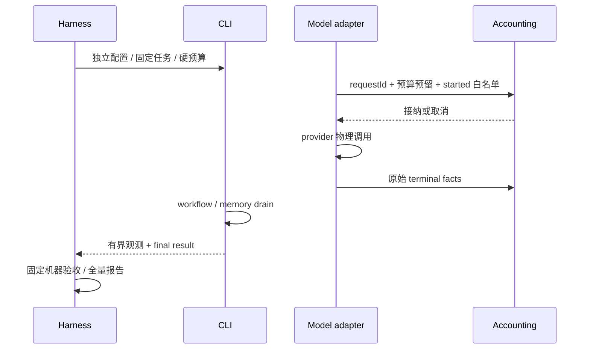

# 编程任务质量评测

- 状态：实施契约，2026-10-10。
- 所有者：独立 bootstrap benchmark harness 管理夹具、临时目录、子进程与报告；模型 adapter 仍唯一拥有物理请求，现有用量存储不变。

## 执行与隔离

默认仅运行 fake CLI，不调用模型。`--real` 必须同时提供真实 CLI 路径、显式合成评测配置以及每 arm 时间、输出、请求、Token 预算和全局 Token 预算。使用固定 12 个合成任务与固定机器验收器。每个 task/arm 独立目录、配置、storage、home；不读取用户生产会话或记忆。对照按任务交替 arm 次序，保留全部失败，不挑选复测。

机器验收以 harness 保有的固定检查脚本执行候选文件，不使用模型可改写的测试作为判据。CLI exit 0 与任务通过分开。结果状态为 passed/task-failed/harness-error/timeout/cancelled/unverified，最终 NDJSON `result` 只能出现一次且在最后；过程文本不能当作结果。记录夹具版本、CLI 构建 hash、配置 hash、首次机器验收、耗时、修复次数（无法确认时 null）。

## 请求与预算契约

通过可选 `PhysicalRequestAccountingPort` 接入所有共享 model adapter 的 main/actor/compact/memory/other 请求。每次实际 provider 调用前同步预留，之后接收既有 network status 终态。request ID 幂等；请求正文、header、错误正文和凭据不进入观测。无观测端口时生产行为不变。

原 model_request_started 是准备阶段的生命周期事件，不等于实际调用。计量在 final retry-yield 与最后取消检查后紧邻 SDK 调用的同步入口预留并记录 started 白名单；准备阶段取消、改派不消耗物理请求预算。SDK 调用自身的同步失败仍算一次调用尝试。seal 后不再接纳新请求或迟到事件，冻结快照保持不变；未结算请求保留 incomplete，不把迟到结果补成已完成。

显式 benchmark 预算使用保守预留：每次物理请求消耗该模型配置的 contextWindow + 本次 maxOutputTokens；不因实际用量较小退还预留。缺少合法窗口/输出上限即拒绝。每次 retry 单独预留；预留发生在 provider 调用前，超限取消整个 arm。此上界依赖现有模型配置与 provider 对窗口限制的契约；报告同时提供 reservedTokens 和实际用量，不将预留值冒充花费。服务端工具等非 Token 费用不推算价格。

物理请求 ID 由 adapter 的单调请求序号分配，与逻辑重试预算 attempt 分离。off-peak 排队继续保留既有“不消耗逻辑重试次数”的规则，但每次重新调用 provider 都使用新的 request ID，并分别消耗 benchmark 请求与 Token 预留预算；普通重试、流式 error chunk 与非流式失败使用同一规则。验收：maxRequests=1 时，首次 off-peak queued 后必须在第二次 provider 调用前拒绝；未启用 benchmark 时，maxAttempts=1 仍允许排队后的轮询，两个物理请求 ID 不同而逻辑 attempt 保持 1。

正常结果等待 workflow 和显式 memory-bench drain，再冻结统计。每个已开始请求都必须有终态且 provider usage 完整，才将 tokenCoverage 标 complete；失败或缺 usage 为 incomplete，总量 null，已知小计单列。reasoning 属于 output，cache 属于 input，不重复相加。金额没有统一价格事实时为 null。无请求观测不等于免费。



超时或取消只停止本 harness 创建的进程树；保留匿名报告，不终止其他 Agent。收尾有独立有限 deadline，无法确认清理时记录 harness-error，不因父进程退出而无限等 pipe。Windows 异常父退出后的完整孤儿清理需要 Job Object，目前不承诺；不扫描全局 PID 猜测所有权。全局预算以预留值分配，每个 arm 预算从剩余额度扣除；并发不超售。

每个 arm 强制独立 storage/SQLite、HOME、provider cache base；禁自定义 plugin、MCP、skills、hooks 与会话自动召回，保留明确供应商/模型配置及相同权限。环境键使用当前 `LCODE_RUNTIME_ENV=test`，关闭外部模型遥测。结果目录由 wx manifest 唯一占用，NDJSON 只追加，已有报告不覆盖。

## 验收

离线测试覆盖通过/错误输出/缺 result/重复 result/超时/取消/输出溢出、独立 arm 配置、固定验收不可篡改、请求去重、终态缺失、sidecar 分类、retry 配额和 Token 预留失败。真实入口缺显式开关、配置或预算拒绝开始。真实模型收益只根据用户另行开启的真实报告判断，fake 结果仅验证 harness。

## 使用入口

从仓库根执行：

```powershell
pnpm --dir apps/lcode-cli bench:task-quality --output ../../.tmp/task-quality
node --test apps/lcode-cli/packages/bootstrap/scripts/benchmarks/task-quality/harness.test.mjs
```

真实入口为同脚本的 `--real`；显式提供 `--cli`（已构建 CLI 文件）、`--config`（合成评测专用 JSON）、`--experiment goal|workflow|memory`、`--timeout-ms`、`--max-output-bytes`、`--max-requests`、`--max-arm-tokens`、`--max-total-tokens`。凭据环境变量只通过明确 `--pass-env NAME` 传入，不复制整个进程环境。每个 arm 从总预算预留全额度，失败/用量未知也不退还；不足时报告保留已执行样本与完整计划，不能当作全套完成。

报告给出 plannedSamples、executedSamples、complete 和 stopReason；预算耗尽或取消后的完整未执行计划仍以 missing-arm 出现在配对清单中。脚本对未完成计划返回非零退出码，即使已执行样本全部通过。取消发生在最后一个样本时也记录取消状态，不报告正常完成。

模型选择白名单包括 provider/model、reasoning 与真实调用选择的 speed（null 明确表示模型没有选择 speed；字段缺失表示旧观测不完整）。main/actor 选择集合按稳定内容排序；相同集合的出现顺序不同不能被误判为模型不同，不同 speed 或缺 speed 观测不进入配对耗时比率。

Goal 对照均通过 `--goal -p` 接入真实 Goal continuation，strict 另传 `--goal-acceptance <jsonfile>`；工作流对照固定不同编排指令、模型/权限不变，实际是否建立 workflow 由 run-started 进度与请求事实核对；记忆对照 off/fixed/maintenance，固定 Markdown 使用现有 root resolver，维护 arm 才加 `--memory-bench`。三条 memory arm 共同开启零模型请求的 L0 观察仪器，读取临时 ledger 的无正文计数确认真实注入；其文件 IO 计入耗时。L1 排序始终关闭。实际 treatment 缺失或观测损坏不能作为成功增益样本；公开模型选择事实不完整/不一致、任务失败和缺 arm 均从配对比率中排除并保留原因。

memory treatment 还核对真实 started 的 memory 请求：maintenance 必须实际发生至少一次维护请求，off/fixed 必须没有；缺请求观测或维护未执行不能包装成完整 treatment。每 arm 只运行单个任务且不跨 arm 继承记忆，本套可比较固定注入与维护开销，不能证明自动学习对后续任务的泛化收益。

CLI 的 `--benchmark-limits` 仅适用于 `-p --output-format stream-json`，值为 JSON `{ "maxRequests": 20, "maxReservedTokens": 5000000 }`。正常JSON结果新增可选 `physicalRequests`；未启用时既有线格式不变。`--goal-acceptance` 隐含创建严格 Goal；文件上限64KiB，使用统一运行时schema。
