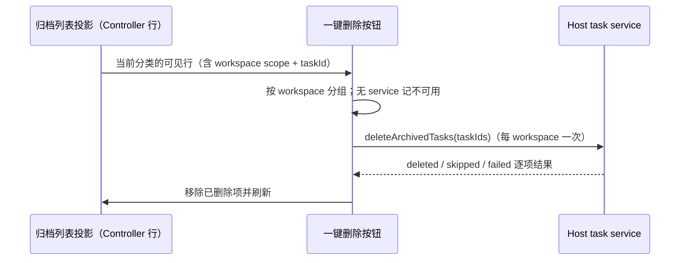

# 归档任务批量删除

## 产品规则

### 2026-10-10：批量删除的选择集必须与归档列表显示集合同源

真实故障：工作树分支会话归档后在归档列表可见，但“删除所有归档任务…”收集到 0 项，只提示“暂无归档任务”，删除无法执行。

根因是同一份数据被读了两遍、过滤两遍：

- 侧栏归档列表读 Host Controller 投影行。`tasks-index` 不持久化 `executionBindingId`，工作树归属只由 sessions-index 覆盖层下发（见 [工作树侧栏](worktree-sidebar.md)），因此列表能正确分类出工作树会话。
- 批量删除过去重新调用 `listArchivedTasks` 读 `tasks-index` 原始行，再套同一个分类谓词。原始行的 `executionBindingId` 恒为空，工作树会话永远匹配不到谓词，全部被过滤掉。

规则：**归档列表当前分类渲染出的行集合，就是批量删除的选择集。** 批量删除不再重新查询归档集合，也不再自行重新分类；选择集由列表投影（Controller 行）显式传入，删除逐项使用这些 `taskId`。这样“看得见”必然“删得掉”，也不会删除被分类隐藏的其它项目或工作树会话。

唯一 owner 仍是 Host Controller 投影：列表与删除都读它的行，UI 不保留第二份分类真值。删除写路径不变：同一 workspace 一次 `deleteArchivedTasks` 批量 RPC，逐项事务 + 归档 guard，批次结束由原 source 统一广播一次。

失败语义：目标项目解析不到 Host service（远端 source 未连接）时，该项目整体记为不可用并提示，不发送删除请求，也不影响其它项目；单项被归档 guard 跳过或失败仍按逐项结果统计（已删除/跳过/失败）。确认框计数取自同一选择集，不再出现“列表非空但计数为 0”。

验收：工作树分类下归档列表可见的会话可被批量删除；普通分类不会连带删除工作树会话，反之亦然；列表为空时仍提示“暂无归档任务”且不发送请求；远端未连接项目只报不可用、不误删其它项目；删除后列表与计数同时收敛。

### 2026-10-10：归档操作菜单必须完整显示删除项文案

“归档操作”下拉的删除项文案（`删除所有归档任务…`）此前贴着菜单盒右边界渲染，界面字号调大后无余量，末字被 `overflow-x-hidden` 裁掉，看起来“显示不全”。

规则：该菜单使用显式宽度，保证在最大界面字号（`MAX_UI_FONT_SIZE_PX`）下删除项文案仍单行完整显示，不依赖可用宽度变量兜底。同工具栏的“筛选和排序”菜单沿用同一显式宽度写法。

验收：界面字号 12–20px 全区间内，删除项文案完整可见、不折行、不裁切。
