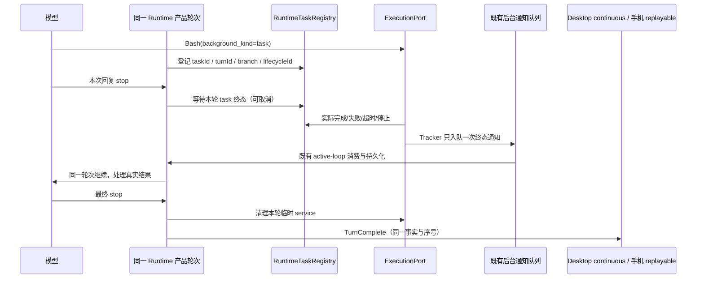

# 会话临时预览服务生命周期

## 后台构建等待与完成边界修复（2026-10-07）

已确认的缺陷：模型启动有限时长的后台构建后用文本结束回复，表示等待完成通知；Runtime 却将所有未保留的 Bash 当作临时预览，在 TurnComplete 前取消构建，并抑制取消通知。模型结束一次回复不代表后台工作已经完成。待办投影不控制执行，不得靠自动标记待办完成或 UI 发送“继续”绕过该边界。

### 产品与接口规则

- Bash 增加可选 `background_kind: "task" | "service"`。新启动、缺省参数的后台命令视为 `task`，用于构建、测试、安装等有限工作；临时预览/开发服务器由模型显式声明 `service`。不依据命令名、描述、端口或待办文本猜测用途。
- 既有 `keep_alive_after_task=true` 及用户单次审批规则保持：缺省 kind 的保留请求按 service 登记；显式 task 不得请求跨轮保留。service 默认不保留，仍在成功、失败、取消时清理。
- 普通模型 stop 边界遇到本轮、当前会话分支中的 task，Runtime 等待实际终态；通过原有后台通知队列消费结果后，继续同一产品轮次请求模型。构建失败、超时、用户停止的结果也交回模型，不能伪造成成功。
- 等待复用 RuntimeTaskRegistry.waitForTerminal 与 turn AbortSignal；不轮询、不添加等待超时、不另建队列。等待多个 task 时任一终态即唤醒，释放其余临时 waiter，下一次模型请求可处理结果及剩余工作。沿用现有 ExecutionPort 的后台执行与取消语义；其后台模式的 timeout 原本用于转后台，并非进程最终截止时间，此次不另增自动终止规则。
- 用户取消、会话关闭、强制切换模型继续走既有 abort/owner 路径，取消时清理本轮有限命令和临时服务；不影响其它会话、turn、conversation branch 或明确获授权保留的服务。
- 轮次等待期间不发布 TurnComplete、不开放最终 fork boundary、不触发自动提交审核。后台工作结束并被模型处理后，才发布原有完成事实；临时服务及明确保留的服务不阻塞这一边界。
- 旧内存记录没有 backgroundKind 时保留原清理语义；不重跑或恢复已取消构建，不迁移持久聊天记录。此次只影响后续启动的命令。

### 唯一所有者与顺序



RuntimeTaskRegistry 是用途和执行代次的唯一事实所有者，ExecutionPort 是进程结算所有者；通知继续使用 claim、branch fencing 和原 active-loop drain。Host/Main/Renderer 不增加生命周期、队列或 accepted 状态，协议的 continuous/replayable 语义不变。

### 验收

1. 构建背景任务仍运行时模型说“等待通知”：无取消、无 TurnComplete；实际结束通知只消费一次，同一轮继续进行验证和收尾。
2. 构建失败或超时：真实错误进入下一请求，允许模型处理，不提前宣布全部完成。
3. 临时服务：不等待服务自行退出，成功/失败/取消仍按原规则停止并等待进程结算；明确获授权保留不阻塞提交审核。
4. 多任务与竞态：任一结果及时唤醒；模型返回前已到达的结果也消费；重复 tracker/TaskOutput 不双发；旧 turn/branch/lifecycle 不唤醒当前轮。
5. 等待时取消：立即解除等待，所有 waiter 清理，进入原取消与进程结算路径，不启动后续模型请求。
6. 真实进程回归使用隔离临时目录与受控模型，无外部供应商调用；现有通知消费 continuous/replayable 投影与自动提交闸门回归必须通过。

### 本次验证结果

- 生命周期与执行链回归 54 项通过：包括真实 Windows 子进程的正常退出、非零退出、等待期间取消，实际 Bash 工具 → Tracker → 通知消费 → 同一 Turn 续跑 → 临时 service 清理；以及多任务、提前到达结果、旧代结果、权限确认、通知去重、桌面 continuous 与手机 replayable 结果消费。真实 HTTP 预览父子进程清理及其它会话隔离通过。
- 模型切换、取消、轮次生命周期及完成后 memory 行为回归 80 项通过；Git 自动草稿与弹窗闸门回归 17 项通过。没有修改待办状态、输入 admission、Host/lease 或最终 fork 持久化规则。
- 根 `pnpm typecheck`、`pnpm lint`、`pnpm verify:pre-push` 通过，架构 baseline=0/new=0。CLI contracts build/core typecheck/build 通过；contracts lint 通过，core 全包 lint 退出 0 但有两条既有 `lint-fork-rewind.test.ts` optional-chaining 警告；本次目标文件定向 lint 与格式检查通过。
- 运行工具为本机 Node 24.14.1、pnpm 10.33.2；`mise.toml` 固定 Node 24.14.0，当前 shell 没有 mise 命令，未宣称验证了固定补丁版本。未构建桌面安装包、未重启用户应用、未重跑已经取消的业务构建。
- Linux/macOS 清理采用既有受控 ps/signal 回归，本机未进行这两个平台的原生进程验证。测试创建的本地进程、输出目录均已清理。

## 规则与根因

2026-09-30 用户确认：会话内临时 Web/开发预览默认随本轮任务结束关闭，仅用户明确选择保留的服务继续运行；预览不得影响任务完成后的 Git 提交信息弹窗。

原实现把模型传入的 `keep_alive_after_task` 直接视为保留授权。在完全访问模式，Bash 权限自动放行，模型可自行让临时服务跨轮常驻。这是授权来源缺口，不应靠猜命令名、端口扫描或定时强杀修复。

真实 Windows 进程回归另外复现：Bash 直写输出时取消先完成 root exit 的合成结果，`waitForBackgroundTask` 可早于异步 `taskkill /T /F` 完成返回。Execution adapter 必须由每次 run 持有自身的杀树 settlement，返回 ExecutionResult 前等待它；不能等整个 adapter 所有进程的关闭，更不能仅把 UI 状态改成 stopped。

- Bash `background_kind=service` 缺省或 `keep_alive_after_task=false`：本轮成功、失败或取消都清理该 turn 的临时后台服务。有限 task 的成功边界先等待并消费结果；失败或取消路径清理全部未保留的本轮 Bash。只读/普通/计划/工作流的相同 Runtime 路径一致，不依赖是否有 Git 修改。
- `keep_alive_after_task=true` 只表达保留请求，不表达授权。该调用在所有协作模式必须经过现有 permission broker 的用户确认；无 broker 时拒绝执行。项目/会话的宽泛 Bash allow、完全访问模式、PreToolUse allow 和 PermissionRequest 自动 Hook 均不能替用户决定保留。
- 复用 ToolPermissionSpec 增加可选 `approvalSource: "user"` 收窄应答来源。仅保留请求启用此约束；其它工具的 Hook 审批和模式规则保持不变。保留确认只提供单次允许/拒绝，不能保存永久或会话 allow。
- 模型提示明确临时预览默认关闭；仅用户要求任务后继续访问时才申请保留。权限弹窗显示当前语言的明确说明；用户拒绝后遵循原拒绝协议，停止并等待用户指示，不得静默去掉保留参数重新启动。
- 保留授权只绑定这次经过审批的工具调用，不能依赖正文关键词推断。RuntimeTaskRegistry 的现有 `keepAliveAfterTask` 仍是已启动任务的唯一生命周期事实，不新增 renderer 保留状态或持久队列。
- 清理以 Runtime、turnId 和具体 taskId 定位；不停止其它会话、前轮任务、用户自行启动的终端、子 Agent/workflow 本体。只调用 ExecutionPort 的进程树取消及结算，不直接从 UI 操作进程。
- 系统清理先设置 `cleanupOnTurnComplete`，避免取消通知唤醒新模型轮次。清理失败记一次受控 warn，不能把成功代码任务改写成失败，Git 完成闸门继续排除 Bash。
- 升级不追杀已完成旧会话、无归属进程或旧版本常驻服务。重启/关闭会话继续沿用现有 ExecutionPort.close 收口；新会话采用新审批规则。

## 所有者与顺序

```text
模型 Bash 输入 → PermissionService（缺省普通规则 / 保留请求强制用户审批）
              → 既有 broker（Desktop / Web / TUI 用户回答，同一命令通道）
              → ToolExecutor → ExecutionPort → RuntimeTaskRegistry(taskId, turnId)
有限 task 成功边界 → 等待终态并经既有通知继续本轮；最终成功/失败/取消 → Runtime 清理未获保留的本轮 Bash → ExecutionPort 取消进程树并结算
                  → 既有 TurnComplete/TurnError → continuous / replayable 同一投影
                  → Git 自动生成（仍不等待保留 Bash）
```

修改 CLI contracts/core 与共享权限弹窗说明；没有新 Main 业务状态、Host、终端队列、RPC 方法或网络 payload。既有 `optionsPolicy=no-always-allow` 在 Desktop continuous 与手机 replayable 共用。Workspace identity、owner/lease、branch 与 lifecycle fencing 不变。检索功能图没有预览生命周期节点，记为 graph-drift-candidate，不虚构节点或恢复缺失图契约。

## 验收与验证计划

| 用例 | 动作                                            | 断言                                                       | 证据                     |
| ---- | ----------------------------------------------- | ---------------------------------------------------------- | ------------------------ |
| P1   | 临时预览，Bash omit/false                       | 沿原权限规则；本轮结束停止且等待进程退出                   | 单元 + 真实进程          |
| P2   | 完全访问/计划/普通模式请求保留（含字符串 true） | 都 ask，宽泛 allow 与 Hook 不绕过，无 broker 拒绝          | 权限/executor 集成       |
| P3   | 用户明确允许/拒绝保留                           | 允许后继续运行；拒绝不启动；只有单次确认选项               | executor + 浏览器夹具    |
| P4   | 同会话不同 turn / 两会话同时运行                | 仅清理对应任务；保留及其它 owner 不受影响                  | Runtime + 真实进程       |
| P5   | 本轮失败/取消                                   | 清理临时进程，不覆盖原失败/取消事实                        | Runtime 单元/调用路径    |
| P6   | 服务派生子进程                                  | Windows 实际进程树与 HTTP 端口结束；其它平台使用原 adapter | 本机集成；其它 OS 未实测 |
| P7   | Git 自动弹窗                                    | 普通、计划、工作流及保留服务的完成闸门不回归               | 现有跨层回归             |
| P8   | 桌面/390px 手机权限弹窗                         | 清楚显示保留含义，键盘允许/拒绝可用                        | 实际共享组件夹具         |

必须执行根 typecheck/lint/changed 架构检查，CLI typecheck/lint 以实际入口为准，区分既有失败。正式版使用 `LCODE_ENV=production pnpm bundle:desktop -- --os win --arch x64`；不自动安装或操作用户现有应用。

## 本次验证记录（2026-09-30）

- 红灯复现：原完全访问模式静默允许保留，原 Windows 取消结算后 HTTP 子进程仍存活；修复后对应测试通过。
- 定向回归 34/34：Bash 保留参数、四种模式的强制用户确认、拒绝/无 broker、Hook 改写防绕过、普通 Hook 不回归、单次审批不持久化宽泛授权、Runtime turn 范围、真实 Windows HTTP 父子进程及其它会话隔离、Linux/macOS 分支结算、Git 完成闸门与中文草稿预填。
- Linux/macOS 是受控 `ps`/signal 单元测试：验证两段清理、等待最终查表完成、计时器保活、不发信号给其它 owner；本机没有可用 Linux/macOS 环境，未宣称原生实际进程验证。
- 共享 PermissionDialog 浏览器夹具：中文布尔及字符串保留说明、临时服务不出现保留文案、英文说明、Enter 允许、390px ArrowDown/Enter 拒绝，只有单次允许/拒绝；390px 与 1365px 截图已检查，无横向溢出。夹具不连接真实任务或模型。自建测试服务和浏览器已关闭，真实 HTTP 测试子进程已清理。
- 根 `pnpm typecheck`、`pnpm lint` 通过；changed 架构检查 baseline=0/new=0/violations=0；`git diff --check` 通过。CLI contracts/core/adapters 分包类型检查已执行；CLI 根 typecheck/lint 缺失 turbo 可执行入口，分包 Lint 仍有既有 max-lines/unused 等失败。此次新增 permission-flow 超行已通过收口到同一权限结果 helper 消除，不为历史文件添加禁用规则。
- 根 `pnpm fmt:check` 未通过（2617 个既有文件）；本次目标文件已用 CLI 可用的 oxfmt 格式化，未格式化无关文件。
- 改动模块：lcode-cli（contracts/core/adapters）、ui（共享审批说明）、web（测试夹具）。状态所有者仍为 RuntimeTaskRegistry/ExecutionPort；没有新增 renderer 生命周期状态、Main 状态或远端恢复队列。模块 context 当前均 unmanaged，按现有公共入口检查，无新增架构违规。
- 目标已跟踪文件相对 HEAD 的工作区差异为 +463/-72 行，包含原有提交弹窗与语言等本地修改，不能视为本轮独占增量；新增测试/夹具/spec 另计。保留所有无关本地改动。
- 正式构建完成：`LCODE_ENV=production`、`LCODE_PREVIEW_IDENTITY=0`，完整 `pnpm bundle:desktop -- --os win --arch x64` 退出 0，无 skip prepare/build。身份、运行时依赖、native resource policy 和体积校验通过。安装包 `packages/desktop/dist/LCode-3.16.5-win-x64.exe`，2026-09-30 21:28:01（+08:00），150351968 字节（143.4 MiB），SHA256 `819EBDCF8421125ED996012101250845BBE0ADC58768F114243B6442D8F52A26`。
- 包内核对：renderer 包含中文保留确认文案；实际 `resources/glm/lcode.cjs` 包含用户审批限制、默认临时预览提示、拒绝不绕过提示，Windows/POSIX 杀树都返回对应 settlement，run 等待该 settlement。Linux/macOS arm64/x64 四组远程 CLI 资源均包含相同修复。未安装或重启用户应用；旧会话已经遗留的服务不自动追杀。
