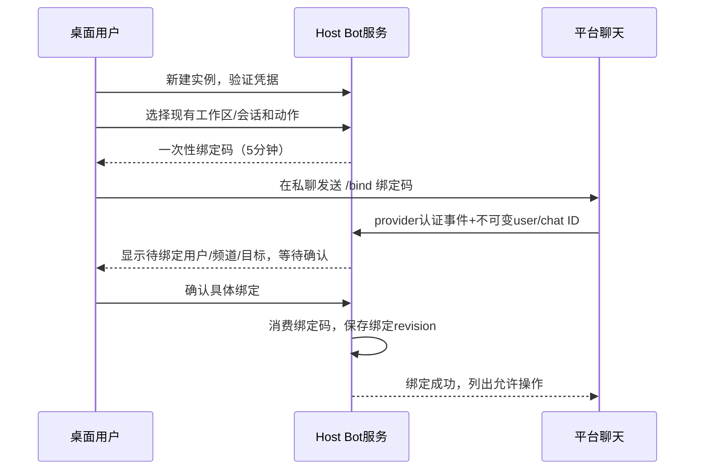
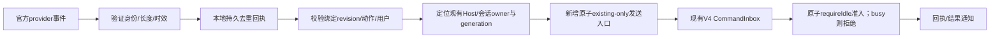

# 机器人管理与 cfworker-remote 集成方案

状态：**规划稿，尚未实施**。总体路线见 [工作区智能增强方案](./workspace-intelligence-roadmap.md)。

## 1. 产品定位：机器人是入口，手机仍是完整工作台

采用参考图的“扫码连接 + Bot Channel + 机器人管理”信息结构，但不是承诺同时接入四个平台。

用户价值按层次交付：

1. **B1 通知与打开工作区**：任务完成、失败、等待审批、复盘提案出现时通知已绑定用户；查看状态；点击进入现有手机镜像。
2. **B2 受限短指令**：用户主动向机器人提交一个明确文本任务到已绑定、已存在的会话，或停止特定执行；审批、文件差异、模型设置继续在手机完整界面操作。
3. **B3 更多官方渠道**：首个provider稳定后接飞书/Lark，再按实际官方条件接企业微信智能机器人。
4. **B4 可选 CF webhook**：仅在公网回调有真实需求时增加独立中继，不为了使用CF而重构现有手机隧道。

明确不做：Bot里另起Agent/Local Host；任意群成员控制桌面；聊天文本直接执行shell；机器人自动批准权限；Worker保存工作区快照/记忆/待执行任务；电脑离线后自动积压并补跑旧指令；个人微信非官方逆向登录。

## 2. 当前能力与需要新增的部分

### 2.1 已有能力

- `MobileRemoteControlPanel/RemoteControlSettingsSection/useRemoteControl` 通过 `IPlatformService` 调用Desktop Main。
- Main单活动配对房间，使用generation排除旧start，管理设备授权及撤销；手机通过已有window-scoped Host attachment接入。
- Worker入口为 `/connect/host`、`/ws/pair`、`/ws` 和 `/p/:roomId` 静态入口；room DO拥有认证与桥生命周期，不拥有业务任务。
- `workspaceIdentity`、`remoteSessionId`、owner/lease及stale-run守卫已有；手机使用 `web-remote-replayable`，桌面使用 `desktop-continuous`。
- CLI `CommandInbox` 对commandId准入/查询/重放，runtime拥有接受后的输入队列。

### 2.2 不是已有能力

没有经本轮核实的Bot实例管理、chat binding、provider webhook、通知outbox、聊天安全深链或Bot到V4的受限命令入口。`sendConversationCommandV4` 的现有 `getClient` 可能启动workspace runtime；现有订阅和命令查询使用的 `getReadOnlyClient` 默认也可能启动CLI（`lcodeAgentService.ts:4819、5113`）。因此Bot的status、事件订阅、command、command query都需要同一可信 existing-only 访问策略，不只是新增发送入口。连接消失返回offline或outcome-unknown，不借只读查询拉起runtime。

当前浏览器设备凭据按用户确认的“记住设备”规则同源持久保存，旧 sessionStorage 仅用于迁移或不可持久保存时降级；不同浏览器/聊天内置浏览器不保证复用。`/p/<roomId>` 无 capability 的链接只对已经持有效设备凭据的浏览器有用，不能描述为任意聊天客户端点击即可免授权进入。

### 2.3 调查基线

`cfworker-remote` 是被主仓库忽略的独立嵌套Git仓库，HEAD `ef1ba5f799ead2a6c3666340e708223574d0926d`，package version `0.1.0`；不由根pnpm workspace检查覆盖。版本不等于生产部署版本。

关键源码：

- [Main配对/attachment控制](../packages/desktop/src/main/desktopRemoteControlController.ts:148)
- [凭据store](../packages/desktop/src/main/desktopRemoteControlStore.ts:14)
- [已有Host查找与remote attachment](../packages/desktop/src/main/desktopRemoteSessions.ts:832)
- [Worker入口](../cfworker-remote/src/index.ts:112)与[Room](../cfworker-remote/src/room.ts:91)
- [设备凭据存储与旧会话迁移](../packages/web/src/remote/pairingCredentialStore.ts:1)：当前持久恢复语义见 [手机重连规格](./mobile-remote-reconnect.md)。
- [V4发送入口](../packages/services/src/lcode-agent/lcodeAgentService.ts:5038)
- [CommandInbox](../apps/lcode-cli/packages/bootstrap/src/lcode-protocol-v4/command-inbox.ts:78)

## 3. 根据截图落地的UI

### 3.1 快捷入口

保留footer现有手机入口。当前约400px Popover不塞四张巨大渠道卡：

- 未配置Bot时保留原扫码操作，增加“机器人通知与远控”入口。
- 用户打开完整连接Dialog后，宽屏两栏：左为现有扫码/已授权设备状态，右为已启用渠道及“管理机器人”；窄屏上下排列。
- 二维码、刷新、复制链接、停止保持现有单一owner；Bot连接状态独立显示，停止手机房间不自动停Bot，停Bot也不踢掉已授权手机。
- 平台卡显示准确状态：未配置、待绑定、连接中、在线、凭据失效、目标离线、受限；状态附文字而非只用绿色圆点。
- 未实现平台显示“规划中”而不是可点击配置按钮；个人微信不显示成已支持的微信Bot。

### 3.2 机器人管理页

在Desktop“基础设置 → 远程控制”附近新增“机器人渠道”管理分区，复用Settings组件，不另做网站。页内分三层：

1. **实例**：provider、显示名、write-only凭据更新、连接测试、启停、最近错误、删除。
2. **授权绑定**：平台用户/租户/chat/thread、工作区别名、目标会话、允许动作、通知订阅、有效期、撤销。
3. **投递记录**：脱敏事件类别、接收/拒绝/已准入/完成/未知状态、时间与原因码；跳转本地会话查看内容，不复制完整聊天正文。

默认仅Desktop可配置或轮换Bot凭据。已配对手机继续拥有原会话能力，并可查看通知关联任务；Bot配置尚未开放到Web不等于降低手机会话权限。后续若允许手机管理，必须通过同一Host服务和显式敏感操作确认，不能把token回显给浏览器。

遵守 `DESIGN.md`：`text-ui-*`、语义色、已有Dialog/Button/表单、焦点管理、键盘导航、中英文及320/390px窄屏；移动editable使用 `text-mobile-input-safe`。

## 4. Provider取舍与官方边界

| 渠道               | 推荐接入                                 | 优先级与限制                                                                      |
| ------------------ | ---------------------------------------- | --------------------------------------------------------------------------------- |
| Telegram           | 本地 `getUpdates` 长轮询 + `sendMessage` | 技术MVP；用户必须先联系Bot；直连网络可达是前提                                    |
| 飞书               | 企业自建应用Bot + 官方SDK长连接          | 国内环境优先候选；需要应用权限/可见范围；若成为首选则替代而非并行启动Telegram MVP |
| Lark               | 独立provider配置 + 官方长连接            | 复用适配代码但不共享飞书token/租户/域名；逐项确认区域规则                         |
| 企业微信智能机器人 | 官方BotID/Secret长连接                   | B3验证；每Bot单有效连接，不能与其他程序抢占                                       |
| 企业微信群Webhook  | 单向推送                                 | 可作为通知-only，不能冒充双向短指令                                               |
| 个人微信           | 暂不支持                                 | 本轮未取得个人号通用官方Bot收发契约，不做逆向协议承诺                             |

凭据及provider SDK选择遵循现有依赖优先；只有官方协议/签名/重连确有必要时再评估官方SDK，不能为了四个logo一次加入四套依赖。

官方资料（接口配额、权限和产品能力发布前须再次核对）：

- [Telegram Bot API](https://core.telegram.org/bots/api)：webhook与getUpdates互斥，update_id去重，update最长保留24小时；HTTP成功不是Agent已完成。
- [Telegram Bot工作方式](https://core.telegram.org/bots#how-do-bots-work)：Bot不能主动开启用户会话。
- [飞书接收消息](https://open.feishu.cn/document/server-docs/im-v1/message/events/receive)、[Lark接收消息](https://open.larksuite.com/document/server-docs/im-v1/message/events/receive)：消息幂等用message_id，不把event_id直接当业务消息ID。
- [Lark事件规则](https://open.larksuite.com/document/ukTMukTMukTM/uUTNz4SN1MjL1UzM)：HTTP回调要求短响应及有限重试，不能等待Agent执行结束再ACK。
- [企业微信群推送](https://developer.work.weixin.qq.com/document/path/91770)、[企业微信智能机器人长连接](https://developer.work.weixin.qq.com/document/path/101463)：两者能力不同。
- [Cloudflare Secrets](https://developers.cloudflare.com/workers/configuration/secrets/)：放到CF意味着新增云端秘密托管，不是“秘密仍只有本地可读”。

## 5. 单例owner与进程拓扑

### 5.1 B1不新增常驻进程

`IBotChannelService`（拟议）在已有Local Host服务层，拥有Bot配置、chat bindings、provider连接、去重与通知账本；对其他窗口暴露公共服务代理。

Main仅做排他连接分配/生命周期和owner路由：`botInstanceId → hostId + generation`。不要把Bot配置、chat业务状态、消息队列塞入Main，也不把TaskRealtimeBus变成Bot任务库。

同一Bot实例只有一个已分配Host连接provider。迁移须旧连接停止确认或旧Host进程退出后才授予新generation；不能租约时间一到就让两个长轮询争用token。所有异步回调带generation，旧代不写去重offset、不发通知、不提交命令。

没有可用Host时Bot离线；不为Bot起新Local Host/Agent。窗口全关后继续在线属于独立产品需求，后续才评估I/O broker；即使有broker，也只能向已有Host交付，不能自行承载任务状态。

### 5.2 凭据与持久化

- Bot token、App Secret、Encrypt Key通过既有凭据能力加密存储；数据库只持credentialRef、provider与非敏感配置。
- UI只接收 `hasCredential/lastRotatedAt`，测试连接只返回安全错误码，日志不输出完整认证URL或request body。
- Secret更新成功后原子切换连接generation；新凭据验证失败保留旧连接，除非用户明确撤销。
- 删除Bot实例先停连接、撤销绑定与待发送通知，再按用户操作删除凭据引用；不能抹掉审计以掩盖未知投递结果。
- Bot token不可复用为Worker hostToken/deviceCredential。安装clientId不是授权凭据。

### 5.3 拟议服务和记录

```ts
interface BotInstance {
  id: string;
  provider: "telegram" | "feishu" | "lark" | "wecom-smart";
  label: string;
  enabled: boolean;
  credentialRef: string;
  revision: number;
}

interface BotBinding {
  id: string;
  botInstanceId: string;
  tenantId?: string;
  chatId: string;
  threadId?: string;
  allowedUserIds: string[];
  workspace: MemoryWorkspaceRef; // 实施复用公共workspace引用类型，不依赖memory模块
  sessionId: string;
  actions: Array<"notify" | "status" | "open" | "sendText" | "stop">;
  revision: number;
  expiresAt?: number;
}
```

拟议公共操作：list/create/update/test/start/stop、beginBinding/confirmBinding/revokeBinding、listDeliveryReceipts。实现需要严格schema、数量/长度限制和workspace作用域校验；`credentialRef`也不应不必要地传到UI。

持久记录分开：Bot实例、绑定、平台transport offset、入站去重回执、出站通知outbox。它们不是另一份task/session表，不拥有已准入输入的执行顺序。

## 6. 绑定与最小权限

### 6.1 绑定流程



绑定码仅用于连接申请，不是执行权。建议128-bit随机token、存hash、一次性/5分钟/尝试限额；用户通过复制命令使用，避免短数字易穷举。过期、重复、Bot实例不匹配均拒绝。

首次绑定必须在桌面或已经完成强授权的手机界面确认，不能“谁第一个给Bot发消息谁就是主人”。平台username/displayName可改，不作为授权键；使用provider验证后的tenant/user/chat/thread ID。

B1默认私聊，只允许notify/status/open。群聊支持另开设置且要求明确白名单用户、精确@或命令；不能因为Bot在群里就接受所有群成员指令。MVP不接受转发内容、消息编辑、语音、附件自动转指令；这些以后逐项定义而非猜测。

一绑定首版只指向一个现有session。切换目标必须在受信UI更新binding revision；聊天中的“切到另一个目录”不是路由授权。

## 7. B1 通知与现有手机链接

### 7.1 通知默认内容

默认发送脱敏卡片：工作区别名、任务别名（用户允许时）、状态、发生时间和“打开LCode”。不默认发送源码、提示词、工具stdout、完整最终回答、记忆正文、文件附件或带凭据的URL。

通知类型：completed、failed、waiting-for-approval、review-proposal-ready。逐token输出不转发；同一run的重复边沿按 `bindingId + runId + eventKind + eventRevision` 去重/合并。静默时段与分类开关由本地服务持久化；通知只影响投递，不改变原任务。

出站outbox只保存发送所需的有界脱敏摘要和引用，24小时TTL、数量/体积上限；撤权后未发送项作废。provider支持idempotency key时复用；Telegram等不保证跨网络重试恰好一次，不能承诺通知绝不重复。结果未知时最多有限重试并标记，不能无限刷群。

### 权威通知来源：B1的必需前置

不能依赖Renderer轮询或toast。Bot owner以existing-only方式订阅绑定目标owner的服务端事实，即使聊天面板没有打开也可接收新事件。当前 `lcodeTaskServiceAdapter.ts:3039–3057` 的终态适配只有taskId、可选inputId及归一化结果，不足以直接声称已有下表的稳定事件契约；B1需补公共、脱敏的观察接口。

| 通知                  | 权威事实与入口                                                   | 所需稳定标识                                                     |
| --------------------- | ---------------------------------------------------------------- | ---------------------------------------------------------------- |
| completed/failed      | 目标Host对CLI已提交执行终态的投影，不从UI状态推断                | workspace identity、sessionId、executionId、终态revision/eventId |
| waiting-for-approval  | 目标owner已提交的interaction创建/解决状态；发送前再确认仍pending | interactionId、interaction revision、所属executionId             |
| review-proposal-ready | 复盘Repo提交pending提案成功后发布；R1上线前不订阅                | proposalId、proposal revision、workspace identity                |
| `/status`             | 同一owner的现有runtime只读快照；连接不可用返回offline            | snapshot revision、当前executionId                               |

拟议 `subscribeBoundSessionSignals` 在Host公开观察面返回以上有界DTO，不传工具正文；Bot在自己Repo持久化event去重/outbox。Bot owner与目标会话owner不在同窗口时经现有Main路由找到目标Host，再建立受scope约束的服务订阅；Main只转发，不保存业务事件。

B1不补发Bot离线期间的历史通知。订阅首次建立/恢复时先读当前snapshot作为水位，默认只推之后的新变化；现有pending审批只在用户 `/status` 时返回，避免重连刷屏。订阅掉线显示通知不可用，不能伪称持续在线或为补通知启动CLI。仍在outbox的已捕获事件可按TTL恢复投递，发送前校验binding revision和审批当前状态。

验收必须关闭Renderer会话订阅但保留既有Host，确认新终态仍触发通知；再将CLI置冷/退出，确认status、subscribe、query均不把它启动。

### 7.2 不携带授权能力的“打开”链接

B1复用现有 `/p/<active-roomId>`，**不附 capability、hostToken、deviceCredential或可执行指令**。需当前已由用户开启远控且目标与活动房间一致；无活动房间时回“请在桌面开启远控”，不自动重启现有手机房间。

已授权的同一浏览器session可尝试重连；聊天内置浏览器或新浏览器缺凭据时，明确提示使用已经配对的浏览器，或在桌面重新完成原有双方配对。不得把配对capability送进群来“改善体验”。B1不承诺电脑重启后长期链接自动发现新房间。

精确跳转到session需要新增受限导航hint：身份校验完成后才解析，由Host校验目标可访问，hint只选页面不授予权限。若当前房间镜像的是别的window/远端目标，不生成看似可用链接，不静默切断现有手机。

### 7.3 后续“长期移动入口”的安全方案

截图的长期访问应来自可重新查询当前入口的Bot，不来自永不过期的配对密钥。若要让新浏览器也能发起配对，可新增短期open-request：

1. 已授权chat请求 `/open`，本地生成绑定到Bot/用户/目标的短期一次性申请ticket，仅代表发起配对申请。
2. 浏览器兑换时提交一次性nonce；Worker只转发，桌面展示目标、设备与比对码，由用户确认。
3. 只有原配对链完成后才签发设备凭据；ticket泄漏/转发不能自动变成远控权限。
4. 用户不在桌面、浏览器又没有已授权凭据时不能保证无人工打开。用户已确认的“记住设备”仅保留既有授权并支持桌面吊销（见手机重连规格）；新浏览器授权、passkey 与 Bot ticket 仍需独立设计，不能借持久存储绕过确认。

这是新增协议与安全流程，非B1暗含已实现能力。

## 8. B2短指令到既有执行入口

### 8.1 首版命令集合

- `/status`：绑定会话的有界摘要。
- `/open`：上节安全链接/说明。
- `/run <text>`：用户在受信UI明确允许后才启用；最多4000字符纯文本，提交到绑定的已有会话。
- `/stop <run-short-id>`：仅停止通知中明确对应的执行；必须携带 `expectedForegroundExecutionId`，不能停掉后续新run。

不提供 `/shell`、`/approve`、权限切换、模型切换、删除文件、安装技能、创建新会话/cron/OffPeak的专门通道。`/run`文字可能请求这些操作，但执行权限仍需交集限制，不能把现有yolo会话自动开放给聊天渠道。

### 8.2 权限交集与执行策略

```text
实际权限 = 会话现有权限 ∩ Bot绑定动作 ∩ 渠道执行策略
```

绑定sendText授权不等于批准模型随后所有工具。来自Bot的新轮次增加可信 `external-bot` origin/capability，默认最高为需要审批的构建模式；代码写入/执行按原策略请求桌面或已授权手机批准，不能在Bot中自动代答。长期存储的会话permissionMode不被Bot改写，已有foreground run也不因Bot stop/status被变更。

该轮默认禁用用户/工作区/插件的可执行hook，并设置 `memoryExtraction:skip`，避免聊天输入经hook直接执行或被轮后提取自动固化为偏好；普通桌面/手机会话不受影响。首版拒绝调度配置写入和无法完整继承渠道策略的Agent/工作流派生执行，不借已有会话授权缓存绕过新的渠道边界。后续开放子执行须证明origin、权限交集、取消和费用归因端到端继承。

不得自动采集桌面浏览器ambient context附到Bot消息：现有sendText路径会调用 `collectBrowserAmbientContext`，Bot入口须明确排除这一隐式数据扩张。模型配置、provider凭据由绑定会话owner提供，Bot文本不能携带伪造配置。

### 8.3 准入顺序



新增访问策略必须在使用client、租约和session状态的同一受控过程保证“仅已有运行时”，覆盖status、服务事件订阅、command以及ACK查询；不能先检查online再调用会启动runtime的 `getClient/getReadOnlyClient`。目标不存在、冷runtime、远端连接未就绪、owner切换时返回offline、结构化拒绝或outcome-unknown；不创建隐藏会话或落到本地同路径。

Host内部建立可信连接作用域，使后续query/command能使用现有schema和认证规则；不能伪造手机clientMode来借用权限。命令选择scope后继续走现有owner/lease路由，不直接跨Host调runtime。

B2首版sendText固定为原子 `requireIdle`：目标忙碌就拒绝，不能走auto、guide/steering或queue。原因是当前 `prompt-admission.ts:42–87` 可以把忙时输入steer到已有轮次，而 `input-intent.ts:39–67` 尚未持久化渠道能力；仅限制“Bot新轮”挡不住已有yolo轮被外部消息影响。普通桌面/手机队列语义保持不变。

后续若开放Bot排队，必须先扩展权威intent，持久化可信origin/capability、绑定revision、预算与策略版本，验证冷恢复、晋升、撤权时都不丢限制；ACK区分已排队，GUI显示同一权威队列项。那是独立后续批次，Bot Repo始终不能创建第二执行队列。

## 9. 入站幂等、网络不确定性和离线

### 9.1 持久回执

入站键为 `provider + botInstanceId + tenantId + immutableMessageId`（实现采用无歧义编码，不手写拼接碰撞）。Telegram update_id用于transport水位，message/命令动作另有稳定身份；飞书/Lark消息采用message_id。

本地去重记录先持久化指令摘要hash、绑定revision、目标ref、稳定commandId、provider时间、过期时间；再向CLI发送。同一消息重试不得生成新commandId。

B2首版状态为 `received → submitting → admitted → completed/failed/cancelled`，或 `rejected/expired/outcome-unknown`；busy是rejected，不进入queued。provider投递ACK、CLI准入ACK、模型完成是三件事，UI/聊天文案不得混用。

去重记录不是可在任意未来重放的任务队列：只允许在本次短投递窗口重试，建议2分钟；默认命令年龄上限5分钟。设备重启/重新连接后过期的更新拒绝，Telegram保留24小时的update不能被自动补执行。offset只在回执或终拒绝持久化后推进。

### 9.2 ACK丢失

发送后失联先按同sessionId+commandId查询，不能立刻新发一条。现有CommandInbox可从内存/pinned和持久转录/时间线回源，但不是无限保留的通用exactly-once数据库。

查询为unknown时：仅在能证明未提交且仍处于允许窗口、owner generation未改变时重试同commandId；无法证明则记录outcome-unknown，提示用户在手机查看，不自动换新ID重执行。进程在“发送成功但尚未记回执”处崩溃的测试必须覆盖这一语义。

### 9.3 限流与滥用

建议初始限制：每用户每分钟6条命令、每Bot最多20个绑定、每消息4k字符、每目标最多1条未获准入的Bot提交。provider限额独立遵守；群消息不逐条回复未授权用户，防止放大。限额可在产品设置有限调整，不能让普通聊天消息更改。

撤销绑定、停用Bot、凭据轮换都递增revision/generation并作废未提交回执和待发通知；已在CLI接受的输入不悄悄消失，应作为用户明确的取消命令处理并记录结果。

## 10. 与 cfworker-remote 的两种集成深度

### 10.1 默认方案：Worker只承载手机镜像

```text
平台 ←→ 本地Bot Host服务 ←→ 原会话runtime
              │
              └─ 通知中的无权限导航链接
                         │
手机浏览器 ←→ cfworker-remote ←→ Main帧泵 ←→ 已有Host attachment
```

Telegram长轮询、飞书/Lark长连接、企业微信官方长连接都是出站连接方案，不需要开放本机公网端口。这是真正的“结合cfworker-remote”：聊天负责轻操作与提醒，复杂操作复用现有完整手机工作台。

B1无需改Worker任务/房间模型，但本地管理、绑定、通知与安全链接仍是新增后端，不能叫“只改UI”。

### 10.2 可选方案：新增独立Bot webhook relay

只有平台确实要求回调或本地长连接不适用时采用。新增 `/bot-ingress/<opaque-id>` 和独立认证的desktop relay注册/心跳，不把Bot塞入现有单手机 `/ws`桥，也不改变手机room DO的状态机。

Worker可存：路由ID/设备relay公钥或token hash、generation、有效期、有界防重放hash及连接指针。不能存：workspace路径、session历史、消息内容、任务队列、记忆。路由由持有秘密/密钥的桌面注册，安装clientId和可猜的channel名不能作认证。

原始body的provider验签和ACK要求：

- Telegram可用独立webhook secret；Bot token仍可仅在本地发消息。但平台消息仍由Worker TLS终止可见，不是端到端加密。
- 飞书签名/解密若在Worker做，必须在CF Secrets配置对应验证密钥；这改变秘密托管边界，应在UI/部署文档明确。若选择本地验签，就必须在线转发原始字节并在平台时间窗内完成，不能先无条件ACK。
- Host在线并已经可靠记下本地回执后才给平台成功ACK；不能等待Agent完整执行。离线或本地ACK超时返回可重试响应，平台有限重试，不承诺永久保存。
- 本地按消息时效拒绝晚到事件。若将来要求可靠离线命令队列，必须重新评审业务状态放置，而不是偷偷加CF Queue。
- CF rate limiting、body上限、签名时间窗、nonce防重放、connection generation和路由TTL必须有测试；不能只靠HTTPS和随机URL。

部署是单独批准的操作。Worker在独立仓库push会触发自动部署，本方案不提交、不push、不设置secrets。发布需记录双方协议版本和回滚顺序，不能只打包桌面而忽略线上Worker兼容性。

## 11. 实施文件落点与协议扩展

| 层               | 当前复用点                                                                                        | 拟新增/修改                                                                              |
| ---------------- | ------------------------------------------------------------------------------------------------- | ---------------------------------------------------------------------------------------- |
| UI               | `settings/RemoteControlSettingsSection.tsx`、`MobileRemoteControlPanel.tsx`、footer、SettingsPage | Bot管理页、连接Dialog、hooks、状态与i18n                                                 |
| services         | 公开service descriptor、DI、现有lcode-agent与credential能力                                       | `IBotChannelService`、Bot Repo/provider adapter、回执/outbox、只访问已有runtime的adapter |
| Main/Host        | `desktopRemoteControlController`、Host注册表、owner路由                                           | Bot连接owner分配/代数、Host服务装配；不写task/session状态                                |
| shared/client    | `platform.ts`、ServiceChannels、RPC代理、V4命令schema                                             | 严格Bot DTO、内部可信执行origin/策略、existing-only能力与错误码                          |
| CLI              | CommandInbox、admission、工具权限边界                                                             | 只收窄的渠道策略、既有会话存在性/执行期校验、去重查询回归                                |
| Web              | `MobilePairingPage`、credential store、现有Root                                                   | 登录后导航hint、未授权打开说明；不降低现有镜像权限                                       |
| Worker（可选B4） | 认证与出站隧道的实现经验                                                                          | 独立Bot ingress/relay协议、测试、文档；不复用业务room或存任务                            |

跨包使用公开入口，provider网络IO异步；Bot实现归Host services，不从UI调用Repo，不让Main引用Agent runtime。

## 12. 分阶段验收

全部为计划用例；本轮没有Bot实装或真实账号验收。

| ID     | 场景                                             | 必须断言                                               |
| ------ | ------------------------------------------------ | ------------------------------------------------------ |
| BOT-01 | 配置/测试/重开页面                               | token不回读、不进日志/URL；失败无泄漏                  |
| BOT-02 | 陌生用户抢绑定/码过期/重复提交                   | 无执行权；只在桌面确认正确tuple后生效                  |
| BOT-03 | 用户名改变、群里另一个成员发送命令               | 仍按不可变ID判断，未授权不执行                         |
| BOT-04 | 两窗口同时启动或Host移交                         | 仅一个provider连接，旧generation无业务副作用           |
| BOT-05 | 未启用sendText、yolo会话、伪造模型参数           | 不升级权限；渠道策略生效；不附浏览器ambient context    |
| BOT-06 | runtime不存在/远端同路径/owner换代               | 拒绝，不新建Agent/Host，不fallback到本地               |
| BOT-07 | 同provider事件重复、ACK丢失、进程崩溃            | 同commandId查询/结算；未知不自动新发                   |
| BOT-08 | 目标busy或正在yolo轮次中运行                     | 原子拒绝，不steer、不queue；已有轮次内容和权限不变     |
| BOT-09 | 迟到stop到达，目标已开始新run                    | expectedForegroundExecutionId不符，拒绝                |
| BOT-10 | 离线24小时再恢复Telegram polling                 | 过期命令不执行，推进offset有持久依据                   |
| BOT-11 | Bot链接被转发/群里点击/新浏览器                  | 不获得授权；原双方配对与撤销仍生效                     |
| BOT-12 | 停手机房间/停Bot/撤销绑定                        | 三种动作互不误代；已接受命令按显式取消处理             |
| BOT-13 | completion通知重试/限流/撤权                     | 不影响任务事实；有限重试；已撤权不发                   |
| BOT-14 | Worker webhook伪签名/大body/重放                 | 转发前拒绝；Host不在线不成功ACK业务                    |
| BOT-15 | 手机重连、room.ready expiresAt=null              | 合同一致、Initialize和replay恢复，不靠Bot兜底          |
| BOT-16 | 中英/窄窗/手机/键盘/深色主题                     | 核心动作、状态、审批链接与focus可用                    |
| BOT-17 | Renderer没有会话订阅，Host/CLI仍在线             | Host权威新终态可通知；不依赖UI toast或轮询             |
| BOT-18 | CLI置冷/退出后调用status/subscribe/command/query | 所有路径启动次数为0，返回offline或outcome-unknown      |
| BOT-19 | 重连后遇到旧终态或已解决审批                     | 不补发历史通知、不刷屏；outbox发送前重新核验绑定与审批 |

### 当前可用检查入口

```bash
pnpm typecheck
pnpm lint
pnpm --dir apps/lcode-cli check
pnpm --dir cfworker-remote typecheck
TSX_DISABLE_CACHE=1 pnpm --dir cfworker-remote test
TSX_DISABLE_CACHE=1 pnpm exec tsx --test packages/desktop/src/main/desktopRemoteControlController.test.ts packages/desktop/src/main/desktopRemoteControlTunnel.test.ts packages/desktop/src/main/desktopRemoteControlFramePump.test.ts
```

Web当前有 `pnpm --dir packages/web test`，会运行浏览器相关测试，不是纯函数测试；部分本地文件被忽略。新Bot与恢复fixture必须提交到适当仓库并接入CI。新增测试先用fake provider、临时Repo、注入socket，不用真实token；最终单独执行经授权的私聊测试、手机同一浏览器与内置浏览器测试、真实网络断连与撤权测试，报告环境和未测项。

## 13. 迁移、关闭与回退

- 所有Bot实例默认无配置/关闭；升级不自动注册provider、不读用户其他机器人配置。
- B1不改既有手机credential寿命、不替换Worker配对API；关闭Bot后扫码远控保持原状。
- B2开关关闭后拒绝新外部命令，已接受输入仍在原会话展示；停用/卸载不能悄悄删除运行事实。
- 新协议使用能力协商；旧Host/Worker不支持时隐藏对应操作并明确原因，不降级为不校验的直接命令。
- 现有 stopPairing 与 revokeDevice 的语义分别展示：停止当前房间不自动等于永久吊销所有已授权设备，UI不得误导。
- 云端relay、持久可信浏览器和离线执行均是后续明确范围，不能作为首版实现的隐性依赖。
