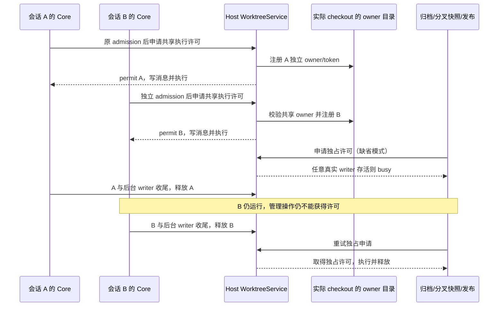

# 本地项目、独立工作树与多会话执行

## 已确认回归与产品规则

独立工作树功能把整轮独占 checkout 许可注入了所有协议会话。普通本地项目的两个会话因此按目录串行；后一个输入虽获 admission ACK，却在用户消息落盘前等待，表现为输入框清空而消息和回复不出现。

- 普通本地项目中的不同会话可以并行执行，继续共享实际项目文件；并行不提供文件隔离。同一个会话的输入仍由其 Core CommandInbox 串行 admission，不建立 Host 或 Renderer 队列。
- 独立工作树提供文件、cwd 和分支隔离。不同工作树及原本地目录各自执行，不能因为属于同一原项目或共享 Git common directory 而互相阻塞。
- 在同目录分叉、恢复、不同面板或不同窗口中打开不同会话，按实际 checkout 协调：同目录的会话允许共享执行，工作树 alias 仍归属于原绑定，不能伪造第二个目录或绑定。
- 在多个面板、窗口、桌面与手机中打开同一个会话，只订阅同一 owner；不能因此创建第二个 runtime 或重复执行已接纳的输入。
- 工作树 setup、归档、丢弃、源目录快照分叉、源提交、候选验证/集成及目标发布仍独占其实际操作目录。任意活跃会话及后台 writer 持有共享执行许可时，这些操作不能越过许可修改或删除目录。
- 冲突修复 runtime 对冻结的集成目录使用独占许可，保持既有父绑定、operation、scope 校验。

## 唯一所有者、接口与时序

WorktreeService 的 checkout coordinator 唯一拥有许可；Host 协议桥接根据已验证的操作选择共享执行或独占修复，不让客户端决定权限范围。`acquireCheckout.mode` 为 `shared | exclusive`，缺省 `exclusive`，既有管理操作保持原行为。`checkout/acquireWriter` / `releaseWriter` 的 wire schema 不变，普通 runtime 请求由 Host 映射为 shared，repair 映射为 exclusive。

底层沿用同一个 canonical checkout 路径的 `acquireFileLock` owner 目录。共享 owner 有各自的 token/PID；加入前后校验同一目录实例和全部 owner 的共享声明。旧版本 owner 没有共享声明，按独占处理；旧版本独占申请也不能回收仍存活的共享 owner。许可不因等待超时、窗口切换、订阅关闭或 UI idle 释放，只在实际 writer 收尾或 Host 确认进程退出后释放。

会话、绑定、origin project 的归属、workspaceIdentity/path 分工及远端 owner/lease 路由保持原接口。同一物理 checkout 的互斥边界按真实 canonical 路径；身份与 session/Host 代际保留各自许可所有权，不能跨身份或进程复用 token。Desktop continuous 与手机 replayable 复用相同 Core 事件序列，桌面订阅切换及手机重连都不拥有许可或执行队列。

## 验收

1. 同一本地目录的 A 保持运行时，B 首发、续发及同目录分叉会话都可进入真实 Core，产生各自用户消息、模型执行和终态；按 session 对账，不能串消息或模型。
2. 同时运行本地 A/B、独立工作树 C/D 及 C 的同目录 alias；各自 cwd、绑定和项目归属准确。原项目 writer 不阻塞 C/D，C 不阻塞 D，C 与 alias 能并行。
3. 同一会话多次输入仍走原 Core admission/queue；不同会话并行不能移除该约束。同一会话多订阅分别验证 desktop-continuous / web-remote-replayable，不产生重复执行。
4. 多个 Host/coordinator 的共享许可可以共存；独占许可阻止共享和独占申请。共享许可阻止归档、丢弃、快照分叉及目标发布，释放任意一个共享 owner 不影响其余 owner。
5. canonical root、嵌套目录、独立 worktree 与同目录 alias 边界正确；活 PID 不按时间过期，退出 owner 可回收，旧独占锁与新共享锁双向兼容，加入/释放竞态不会删除另一 owner。
6. 取消、后台 writer 收尾、进程退出和迟到许可保留现有回归。严格服务字段转换、跨 scope/identity/repair 校验继续通过。

## 迁移和验证范围

无需数据库或会话迁移，不修改当前正在运行的安装版，也不清除它的活跃目录锁；修复需重新构建并重启应用才能生效。验证使用隔离 Git 目录、受控模型及真实 Core/Host 桥接；浏览器发送回归覆盖桌面与手机宽度。安装版真实模型、多窗口和实体手机未经实际执行时明确标为未验证。

## 实际验证记录（2026-10-05）

本次生产代码涉及 `worktree`、`services`（Host 桥接）和 `shared`；CLI Core 与 Web 仅扩展测试桩和回归场景。许可仍由原 checkout coordinator 持有，会话输入仍由原 CommandInbox 持有，没有新增队列或状态写入路径。

- 开工基线检查通过；最终 `pnpm architecture:check --changed` 为 0 violations / 0 baseline / 0 new。
- 本次修复范围 25 个文件，新增 652 行、删除 33 行，净增 619 行；主要增量为测试与行为/验证文档，不包含现有 runtime-environment 改动。
- `pnpm lint` 为 0 errors；现有 runtime-environment store 有 1 个 unused-function warning。CLI Lint 通过，保留 3 个现有 optional-chaining warning。改动文件格式检查通过。
- 根目录、CLI 和 Core 类型检查均实际执行，但未通过：现有 `runtimeEnvironment.ts` 在声明前展开 `scope`；现有 runtime-environment service / validated service 尚未实现契约中的 `releaseConsumer`。这些任务外改动保留原样，不能把类型检查报告为通过。
- 正常加载测试也被上述 `scope` 的运行时 ReferenceError 阻塞。为单独验证本次行为，使用临时 Node loader / Vite transform **仅在内存里**前移该现有声明，保留全部现有 schema，不改工作区文件、不影响运行中的应用。以下测试通过结果均来自这种隔离验证。
- 完整领域与集成回归 107/107 通过：共享文件锁、Host 请求校验、进程退出许可回收、CLI 许可/后台 writer、真实 Core/V4 发送以及全部现有 worktree 测试。
- 随后加强共享 writer 下的源目录快照、丢弃、发布与同 owner 模式校验，补充损坏锁元数据场景，针对性回归 40/40 通过；其中部分用例与前述 107 项重叠，不累计成独立用例总数。同一会话 admission、queue、promotion 也在本轮实际执行。
- 新增浏览器多窗口回归 8/8 场景通过（含父测试共 9/9）：1280px / 390px 下的 local/local、local/worktree、worktree/local、worktree/worktree。两页使用真实 Composer，各自消息归属不串线；真实后端并行由上述 Core/Host 集成测试覆盖。
- 完整浏览器回归实际复跑：36 项中 28 passed / 8 failed / 0 cancelled，8 个失败包含父测试和 7 个现有准备流程场景。它们都等待 `environment/running`；现有未修改的 `WorktreePreparationCard.tsx` 把不含 runtimeStage 的 environment 映射为 checkout，阶段与测试期待不一致。不能据新增场景通过宣称完整 E2E 通过。父测试预算因增加 8 个顺序场景从 120 秒调整为 240 秒，每次交互仍保持原 7 秒限制。

隔离领域测试入口为 `pnpm exec tsx --test --test-concurrency=4`，目标包括 `atomicFileLock.shared.test.ts`、`worktreeRequests.test.ts`、`worktreeClientLeases.test.ts`、`checkout-execution-port.test.ts`、`checkout-execution-lease.test.ts`、`scripts/checkout-send.integration.test.ts`、`scripts/checkout-multi-session.integration.test.ts` 以及 `packages/services/src/worktree/` 下实际存在的测试文件。浏览器入口为 `node --test packages/web/test/conversation-send.test.mjs`；运行时使用上述临时加载转换与本机 Chrome。
