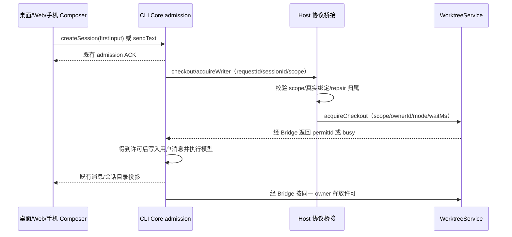

# 会话发送与目录写入许可回归

## 已确认问题

2026-10-03 的运行日志记录：输入已由 Core admission 接纳，随后在申请 checkout writer 时出现严格校验错误，未知字段为 `requestId`、`sessionId`。消息尚未写入历史，界面已按 accepted ACK 清空输入，因此新会话不进入侧栏、旧会话没有新增消息或回复。

Host `handleWorktreeRequest` 将完整的 `checkout/acquireWriter` 协议请求展开到 `IWorktreeService.acquireCheckout`。协议字段与服务字段不同；既有桥接测试使用未校验参数的服务桩，未覆盖实际服务严格校验。

## 产品规则与边界

- 新会话首发和旧会话续发，无论本地目录还是独立工作树，均能经过共享执行许可进入真实执行和消息投影。
- Host 在协议与服务之间明确转换字段：服务只接收 `workspacePath`、可选 `workspaceIdentity`、Host 推导的 `ownerId`、`mode` 与等待时长；`requestId`、`sessionId` 和 `repair` 留在协议层完成关联及权限校验，不传入服务。
- 保留协议和服务严格校验，不通过放宽 schema 或绕过写入许可修复发送。
- `ownerId` 仍由原工作区 identity/path 和会话 ID 推导；实际 checkout 使用请求中经过验证的路径与 identity。同路径不同 Host 不能串许可。
- 本地共享目录允许不同会话并行；独立工作树按各自实际目录独立执行。同一会话仍由 Core admission 串行。目录管理操作与冲突修复保留独占许可，详细边界见 [多会话执行](checkout-multi-session-concurrency.md)。
- 进程确认退出及退出后的迟到许可，只向释放接口传入 `token`、`ownerId`，不将返回票据中的 `workspacePath` 混入严格请求。释放失败保留票据供原 owner 重试，不能遗留目录锁阻挡后续会话。
- Core admission、Host WorktreeService 的唯一许可所有者、已有 ACK 以及桌面 continuous / 手机 replayable 投影语义均保持现有边界。

## 验收场景

1. 桥接真实严格校验服务：本地首发与续发、工作树、remote identity 均获取和释放许可，无未知字段。
2. 冲突修复协议字段用于校验归属，服务接收的参数只包含服务 contract 字段。
3. 同目录普通 runtime writer 可以同时获得共享许可；独占管理操作与活跃 writer 互斥；独立工作树不受来源目录 writer 阻塞。
4. 不允许跨工作区、伪造绑定或越过修复归属；其他服务错误继续向上抛出。
5. 实际输入回车/发送按钮经共享 Composer 提交，成功后消息可见；发送失败保留草稿。新/旧本地及工作树分别验证，浏览器测试不调用真实模型。

## 验证记录

- 2026-10-03，Windows、Node 24.14.1，在 `L-GO` 当前检出代码上验证。新增严格服务测试先复现参数混传错误，修复后通过。
- `pnpm exec tsx --test apps/lcode-cli/packages/bootstrap/src/lcode-protocol/checkout-execution-port.test.ts apps/lcode-cli/packages/core/src/runtime/methods/checkout-execution-lease.test.ts packages/services/src/lcode-agent/worktreeRequests.test.ts packages/services/src/lcode-agent/worktreeClientLeases.test.ts scripts/checkout-send.integration.test.ts`：26/26 通过。覆盖真实严格服务、Git 工作树、V4 命令、Core admission/执行/消息投影及退出清理；模型和 Host 外层会话注册使用测试替身。
- `pnpm --dir packages/web exec node --test test/conversation-send.test.mjs`：通过 `LCODE_TEST_BROWSER_PATH` 使用本机 Chrome，19/19 通过。共享 ConversationComposer 在 1280px/390px 下分别验证新旧会话、本地/工作树、回车/按钮，以及失败保留草稿和等待 ACK 期间保留新输入。服务与发送回调使用测试替身，界面的消息/会话条目属于 fixture；实际后端执行与消息投影由上一条集成测试覆盖。
- `pnpm typecheck`、`pnpm lint` 通过；`pnpm architecture:check --changed` 为 0 violations / 0 baseline / 0 new；`git -c core.safecrlf=false diff --check` 通过。
- 未替换正在运行的安装版，未运行真实模型、完整安装版 UI E2E、实体手机、macOS 或 Linux 验证。此前准备过程、分叉菜单或提交审核测试通过不代表完整发送链路通过。

本日追加了聊天区准备与真实 sessions-index 验证；当前 Composer/Timeline 浏览器回归为 25/25，通过本地/工作树、新旧会话、首发准备及取消/重试。新的桌面 Host 构建已确认包含参数转换修复，运行中的旧安装包仍含错误的请求展开；详情见 [聊天区准备与发送回归](worktree-preparation-and-sidebar-fork.md#2026-10-03-聊天区准备与发送回归)。
