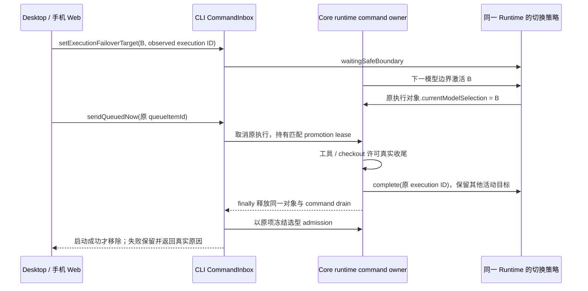
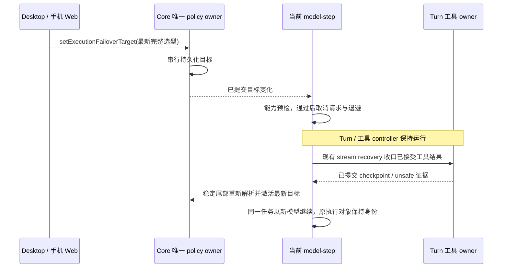

# 队列消息与模型切换交接

## 产品规则

- 已接受的消息仍由 CLI CommandInbox / Core pending input 唯一拥有。点击“立即”复用 `sendQueuedNow`，空闲时直接提升，运行中先取消旧执行；不在 Renderer 重建或重发文本。
- 队列消息使用入队时冻结的完整 ModelSelection（供应商、模型、推理、速度），不能被旧会话模型或之后的草稿改选覆盖。需要改变已排队消息的选型时仍通过撤回编辑后重新提交。
- Core 与 Bootstrap 同时持有取消域时，两者都必须收到取消。取消不等于执行权释放；只在旧执行真实释放后启动提升消息，不伪造 idle，也不延长现有安全超时。
- Core foreground execution 对象由 runtime command 创建并唯一持有直到 finally 完成。安全切换、active 模型重应用只更新该对象的 `currentModelSelection`，不得复制或替换对象；取消 controller、队列继续授权和收尾的对象身份必须属于同一次执行。否则已结束的任务会遗留 foreground ID，新的切换永久显示等待安全边界，队列提升一直超时。
- 已激活 B 后又请求 C，即使 C 仍在等待安全边界，停止旧执行也必须清理该执行的策略和 execution ID；保留仍在运行的子代理目标，不能按整份 policy 或 ID 相等强行解锁另一执行。
- Core promotion lease 精确绑定原消息 inputId。持有匹配 lease 且旧执行已空闲时，待处理的后台通知不能挡住提升消息；普通输入或另一条消息不能借用 lease 抢跑。
- Core 提供只读 `isForegroundExecutionIdleForPromotion()`，同时检查 foreground execution、command drain、active turn 与 start reservation。Bootstrap 不能只凭实时 executionId 消失判定 idle，因为 durable policy 清理尚可能占有 command drain；不把 lease 或排队通知计入此谓词。
- 明确提交的新选型继续在 Core 执行入口校验并应用，不为队列引入第二套选型写入。无显式选型的旧输入沿用既有会话选择；启动前失败保留原项，已启动后的模型错误走既有 Turn 终态，不静默换回旧模型。
- “立即”显示处理中状态、同一行防重入，结束后恢复；ACK failed/rejected/stale 和传输失败都必须显示提示。消息只有实际 admission 成功后才从权威队列移除。
- “立即”失败说明依据 ACK 的 reasonCode：旧执行收尾超时显示等待任务结束；promotion/reservation 忙显示另一条消息正在启动；模型恢复不可用才提示撤回重选；stale 显示状态已变化；未知或传输错误显示通用重试。行内反馈不展示服务端原始错误、消息正文或地址，不能把所有失败都归为模型错误。

## 所有者与时序

```text
Desktop continuous ── sendQueuedNow ──┐
Web replayable ────── sendQueuedNow ──┴─ CommandInbox（串行 / commandId 幂等）
  -> 原项 reservation -> Core promotion lease（原 sourceCommandId）
  -> 取消 Core + Bootstrap -> 旧执行 finally 释放
  -> Core admission 校验冻结选型 -> 新轮 -> remove(promoted)
  └─ 启动前失败：释放 lease / reservation，原项原位保留，UI 明示失败
```

不更改 wire schema、持久化格式、workspaceIdentity / remoteSessionId / owner-lease 路由或恢复边界。UI 只拥有一次按钮点击的 pending 状态，不保存第二份已接受队列。跨会话迟到的失败反馈不得写到新 pane。生产日志只记录命令/状态/原因，不记录消息正文、凭据或服务地址。



## 验收

1. A 运行中选择 B 后入队，点击立即；两层取消域均结束，只启动一次 B，原文本、附件、来源和推理/速度均保留。
2. A 结束时仍有 Bash 后台通知排队；匹配 promotion lease 的 B 优先启动，通知不丢失且不能先抢占 B。其他 inputId 无法借用 B 的 lease。
3. completed / interrupted 下保留的消息也能立即提升；失败回滚，重试不重复执行。
4. 旧会话选型 A 与冻结的新选型 B 不同时，输入意图完整传入 Core；无选型的历史消息仍沿用 A，B 不可用时明确报错、不静默回退。
5. 桌面与手机浏览器点击立即都有 pending 和失败反馈；连续点击只发送一次。切换会话后旧 ACK 不污染新会话。
6. 安全边界 A→B 激活及后续 active 重应用始终保留 execution 对象身份；成功、模型失败、用户取消都可通过同一 finally 清理，既有 stale owner 防护保持有效。
7. B 已激活且 C waiting 时点击立即：取消先作用于原 controller，队列自动继续授权仍属于原对象；释放 foreground 后保留活动 child 策略，旧 foreground 的等待状态消失。下一条消息用自己的供应商、推理、速度和附件启动一次。本地目录和独立工作树共用同一 Core 规则。
8. 桌面与窄屏浏览器分别展示 idle timeout、busy、模型不可用、stale、未知/传输失败说明；原队列项不丢失，重试清除旧反馈，迟到失败不污染新会话。

## 用户立即切换模型

手动选择允许同一任务内 A→B→A→C 及继续切换，不借用自动故障交接的两次预算；自动恢复仍防循环且最多两次。总切换次数与自动交接次数同属当前 Runtime loop，只有成功的 policy 原子提交才能递增，手动操作不能清零自动预算或解除 unsafe fence。

选择新模型复用 `setExecutionFailoverTarget`。CLI Runtime 的策略 owner 先持久提交目标，再通知活动 model-step；该 step 只取消自身网络/退避 controller，Turn、工具和 checkout writer owner 保持原生命周期。恢复沿现有 streaming coordinator 与 Router 使用最新目标，停止/取消 Turn 优先于模型切换。订阅在请求完成或异常后同步解除，工具阶段不保留网络取消入口，旧 step 不能取消下一请求。子代理复用父策略 port 的订阅，但按自己的精确 scope 过滤；pin 的子代理没有目标，不受影响。新模型不可用、不兼容或 unsafe 时不取消旧请求；目标在原安全边界明确 blocked。取消后目标被新命令覆盖且不可激活时，用已持久化 checkpoint 恢复原模型并保留 blocked 事实，不把用户切换误判为任务停止。



验收：悬挂网络或长退避中选择 B 后立即收到请求 abort，Turn 不取消；旧请求流关闭后同一任务仅请求 B。B→C 覆盖只请求最终可用目标。正在工具阶段选择模型不取消/重放工具，工具完成后用新模型。Stop 与切换交错时保持停止，不自动重启。不可用/不兼容目标不先取消旧请求。请求完成后订阅释放，后续命令不取消旧请求或无关会话。桌面和手机复用同一 owner，UI 状态保留完整推理、速度且窄屏可阅读。

## 验证范围

使用隔离的 Runtime/Host 桩测试双取消域、promotion lease 与冻结选型；浏览器用真实共享队列组件验证 pending、失败、重试及窄屏。测试不发送用户现有队列消息，不调用真实模型、不改用户数据库。
