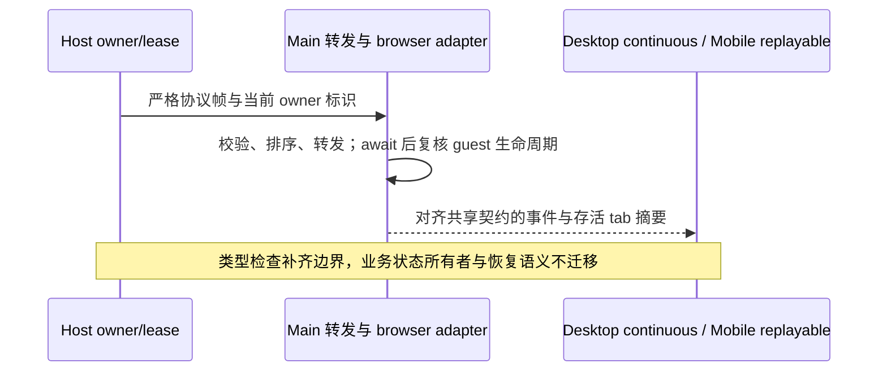

# Desktop Main 全量类型检查与运行时边界修复

## 规则与所有者

- 根 `pnpm typecheck` 必须覆盖 Desktop Main，包括当前共享辅助模块与 scheduler 协议；
  保留 strict 与 noUncheckedIndexedAccess，Main 为只检查的叶子工程，不让 tsc 输出覆盖
  tsup 的生产包。会序列化到隔离页面执行的函数由独立 browser-runtime 工程使用 DOM 类型库检查，Main 继续只使用 Node 类型库；Main
  的平台副作用仍由既有 Electron/Node adapter 承担。
- 共享类型从对应包的公开入口导入或导出。运行时 Zod schema 和 TypeScript 契约必须
  对齐，任务事件的 trace、owner/lease、workspace identity 和两种 delivery 语义保持一致。
  Main 只消费已校验的传输信封，转发载荷按 Host schema 推导类型，不将 passthrough 的
  不透明流载荷断言为完整业务事件；业务事件解释仍归 Host/客户端，原有运行时准入不放宽。
- BrowserGuestManager 是 tab、guest 与命令生命周期的唯一所有者。异步等待后重新读取
  可变生命周期；公开摘要只描述仍存活的 tab，不向严格客户端发送内部 closed 状态。
  录制的 locator 动作与坐标 click 明确区分，不用宽泛断言访问其它动作不存在的字段。
  页面注入函数在 production 的 minify/keepNames 配置下也必须保持闭包独立；局部辅助函数
  使用对象方法，避免函数名称保留转换注入 Main 外部 helper，序列化后在页面报未定义错误。
- Electron fetch adapter 接受共享 fetch 输入并将 URL 规范化为字符串；DNS 校验保留
  all:true 地址数组及连接阶段绑定。文件保存 IPC 先验证并捕获 ArrayBuffer，再跨 await
  使用同一载荷；PDF 导出产生独立 ArrayBuffer，不返回池化或共享底层缓冲。
- 日志、子进程 stdio、ConsoleMessageEventParams、可选入口和 helper 指纹使用实际
  契约；不通过 any、忽略诊断、排除出错源文件或放宽检查来消除错误。
- 显式使用 Electron 默认 userData 的隔离启动跳过品牌数据复制，不能向 undefined 路径
  迁移或误写用户正式数据；遥测目标只保留现有 SSH/WSL/Docker 契约，清理已移除 server 分支。

## 验收

1. 根类型检查、Main 独立全量检查、根 Lint、CLI 类型/Lint、架构与发行契约通过。
2. 缺失截图请求、等待时关闭/替换的 guest、关闭 tab 的摘要与不同录制动作均遵守原
   生命周期；异步后不能使用失效 guest，不能扩大命令或跨 scope 权限。
3. DNS 地址数组、有效/无效文件载荷、PDF 独立缓冲以及任务流文本合并与 invalidation
   顺序执行对应回归。Desktop continuous 与手机 replayable 继续复用同一 owner。
4. 新版 tag 使用修复后的源码、版本、声明与 Web 产物；推送主仓库及独立 Worker 仓库，
   原 tag 不强制改写。保留与任务无关的两份本地文件。

## 验证结果（2026-10-08）

- 根类型检查（含 Main）和 Main 独立全量检查退出码均为 0。只复制源码、全新 frozen 安装
  的临时副本也通过根全量检查，没有依赖本机生成文件或手动工具链接。
- 12 个 Main 运行时回归全部通过，包括真实 Chromium 执行 production minify/keepNames
  后序列化的 DOM 函数；两个 delivery kind 下的 owner/lease、stale run 和 invalidation
  先后顺序通过。Electron/网络 I/O 使用测试适配器，未执行真实 OS 原生弹窗。
- 根 Lint、changed 架构检查通过；根命令和发行门禁增加 Main 工程与运行时回归，
  保留 browser-runtime 的独立 DOM 类型检查及无运行时输出的 Main 叶子检查。
