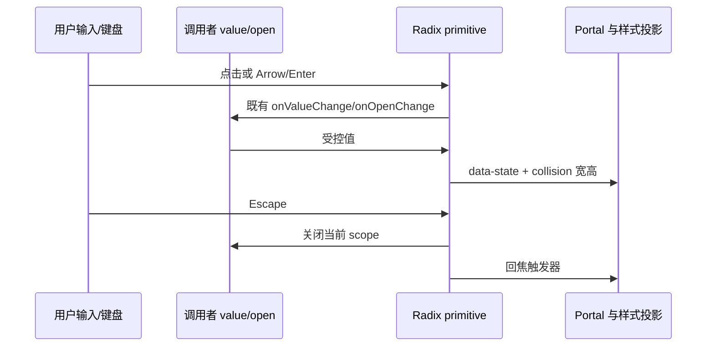

# 前端共享组件品控

## 范围与依据

按 Trace-Browser 的 desktop-admin-frontend-theme 规范、共享组件和管理前端实现检查 LCode。沿用 LCode 的 UI 字号、紧凑密度、圆角、Radix primitives 与平台边界；不复制 Trace 的固定像素或官网视觉。不改业务服务、Host、会话协议及用户未提交的运行环境改动。

当前确认：共享组件消费的 muted / muted-foreground / ring 缺少全局 token；Select、InputGroup、Badge 等仍有固定高度；Popover、ContextMenu、Dialog 缺少共用视口约束；原生输入步进、光标、自动填充未纳入主题。上一轮 Button 全局换行和无层级的强制焦点描边需要收敛。

## 产品规则与接口

1. 七色主题与 THEME_OPTIONS 沿用 ui-theme-modes.md。shadcn 兼容 token 只在全局 @theme 定义别名：muted → surface，muted-foreground → foreground-subtle，ring → input-border-focused，secondary/card/accent-foreground → foreground；不新增各主题的平行色板。
2. 普通 Button 默认保持单行；大字号靠最小高度容纳行高，长文案由局部 SettingsRow、推荐入口等选择换行或带完整提示的截断。共享 Button 提供键盘 focus-visible ring。全局 base 仅提供焦点兜底，不覆盖组件自身边框/ring，不清除浮层阴影；forced-colors 使用系统 Highlight。
3. 原生 number 输入隐藏步进按钮，保留 ArrowUp/Down 的原生数值操作；输入光标、自动填充、原生 select 选项、checkbox/radio accent 与 color-scheme 使用已有 token，不以长时间 transition 遮掩自动填充。普通表单的 readonly/disabled/error 状态有可辨识语义。
4. Select、InputGroup、Tabs、Badge 的默认高度是下限，大字号不裁切文字；InputGroup 的背景、边框及 focus-within 与 Input 一致。Select 保持箭头/选中标记独立空间，长选项自然换行，不盖住尾部标记。当前 Radix ItemText 会忽略 className，文字约束必须通过 Item 的实际后代选择器生效，并验收字形边界。滚动列表中的 Select/菜单项不能通过 flex shrink 压成低于字形高度的行。
5. Popover、Select、ContextMenu 和 Tooltip 通过 Radix 可用视口宽高限制，内容在内部滚动；继续由 Radix 负责 Portal、collision、键盘导航和关闭回焦，不另写定位或 open 状态。Select item-aligned 没有 Popper 尺寸变量，内容宽度使用视口减 Radix 两侧 10px 边距的 CSS fallback；其 positioner 的内联「至少五行」min-height 在长选项下高于视口，通过仅命中本组件 wrapper 的 CSS 兼容规则取消该下限，保留 Radix 的 max-height 和定位计算。
6. 普通 Dialog/AlertDialog 默认限于动态视口并可内部滚动。需要稳定标题/操作栏的长表单使用共享 DialogBody 和 flex 布局；其他已有自定义滚动/网格弹窗继续兼容，不自动重写调用者 children。新增 DialogBody 只负责 min-height/min-width/scroll，没有状态。关闭按钮复用 common.close 中英文文案并保留 no-drag。
7. 生产工作流启动表单及 API Key 管理弹窗采用正文滚动，标题和操作栏留在可视区域；不改变提交、权限、busy、文件导入、请求或校验逻辑。
8. Toast 的长通知正文可完整换行，使用 text-ui-\*；短窗口内部可滚动，关键操作不因截断失去含义。普通通知使用 status，warning 使用 alert，辅助技术可读；保留既有 toast 所有者、去重、计时和位置接口。
9. Switch/Checkbox 保持 checked、mixed、disabled 和键盘焦点可辨识；Switch 只过渡颜色/transform，reduced-motion 下停过渡。共享浮层尊重 reduced-motion，业务状态与加载语义不变。
10. 手机 Web（浏览器主题根 + coarse pointer + ≤767px）的可编辑 Input/Textarea 使用 mobile-input-safe token 作为 16px 字号下限，同时保留更大的 UI 字号；只作用于编辑控件，不放大根字体或桌面布局。用 320/390px、横竖屏与视口缩小模拟软键盘，验证草稿不丢、弹窗操作仍可达。
11. Windows/Linux 的窗口框架保留不透明背景，macOS 保留透明/vibrancy 语义；Linux 最大化撤去圆角裁切。共享 Dialog 保留 no-drag。平台差异继续由既有 DesktopWindowFrame 参数/根 class/IPlatformService 投影，不根据浏览器 UA 新建平台分支。三种平台 renderer 路径验证不等于对应 OS 的原生实机验收。

## 状态与事件顺序

主题、字体由既有 Zustand store 持有；受控值由调用者持有，Radix 持有未受控 open/active/focus 状态，Toast 使用现有宿主。样式只投影状态，不引入第二个队列、缓存或浮层栈。

## 验收证据

- 修改前先补浏览器回归：7 色、12/14/20px UI 字号、中英文、1280×720、1440×900、390×844、320×568 与短横屏。
- 覆盖 native number、autofill 样式、checkbox/radio、Select、Switch、InputGroup、Tabs、Badge、Popover/右键菜单/嵌套 Dialog/Toast；检查实际 computed style、文字边界、命中目标、内部滚动、焦点和 selected/disabled/error/loading 状态。
- Select 的 Popper 和选中项对齐两种定位都验证长文本、首末选项与窄/短视口；不能假定两种定位会提供相同的 Radix 尺寸变量。
- 使用真实 SettingsPage、ConversationTimeline 和生产长表单组件；服务仅用有界 fixture 替代，不把浏览器 fixture 当作完整桌面原生验证。
- 真正执行 UI 相关单测、浏览器回归、pnpm typecheck、pnpm lint、pnpm architecture:check --changed；按模块报告证据及未验证范围。不得把整站、跨平台原生或所有页面写成已通过。
- Windows 可用时用隔离、隐藏的 Electron BrowserWindow 验证真实 renderer 的弹窗边界和 no-drag；不初始化正式应用的 Host/Agent，也不使用正式 userData。macOS/Linux 的 CSS 分支和手机模拟均不能替代对应 OS 或手机实机验收。
