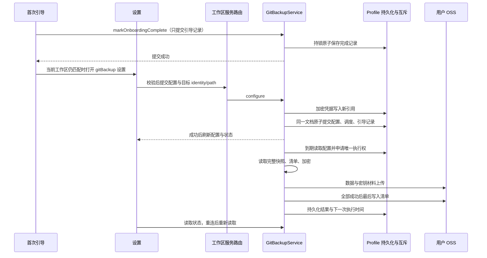
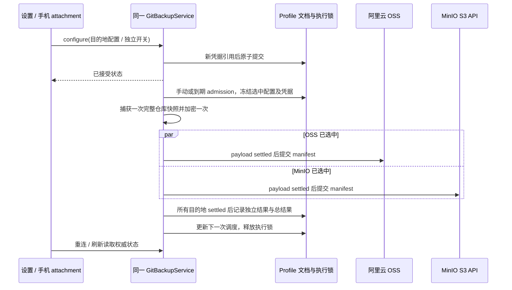

# Git 自动备份

## 目标与范围

修复「设置 / 数据与统计 / Git 自动备份」的占位逻辑。设置、首次引导、手动备份与自动调度使用同一 Host 服务契约，不以浏览器存储或 UI 定时器作为已保存事实源。OSS 请求直达用户配置的阿里云存储桶，不经过产品服务器。

备份覆盖 `.git` 仓库数据，包括 objects、refs、reflog，不备份工作区未提交文件。保留 `repo_backup_manifest/v1` 的长度编码归档格式与 AES-256-CTR / RSA-OAEP-SHA256 解密兼容性。不能完整覆盖的 linked worktree、gitfile、外部 alternates、依赖 promisor remote 的 partial clone 或外部 include 配置等仓库必须明确报错，不能声称已备份。

## 状态与边界

- `GitBackupService` 是对应文件系统 Environment 的配置、密钥、已加入工作区、调度时间及成功/失败记录的唯一所有者；Desktop Main 仅转发 RPC，不持有备份业务状态。
- 配置使用 Host profile 数据目录。OSS Secret 使用 Host CredentialService，不再写入 localStorage 或配置 JSON；配置文件持久化必须异步、原子且限制权限。getConfig 返回空 secret，保存时空值复用同一 AccessKey ID 的已保存 secret。修改 ID 必须重新输入 secret。禁止凭据日志。
- 自动备份工作区由用户显式加入，按 `workspaceIdentity?.trim() || workspacePath` 去重。identity 用于绑定、对象命名与关联，path 用于文件操作；不能因为同路径而把远程工作区路由到本机。
- 一个 profile 的所有 Host 共享持久化调度状态，并使用跨进程互斥避免同一周期、配置或密钥并发写入。配置、调度与引导完成记录在同一原子文档提交；凭据写入新的不可变引用后才提交文档，提交失败不覆盖旧凭据、不启用计划。凭据引用保存在 profile 文档中，不依赖当前绝对路径，数据目录迁移后保持可读取。旧分文件记录在持锁读取时一次性导入。进程关闭释放调度资源，不调用会改变用户 enabled 设置的 stopBackup。
- UI 只保留未提交草稿、请求中状态与服务状态投影。通过 `packages/ui/src/hooks/` 获取当前工作区 Host；引导与设置均传递完整 path、identity、remoteSessionId、remoteTarget，包含设置覆盖工作区与仅有 remoteTarget 的恢复阶段。断连保持不可用，绝不降级到本机备份。
- 手机 Web attachment 访问桌面已有 Host 的同一服务；不另启 Agent 或 Local Host。桌面连续链路与手机可恢复链路均使用 RPC 读取持久化状态，重连后重新读取，无 UI 自建备份队列。

## 产品规则

1. 默认关闭；首次引导加载服务完成记录后才显示。弹框仅介绍备份，不填写配置。“开启自动备份”先持久化已看过引导，再关闭弹框并打开当前工作区的「设置 / 数据与统计 / Git 自动备份」；不启用调度、不注册工作区、不保存凭据。跳过只持久化完成记录，不打开设置。完成记录写入失败时保留弹框并显示错误；晚到完成不为已切换的工作区打开设置。实际配置、目的地选择与启用都在设置页完成。
2. 设置读入已保存配置。OSS 与间隔修改使用明确保存动作；未保存表单不会被状态刷新覆盖。启用开关保存成功后才更新，不允许缺少有效配置或工作区时开启。
3. 间隔必须为 5 到 1440 的整数分钟。校验 AccessKey、bucket、region 和对象前缀，支持 `cn-hangzhou` 与 `oss-cn-hangzhou`，不接受自定义 URL、路径穿越或非法 bucket。
4. 自动备份只处理已加入列表。保存当前工作区或开启会幂等加入；可以移除目标。关闭不会丢失配置、密钥或已加入列表；不会新增上传，已开始的运行允许完成，页面准确说明。
5. “测试连接”使用用户表单配置执行真实的非写入 OSS 请求，不上传测试对象。空 secret 仅复用同一 AccessKey ID 的已保存 secret。不伪造成功；修改表单清除旧结果；测试过程禁用重复点击，完整显示失败详情。
6. 手动备份使用已保存配置和当前工作区，允许自动调度关闭时运行。不自动保存未确认的草稿。无工作区、断连、配置无效或已运行时禁用；完成显示结果，失败显示原因。
7. 状态显示运行中、上次成功时间、文件数、大小、下一次调度及错误。没有成功记录时不能显示成功。刷新不覆盖编辑草稿；晚到结果不污染新 Host / 新工作区。
8. 公钥可查看；私钥仅在明确导出操作后通过 `IPlatformService.saveFile` 保存，不在页面、剪贴板或日志中展示。取消导出不报成功，失败必须显示错误。密钥首次生成并发安全，残缺或损坏时不得重生成覆盖旧私钥。
   Web 的 saveFile 仅接受字节数据并启动浏览器下载，不返回原生绝对路径，也不能观察下载后的系统取消或落盘结果。拒绝 sourceUrl 请求且不发起网络访问。页面对 Web 显示“已开始下载”，对 Desktop 显示原生保存结果。新增此可选能力不能改变现有图片下载的 Web fallback。
9. OSS URL 使用 bucket 子域且签名资源与编码路径一致。HTTP 非 2xx、断网和超时均使备份失败。清单最后上传作为完成标记；不同工作区和并发尝试使用不同对象前缀，不能互相覆盖。
10. 清单哈希与归档必须来源于同一组读取字节，并检测扫描期间文件改变，不能将不一致快照报告为成功。单次归档最多 256 MiB、100,000 个文件；不跟随符号链接把仓库外数据意外上传。清单 v1 含文件名、哈希及工作区路径等元数据，只有仓库文件内容加密，页面与文档准确披露。
11. 保留 v1 格式不等于增加恢复或认证能力。AES-CTR 不提供认证防篡改，明文清单中的 SHA-256 不能作为可信认证证明；归档不记录文件权限，恢复时无法可靠还原 hook 等文件的执行权限。当前没有内置恢复命令，格式解析与解密单测不构成产品级恢复验收。

## 迁移

旧浏览器 `git-backup-config` 从未形成真实服务配置，不能因迁移自动开启或产生上传。首次读取仅转为待确认草稿；显式保存成功后清除旧凭据。旧 onboarding 标记可迁移为服务完成记录，失败不删除旧记录。Host 保存成功后，浏览器禁止删除旧数据不能将已提交结果误报失败；保留旧数据供以后清理。引导读取失败重试成功时重新读取完成记录，不初始化配置表单；设置页保存失败时保留已填写草稿。已接受的位置变更或清除立即投影历史失效，即使随后读回失败也不显示旧地址成功；同位置密钥轮换及无关槽保存保留历史。旧 Host 缺少 channel 时页面显示不可用，不显示假成功。RPC 中新增方法无需改变 Agent stdio 协议。

## OSS / MinIO 多目的地扩展（2026-09-30）

### 范围与唯一所有者

- 在现有 Host 服务中增加 MinIO；每个 profile 提供 OSS、MinIO 两个独立配置槽，不增加 UI 上传器、另一个调度器或任意数量的同类账户。
- 总开关 `enabled` 控制自动调度；`destinationEnabled` 分别选择 OSS / MinIO，两者可以同时启用或只启用一个。保存配置不自动选择新目的地、不自动开启总开关。开启总开关要求至少一个选中的有效目的地及已加入工作区。
- 保留共享间隔、工作区列表和加密密钥。每个目的地的凭据、可用性、上次尝试、上次成功和错误分别持久化；配置位置或账户改变后清除该目的地旧位置的成功投影。
- 设置以「阿里云 OSS」「MinIO」两个独立页签展示，不再使用两行目的地开关加一个下拉编辑器。每个页签的面板只显示该目的地的加入备份开关、配置、保存 / 测试 / 放弃修改 / 清除操作、单目的地手动备份与独立结果。页签标题始终展示各自已加入 / 未加入 / 未配置 / 需检查状态，不隐藏另一目的地需要处理的错误。
- 页签切换只改变同一个 `useGitBackup` 的 `provider` 展示状态，不保存配置、不切换目的地开关、不开启调度。OSS 与 MinIO 可同时加入备份；切换页签不丢失任何一方草稿，测试结果按类型和草稿版本隔离。已有写入期间不允许切换，测试期间允许切换且晚到结果只属于原目的地。
- 总自动备份开关、共享间隔、全部已选目的地手动备份、全局状态、工作区列表与密钥管理位于页签之外，只展示一份。共享间隔仍随当前页签的显式保存提交，文案明确它影响两个目的地；不新增调度器或第二条配置写入路径。明确确认后可以清空当前页签的已保存配置并关闭其开关，不删除固定槽、工作区、密钥或远端对象。
- 复用现有 Tabs / Switch / Input / Button，页签具备 tablist / tab / tabpanel 语义与键盘导航，在手机宽度及明暗主题中保持可辨识；不只依赖颜色区分当前目的地。布局拆分在 UI 内完成，Host 契约、RPC、持久化、身份隔离与桌面 / 手机传递语义保持不变。
- 首次引导仅跳转统一设置页，不再显示 OSS 表单；跳转和跳过都不覆盖 OSS / MinIO 配置或启用状态。旧浏览器 OSS 草稿在设置页读取，仅在 OSS 明确保存后清理；保存 MinIO 不清理。

### 请求与凭据

- MinIO 使用维护中的 AWS Signature V4 签名器，S3 path-style 请求；endpoint 为用户提供的 S3 API origin（不是控制台地址），允许 HTTPS 和明确填写的 HTTP，不允许 userinfo、query、fragment 或路径。HTTP 会暴露传输内容，页面明确警告，不禁用 TLS 校验。
- MinIO region 默认 `us-east-1`；bucket、endpoint、账户、region 和前缀按 MinIO 规则校验，不复用 OSS region 规则。
- MinIO HEAD bucket 测试不创建对象、不创建 bucket；HEAD 成功不证明 PUT 权限。上传使用同一 Host 注入的网络适配器，保持代理、No Proxy、自定义 CA、超时和禁止重定向，不从浏览器直连。
- OSS 和 MinIO 凭据引用隔离。空 Secret 只能复用同一目的地与 AccessKey ID 的凭据；MinIO endpoint 改变也要求重新填写 Secret，避免把旧密钥发给新服务器。getConfig 始终清空所有 Secret，错误和日志不得输出签名或凭据。
- 所有目的地配置、引用、状态与引导仍在一个锁和一个原子文档提交。新密钥先写不可变引用，文档失败清理新引用而保留已接受配置和旧引用。

### 运行顺序与失败

- 手动默认备份到所有 `destinationEnabled` 的目的地，不受总自动开关限制；可明确指定一个已保存目的地，即使其自动开关关闭。无选中目的地的默认手动操作明确报错。
- 每个工作区 admission 时冻结配置及凭据；运行期间关闭某目的地或总开关不取消已经接受的运行，下一工作区 admission 重新读取配置。删除工作区等既有规则不变。
- 同一工作区只捕获 / 加密一次，OSS 与 MinIO 使用同一相对 backup ID，各自前缀独立。一个目的地失败不阻止其他目的地完成；每个目的地只有三个 payload 都成功后才上传自己的 manifest。
- 等待所有目的地及其 payload settled 后才能释放执行锁。全部选中目的地成功才返回总体成功；部分失败明确拒绝并携带不含凭据的目的地结果，同时持久化成功目的地的记录。失败目的地不写完成清单，不回滚成功目的地、不删除远端对象、不增加自动重试队列。
- 全局上次成功只表示某次接受的目的地全部成功，持久化其目的地归属（包括未选中目的地的显式手动备份），不按当前开关猜测历史归属。修改或清除历史涉及的位置时清除全局旧成功，保存无关槽不清除。缺少归属的旧 v2 历史按已有目的地成功记录推断；无法判定时保守清除。
- 结果在同一文档锁下比较 admission 与当前的位置 / 账户；旧位置的晚到成功和失败都不进入替换配置的独立或全局状态，但原调用仍返回其真实结果。更换位置同时清除涉及的全局错误；周期末重新过滤失败的位置归属，不能重写已经失效的旧错误。多工作区周期的当前有效错误不能被后来成功覆盖。
- 桌面 `desktop-continuous` 与手机 `web-remote-replayable` 均沿用现有 RPC 和同一持久化所有者；不增加 Agent stdio 协议、手机运行时或恢复队列。

### 迁移和验收

- 旧仅 OSS 文档 / `_backup.version: 1` 在既有文件锁内一次性迁移到版本 2。保留原总开关、间隔、到期时间、工作区、引导完成及精确 OSS credentialReference，不重新按路径计算；旧已保存 OSS 默认被选中，MinIO 默认关闭。
- 无 `_backup` 的旧 Host JSON 若仍含 OSS 明文 Secret，必须先将该值写入新的不可变凭据引用，再原子提交脱敏文档；不得覆盖已有旧引用的其他值。凭据写入或文档提交失败保留原 JSON、回滚新引用并返回脱敏错误，不能先抹去唯一密钥。旧 JSON 已脱敏时保留其旧引用。
- 历史成功只归入 OSS，不伪造 MinIO 成功。迁移后移动 profile 仍使用已保存引用。旧 RPC 客户端的 OSS configure/test/start 调用保留兼容默认语义。
- 回归覆盖明文迁移及凭据 / 文档失败回滚、未选中显式备份后更换或清除位置、晚到旧位置失败及周期末错误过滤、欢迎弹框只跳转且不写配置、失败不跳转与过期工作区不跳转。
- 测试覆盖：旧文档迁移 / 重启、独立凭据和失败回滚、OSS-only / MinIO-only / 两者、任一失败仍完成另一方、慢请求 settled 后释放锁、各自 manifest-last、无目标拒绝、停止与多 Host 去重、endpoint 改变不复用 Secret。
- MinIO 测试覆盖 SigV4 已知向量 / 独立签名确认、bucket HEAD、路径编码、端口、HTTP/HTTPS、失败 / 超时 / 重定向，不使用真实服务器或用户凭据。
- 页面交互覆盖页签切换草稿保留、当前面板仅有一个目的地开关 / 配置 / 单目的地备份 / 结果、页签非启用互斥选项、非当前页签错误提示、共享区域不重复、独立开关失败、保存 MinIO 不覆盖 OSS、单个与全部手动备份、部分失败状态、断连防本地 fallback、手机无溢出。实际执行现有测试、类型 / Lint / 架构检查与 Web 构建，诚实记录未使用真实 OSS / MinIO 或原生桌面对话框。

## 验收与测试

- 服务单测：默认关闭、有效保存与重启恢复、非法间隔/配置拒绝、目标 identity 去重、配置并发合并、禁用保留数据、到期调度与多实例去重、dispose 不改变 enabled。
- 备份单测：无仓库、gitfile/alternates/符号链接错误；归档解码并解密校验；清单与字节一致；上传失败不写成功状态；清单最后提交；对象路径隔离；密钥并发及残缺保护。
- OSS 单测：正确 bucket endpoint、region 标准化、路径编码、签名、真实连接检测、HTTP 错误及请求超时，全部使用模拟网络，无真实凭据或上传。
- UI 单测与交互验收：加载失败重试、保存并重新打开、测试结果随编辑失效、错误消息有详情、开关失败回滚、当前工作区手动备份、私钥取消/失败、首次引导保存失败、晚到请求和断连防误路由。
- 页面 E2E 场景：桌面宽度及手机宽度下保存、测试、开关、手动备份与公钥展示可操作，表单标签可访问，长路径与错误不溢出；Web/手机断连状态无本机 fallback。网络可用测试桩，不触碰用户 OSS。
- 实际执行目标测试、`pnpm typecheck`、`pnpm lint`、`pnpm architecture:check --changed`，分别报告结果和未覆盖范围。

## 验证记录（2026-09-30）

- 服务、签名、快照、迁移、RPC 与远端 Host 路由：84 项通过。命令：`pnpm exec node --import tsx --test --test-timeout=30000 packages/services/src/git-backup/*.test.ts packages/client/src/remoteServiceAccess.gitBackup.test.ts packages/desktop/src/renderer/src/remoteWorkspaceSessionServices.gitBackup.test.ts`。
- UI 草稿、状态投影、引导生命周期、组件与完整工作区路由：51 项通过。从 `packages/ui` 执行 `pnpm exec tsx --test src/hooks/useGitBackup.test.ts src/hooks/useGitBackupOnboarding.test.ts src/hooks/gitBackupLegacyConfig.test.ts src/GitBackupWelcomeDialog.test.tsx src/settings/GitBackupSection.test.tsx src/root/rootWorkspaceShellTarget.test.ts`。
- Web 重连与配对：`pnpm --filter @lcode/web test`，21 项通过；Web 文件导出：`node --test packages/web/src/saveWebFile.test.mjs`，9 项通过。以上合计 165 项，无失败或跳过。
- `pnpm typecheck`、`pnpm lint`、`pnpm architecture:check --changed` 通过；Lint 为 0 警告 / 0 错误，架构为 0 基线 / 0 新增违规。`services` 和 `ui` 是 legacy unmanaged 模块，架构检查不等同于完整的边界审计。
- `pnpm --filter @lcode/web build` 通过（19.30 秒）。保留既有大 chunk、无效动态导入和插件耗时警告。当前 Node 为 24.14.1，仓库固定版本为 24.14.0，pnpm 报 patch 版本提示。
- 35 个本轮相关文件的 scoped 格式检查通过，`git diff --check` 通过；未把全仓库格式检查视为通过。格式器直接写入部分文件失败后，使用同版本 `oxfmt` 的 format API 完成格式化并重新检查。
- 功能图 YAML、69 个唯一节点、101 条关系的端点与 rank、4 个备份节点的当前源码引用已验证。
- 模拟服务页面实际验证：弹框无配置表单；开启进入设置且只变更引导完成记录；失败保留弹框且不跳转、重试成功；跳过不进入设置；390px 下明暗主题无横向溢出；未选中目的地手动备份后更换 bucket，即使提交后读回失败也立即清除旧成功记录。浏览器工具鼠标点击未可靠送达、截图超时，改以页面按钮事件验证逻辑；不计作完整鼠标 / 像素级 E2E。
- 所有网络均为测试桩，无真实 OSS / MinIO 上传、真实手机 attachment 或原生文件保存对话框验证。没有提交、推送、发布或打包安装程序。
- 状态所有者仍是文件系统 Host；欢迎 UI 只提交完成标记，设置通过既有 RPC 提交配置，接受结果按位置归属过滤。相关模块为 services、client、desktop、ui、web；不新增 Main 或手机状态所有者。
- 相对当前 HEAD 的备份核心实现、单测和浏览器 fixture 范围（包含前序 OSS 修复，不含其他任务）为 6 个已跟踪文件 +1171/-603、33 个新增文件 7063 行，净 +7631 行；不将整个工作区的其他未提交改动计入本任务。

## 独立目的地页签验证（2026-09-30）

- 本轮只调整 UI 展示和组件拆分，复用原 `useGitBackup` 草稿所有者、Host 契约和配置提交路径。`GitBackupDestinationTabs` 管理页签展示，`GitBackupDestinationPanel` 集中当前目的地操作，`GitBackupResultDetails` 复用结果格式；不增加服务、调度器或持久化状态。
- 上述 UI 回归命令现为 53 项全部通过，覆盖目的地面板隔离、两个目的地同时选中、非当前页签错误提示、写入期间禁止切换、测试期间允许切换、tab / tabpanel 的关联，以及共享间隔与当前保存表单的关联。
- 实际浏览器使用模拟服务验证了鼠标与方向键切换、双草稿保留、MinIO 保存不覆盖 OSS、不自动开启目的地或总开关、两者同时加入、测试结果晚到不串页签、部分失败保留健康目的地成功，以及共享间隔非法值不提交 / 合法值保存不覆盖另一目的地。
- 390px 手机宽度下，明暗主题均无横向溢出；页签列表宽度与 scrollWidth 均为 358px，页面宽度与 scrollWidth 均为 390px。实际截图确认卡片底色与当前页签区分，修正了半透明底色的对比度问题。手机少数语义定位点击超时后使用当次可见 DOM 元素点击验证；合法共享间隔的保存通过页面原生按钮事件验证。
- `pnpm typecheck`、`pnpm lint`、`pnpm architecture:check --changed` 均通过；Lint 0 警告 / 0 错误，架构 0 基线 / 0 新增违规。`ui` 仍为 legacy unmanaged，未把静态架构检查当作完整边界审计。
- 最终 `pnpm --filter @lcode/web build` 通过（12.51 秒），保留既有 Node patch 版本、大 chunk、无效动态导入和插件耗时警告。13 个相关文件的 scoped 格式检查与 scoped `git diff --check` 通过；功能图 69 节点 / 101 关系和备份源码引用验证通过。
- 相对本轮开工时读取的内容，7 个 UI 实现与测试文件从 1053 行变为 1196 行，净 +143 行（含 3 个抽取组件，不含文案和文档）；不将之前遗留的未提交改动归为本轮新增。
- 本轮未改后端，因此未重复执行前一轮服务 / Web 底层单测；未访问真实 OSS / MinIO、真实手机 attachment 或原生桌面保存对话框，未提交、推送或打包安装程序。
