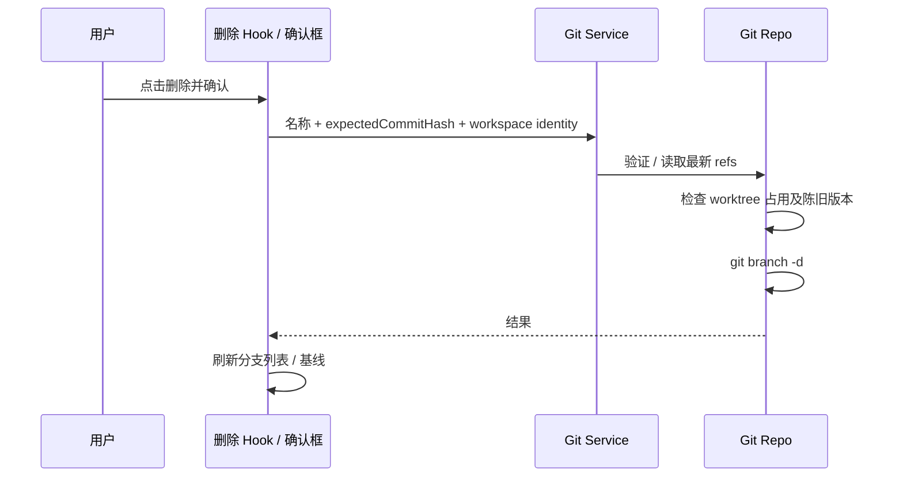

# 分支选择器删除本地分支

- 基线选择器和本地目录分支选择器提供每个分支的删除入口；使用共用确认组件和 Git 服务。删除不切换分支，不删除远端分支，不清理工作树。
- 当前分支及被任一 worktree 检出的分支不可删除；列表展示 checkedOutPath。服务重复检查保护，并比对确认时的 commitHash，防止陈旧确认删除已改变的分支。
- 只支持安全删除 git branch -d -- name：未合并的分支保留并展示错误，首期不提供强制删除。参数以 argv 传递，验证 Git ref 格式。外部 Git 并发仍由 Git 的工作树占用和未合并保护裁定。
- UI 通过 hook 调用 IGitService.deleteBranch，Service -> Repo -> 注入的 command provider；身份沿现有本地/远端 Host 路由，不引入平台专属 API。取消不执行命令；失败保留确认框与错误；成功刷新列表与 summary。被删除的本次基线恢复 HEAD。

验收：中文分支、取消、占用分支、未合并分支、确认后 ref 改变、删除成功、选定基线被删除、手机点击和键盘操作。UI 交互测试场景随代码提供，由用户构建验证。
