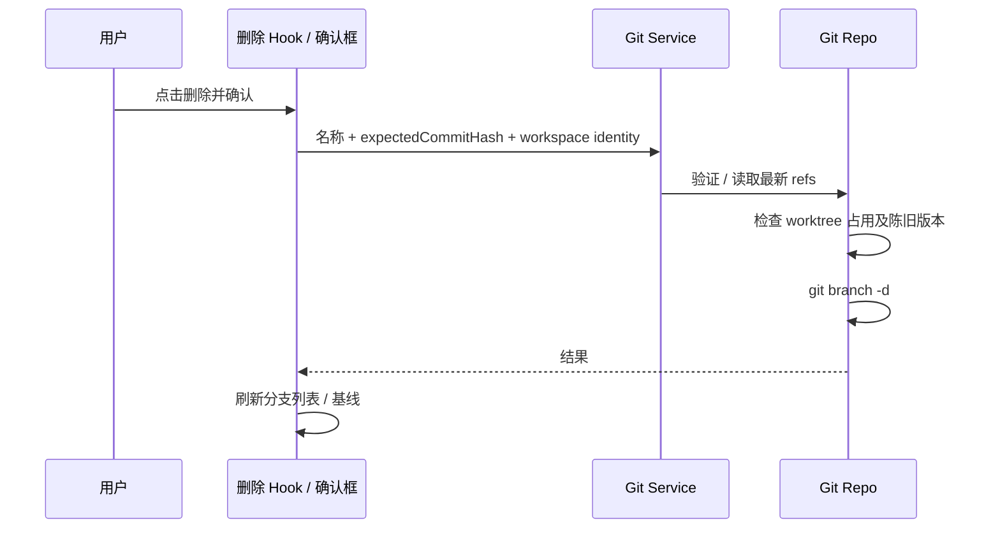
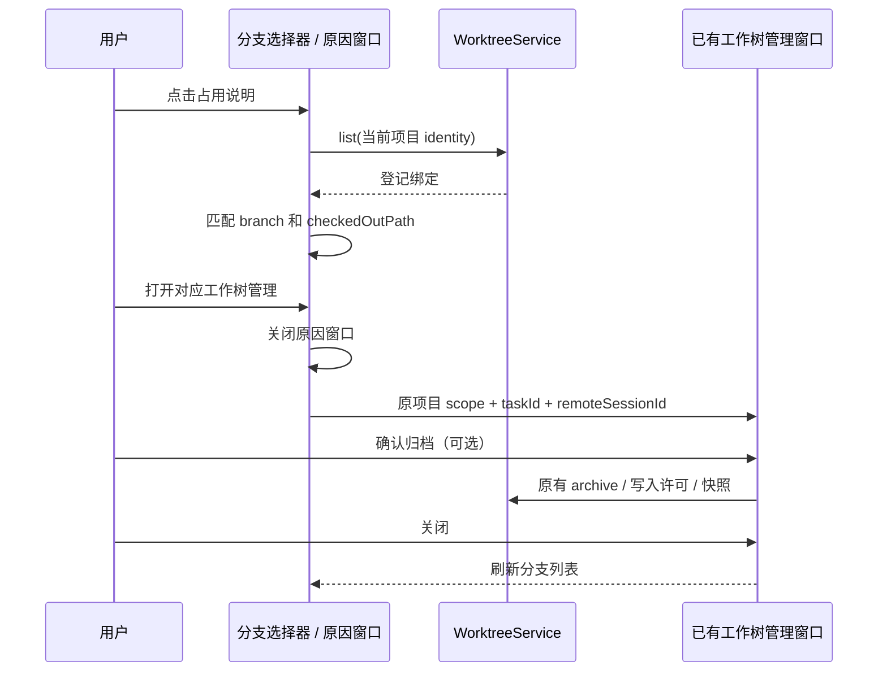

# 分支选择器删除本地分支

- 基线选择器和本地目录分支选择器提供每个分支的删除入口；使用共用确认组件和 Git 服务。删除不切换分支，不删除远端分支，不清理工作树。
- 当前分支及被任一 worktree 检出的分支不可删除；列表展示占用状态。右侧占用说明图标可点击，打开原因窗口，显示 checkedOutPath；普通分支仍使用垃圾桶和删除确认。服务重复检查保护，并比对确认时的 commitHash，防止陈旧确认删除已改变的分支。
- 普通分支删除只使用 git branch -d -- name：未合并的分支保留并展示错误。受管工作树可进入项目工作树管理，按 [工作树删除规则](worktree-discard.md) 确认删除目录及任务分支，不经过提交审核。参数以 argv 传递，验证 Git ref 格式。外部 Git 并发仍由 Git 的工作树占用保护裁定。
- UI 通过 hook 调用 IGitService.deleteBranch，Service -> Repo -> 注入的 command provider；身份沿现有本地/远端 Host 路由，不引入平台专属 API。取消不执行命令；失败保留确认框与错误；成功刷新列表与 summary。被删除的本次基线恢复 HEAD。
- 分支名称与操作入口在同一行分配空间：名称区域允许收缩和换行，选中标记和操作按钮占据统一的固定区域，始终可见。长中文、英文及无空格名称完整显示，不裁剪文字或操作。当前分支和占用分支的说明入口支持鼠标、触控及键盘，不因禁用删除而禁用原因查看。
- 基线与本地分支选择器复用同一搜索与列表组件、图标、字体、宽度、行距和选中标记；Composer 触发器使用统一样式。工作树模式在搜索框下显示基线说明并提供 HEAD；本地模式保留创建分支和 Git 图谱。搜索和基线选择只修改局部查询或草稿，不切换原目录分支、不创建工作树。上下方向键/Enter 选择，Tab 进入操作按钮，Escape 关闭。
- 基线说明保持在列表外；仅分支列表纵向滚动。弹层高度受当前可用视口限制，列表可收缩，不能继承通用 Popover 的大行间距；桌面、手机及大字号下都无横向溢出，最后一条分支可滚动到可操作位置。
- 占用窗口沿当前 workspacePath、workspaceIdentity 和服务注入读取 useProjectWorktrees。首次启用即为读取中，不以初始空投影判定未登记。只将 Git checkedOutPath 与登记绑定的 checkoutPath、branch 精确匹配的条目作为对应工作树；Windows 盘符路径允许分隔符与大小写差异，POSIX 路径大小写敏感。查找失败可刷新重试，未登记的占用目录显示外部管理提示；连接缺少服务时显示不支持管理，不冒充未登记或本应用工作树。
- 点击对应工作树管理先关闭占用窗口，复用 ProjectWorktreeManagementDialog 并选中该会话；保留 originWorkspacePath、originWorkspaceIdentity 和 remoteSessionId。打开、返回、关闭管理不执行归档或删除。管理窗口关闭后刷新分支投影；归档、忽略文件确认和运行中写入许可沿原 WorktreeService 流程。查找结果不得跨 scope 复用，切换项目后旧窗口与目标无效。
- 普通分支列表沿用安全删除规则，不提供隐式归档或对外部工作树的自动清理。受管工作树删除由 WorktreeService 的生命周期命令执行，操作完成后将删除结果传回原选择器，刷新占用和选定基线；不增加另一个文件或 Git 写入 owner。

验收：中文分支、取消、占用分支、未合并分支、确认后 ref 改变、删除成功、选定基线被删除、手机点击和键盘操作。UI 交互测试场景随代码提供，由用户构建验证。

布局回归：在 1280px、截图尺寸 1143×723、390px 及 320px 视口，中文/英文、浅色/深色和大字号下，两种列表的行布局一致并完整显示长名称；操作按钮边界始终位于列表内。滚动到最后一条分支后，点击删除只打开该分支的确认框，不选择基线或切换分支；取消没有 Git 写入。`HEAD` 无删除按钮，当前/占用分支点击说明没有删除确认。覆盖搜索、键盘选基线、Tab 操作、占用管理往返、未登记工作树、读失败重试、跨项目与远端 identity。

