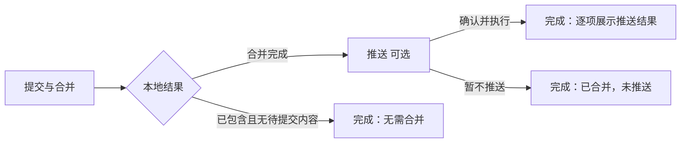
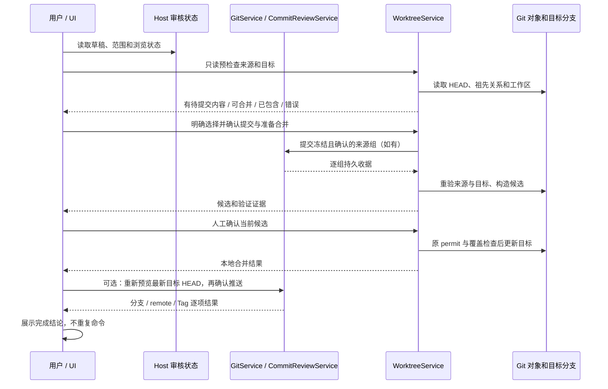

# 提交与合并审核：流程和界面优化方案

状态：已按用户确认实施，开发回归已执行；安装版和实体手机验证尚未执行。2026-10-09。

## 实现契约（2026-10-09）

用户已确认按方案实施。新增 `getIntegrationPreflight({ bindingId, targetBranch })`，只读返回来源/目标 HEAD、独有提交数、未提交文件数和已包含判断；请求与响应均严格校验。合并请求增加 `acknowledgeUncommitted`，仅明确选择不纳入未提交文件时使用；冻结审核提交组携带其已确认范围意图。预检查不授权执行，执行前服务重新读取 Git 事实。

只读合并检查使用独立的 WorktreeIntegrationInspection 契约，由原 IWorktreeService 继承并公开；查询与状态变更的接口职责分开，owner、RPC descriptor 和服务实例仍唯一。

无需合并记录使用独立终态 `up-to-date`，持久保存本次 refs 和 `mergeResult`，不创建候选目录或运行验证，也不伪造 published。正常候选按真实树和 Git 路径变化分类为 content/history-only；记录 changedFiles 和本次来源独有提交数。历史记录不改写，显示缺证据或可证明的已包含语义。新终态不锁住来源，归档、删除、重试及发布入口都必须识别。

顶层结果浏览新增可选 `publicationView: { operationId, view: "push" | "result" }`，沿 Host 审核字段版本同步，与 worktreeView 四个子阶段分开；默认先展示合并结论，推送仍需主动选择。人工确认、发布计划和 run 保持本端；相同 operation 的视图切换不卸载发布控制器。未持有本次 run 时显示未执行/待核实，不从浏览字段推断已推送。

完成区分别总结提交、合并和推送。新检查区域按准备/检查分别显示摘要，日志折叠；审核窗口使用固定标题与底部、独立滚动正文。普通提交使用 Button 和原门禁/快捷键；工作树优先强调提交并准备合并，其余操作降为次级。

## 目标与范围

基于会话 `sess_01a11b87-1bff-7f68-b4bb-1af318196709` 暴露的问题，让用户能明确回答：哪些文件已经提交、哪些内容已经合并到哪个分支、是否推送到远端，以及本次操作最终发生了什么。

范围包括共享提交审核窗口、工作树合并审核、可选推送和结果展示，兼顾桌面与手机 Web。本地目录提交复用视觉语言，但不显示工作树合并步骤。工作树管理继续只处理生命周期；不新增第二个提交控制器。

实现与测试不执行现场提交、合并、推送，也不修改历史 operation、构建或安装应用；真实 Git 测试只使用临时仓库。

## 当前证据与问题

| 问题                             | 已确认的依据                                                                                                                                                                 | 影响                                                                        |
| -------------------------------- | ---------------------------------------------------------------------------------------------------------------------------------------------------------------------------- | --------------------------------------------------------------------------- |
| 零变更被表达成有效合并           | 现场 operation 的 sourceHead 为 `c45e4c7`，targetHead 与 candidateHead 同为 `847c9e5`，diff 长度为 0，status 为 published；只读 Git 核对确认来源已被目标包含、独有提交数为 0 | “已合并到 L-GO”不能说明本次是否纳入新内容；未提交改动仍可能全部留在来源目录 |
| 完成结论与后续动作混合           | `worktreeReviewStages.ts` 定义准备、审核、确认、完成；`WorktreeTaskActions.tsx` 在 published 后接入 `WorktreePublication` 的可选发布表单                                     | 用户进入“完成”后仍面对待操作控件                                            |
| 主提交操作像普通内容行           | `GitCommitConfirmAction.tsx` 使用 Command/CommandItem；同窗又混用 Button、阶段按钮、文本和 details/summary                                                                   | 主动作、导航、状态及详情入口缺少一致区分                                    |
| 技术证据占据主阅读区             | `WorktreeIntegrationEvidence.tsx` 直接列出完整哈希、基线、共同祖先、集成目录；`WorktreeValidationResults.tsx` 同时列出命令计划与“命令 — exitCode”                            | 用户先读实现细节，难以发现结论与下一步                                      |
| 来源内容与合并内容容易混淆       | `WorktreePreparation.tsx` 可直接准备已提交 HEAD 的合并；`CommitAndMergeControl.tsx` 才传入冻结来源提交组                                                                     | 未提交文件不能由“合并当前提交”隐式纳入                                      |
| 历史合并结果与当前目标 HEAD 不同 | operation 是历史收据；`worktreePublicationPlan.ts` 会为本次推送冻结目标分支最新 HEAD                                                                                         | 历史验证通过不能代表后来新增提交也已验证                                    |

初次问题归纳依据用户反馈和源码结构；实现后已采集实际共享组件的桌面/390px、中英文及全部静态主题截图，并验证焦点、正文滚动和固定动作区。截图使用服务桩，不代表安装版或实体手机已验证。

## 推荐产品规则

### 1. 三个清晰的视图

- **提交与合并**：范围、来源提交、候选审核、验证、确认合并。保留现有业务子阶段和人工确认边界。
- **推送（可选）**：独立展示实际推送分支、remote、目标分支和本次冻结 HEAD，预览后再确认。Tag 操作保留在高级选项内。
- **完成**：展示结果结论和证据摘要；结果区不内嵌待填写表单。推送失败时也可查看结论，但必须分别说明本地合并成功和远端失败。



推送可跳过，不能作为本地合并成功的前提。回看阶段不执行命令；“暂不推送”只是本端选择，不伪造远端成功。新来源改动可开始新审核，旧结果不锁住新提交。

这三个视图是用户流程，不将现有四个 worktree 子阶段直接重编号。顶层推送/结论浏览通过独立、带 operationId 的 publicationView 同步；原 worktreeView 保留子阶段含义。严格 schema 与旧快照恢复规则共同更新，未直接扩大 max(3)。

### 2. 提交与合并必须说明包含范围

- 有待提交改动时，默认下一步为审核所选范围并“提交并准备合并”；显示选中、排除、剩余未提交数量。
- 无待提交改动且有尚未合入的来源提交时，使用“准备合并已提交内容”。
- 有未提交改动但用户只想合并既有提交时，提供明确的次级选择，先展示“这些未提交文件不会进入本次合并”，沿现有文件查看器查看遗漏范围，再接受用户选择；不能默默替用户暂存或忽略。
- 合并确认明确区分“来源提交已完成”和“将合并到 {targetBranch}”。“提交并准备合并”不能写成“已合并”。

### 3. 零变更和历史变更分开判断

权威判断来自服务读取 Git 对象、祖先关系和工作区状态，不由 UI 根据空 diff 文本猜测。

| Git 事实                                     | 推荐行为与结论                                                                                                 |
| -------------------------------------------- | -------------------------------------------------------------------------------------------------------------- |
| 来源已被目标包含，来源仍有未提交改动         | 提示“当前已提交内容已包含在目标中，仍有改动尚未提交”；主入口返回来源提交审核，不显示本次新增合并成功           |
| 来源已被目标包含，无未提交改动               | 显示“目标已包含来源提交，本次无需合并”；不启动候选创建、依赖准备、验证或目标更新；既有目标推送入口仍可独立使用 |
| 来源含未被目标包含的提交，候选树与目标树相同 | 允许审核提交历史，明确“纳入提交历史，文件内容无变化”；不能仅因 diff 为空一律阻止合并                           |
| 候选带文件内容变化                           | 显示实际变更文件及增删统计，确认后更新目标                                                                     |
| 缺少必要证据、读取失败或引用变化             | 显示原因并要求刷新/重新审核，不能当成零变更或成功                                                              |

二进制变更用 Git 树/路径状态判断；文本 diff、行数和截断结果不能单独证明无变化。历史 published 记录保持原样，只改善展示；证据足够时解释为“当时目标已包含来源，未新增内容”，不足时标为结果未核实。

新预检查由 WorktreeService 负责。在创建候选前检查已提交来源和目标关系；在冻结来源组实际提交后重新检查；服务 admission、writer permit 和目标更新仍重验 HEAD、identity、候选和验证证据。预检查成功不是后续执行授权。

### 4. 完成是事实摘要

默认展示三个独立结果：

1. **提交**：本次已提交组数/提交哈希，或者“本次未创建来源提交”；不把整个历史分支的提交数当成本次提交数。
2. **合并**：实际目标分支、结果提交、文件变化/仅历史变化/无需合并；验证通过、失败、跳过分别说明。
3. **推送**：逐 remote/分支/Tag 的成功、失败、未执行或待核实；有一项失败时不汇总成全部成功。

显示“本次合并结果”与“当前目标分支”两个时间语义；目标后来前进时，提示本次推送会包含后续提交，历史验证收据只覆盖原候选。短哈希用于摘要，完整哈希和目录可展开、复制。

现场示例的正确结论应为：“L-GO 当时已包含来源提交；本次未新增合并内容。尚未提交的文件未进入目标分支。”未提交状态应来自当时证据，不能用今天的工作区替代历史事实。

## 页面与按钮方案

```text
┌ 提交与合并审核                         关闭 ┐
│ 提交与合并     推送（可选）     完成        │
│ 来源任务分支 → 目标分支                    │
│ 当前状态、范围摘要和需要处理的原因          │
├ 当前阶段正文                              ┤
│ 文件范围 / 提交信息 / 审核 / 结果摘要       │
│ 验证：2 项通过 · 依赖准备：已完成          │
│ > 查看检查详情    > 查看技术信息           │
├ 固定操作区                                ┤
│ 次级操作                     当前主动作   │
└─────────────────────────────────────────┘
```

- 两种审核窗口复用布局规则：固定标题、可滚动正文、固定底部动作。宽屏目标为 `max-w-3xl` 的流式窗口，手机使用单列并保留安全边距；Diff 继续使用既有独立查看器。
- 每个当前阶段只强调一个主动作，使用已有 Button 的 primary；上一页、查看差异、复制、刷新使用 outline/ghost 等次级样式。
- 主提交操作改为真正的 Button；快捷键作为附属提示，且仍受同一审核门禁控制。普通提交快捷键不能升级为合并或网络推送。
- 阶段导航使用独立选中指示和阶段状态，避免所有步骤都像执行按钮。状态用图标加文本表达；不可点击摘要不使用按钮外观。
- 折叠详情有统一箭头、文字和展开态。把“pnpm run lint — 0”改为“Lint 通过”，命令、退出码、输出进入详情；依赖准备与检查结果分别统计。
- 页首突出来源/目标与本次范围；完整路径、共同祖先、完整哈希置于技术信息中。失败原因默认展开，操作入口放在原因附近。
- 遵守 DESIGN.md：`bg-popover` 外壳、`bg-surface` 低强调摘要、语义化边框；只使用 `text-ui-*`。标题/主操作用 text-ui-base，帮助说明用 text-ui-sm，状态不靠颜色单独表达。
- 检查全部已提供主题、中英文长文案、长路径、390px 宽度、键盘焦点及手机软键盘。底部动作不得遮挡正文或输入。

## 状态所有者、接口和时序

| 状态/事实                              | 唯一所有者                                                                          | UI 的职责                                        |
| -------------------------------------- | ----------------------------------------------------------------------------------- | ------------------------------------------------ |
| 草稿、文件范围、冻结审核引用、阶段浏览 | 目标 Host 的 GitReviewWorkspaceState；现有共享 schema/版本控制                      | hooks 读取事实；store 只保留快照和未接受 overlay |
| 人工确认、窗口可见、查看器返回 token   | 当前设备交互状态                                                                    | 内容/候选变化清除确认；关闭只隐藏                |
| 来源提交及逐组收据                     | GitService / CommitReviewService                                                    | 展示本次收据，不制造提交事实                     |
| 预检查、候选、验证、目标合并结果       | WorktreeService                                                                     | 展示服务结果和摘要；不由 Main 或 UI 推断成功     |
| 发布计划与逐步执行结果                 | 当前 useWorktreePublication / publishExecution 控制器，真实副作用由 GitService 执行 | 保持唯一在途控制器；视图切换不卸载或重放执行器   |

当前发布执行器明确没有队列和持久化，不能因增加“推送”页就宣称推送历史已跨端保存。重开同一挂载控制器保留现有结果；应用重启或换设备后缺少本次结果时显示“本次推送结果待核实”，保留显式检查/重新预览入口，不自动重试，不回退已完成合并。如以后要求跨设备恢复完整发布收据，需要另行扩展 Git owner，不能把 UI 本地 run 变成 Host 业务事实。

已实现的接口增量：

- WorktreeService 的 getIntegrationPreflight 只读结果，携带 binding、来源/目标 HEAD、来源已被包含的判断、独有提交数量和未提交状态；查询不产生候选或写入分支。
- 合并入口沿 sourceCommits 与 acknowledgeUncommitted 区分已审核提交范围和明确只合并已提交内容，并在服务端重验。无合并工作时返回 up-to-date 终态及 mergeResult，不伪造 published 成功；公开类型、请求、响应和持久记录都有对应校验。
- 顶层流程浏览字段 publicationView 通过原 GitReviewWorkspaceData 与 Git RPC 通道接受；旧字段版本默认补 0，不隐式重置其它字段。不共享本端人工确认、窗口可见性或推送 run。
- UI 经 packages/ui/src/hooks 访问当前 Environment 服务；跨包只用公开入口。共享 schema 已通过 packages/shared/src/lcode-protocol/index.ts 公开，不增加 CLI 会话输入命令或接受队列。



身份仍采用 `workspaceIdentity?.trim() || workspacePath`；路径用于 Git/cwd，remoteSessionId 用于路由。桌面 desktop-continuous 与手机 web-remote-replayable 的重连/快照语义分别验证，不新建 Agent、Host 或接受队列。

## 实施顺序与源码范围

1. **先纠正结果语义与合并预检查**：先补服务回归测试，再调整 worktree/app/integration.ts 与公开 contract；补全无变化、未提交内容、历史变化的返回契约。历史记录展示只读兼容。
2. **拆分流程并统一主动作**：GitCommitDialog、GitCommitConfirmAction、CommitAndMergeControl、WorktreeTaskActions、阶段导航及相关 hooks；明确顶层流程字段与原子更新规则，更新跨端 schema。保留原服务命令和一个挂载控制器。
3. **整理信息层级和完成摘要**：WorktreeIntegrationEvidence、WorktreeValidationResults、WorktreePublication 与中英文文案；将推送表单移入独立可选视图，结果摘要始终可读。
4. **交互和跨端验收**：补实际共享组件的浏览器场景，截图比较主按钮/摘要/详情区；执行根类型、Lint 和架构检查，再进行安装版人工复核。

实现时使用 architecture-governance 技能，先检查架构并读取 ui、services/worktree、shared 等实际触及模块的受控上下文；bug 修复加中文依据注释。本轮没有代码改动，不生成架构违规 baseline。

图索引已新增 capability.git-commit-merge-review，连接原工作树 owner 与 checkout writer；4 个源码种子、77 个唯一节点、110 条边的端点和 rank 均已验证。

## 验收场景

下表是验收目标。实际执行范围见文末记录，未将 fixture 结果当作安装版或实体设备证据。

| ID  | 准备与动作                                         | 必须断言的结果                                                             | 所需证据                 |
| --- | -------------------------------------------------- | -------------------------------------------------------------------------- | ------------------------ |
| A1  | 来源已被目标包含，但仍有未提交文件；进入审核       | 显示未提交/未纳入范围，主入口引导提交；不能显示本次新增合并成功            | UI + 临时 Git 仓库       |
| A2  | 来源已被目标包含且干净；准备合并                   | 显示无需合并；不创建候选、不准备环境、不运行验证、不更新目标               | 服务调用计数 + refs/文件 |
| A3  | 有新来源提交，候选树与目标相同；审核合并           | 明确仅历史变化，可人工合并；不能因空 diff 误拦截                           | 真实 Git 历史与树        |
| A4  | 新提交只修改二进制文件                             | 计为实际文件变化，不误判无变化                                             | Git 树 + UI              |
| A5  | 来源提交分组部分成功后失败；重试                   | 已成功组保持收据，只继续失败/剩余部分，不重复提交                          | 服务收据 + Git log       |
| A6  | 来源有未提交文件；明确选择仅合并已提交内容         | 纳入范围与遗漏范围可见；工作区文件不被暂存/删除；普通入口不默默采用该意图  | 浏览器 + 真实 Git        |
| A7  | 合并成功；暂不推送                                 | 完成页显示已合并、未推送；不会调用 push                                    | E2E 调用记录             |
| A8  | 两个 remote 推送一项成功一项失败；重试失败项       | 本地合并仍成功，远端结果分开；不重复成功提交、合并和推送                   | 发布 fixture + 服务调用  |
| A9  | 查看历史合并，目标已新增提交；预览推送             | 分清历史候选与本次最新 HEAD；不把旧验证当作新 HEAD 验证                    | E2E + Git 指纹           |
| A10 | 验证期间目标/候选变化，或确认后预览 HEAD 改变      | 旧授权/计划失效，保留原因；不能覆盖本地改动                                | 服务集成 + UI            |
| A11 | 关闭、重开、看 Diff 返回、切换会话/epoch、重复确认 | 草稿按原 scope 保留；旧响应不能覆盖新 scope；视图导航不重放操作            | 生命周期 + E2E           |
| A12 | 桌面与手机同步、断线重连、Host 重启                | 浏览字段按版本对账；人工确认仍本端；无发布收据时显示待核实，不伪造推送成功 | shared-host E2E          |
| A13 | 1280/390px、全部主题、中英文长文案、键盘和软键盘   | 主按钮明显、状态不似按钮、折叠可识别、无横溢出、焦点/操作区可用            | 截图与浏览器交互         |

已有测试入口可扩展：

- `pnpm exec tsx --tsconfig packages/ui/tsconfig.json --test packages/services/src/worktree/worktreeReview.integration.test.ts packages/services/src/worktree/worktreeSafety.integration.test.ts packages/services/src/worktree/worktreeTargets.integration.test.ts packages/ui/src/git-action-menu/commitMergeState.test.ts packages/ui/src/git-action-menu/gitCommitDialogLifecycle.test.ts packages/ui/src/store/reviewWorkspaceState.test.ts`
- `node --test packages/web/test/git-commit-dialog.test.mjs packages/web/test/worktree-ui.test.mjs`；共享 Host 场景在 git-review-cross-platform-cases.mjs 中由前者调用，不独立冒充测试入口。
- `pnpm typecheck`、`pnpm lint`、`pnpm architecture:check --changed`，以及触及文件格式检查。新增场景和正式版界面均须实际运行后才记为通过。

## 本轮已执行核查

- 基线 freshness 通过：当前 L-GO 与 origin/L-GO 同步，相对 origin/main ahead 3 / behind 0。
- 只读核对目标会话、现场 operation 和 Git 祖先关系，确认该次零新增合并事实。
- 使用 mise.toml 指定的 Node 24.21.0，通过 scripts/mise-run.mjs 执行 `pnpm typecheck`、`pnpm lint`，退出码均为 0。
- 制定方案时未执行交互 E2E，之后的实现验证见下一节。
- 保留原有未跟踪文件；没有修改现场历史记录或 Git refs。

## 实现与验证记录（2026-10-09，Windows）

- 服务先补 5 项真实临时 Git 回归，在旧实现上均失败；实现后通过。覆盖独立 up-to-date 终态、无需候选/验证、未提交文件明确排除、预检查不授权后来变化、仅历史变化与二进制内容变化。无变化记录持久化，重启/重试沿同一请求收敛，归档不被误锁住。
- 原工作树审核/安全/目标和手机接线测试一组 28 项通过；另运行运行环境 candidate/admission、生命周期、手机接线及 schema 一组 24 项通过。分组有重复用例，不简单累计。原 owner/lease、目标覆盖预检查、验证收据和响应丢失后的对账仍有效。
- UI/state/publication 及 Host 编辑状态一组 11 项通过；新增 shared 迁移与严格 schema 2 项通过；新增检查摘要 2 项通过，先复现依赖准备失败日志被折叠，再确认外层和失败输出默认展开。准备完成与实际检查通过分别计数。
- 完整提交审核浏览器回归 `node --test packages/web/test/git-commit-dialog.test.mjs` 最终 50/50 通过，含真实共享组件、双端实际 Host 桥、桌面/390px、中英文、全部静态主题、未提交范围、固定动作区、关闭重开与切换会话确认隔离、推送可跳过、部分失败只重试失败步骤及 Tag 边界。浏览字段同步不共享人工确认或发布 run。
- 完整工作树交互回归 `node --test packages/web/test/worktree-ui.test.mjs` 在最终代码上 37/37 通过。新增仅准备合并的请求 ID 重试场景，验证三次调用复用同一 admission，成功后不重放来源提交。
- 只读预检查与操作请求严格校验；结果按 Git 树而非文本 diff 判断。关闭保留本端相同预检查的排除选择，切换 workspace/identity/session 清除确认；React pending 生效之前由当前控制器 ref 拦住重复 admission。没有新增已接受队列或业务状态 owner。
- 窄屏浏览器回归实际捕获了 overflow-hidden 外层被焦点滚动、标题移出可见区的情况。改为 overflow-clip，正文保留独立 overflow-y-auto；不使用超时掩盖。测试等待真实 DOM/动画完成，检查标题、底部与主动作的实际位置。
- 中途失败包含旧菜单行 aria-disabled 断言、默认展开技术信息/推送表单的旧假设，以及切换会话后未按既有规则重开新 scope 的测试步骤；断言改为原生按钮 disabled、显式详情/视图操作和 scope 导航，保留禁止未经审核提交及不重复副作用的断言。未把中途失败写成通过。
- 根 `pnpm typecheck`、`pnpm lint` 和 `pnpm architecture:check --changed` 通过；架构 baseline 0、new 0、总违规 0，未改变策略或 baseline。接口按窄只读查询契约与原状态变更契约分组，仍是同一 WorktreeService 实例及 RPC descriptor。
- 截图位于 `artifacts/git-review-redesign/`，包括两种宽度的完成页与中英文/静态主题审核页；该生成目录忽略入库，永久浏览器用例已显式解除 test/ 忽略。仅检查触及文件格式，不批量改动其它源码。
- 没有构建、安装、重启正式应用或提交这些改动。测试浏览器/Vite 由测试 after 清理；原有 auto-commit-popup-test.txt 和 composerRecent.test.ts 保留。
- 变更模块为 worktree、shared、ui、web 及图索引/spec；原 Git/审核状态/工作树 owner 不变。交付统计为 42 个已有文件 +1488/-606，17 个新文件 1056 行，净增 1938 行（记录统计时）；包含接口拆分、测试、spec 和触及旧文件的格式迁移，不当作纯生产逻辑增量。

## 3.17.5 发布安排（2026-10-09）

用户已授权新版 Tag、手机 Web 构建及两个仓库的提交推送。根 package.json 是发行版本的唯一所有者，更新为 3.17.5；CLI 与 Worker 自身的独立包版本不随桌面版本改写。

先完成源码及发行门禁，再以 production 执行 `pnpm build:mobile-web`，完整重建独立 cfworker-remote 仓库的 public。校验入口文件及资源引用、产物版本与源码一致，禁止发布 sourcemap；Worker 类型检查和当前测试入口必须通过。根仓库只提交本轮实现、spec 与发行版本，保留此前两个未跟踪文件。

版本提交通过后，在当前 L-GO 推送提交及新的 v3.17.5 Tag，沿现有六平台 Actions 发布安装包与清单。独立 Worker 的 main 提交并推送完整 public，由现有 Workers Builds 部署；远端提交、Actions 与线上入口分别核实，不把推送成功写成安装包或部署完成。

本地发布验证：production 手机 Web 构建成功，3806 个文件与 dist 逐字节一致，入口资源可用、包含 3.17.5、不含 .map。根类型、Lint、架构（0 违规）、依赖安全 11 项与远控 76 项通过；Worker 类型及 34 项测试通过。发行测试首次因版本变更导致 package.json 指纹过期失败，执行 notices 脚本后仅 inventory 的该指纹变化，许可正文与既有 review baseline 不变，最终 42 项通过、1 项 Chromium 场景按现有环境条件跳过。原 SSH 推送主机密钥校验失败；同仓库直接 HTTPS 的 dry-run 已通过，不改变本地 remote 配置。
