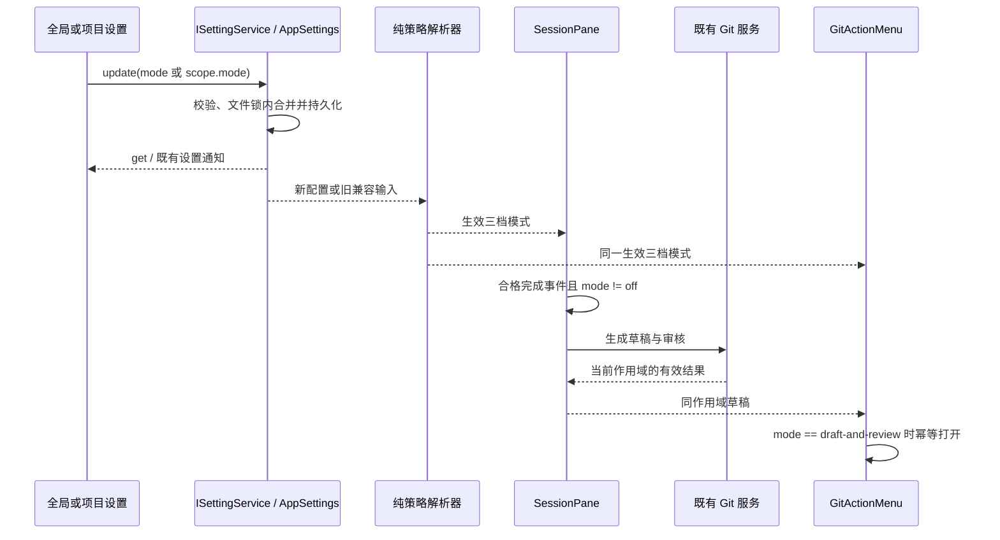

# 任务完成后的提交审核设置

## 产品规则

- 全局及项目设置将原有“任务完成后生成提交草稿”和“提交草稿就绪后自动打开审核窗口”统一为“任务完成后的提交审核”。
- 全局提供 `off`（关闭，默认）、`draft`（仅生成草稿）、`draft-and-review`（生成并打开审核）三档；项目额外提供 `inherit`（继承全局），并展示当前生效模式。
- 自动生成仍只处理当前查看的可写主编码会话实时成功完成且本轮有可提交改动的情况；后台完成、重连或重新打开已完成会话不补发模型调用。
- `draft` 与 `draft-and-review` 使用同一模型与冻结审核路径，均消耗模型额度；前者保留草稿供手动审核，后者按同一草稿 key 自动打开一次。
- `off` 不自动生成或打开审核；通用 Git 手动审核入口始终可用。Composer“生成提交草稿并打开审核”入口只在生成启用时显示，文案规则见 [提交草稿与审核](git-auto-commit-message.md)。
- 本地会话可审核后提交，工作树会话还可审核后合并。提交、合并与远端发布均须用户确认；设置变更、读取及迁移不执行这些操作。
- 切换到关闭使在途自动生成结果失效；两个生成模式之间切换不额外调用模型。已有同一作用域草稿从仅生成改为自动审核时，可按既有幂等规则打开；已经消费或主动关闭的草稿不重复弹出。

## 所有者、接口与迁移

- `ISettingService` 的 `AppSettings` 是配置唯一所有者，继续使用已有 update/get、文件锁、字段补丁和设置通知；不另建持久化或跨端状态。
- 新全局字段 `gitCommitReviewMode` 为可选严格枚举；项目字段 `projectExecutionPreferences[scope].gitCommitReviewMode` 为同一枚举加 `inherit`。不在 schema 默认填入新值，以免遮蔽尚未迁移的旧配置。
- `resolveGlobalGitCommitReviewMode` 与 `resolveProjectExecutionPolicy` 是纯解析入口；运行入口与弹窗读取同一生效模式，界面不维护第二份布尔状态。
- 旧全局 `autoGenerateGitCommitMessage` / `autoOpenGitCommitReview` 及旧项目各自的 inherit/enabled/disabled 字段仅作兼容输入，新界面不再写入它们。
- 全局新字段存在时优先使用；缺失时，旧生成关闭映射为 off，旧生成开启且弹窗关闭映射为 draft，其余生成开启配置映射为 draft-and-review。
- 项目新字段为显式模式时覆盖全局；为 inherit 时直接跟随全局并忽略该项目旧覆盖。新字段缺失时，按旧两项各自的显式覆盖和继承计算模式，保留旧项目半覆盖的动态继承语义。旧全局生成关闭、弹窗开启且项目仅启用生成时，仍生效为 draft-and-review。
- 全局改为新模式后，尚未选择新模式的旧项目分别继承由全局新模式派生的生成/弹窗行为；项目第一次选择新模式只发送该 scope 的新字段补丁，不改写其他项目、执行方式或高级配置。
- 原项目 `workspaceIdentity?.trim() || workspacePath` 是覆盖 key；实际工作树目录仅用于执行，不另存偏好。同一路径的不同远端 identity 不串用覆盖。
- 保存失败保留已接受的生效设置并显示错误，不伪造成功。Desktop、Web 与手机复用共享 UI、协议校验和目标 Environment 的设置服务。Desktop 的 continuous 与手机 replayable 会话投影保持原语义，迁移不产生会话事件。

设置 owner 只管理配置；模型与 Git 操作经现有注入 Git 服务。

## 验收场景

1. 空配置默认 off；旧全局四种组合与各项目旧两项三态的组合均正确解析，解析不修改输入。旧字段与新字段并存时，新值（含项目 inherit）优先。
2. 项目继承随全局变化；显式模式固定；旧单字段覆盖保持动态继承；远端 identity 隔离且本地路径 fallback 保留。严格 schema 拒绝布尔值、未知枚举和全局 inherit。
3. 实际 Settings 服务保存、重读及并发项目字段补丁保留原配置；重新创建服务读取同一模式。新选择不需要清空或重写旧字段。
4. 浏览器使用真实共享设置组件：全局只有一项审核三档选择；项目只有一项含继承的选择，正确展示生效值。旧配置显示映射后的值；保存失败显示错误，重试可成功；其他 scope/高级字段不丢失。
5. 在桌面宽度和手机窄屏、中英文下选择三档/继承，文本完整、无横向溢出，键盘可操作。
6. 实际 GitActionMenu 消费相同自动草稿：off / draft 不自动开窗，draft-and-review 自动开窗且预填；draft 手动打开仍预填，off 通用手动打开可用。设置变化不自动生成、提交、合并或发布；原有关闭/重开/差异往返继续通过。

## 验证记录

2026-10-03，在 `L-GO` 的当前代码上实现并验证：

- `pnpm typecheck` 通过；`pnpm verify:pre-push` 的 Lint 与架构检查通过，架构 baseline / new / total 均为 0；本次 25 个文件的 `pnpm fmt:check` 与 Git diff 格式检查通过。
- `node --import tsx --test packages/shared/src/worktreePolicy.test.ts packages/shared/src/gitAutoCommitMessageSettings.test.ts packages/services/src/setting/projectExecutionPreferences.test.ts`：11 项通过，覆盖旧全局组合、旧项目半覆盖、新模式优先级、身份隔离、严格校验及真实并发持久化/重读。
- `node --import tsx --test packages/ui/src/git-action-menu/autoCommitMessage.test.ts packages/ui/src/git-action-menu/autoCommitMessage-prefill.test.ts packages/ui/src/git-action-menu/gitCommitDialogLifecycle.test.ts`：19 项通过，覆盖完成闸门、在途失效、指纹、作用域、草稿消费与窗口生命周期。
- Windows Chrome 运行 `pnpm --dir packages/web exec node --test test/worktree-ui.test.mjs test/git-commit-dialog.test.mjs`；提交审核分组完整通过，包含三档开窗、手动预填、切换设置不重复打开/生成，以及既有跨端 Host 状态、万级文件与发布回归。
- 工作树分组发现旧名称/旧选择器断言及拆分测试遗漏断言库导入，修正后单独重跑 `pnpm --dir packages/web exec node --test test/worktree-ui.test.mjs`：14 项全部通过，含中英文、1280/390px、键盘、保存失败、继承和旧配置迁移。最初 Lint 行数和日志结果字段类型问题也已修正；未删除用例或增加超时。
- 功能图 YAML 可解析，76 个节点 ID 唯一，108 条关系端点/rank 有效；新增 5 个源码种子逐一核实。旧开关 test-id 的静态调用方已通过 `pnpm dep:refs` 核实并更新。
- 30 个其他任务的文件内容逐字节保留；6 个混合文件仅修改本设置的代码/文案，原终端与项目功能改动保留，两个 locale 的其他已有条目逐项校验一致。

浏览器验证使用真实共享组件、hooks 和既有测试 Host/确定性模型与 Git 边界；手机为窄屏浏览器模拟，不宣称已安装桌面包或实体手机、macOS/Linux 上实测。实际 Node 为 24.14.1，`mise.toml` 固定 24.14.0，pnpm 10.33.2；引擎提示未导致上述检查失败。本批实现未提交或推送。
