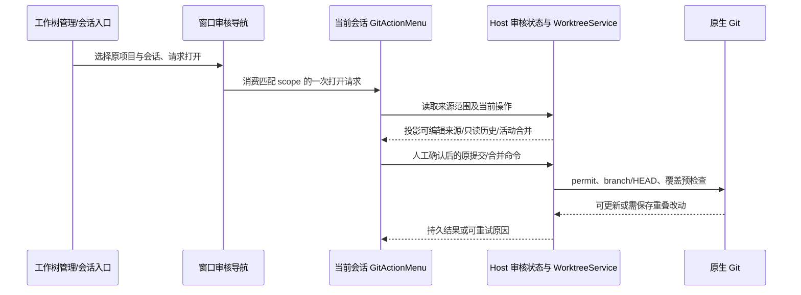
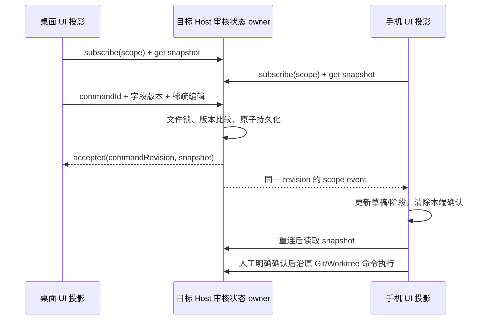
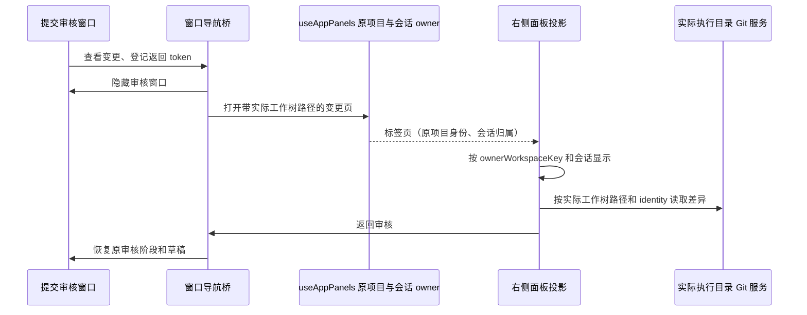

# 跨端审核编辑状态

## 审核入口与阶段修正（2026-10-03）

- 会话与项目菜单中的“工作树管理”只处理执行目录、准备状态、归档、恢复和遗漏文件；“提交与合并审核”是唯一的提交/合并界面。管理入口通过窗口内导航选择对应会话并打开现有 GitActionMenu，不增加第二个提交控制器或服务端队列。
- 窗口导航请求仅表示打开界面，使用原项目 identity/path 与 sessionId 定位，最多保留一个尚未消费的打开请求；Host 审核状态、Git 提交收据、WorktreeService 操作事实仍是原所有者。导航不生成草稿、不提交、不授权合并，桌面 continuous 和手机 replayable 语义保持不变。
- 工作树管理读取现有窗口生命周期失效通知及共享审核阶段版本，重新向 WorktreeService 查询事实；关闭后重开及跨端阶段变化不能显示旧合并状态。归档、恢复仍沿原服务操作，不在管理界面保存第二份操作事实。
- 从侧栏其它项目打开管理后进入审核，复用侧栏原会话导航回调激活项目与会话，再登记打开请求；不能只修改另一个项目的 activeTaskId，留下当前项目不变。
- 来源提交与合并结果使用明确的两个视图。取消、失败和来源提交失败记录属于历史，不触发默认合并视图，也不锁住新来源提交。正在执行或等待审核的操作才锁住来源写入；已完成操作默认回到来源视图，并可查看只读结果。
- 文件入口固定在来源视图的摘要下方，同时适用于本地目录与工作树；进入合并视图后保留“查看来源改动”入口及独立“查看合并结果”入口，不因空补丁消失。已冻结/已提交的范围只能查看；新的可编辑范围仍由 Host 审核状态负责。
- 本地目录审核优先显示当前分支、所选/排除数量、查看变更入口、提交信息与确认提交；远端发布继续默认折叠。工作树归档、恢复不进入提交审核内容。关闭、遮罩、外部差异返回、万级分页与排除、窄屏和国际化沿用现有交互。
- 已有来源提交时，统一审核保留原“准备合并”路径；冻结分组待提交时使用提交并准备合并路径，两者复用现有操作控制器。用户确认合并时记录正在查看的合并视图，完成后保留结果及在途发布；不存在浏览选择的历史完成记录仍默认来源视图。
- 更新目标分支时保留 writer permit、目标 branch/HEAD 和候选检查。原生 Git 的 read-tree dry-run 在验证前及发布前检查实际覆盖风险，允许不妨碍更新的本地改动保持原状；重叠或索引不兼容时展示可理解的处理说明并保留全部文件，不自动 stash、删除或提交目标改动。

### 验收场景

- 本地目录在 1280px/390px、中英文界面显示范围入口；打开、排除、返回、关闭重开保留草稿，推送选项默认折叠，普通提交快捷键不升级为合并/推送。
- 已取消/失败/来源提交失败操作存在时，工作树审核默认来源视图，范围入口与提交可用；活动合并回看来源只读，合并结果仍可从独立查看器返回。
- 已发布操作允许开始下一次来源提交；历史结果可查看，不能重放已提交来源组或旧发布确认。
- 工作树管理不显示候选审批、来源提交或发布按钮；“提交与合并审核”选择对应会话并打开现有审核控制器。切换项目/会话不会在其他 scope 执行导航或 Git。
- 真实临时 Git 仓库：无重叠的未暂存/未跟踪内容在目标更新前后保持一致；会覆盖的文件使更新失败且 HEAD/index/working files 不变；验证期间新增重叠改动再次被拒绝。
- 两类入口及浏览器桩的回归验证不修改真实用户会话、工作树记录或仓库。
- 浏览器交互使用 DOM 和审核入口就绪作为开始条件；整页外围资源的 load 事件不能作为审核业务完成信号。

### 本轮实现与验证

- 审核相关代码与测试共 33 个文件，新增 1108 行、删除 246 行，净增 862 行；语言共用文件统计含保留的原有改动。模块涉及 services/worktree、ui 和 web，审核事实及 Git/工作树操作所有者不变。
- 工作树管理与提交/合并控制器分开；项目菜单沿原侧栏导航激活项目和会话，再打开已有审核窗口。管理状态订阅原生命周期失效通知及共享审核阶段版本，操作事实仍从 WorktreeService 重读。冲突 AI 处理回调通过原项目 identity/path 与会话隔离，并保留旧组件清理不能移除新处理器的规则。
- 来源/合并视图由操作状态及用户浏览选择派生；历史记录不默认锁住新提交，活动来源只读。范围入口位于摘要下方，合并视图保留来源和结果入口；归档、恢复留在管理中。已有来源提交及冻结分组均有原合并路径，结果和在途发布不会因来源解锁而隐藏。
- 目标更新使用原生 Git 覆盖预检查，保留原 writer permit、目标 branch/HEAD、候选及恢复检查。真实临时仓库验证无关未暂存/未跟踪改动保持原样、重叠文件不被覆盖、验证期间新增重叠再次拒绝，以及发布响应丢失后的幂等恢复。
- `pnpm typecheck`、`pnpm lint`、`pnpm architecture:check --changed` 通过；架构 baseline 0、新增 0、总违规 0。未更新 baseline。图索引完成 YAML 解析、76 个唯一节点、108 条边的端点/rank 和三个新增源码种子的符号验证；当前仓库缺失图维护文档链接指向的文件，未恢复历史文档。
- `pnpm exec tsx --tsconfig packages/ui/tsconfig.json --test packages/services/src/worktree/worktree.integration.test.ts packages/services/src/worktree/worktreeSafety.integration.test.ts packages/services/src/worktree/worktreeReview.integration.test.ts packages/ui/src/git-action-menu/commitMergeState.test.ts packages/ui/src/store/commitReviewNavigationStore.test.ts`：31 项通过。
- 同一 tsx 入口执行 `mobileGitDialog.test.tsx`、`gitCommitDialogLifecycle.test.ts` 和 `store/reviewWorkspaceState.test.ts`：9 项通过。旧接线测试仍检查已移除的弹窗内文件清单，本轮改为验证外部查看入口；实际分页和交互由浏览器回归覆盖。
- Windows Chrome 浏览器完整回归执行 `node --test packages/web/test/git-commit-dialog.test.mjs`：44 项通过；`node --test packages/web/test/worktree-ui.test.mjs`：26 项通过。覆盖桌面/390px、中英文、主题、管理跳转、合并后管理状态刷新、历史解锁、只读来源、空结果入口、草稿返回、万级文件/冲突/遗漏清单及原合并/验证/发布重试。
- 中途失败包括旧管理入口文案和准备区域的断言、一次排除入口等待超时及一次整页 load 超时，均未写成通过。补齐真实准备路径与来源/目标摘要，更新入口测试，并将发布编辑场景改为等待 DOM 与真实入口就绪；没有增大测试超时或删掉业务断言，最终完整回归均通过。
- Node 验证运行时为 24.14.1，mise.toml 固定 24.14.0；桌面构建保留已有的大 chunk 告警。浏览器使用确定性 Git/模型桩及原跨端 Host 测试桥，真实 Git 测试只操作临时仓库。未覆盖安装版 app、实体手机及 macOS/Linux 实机；独立运行环境与操作系统沙盒继续暂缓。

## 产品与边界

- 桌面、Web 和手机在同一目标 Host、同一 workspace identity 与会话下共享提交草稿（含上一版）、正向文件范围、排除路径、是否包含未暂存文件、冻结审核引用与分组浏览位置，以及来源/合并阶段和工作树阶段。正向范围与排除集合分开，null 表示原全仓范围，空数组不能冒充全仓；生成后的消息、范围与冻结审核引用一次 admission 更新，另一端数量和文件区域重新读取同一范围。窗口是否显示、查看器返回 token、人工确认和发布执行器仍是当前设备的交互状态；同步不能打开另一设备的窗口或代替人工确认。
- 原项目身份和执行会话确定审核 owner；来源提交草稿另外按 CLI logEpoch 隔离，日志代次变化不能带入旧冻结审核。工作树阶段按原会话绑定同步，不随来源日志重建而倒退；来源控制器的 integration revision 触发同一 WorktreeService 查询。Git 文件操作仍使用实际 checkout 路径。remoteSessionId 仅用于路由，不用作跨设备存储 key；Host key 使用 workspaceIdentity.trim() || workspacePath，禁止按同名路径跨 Host 合并。
- 新 Host 接口通过现有 Git RPC channel 暴露，采用 shared 严格运行时 schema；不在 Main、relay 或 Agent 的 CommandInbox 中另建审核队列，不改 session 的 desktop-continuous / web-remote-replayable 交付语义。

## 唯一所有者和时序

- 目标 Host 的 GitReviewWorkspaceState 是已接受编辑状态的唯一所有者。每个字段单独编号；稀疏补丁只比较其修改字段的版本。不同字段并发可合并，同一字段冲突返回最新快照，不静默覆盖。草稿和排除范围为原子字段。
- 使用异步私有文件原子写入和文件锁持久化；相同 commandId 重试不会再次更新版本，accepted 回执携带该命令首次接受的 commandRevision，不能把返回最新快照的版本冒充本命令版本。读取/更新必须校验 scope、大小、字段与版本；损坏文件明确报错。动态订阅只投影该 scope，不广播草稿给其它 workspace。订阅先建立，再读完整快照，按单调 revision 去重；重连、重新激活和刷新重新对账。
- UI store 仅保留 Host 快照与尚未接受的 optimistic overlay。单条 admission 路径串行发送、压缩尚未发送的同字段编辑；失联保留本端未发送内容，显示错误和显式重试入口。版本冲突保留双方数据，用户可使用 Host 最新内容或明确重新提交本端内容。未对账/待同步/冲突时禁止生成审核、提交、准备合并及目标更新。
- 远端修改消息、范围或冻结审核引用立即清除本端确认；范围变化使旧冻结审核失效。生成请求提交前后均核对范围；模型在途时按来源审核、范围字段版本拒绝迟到结果，即使范围变更后恢复原值，也不能覆盖另一端刚生成的审核。审核内容从原 CommitReviewService 按 id、实际路径与 identity 读取，提交进度从已执行收据派生，不接受 UI 伪造审核或进度。Host 重启/审核被淘汰后草稿可恢复，冻结引用失效要求重新生成。
- 合并事实仍由 WorktreeService 持有。阶段浏览不得改业务状态；来自其它设备的 integration 引用变化触发原服务重新查询。已执行阶段只读。人工确认不跨端传播，确认只针对当前候选和版本。

## 工作树审核与右侧面板归属

- `useAppPanels` 是窗口内右侧标签页和展开状态的唯一所有者。标签页归属始终使用原项目的 `workspaceIdentity?.trim() || workspacePath` 与会话 owner；显示层必须使用相同的原项目身份过滤，不能用实际工作树身份替代。
- `AnimatedSidePanePanel` 显式接收 `ownerWorkspaceKey`，用于标签页可见性、会话引用和面板状态边界；原有 `workspaceAbsPath`、`workspaceIdentity` 继续表示实际执行目录，供 Git、差异、文件和终端操作使用。保留项目和会话隔离，不能通过取消过滤让标签页可见。
- 点击“查看变更与管理文件范围”沿原导航桥登记返回入口、隐藏审核窗口、创建并激活变更标签页。工作树标签页必须立即可见，返回后保留草稿、排除选择和审核阶段。切换会话或日志代次仍使旧返回入口失效。
- 仅修正窗口内显示归属，无持久化迁移，也不改变 Host 的审核事实、远程 identity、连接路由、desktop-continuous 或 web-remote-replayable 语义。

### 面板回归验收

- 本地目录与独立工作树的实际导航桥、`useAppPanels` 和 `AnimatedSidePanePanel` 联动：从审核窗口打开变更页后有可见的标签、文件列表和返回入口，不出现空标签页启动屏。
- 使用路径 fallback 的本地工作树和具有不同原项目/执行 identity 的远程工作树，均按原项目显示标签页，差异请求仍发送实际执行路径及 identity。
- 在 1280px 与 390px 页面验证打开、排除、返回、重新打开，草稿和排除范围不丢失；窄屏使用现有抽屉。
- 切换会话后旧变更页和返回入口不可见；再次切回可恢复该会话的标签页，但旧返回 token 不恢复。项目身份改变不能显示其它项目的标签页。
- 原一万文件分页、搜索和批量排除回归保留；新增浏览器场景必须经过生产面板 owner 与可见性过滤，不能仅用 `setSource` 桩替代导航路由。

## 验收

- 桌面修改草稿、上一版、范围，手机即时更新；手机编辑阶段/分组桌面更新。互相不触发模型、提交、合并或弹框自动打开。
- 不同字段并发不丢失；同字段冲突保留未提交内容；显式选择最新或重试本端后收敛。接受后响应丢失重试不增加版本；期间其它设备同字段修改时，后续本端编辑仍以原 commandRevision 为前置条件，必须显示冲突。缺失中间事件后收到本端确认快照，也按字段版本识别其它设备的修改，清除本端确认。
- Host 重启读取草稿、范围、阶段；身份/会话切换不串数据，远程失联不回落本地；迟到结果不更新新 scope。
- 一万排除路径仍按有界 UI 渲染；编辑数据不携带万份 patch。冻结审核按引用单独读取，并按真实已提交组恢复游标。
- Desktop continuous 和手机 replayable RPC 测试订阅、快照、缺口恢复；浏览器交互覆盖窄屏和双端共享 Host。各原流程仍通过类型、lint、架构与既有浏览器回归。

## 2026-10-03 实现与验证记录

- 相关模块为 services、shared、ui、web，worktree 模块更新公开边界说明；新增审核状态复用既有 Git RPC。没有增加 Main/relay 业务 owner，也没有改 Agent CommandInbox 或 session stream 协议。
- 已接受编辑归目标 Host 的 GitReviewWorkspaceState；UI 的 ReviewWorkspaceProjectionStore 仅投影快照和未接受编辑。CommitReviewService 和 WorktreeService 继续持有冻结审核及操作事实，人工确认仅本端有效。动态订阅在完整读取之前建立，以 revision 去重，稀疏字段版本负责并发；失联重试保留命令 id 和首次接受的版本，模型返回同时核对范围和审核版本。
- `pnpm typecheck`、`pnpm lint`、`pnpm architecture:check --changed` 通过。架构检查 baseline 0、新增 0、总违规 0；未更新 baseline。
- `node --import tsx --test packages/services/src/git/commitReviewService.test.ts packages/services/src/git/gitReviewWorkspaceState.test.ts packages/ui/src/store/reviewWorkspaceState.test.ts`：7 项通过。覆盖身份隔离、真实收据位置、字段并发、同字段冲突、私有文件重启恢复、跨窗口文件通知、响应丢失幂等，以及遗漏通知后不能把另一端版本误当成本端回执。
- `node --test packages/ui/src/v4/ConversationStatusPanel.mount.test.mjs`：4 项通过。
- 浏览器命令 `pnpm --dir packages/web exec node --test test/git-commit-dialog.test.mjs test/worktree-ui.test.mjs`：最终固定源码后 51 项全部通过（0 失败）。覆盖双端草稿/正向范围/排除/阶段往返及刷新恢复、迟到模型结果拒绝、人工确认不跨端自动生效、X/遮罩/重开、外部差异返回、万级文件搜索与批量排除、万级冲突和只读遗漏清单，以及原提交/合并/验证/发布/Tag/重试回归。
- 浏览器场景复用真实共享组件与 hooks；草稿/范围/阶段的双端测试通过 HTTP/SSE 测试桥接访问真实持久化 Host owner，使用 1280px 和 390px Chrome 页面。工作树执行事实和模型/Git 操作使用确定性服务桩，未对用户仓库执行提交、合并、Tag 或推送。
- 本轮使用 Node 24.14.1（仓库 mise.toml 固定 24.14.0，本机验证运行时相差一个补丁版本），在 Windows Chrome 验证窄屏、中英文、浅/深色及重载恢复。动态 RPC/快照语义通过 ProxyChannel 测试；未在已安装桌面 app、实体手机、macOS/Linux 或线上 relay 环境进行现场测试，不能将浏览器尺寸模拟写成这些平台的实机通过。
- 格式检查覆盖全部 72 个相关文件；`git diff --check` 按 Windows CRLF 换行规则通过。一次页面 load 超过原测试 5 秒上限，以及一次源码注释热更新干扰交互的中途失败均保留事实，最终新进程完整重跑通过，未增大测试超时或删除断言。
- 相关文件统计：72 个文件，新增 4605 行、删除 1089 行，净增 3516 行。按相关文件统计，语言和协议等共用文件含保留的既有改动。
- 提交复核修正两处中文文案的 UTF-8 损坏：格式化脚本曾逐块将 Buffer 转成字符串，分块边界可能截断多字节字符。提交暂存改为收集完整字节后统一解码，确认本批相关文件无新增替换字符；语言和协议共用文件按审核相关字段拆分暂存，其他任务有效改动保留。

## 2026-10-03 工作树审核导航修复验证

- 已确认原因：标签页由 `useAppPanels` 按原项目身份登记，显示层却按实际工作树身份过滤，导致点击入口后审核窗口关闭但变更标签页不可见。显示层改用显式 `ownerWorkspaceKey`；实际执行路径、远程 identity、attachment 路由和项目/会话过滤仍保留。
- `TSX_TSCONFIG_PATH=packages/ui/tsconfig.json node --import tsx --test packages/ui/src/app-shell/workspaceSidePaneOwnership.test.ts packages/ui/src/app-shell/mobileWorkspacePanels.test.tsx`：11 项通过。覆盖原项目与执行 scope 分离、项目/会话隔离、窄屏面板与恢复行为；Windows 下通过 PowerShell 设置环境变量。
- 使用本机 Chrome，依次执行 `node --test packages/web/test/git-commit-dialog.test.mjs` 和 `node --test packages/web/test/worktree-ui.test.mjs`：分别 42 项和 25 项通过，失败 0。新增场景运行实际导航桥、面板所有者和显示过滤；验证本地路径 fallback、不同 identity 的远程工作树、1280px/390px、打开/排除/返回/恢复、差异实际路径与 attachment，以及切换会话后的可见性和旧返回 token 失效。原万级文件和工作树合并回归通过。
- 最终 `pnpm typecheck`、`pnpm lint`、`pnpm architecture:check --changed` 通过；Lint 0 警告、0 错误，架构 baseline 0、新增 0、总违规 0。`pnpm --filter @lcode/desktop build:no-runtime-assets` 通过，构建保留原有大 chunk 提示。
- 初次浏览器运行遇到随机端口被 Chrome 禁用，并行测试/构建运行遇到导航超时和浏览器退出。远程面板测试桩起初缺少 attachment 注册，已补齐而未修改生产路由保护；单元测试需指定 UI tsconfig 解析路径别名。最终依次完整重跑通过，未增大超时或删除断言。
- 浏览器中的模型和 Git 操作用确定性服务桩，不对用户仓库执行提交、合并或发布。桌面生产构建已生成，未覆盖已安装应用；未进行实体手机或 macOS/Linux 实机测试。
