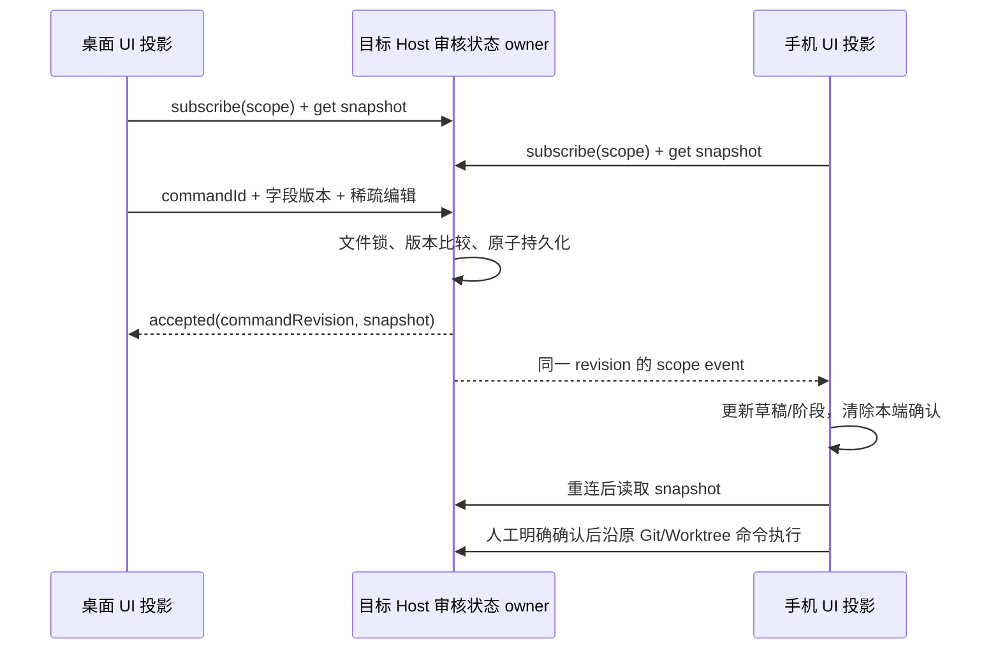

# 跨端审核编辑状态

## 产品与边界

- 桌面、Web 和手机在同一目标 Host、同一 workspace identity 与会话下共享提交草稿（含上一版）、正向文件范围、排除路径、是否包含未暂存文件、冻结审核引用与分组浏览位置，以及来源/合并阶段和工作树阶段。正向范围与排除集合分开，null 表示原全仓范围，空数组不能冒充全仓；生成后的消息、范围与冻结审核引用一次 admission 更新，另一端数量和文件区域重新读取同一范围。窗口是否显示、查看器返回 token、人工确认和发布执行器仍是当前设备的交互状态；同步不能打开另一设备的窗口或代替人工确认。
- 原项目身份和执行会话确定审核 owner；来源提交草稿另外按 CLI logEpoch 隔离，日志代次变化不能带入旧冻结审核。工作树阶段按原会话绑定同步，不随来源日志重建而倒退；来源控制器的 integration revision 触发同一 WorktreeService 查询。Git 文件操作仍使用实际 checkout 路径。remoteSessionId 仅用于路由，不用作跨设备存储 key；Host key 使用 workspaceIdentity.trim() || workspacePath，禁止按同名路径跨 Host 合并。
- 新 Host 接口通过现有 Git RPC channel 暴露，采用 shared 严格运行时 schema；不在 Main、relay 或 Agent 的 CommandInbox 中另建审核队列，不改 session 的 desktop-continuous / web-remote-replayable 交付语义。

## 唯一所有者和时序

- 目标 Host 的 GitReviewWorkspaceState 是已接受编辑状态的唯一所有者。每个字段单独编号；稀疏补丁只比较其修改字段的版本。不同字段并发可合并，同一字段冲突返回最新快照，不静默覆盖。草稿和排除范围为原子字段。
- 使用异步私有文件原子写入和文件锁持久化；相同 commandId 重试不会再次更新版本，accepted 回执携带该命令首次接受的 commandRevision，不能把返回最新快照的版本冒充本命令版本。读取/更新必须校验 scope、大小、字段与版本；损坏文件明确报错。动态订阅只投影该 scope，不广播草稿给其它 workspace。订阅先建立，再读完整快照，按单调 revision 去重；重连、重新激活和刷新重新对账。
- UI store 仅保留 Host 快照与尚未接受的 optimistic overlay。单条 admission 路径串行发送、压缩尚未发送的同字段编辑；失联保留本端未发送内容，显示错误和显式重试入口。版本冲突保留双方数据，用户可使用 Host 最新内容或明确重新提交本端内容。未对账/待同步/冲突时禁止生成审核、提交、准备合并及目标更新。
- 远端修改消息、范围或冻结审核引用立即清除本端确认；范围变化使旧冻结审核失效。生成请求提交前后均核对范围；模型在途时按来源审核、范围字段版本拒绝迟到结果，即使范围变更后恢复原值，也不能覆盖另一端刚生成的审核。审核内容从原 CommitReviewService 按 id、实际路径与 identity 读取，提交进度从已执行收据派生，不接受 UI 伪造审核或进度。Host 重启/审核被淘汰后草稿可恢复，冻结引用失效要求重新生成。
- 合并事实仍由 WorktreeService 持有。阶段浏览不得改业务状态；来自其它设备的 integration 引用变化触发原服务重新查询。已执行阶段只读。人工确认不跨端传播，确认只针对当前候选和版本。

## 验收

- 桌面修改草稿、上一版、范围，手机即时更新；手机编辑阶段/分组桌面更新。互相不触发模型、提交、合并或弹框自动打开。
- 不同字段并发不丢失；同字段冲突保留未提交内容；显式选择最新或重试本端后收敛。接受后响应丢失重试不增加版本；期间其它设备同字段修改时，后续本端编辑仍以原 commandRevision 为前置条件，必须显示冲突。缺失中间事件后收到本端确认快照，也按字段版本识别其它设备的修改，清除本端确认。
- Host 重启读取草稿、范围、阶段；身份/会话切换不串数据，远程失联不回落本地；迟到结果不更新新 scope。
- 一万排除路径仍按有界 UI 渲染；编辑数据不携带万份 patch。冻结审核按引用单独读取，并按真实已提交组恢复游标。
- Desktop continuous 和手机 replayable RPC 测试订阅、快照、缺口恢复；浏览器交互覆盖窄屏和双端共享 Host。各原流程仍通过类型、lint、架构与既有浏览器回归。

## 2026-10-03 实现与验证记录

- 相关模块为 services、shared、ui、web，worktree 模块更新公开边界说明；新增审核状态复用既有 Git RPC。没有增加 Main/relay 业务 owner，也没有改 Agent CommandInbox 或 session stream 协议。
- 已接受编辑归目标 Host 的 GitReviewWorkspaceState；UI 的 ReviewWorkspaceProjectionStore 仅投影快照和未接受编辑。CommitReviewService 和 WorktreeService 继续持有冻结审核及操作事实，人工确认仅本端有效。动态订阅在完整读取之前建立，以 revision 去重，稀疏字段版本负责并发；失联重试保留命令 id 和首次接受的版本，模型返回同时核对范围和审核版本。
- `pnpm typecheck`、`pnpm lint`、`pnpm architecture:check --changed` 通过。架构检查 baseline 0、新增 0、总违规 0；未更新 baseline。
- `node --import tsx --test packages/services/src/git/commitReviewService.test.ts packages/services/src/git/gitReviewWorkspaceState.test.ts packages/ui/src/store/reviewWorkspaceState.test.ts`：7 项通过。覆盖身份隔离、真实收据位置、字段并发、同字段冲突、私有文件重启恢复、跨窗口文件通知、响应丢失幂等，以及遗漏通知后不能把另一端版本误当成本端回执。
- `node --test packages/ui/src/v4/ConversationStatusPanel.mount.test.mjs`：4 项通过。
- 浏览器命令 `pnpm --dir packages/web exec node --test test/git-commit-dialog.test.mjs test/worktree-ui.test.mjs`：最终固定源码后 51 项全部通过（0 失败）。覆盖双端草稿/正向范围/排除/阶段往返及刷新恢复、迟到模型结果拒绝、人工确认不跨端自动生效、X/遮罩/重开、外部差异返回、万级文件搜索与批量排除、万级冲突和只读遗漏清单，以及原提交/合并/验证/发布/Tag/重试回归。
- 浏览器场景复用真实共享组件与 hooks；草稿/范围/阶段的双端测试通过 HTTP/SSE 测试桥接访问真实持久化 Host owner，使用 1280px 和 390px Chrome 页面。工作树执行事实和模型/Git 操作使用确定性服务桩，未对用户仓库执行提交、合并、Tag 或推送。
- 本轮使用 Node 24.14.1（仓库 mise.toml 固定 24.14.0，本机验证运行时相差一个补丁版本），在 Windows Chrome 验证窄屏、中英文、浅/深色及重载恢复。动态 RPC/快照语义通过 ProxyChannel 测试；未在已安装桌面 app、实体手机、macOS/Linux 或线上 relay 环境进行现场测试，不能将浏览器尺寸模拟写成这些平台的实机通过。
- 格式检查覆盖全部 72 个相关文件；`git diff --check` 按 Windows CRLF 换行规则通过。一次页面 load 超过原测试 5 秒上限，以及一次源码注释热更新干扰交互的中途失败均保留事实，最终新进程完整重跑通过，未增大测试超时或删除断言。
- 相关文件统计：72 个文件，新增 4605 行、删除 1089 行，净增 3516 行。按相关文件统计，语言和协议等共用文件含保留的既有改动。
- 提交复核修正两处中文文案的 UTF-8 损坏：格式化脚本曾逐块将 Buffer 转成字符串，分块边界可能截断多字节字符。提交暂存改为收集完整字节后统一解码，确认本批相关文件无新增替换字符；语言和协议共用文件按审核相关字段拆分暂存，其他任务有效改动保留。
