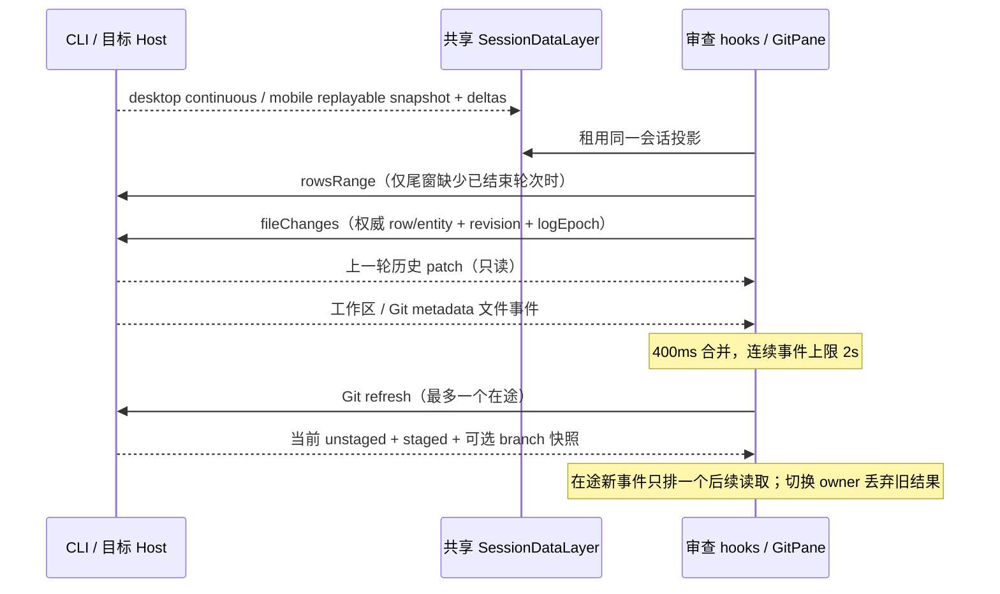

# Git 审查：上一轮历史与及时刷新

## 规则与边界

- 未暂存 = 当前工作目录相对 index 的改动（含未跟踪文件）；已暂存 = index 相对 HEAD 的改动。提交完成后暂存区为空是正常状态，未推送的提交不属于这两个来源。
- 上一轮改动 = 当前会话最近一个已结束的 agent 产品轮次的文件差异。运行中的下一轮不覆盖它；最新结束轮次无改动或已撤销时显示对应空状态，不向更旧轮次寻找非空数据。跳过不执行 agent 的 controlOnly 轮。
- 使用 V4 turnHeader 和 conversation/fileChanges，与聊天中的文件摘要使用相同权威数据。不依赖 TaskIndex.changeSummary，不恢复已移除的 per-turn Zustand map，不从当前 Git diff 重建历史。
- 只在审查面板存在时租用现有 workspace connection / SessionDataLayer。原项目路径用于会话路由，execution workspacePath 用于 Git 和文件显示，远端贯穿 identity 与 remoteSessionId。历史尾窗没有上一轮时，按既有 rowsRange 分页向前寻找，遇到最新已结束轮次即停止；不修改聊天的窗口或业务状态。
- 历史差异只读；读取失败显示诊断和刷新入口，不伪装成零文件。会话、Host、workspace 或 logEpoch 变化后丢弃旧查询结果；手动刷新可重试。提交不会清空历史差异。
- 短批文件事件采用 400ms 合并，连续事件最多等待 2s 即触发刷新，不使用原 60s 的无限延后策略。文件监听路径仍复用 Host 提供的工作区与 Git metadata 路径，工作树保留独立 gitDir / commonDir。
- Host 文件 watcher 的 150ms 合并也必须设置 500ms 上限，否则客户端根本收不到连续写入信号。它仍只广播文件事件，不承载 Git 状态。Git status / diff 只读调用禁用 optional index refresh，避免读操作写回 index 触发自己的监听形成循环；真正暂存、提交和切换分支仍执行原生写入与锁定。
- 每个 Git 读取所有者同时最多一个 refresh RPC。在途期间合并为一个后续读取，先显示已完成快照再读取最新状态，持续写文件不能让所有响应失效。切换 owner 后旧结果丢弃；React effect 重挂载不能造成永久 loading。
- 回到可见页面 / 窗口聚焦时刷新，补齐后台期间的变化。保持监听失败诊断及手动刷新。UI 不自动暂存、提交、推送或改审核文件范围。
- Linux 按既有平台边界不递归监听整棵工作区；仅审查面板可见时，每 2s 补读一次 Git 状态，后台/关闭面板停止。Windows/macOS 使用文件事件。轮询、文件事件与人工刷新共享同一串行读取所有者。
- 自动 Git 刷新不递增历史查询版本，不重复读取整轮 patch；只有轮次/撤销/纪元改变或人工刷新才重读历史。
- 空状态按来源说明原因：已暂存无改动说明提交后清空；未暂存无改动说明当前文件已与 index 一致；上一轮说明已结束轮次的历史语义。中英文、桌面和手机共享组件。
- 每轮聊天文件摘要在“撤销”前提供“审查”。按钮携带该会话、轮次 row/entity、logEpoch 与原 workspace 路由，打开同一审查面板的“所选轮次改动”；选择保持在该轮，不随下一轮开始/完成漂移。手动重新选择“上一轮改动”回到自动跟随最近已结束轮次；会话/工作区切换清除指定轮次。运行中、缺少 entity 和已撤销时按钮不可用。只读审查与撤销是独立动作。

## 唯一所有者与顺序

CLI 是轮次、检查点、历史差异与持久化的唯一所有者；SessionDataLayer 共享订阅，projection store 是只读投影。历史 hook 只持有当前查询结果和租约。Git Service 是当前仓库快照的唯一所有者；UI scheduler 只合并只读刷新意图。

## 验收

1. 聊天上一轮 48 个文件、下一轮正在写入：上一轮审查显示同一 48 文件与历史 patch；当前未暂存显示新一轮 Git 状态，已提交后的暂存区为空。
2. 新轮次结束后切换到新历史差异；无改动和撤销不残留旧轮次文件；冷恢复长尾窗经分页仍能找到上一轮。
3. 历史查询失败显示错误，手动刷新恢复；切换会话和相同路径不同 identity 后迟到响应不能污染当前列表。
4. 文件连续变化时 2s 内发起刷新；大批事件合并，慢 refresh 不并发也不饥饿；未暂存→暂存→提交后列表及统计更新。
5. 重新聚焦刷新，watch/unwatch 幂等且身份切换清理旧监听；打开扩展数据、effect 重挂载不会卡 loading。
6. 浏览器实际运行共享 hooks、SessionDataLayer 与 GitPane，覆盖 desktop-continuous / web-remote-replayable、桌面和手机宽度、中英文。单测验证历史选择、patch、分页与刷新调度；执行 typecheck、lint、架构检查，不构建桌面安装包。

## 本次验证记录（2026-10-05）

- `packages/ui/src/v4/gitLastTurn.test.ts` 与 `packages/ui/src/hooks/gitRefreshScheduler.test.ts`：6 个场景通过，含最新结束空轮、分页纪元隔离、撤销投影、串行刷新和旧 owner 释放。
- `packages/services/src/fileWatcher/fileWatcherService.test.ts` 与 `packages/services/src/git/gitRefresh.integration.test.ts`：6 个场景通过。使用真实临时目录连续写入和真实 Git 仓库；Host 无限尾沿延迟在修复前可复现。
- `packages/web/test/git-review-live-turns.test.mjs`：4 个浏览器组合通过（中文/英文、1280px/390px）；覆盖 48 文件历史、指定轮次固定、旧响应丢弃、返回上一轮、无改动、失败重试、暂存/提交、持续事件及自动刷新不重复读取历史。英文手机组合注入 Linux Host 平台，验证无递归 watcher 的可见面板轮询；不声称本机 Windows 已执行 Linux 原生系统验证。
- `packages/web/test/git-review-source-errors.test.mjs`：4 个浏览器组合通过，已有来源错误隔离没有回退。
- `packages/ui/src/v4/conversationProjectionStore.workflowSync.test.ts`：5 个恢复场景通过，覆盖 desktop-continuous 与 web-remote-replayable 的 ACK/帧顺序、恢复和旧订阅防护。
- `pnpm typecheck`、`pnpm lint`、`pnpm architecture:check --changed`、`pnpm verify:pre-push` 通过；Lint 为 0 警告/0 错误，架构为 baseline 0/new 0。未构建桌面安装包。
