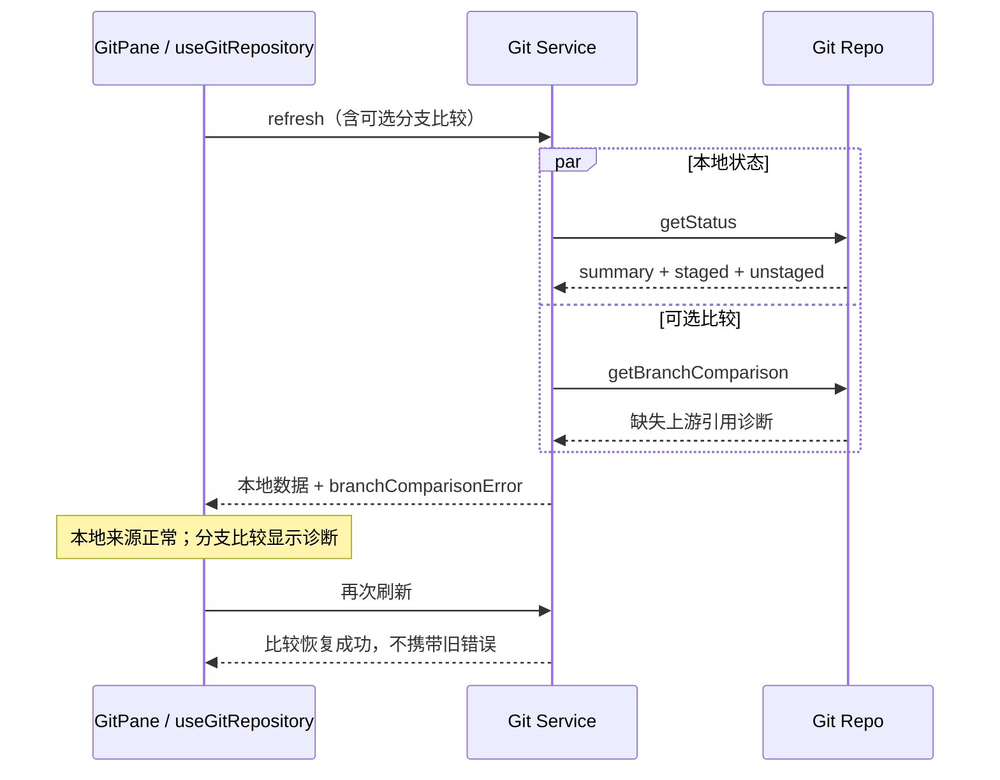

# Git 审查来源的错误隔离

## 问题与产品规则

仓库配置了上游分支，但对应的远程跟踪引用已被删除或尚未获取时，`git status` 仍可返回上游名称。本地已暂存、未暂存的读取成功，`upstream...HEAD` 的分支比较却会失败。原先 `refresh` 把这些读取一起放入 `Promise.all`，分支比较的失败使整次刷新失败，审查面板因此无法查看任何本地改动。

- 已暂存、未暂存和未跟踪文件只依赖本地状态快照，不依赖上游引用是否存在。
- 分支比较失败时，本地列表、统计及差异查看仍可用。切换到“分支比较”显示原始 Git 诊断，不把失败伪装成“没有改动”。
- 本地状态读取失败仍是仓库级错误。不能用空列表掩盖失败。
- 读取过程不 fetch，不调整 upstream，不改 HEAD、索引、配置或文件，也不自动选取其他比较分支。
- 后续刷新成功时清除旧的来源错误；已有请求版本和 workspace identity 的过期响应防护保持有效。
- Desktop、Web 和手机复用同一服务响应与共享 UI，不引入平台特定的处理路径。

## 所有者、接口与事件顺序

Git Repo 负责执行 Git 并保留失败诊断。Git Service 是组合响应的唯一所有者，只隔离可选分支比较的失败；`useGitRepository` 将响应投影到各来源的数据集；GitPane 根据当前来源展示错误。

`GitRefreshResult` 增加可选 `branchComparisonError?: string`。分支比较失败时 `branchComparison` 为 null，错误字段有值。本地字段照常返回。未请求比较、正常比较和无 upstream 的空比较不携带错误字段。旧 Host 没有此字段的响应仍可被新 UI 读取。

`GitPaneDataset` 增加可选 `error?: string | null`，仅 branch 数据集接收 `branchComparisonError`。仓库级错误仍由 `GitPaneRepositoryState.error` 表达。加载状态优先于错误，仓库级错误优先于来源错误。

## 验收与验证

1. 真实临时 Git 仓库配置 `origin/main` 后删除跟踪引用，同时制造已暂存、未暂存、未跟踪文件。带分支比较的刷新必须成功返回所有本地数据，并记录 bad revision 错误。
2. 上述状态下已暂存和未暂存的差异仍可读取；刷新不修改 HEAD、索引或配置。
3. 恢复远程跟踪引用后刷新，正常返回分支比较且不再携带旧错误。
4. 不请求分支比较时不执行上游 diff；没有 upstream 时返回正常空比较；本地 status 失败仍拒绝刷新。
5. 浏览器中打开真实共享 hook 与 GitPane：切换已暂存、未暂存均显示文件；分支比较显示诊断；返回本地来源不会残留错误；刷新恢复后分支列表显示文件。
6. 同一交互覆盖桌面宽度和手机宽度、中文与英文。旧 Host 无错误字段的响应仍正常展示。

服务验证使用 `packages/services/src/git/gitRefresh.integration.test.ts`；交互验证使用 `packages/web/test/git-review-source-errors.test.mjs`。按当前仓库入口执行测试、typecheck、lint 和架构检查；不构建桌面安装包。
