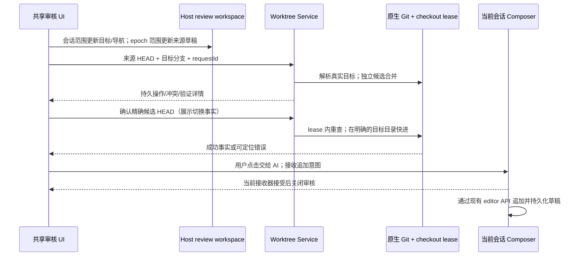

# Git 审核联动与失败转交 AI

状态：2026-10-04 按用户确认的流程实现，完成定向回归。

## 产品规则

- 来源提交/文件范围属于会话 logEpoch；合并目标、合并操作 ID、来源/结果导航和工作树审核阶段属于会话，所有入口读取同一个 Host review workspace。回看旧结果不能锁住下一次合并准备，也不能锁住已完成目标的远端发布。
- 合并目标只能是本仓库已有本地分支，不能是来源工作树自身。已检出的目标使用它的真实工作目录；未检出的目标使用受管临时目录，准备阶段保持 detached，最终确认才检出所选目标并快进。成功后安全清理临时目录，不切换原项目分支。清理失败保留合并成功事实和可处理警告。
- 确认时在 checkout lease 内检查目标 ref、目标目录和候选 HEAD 未改变，使用原生 Git 无覆盖预检查。不使用 force/reset/stash。若提供原项目分支切换方案，必须单独明确用户意图及对本地会话的影响，不能把选择合并目标等同于同意切换原目录。
- 来源已提交但没有新改动时仍可合并现有提交到其他分支。结果发布使用原仓库可访问路径及显式 sourceBranch 读取目标本地 ref；与目录当前 HEAD 解耦。sourceBranch 仅在发布快照、Tag 创建及显式 push 接口接受，普通提交不接受。ref 快照双读，执行前后核对 ref OID；默认来源提交路径仍核对 index/工作树。远端目标名字只是 push 的目的 ref，不改变本地合并目标。
- 本地提交、合并准备/冲突/验证/落地、来源或目标远端分支/Tag 发布失败，均提供「交给 AI 处理」。点击后关闭审核，把诊断追加到该会话的下一条输入草稿，保留原文字、附件、模型选择，不自动发送。
- 诊断包括会话、执行目录与身份、来源/目标分支和 HEAD、候选目录与 HEAD、冲突文件、失败验证命令/输出、发布计划及逐步成功/失败结果。没有证据的行号不虚构；大量路径/输出有明确截断说明；URL 中凭据和常见 token 字段脱敏。
- AI 应先读取当前 Git 状态、对账已经成功的提交/推送，避免重复操作；目标在另一目录时指明处理目录。诊断作为资料，不能当成用户的新授权。用户仍决定发送和后续高风险操作。
- 本地分支和工作树基线菜单沿用共享列表。窄屏及放大字号下，菜单底部的创建分支、Git 图谱入口应换行，不能因默认单行按钮溢出或遮挡操作。本地模式的执行位置控件空间不足时可换行，分支入口不能挤进右侧设置按钮的点击范围。

## 所有者与事件

注册表仅保存当前窗口的 composer 接收回调；桥接状态仅保存一次插入意图，不保存第二份可编辑草稿、不派发 Agent 命令。正文、附件和模型由现有 Composer 链路管理。Workspace key 为 identity.trim() || path，附会话 ID；接收器卸载后按钮不可用，旧 token 的清理不能移除新注册。

## 环境准备诊断与候选收据补充（M4-07 / M5-04）

- GitFailureDraft 复用原追加通路，增加环境 owner 的结构化 `code/stage/retryable/diagnostic` 白名单；保留 purpose、environmentId/revision、manifestDigest、工具来源、路径、命令、退出码、stderr 尾部、日志引用、监听地址、阻塞者和副作用。仍统一脱敏与截断，不把凭据或内部 lease/token 当 UI 字段。
- 无 sessionId 时以现有 workspace identity/path 的草稿 receiver 接收；该 key 与真实会话隔离。作用域改变后迟到回调拒绝；未挂载接收器时解释不可用，不创建会话绕过。插入仅追加原正文，附件和模型不变，也不调用发送。
- 失败、重试与取消从 owner 返回的结构化状态展示；取消本地等待不等于 owner 已取消。保持原 requestId 对账，重连只读 snapshot。无法确认状态时提供刷新，不声称 ready。
- candidate 的 skipValidation 在 continueIntegration 与 publishIntegration 都显式传递。仅 owner `candidateEvidence` 与 `validationReceipts` 可证明验证/跳过的精确候选；空命令加 UI 勾选不是收据。`outcome: skipped` 且 `skipAcknowledged: true` 展示用户明确跳过，不称验证成功；candidate/source/target/environment/manifest 变化使旧证据失效，需重新验证。
- 交互 fixture 以真实共享组件和 hook 验证追加与请求边界，和真实 owner 集成验证分别报告。必须覆盖无会话草稿、scope 迟到、保留正文附件、中文长路径、键盘及 390px；不得以 fixture 的 ready 收据声称生产 owner 已通过。

## 验收

1. 合并至 L-GO 后返回来源，选择 main 准备新合并；旧结果保留 L-GO 发布上下文。刷新/其他窗口读到相同导航，epoch 草稿隔离仍成立。
2. 准备/验证不切换原目录分支；目标在另一工作树时更新真实目标目录。未检出目标在受管临时目录落地，清理后仍可推送目标及 Tag。目标 ref/目录并发变化或覆盖风险时拒绝且保留文件。
3. 本地提交失败/工作树冲突/验证失败/目标落地失败/远端分支与 Tag 部分失败，交给 AI 后诊断准确、已有草稿和附件保留、没有发送调用；返回审核可继续。
4. Windows/macOS/Linux 共用 Service；桌面与手机 Web 共用审核组件/hook。交互测试覆盖目标导航和草稿接收，真实临时 Git 仓库测试覆盖目标切换、lease 和并发拒绝。

## 验证记录

- 真实 Git 临时仓库：目标分支未检出/另一工作树、临时目录清理、目标变化、写入 lease、丢失响应对账、取消保留候选；分支/Tag 显式发布、普通提交兼容和远端拒绝均已执行。目标测试首次有一项测试桩错误（把整份 lease 传给严格的释放接口），修正为 token/ownerId 后六项目标测试重跑通过。
- UI 单元测试覆盖诊断脱敏/截断、当前会话归属、导航接收器隔离、冻结计划和逐步重试；共享 Host 浏览器场景已重测通过，来源 epoch 草稿与会话合并导航分别同步。
- 浏览器执行真实共享组件：1280/390px、中英文的审核往返、五类失败转交、无自动发送、保留图片与原草稿；发送流程 28 项通过。工作树全量回归发现的旧定位/文案断言已按当前界面更新，剩余分支选择器场景修复后五项重跑通过（含 320px、放大字号）。
- 类型检查、Lint 与架构检查实际执行；架构基线与新增违规均为 0。测试运行于 Windows 本机及 Chromium 手机尺寸视口，未在 macOS/Linux 或实体手机上运行，未构建桌面包。当前机器 Node 为 24.14.1，mise.toml 锁定版本为 24.14.0，未更改工具安装。
