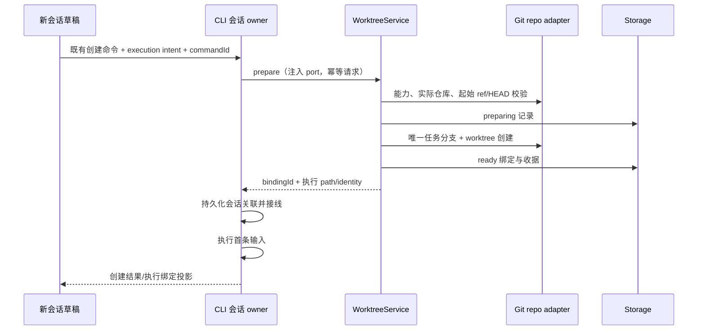
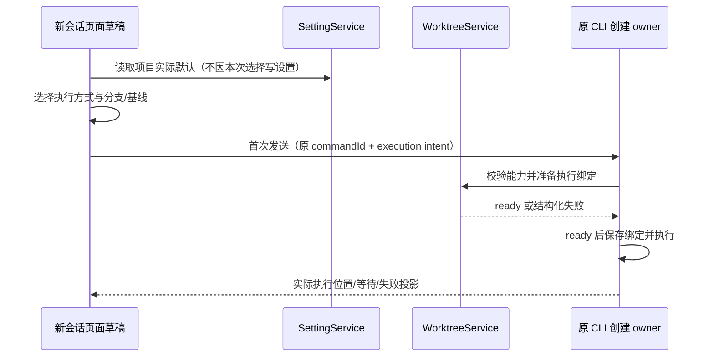
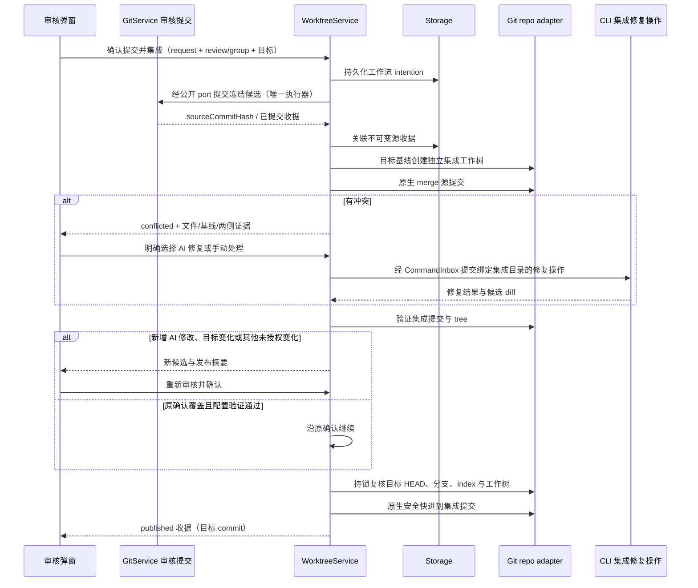
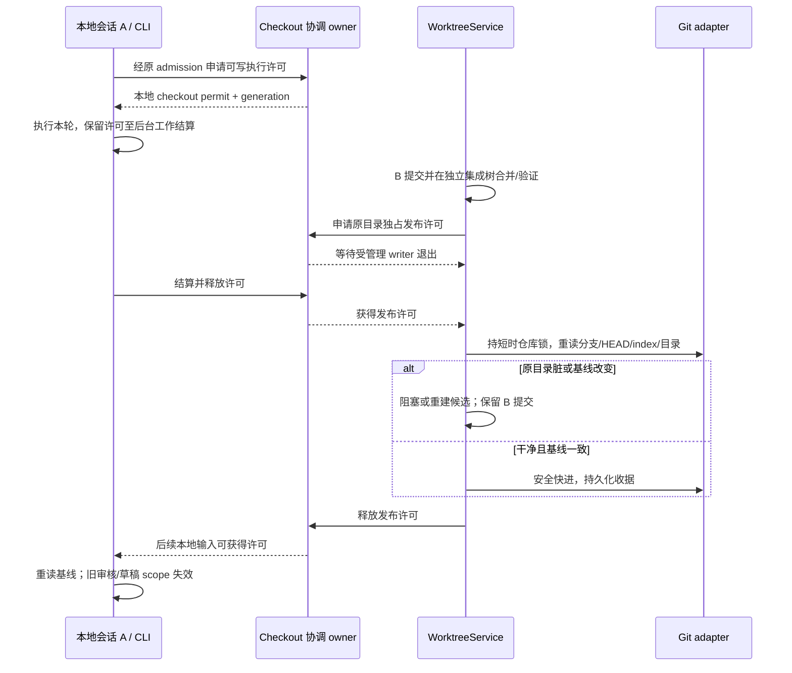

# Git 工作树与提交审核增强方案

后续独立运行环境的开发规范、技术方案、阶段计划及验收统一见 [工作树与本机独立运行环境](worktree-runtime-environments.md)。该文档基于 2026-10-05 的源码核实，环境能力仍待开发；本文已有工作树与 Git 功能的完成状态不包含独立运行环境。

状态：M0–M5 功能已实现，2026-10-03；以 `L-GO` 当前工作区（包括已有未提交改动）为基线。当前接口、使用流程和真实验证结果见第 21 节；早期调研及草案记录保留以说明决策依据，不作为已执行测试的证明。

本次优先级：先核实并交付工作树基础（M0–M2），再增强提交审核与合并（M3–M5）。全文按这个顺序展开，按 M0–M5 依次实现和验收。

## 1. 目标、证据与实施基线

第一阶段目标是在多会话并行开发时隔离文件和 Git index，并让会话稳定使用自己的工作树。基础通过后，再复用提交信息生成、冻结审核和现有提交弹窗，将任务提交有序集成到原项目分支。工作树减少执行期间的相互干扰，不能保证没有合并冲突或功能冲突。

本方案的唯一实施基线是 `C:/Users/Lemon/Desktop/zcode-full` 的 `L-GO`，本轮核实时 HEAD 为 `803e8f0169ac913e4b26026131e14252614fa77e`；实际版本 `lcode@3.16.8`，包名 `@lcode/*`，CLI 位于 `apps/lcode-cli`。核实范围包括该目录现有的未提交修改，不以 HEAD 文件替代用户当前工作区。freshness 检查通过，相对 `origin/main` 为 ahead 54 / behind 0；后续实施仍需重读实际提交与本地状态。

方案修订时文档已从先前 detached 工作树移至此目录；随后在该目录实现代码。项目管理、终端 Shell 等已有本地改动保留，没有强制让同一分支在两个工作树同时检出。

| 当前已存在的能力                                       | 已核实入口                                                                                                                                                    | 增强时必须保留的边界                                                                                                   |
| ------------------------------------------------------ | ------------------------------------------------------------------------------------------------------------------------------------------------------------- | ---------------------------------------------------------------------------------------------------------------------- |
| 全局自动生成、聚焦完成后自动弹窗、手动生成提交纪要     | `specs/git-auto-commit-message.md`；`packages/ui/src/v4/SessionPane.tsx`、`GitActionMenu.tsx`                                                                 | 生成只产草稿，不自动暂存、提交或推送；冷恢复不补发模型调用；旧 scope 和迟到结果隔离                                    |
| 冻结补丁、内容链归属、AI 审核、分组顺序、原生 Hook/CAS | `specs/git-session-commit-review.md`；`packages/services/src/git/commitReviewService.ts`、`repo/commitReviewRepo.ts`、`repo/commitReviewTransaction.ts`       | 文件路径不是作者证明；审核与同组提交幂等只在 Git 服务生命周期内有效，重启后不能直接复用                                |
| 多远程、分支、Tag、发布摘要、分步重试、消息草稿保留    | `specs/git-commit-publish-enhancements.md`；`packages/ui/src/git-action-menu/GitCommitDialog.tsx` 与现有发布逻辑                                              | 执行选项/冻结目标目前是 UI 本地状态；不能据此宣称已有跨重启持久化发布工作流                                            |
| 本地多文件夹项目                                       | `specs/local-multi-folder-projects.md`；`packages/shared/src/localProjects.ts`、`protocol.ts`、`validationAppSettings.ts`                                     | 设置是项目定义唯一来源；主目录决定 cwd/Git；次要可写目录必须纳入工作树隔离能力检查                                     |
| 新会话项目与真实分支切换控件                           | `packages/ui/src/app-shell/WorkspaceShellLayout.tsx` 的 `draftComposerHeader`；`ChatEmptyState.tsx`、`GitBranchSwitcher.tsx`、`hooks/useGitBranchSwitcher.ts` | 原控件会实际切换目录分支；工作树基线选择需要不同的无写入语义                                                           |
| Bash 预览生命周期与 Git 自动备份                       | `specs/background-bash-lifecycle.md`、`specs/git-auto-backup.md`                                                                                              | 临时 Bash 在 turn 收尾停止；经用户确认保留的预览不阻塞提交草稿；Git 备份不覆盖未提交文件且拒绝不完整的 linked worktree |

关联 spec 均在当前 `L-GO` 存在并已核实；实施时按对应功能更新，不恢复旧命名、旧协议或已移除模块。下文的工作树生命周期、checkout 许可、持久化提交收据与集成工作流均是拟新增能力。

Codex 的可借鉴事实是独立 checkout、明确起始基线、聊天持续绑定工作树、环境准备和清理前保存快照；官方文档没有确立 Hand off 内置 AI 自动解决合并冲突。参见 [工作树](https://learn.chatgpt.com/docs/environments/git-worktrees) 与 [本地环境](https://learn.chatgpt.com/docs/environments/local-environment)。下面的集成与 AI 冲突处理属于本项目拟新增设计。

## 2. 对话已确认的规则与建议默认值

| 决策                       | 状态                       | 规则                                                                                                                                            |
| -------------------------- | -------------------------- | ----------------------------------------------------------------------------------------------------------------------------------------------- |
| 本轮制定方案               | 已确认                     | 不实施业务代码、不实际创建任务工作树、不合并用户分支                                                                                            |
| 新会话全局执行默认值       | 用户已确认                 | 默认本地；项目按需启用工作树                                                                                                                    |
| 后台完成会话的自动生成范围 | 用户已确认                 | 工作树第一版保留现有聚焦生成行为；M3 首次扩展时后台会话显示待处理入口，不自动调用模型                                                           |
| 项目覆盖全局、行为分别配置 | 对话方向                   | 生成信息、自动打开弹窗、执行方式分别设置；项目提供继承语义                                                                                      |
| 在现有弹窗提交并合并       | 对话方向                   | 用户明确选择目标并确认；不因开关启用就自动提交、合并或发布                                                                                      |
| AI 处理冲突                | 对话方向                   | 明确触发、独立集成工作树修复、审核和验证后再发布目标                                                                                            |
| 已有会话切换执行位置       | 首期建议                   | 已有会话保持原位置；首期不实现运行中 Hand off                                                                                                   |
| 起始基线                   | 首期建议                   | 默认原项目当前分支的已提交 HEAD；不默认复制未提交改动                                                                                           |
| 清理策略                   | 分阶段建议                 | 工作树第一版保留目录；M5 再开放手动归档和快照，自动磁盘回收更晚启用                                                                             |
| 合并历史                   | M3 建议                    | 原生 merge 语义，保留任务提交；首次集成不提供 squash/rebase/cherry-pick 模式                                                                    |
| 同目录本地会话             | 本轮新增建议，尚非用户确认 | 安全模式下同一实际 checkout 一次只执行一个可写会话；其余沿原 CLI admission 等待。兼容期保留并行时，必须明确共享目录风险；合并发布仍必须独占目标 |

## 3. 工作树优先的实施阶段与交付门槛

当前先实施 M0–M2，交付可以独立使用的会话工作树。顺序是核实现有能力、完成基础服务和绑定、接通执行链与最小界面、通过隔离和恢复验收，再进入 M3。工作树相关的项目执行设置随 M2 交付；提交信息的项目覆盖、自动弹窗拆分和后台待处理入口随 M3 交付。

| 阶段                        | 内容                                                                                                                                       | 必须通过的门槛                                                                                                                               |
| --------------------------- | ------------------------------------------------------------------------------------------------------------------------------------------ | -------------------------------------------------------------------------------------------------------------------------------------------- |
| M0 工作树功能核实           | 基于 L-GO 核实现有能力、路径所有者、Git 登记/branch/index 边界；原生临时仓库验证；代码实施前读取受控上下文                                 | 本轮已有源码核实与 9 项原生断言；应用绑定、运行时和平台验收仍待实现，不混写为完成                                                            |
| M1 工作树基础服务           | 有界 managed 模块与 Git port；唯一分支/目录登记；能力查询、创建幂等、绑定持久化、失败对账和重启恢复；checkout 协调契约                     | 不依赖 UI 创建两步链；不误删外部工作树；不复制原目录脏文件；不把目录缺失偷偷恢复成本地；无未经快照的自动删除                                 |
| M2 执行接线与最小会话入口   | 同一创建命令贯通 runtime/文件/终端/Git/checkpoint/rewind/搜索/技能/Hook；全局本地默认、项目执行覆盖、本次选择、基线控件、准备/实际位置投影 | A/B 同文件/index 隔离；所有默认执行入口使用 binding；恢复/下一轮绑定稳定；原目录不被默认工具写入；基线选择不切原分支；已有本地会话保持原位置 |
| M3 提交审核设置与无冲突集成 | 提交信息项目三态/自动弹窗拆分及后台入口；扩展原弹窗；Git 持久 transaction/receipt；独立集成树；checkout 发布许可；冻结目标、验证和发布收据 | 聚焦行为兼容；本地执行与发布不重叠；目标变化/脏目录拒绝；多组与 ref/index 断点对账；重试不重复提交；原目录内容一致                           |
| M4 冲突与 AI                | 三方证据、人工路径、operation-scoped runtime 修复与审核                                                                                    | 原目录不被冲突污染；AI 结果重新审核；验证失败/中断/产品矛盾保持待处理                                                                        |
| M5 归档与远程完整性         | 快照/恢复/清理；远程能力与两种交付语义；现有远端/Tag 组合                                                                                  | crash/断连对账；路径越界防护；远端不串 scope；完整发布重试不重复 commit/Tag                                                                  |

M1 是基础服务门槛，M2 是第一版会话工作树的交付门槛；通过相应平台验收后可独立开放，不需要等 M3 合并功能。此时只承诺创建、执行隔离、实际位置和已有绑定恢复；继续使用当前 Git 审核/提交入口处理任务分支，尚未实现的目标合并/归档功能不开放。仅仅完成“git worktree add”不能通过 M2。

M3 再开放提交设置与集成增强；M4 可先人工处理，再开放 AI；M5 才开放相应归档/快照恢复与远程组合能力。平台按实际验收分别开放，不以桌面通过宣称 Web/远程/手机全链路已支持。每阶段先补场景/测试，再实现代码。

工作树第一版的独立验收清单：创建成功与失败幂等、文件/index/任务分支隔离、所有默认执行入口的 cwd/identity、跨轮次与重启绑定、项目覆盖与原有本地行为、unsupported 能力显示、管理权及路径安全。提交集成和 AI 修复不用于掩盖其中任何缺口。

## 4. 工作树功能核实与现有能力缺口

### 4.1 当前 L-GO 功能核实

实施顺序调整为：工作树现状核实 → 基础生命周期与执行绑定 → 最小会话入口与隔离验收 → 提交审核增强 → 集成/冲突/归档扩展。工作树基础应能独立交付，不以“提交并合并”或 AI 解冲突已经完成为前提；也不能只创建目录就宣布会话隔离完成。

2026-10-02 当前 L-GO 源码核实：

| 核实项                   | 当前实际能力与证据                                                                                                                                                         | 尚需补足 / 验收                                                                                               |
| ------------------------ | -------------------------------------------------------------------------------------------------------------------------------------------------------------------------- | ------------------------------------------------------------------------------------------------------------- |
| Git linked worktree 识别 | `IGitService.getWorkspaceRepositoryInfo` 和 `gitCliRepo.ts` 已返回 `linked-worktree`；实现按 `.git/worktrees/` 路径判断，异常按 main-tree 放行，注释明确仅用于迁移候选过滤 | 不能复用为创建/删除的安全前置；需原生 Git root/git-dir/common-dir、登记和真实路径校验                         |
| 文件/index/objects 边界  | Git repo 已解析真实 index；`gitCheckpointRepo.ts` 使用 `rev-parse --git-path index`，审核和发布读取目标 cwd 的文件/tree                                                    | 复用现有 Git 适配能力，但需在工作树绑定下实际验收 checkpoint、rewind、提交与 diff；代码兼容不能替代端到端证明 |
| 创建、登记和生命周期服务 | 当前 `IGitService` 没有 create/list/remove/archive/restore 工作树管理方法；已检索的 Service/UI/CLI 入口未找到会话 WorktreeService                                          | 新增有界公开模块与注入 port；不能把 repo 中的 `readCommitReviewWorktree` 文件指纹函数当成工作树创建功能       |
| 会话绑定                 | 现有会话使用 workspace path/identity，`workspace-session-scope.ts` 按身份或规范目录判断上下文读取范围                                                                      | 需持久化 binding、创建请求与实际 execution scope；同一会话所有轮次、恢复和历史沿同一绑定                      |
| 技能和 Hook 发现         | `skillsService.ts` 与 `workspace-hook-config.ts` 已将 `.git` 文件/目录视为发现边界；技能向上收集到工作树根                                                                 | 初始接线可复用；仍需验证 ignored 配置、用户级配置及显式配置路径不会被误当成工作树所有权或意外写回原目录       |
| 文件工具与多文件夹 MCP   | `mcpWorkspaceScope.ts` 会向 filesystem MCP 临时追加存在的源目录；本地多项目可带多个可写源目录                                                                              | 必须把同仓库源目录映射到工作树，外部可写仓库首期明确拒绝；仅改 Agent cwd 不足以隔离                           |
| 设置和入口               | 当前有项目与真实分支选择、全局提交信息开关；没有本文定义的本次 execution intent/项目工作树默认                                                                             | 在基础服务通过后接最小 UI；工作树基线选择不调用真实切分支 mutation                                            |
| 重启、目录丢失与清理     | 现有 Git 审核是内存事实；Git 自动备份不保存未提交文件，且不支持完整 linked-tree 备份                                                                                       | 新增绑定持久化与实际 Git 对账；第一版不自动删树，不以 Git 备份代替工作树快照                                  |
| 合并和冲突修复           | 当前提交/发布能力不等于目标分支集成工作流                                                                                                                                  | 后续阶段实现；基础工作树阶段不展示“合并已完成”或 AI 修复能力                                                  |

上述“未找到”结论来自本轮目标源码与公开服务的有界检索，不否认用户可自行通过终端运行 Git worktree 命令，也不把手工建立目录当作应用管理能力。

### 4.2 已执行的原生 Git 核实

Windows Git `2.49.0.windows.1`、Node `24.14.1` 下，在独立临时仓库实际完成 9 项断言；没有对用户仓库执行创建、暂存、提交或移除。夹具隔离 Git 全局/系统配置、Hook 和签名设置，并确认仓库顶层与 git-dir 均在临时根内；验证结束后仅清理校验过的临时根。

| 原生断言                                                     | 本轮结果                                   |
| ------------------------------------------------------------ | ------------------------------------------ |
| 从已提交 HEAD 创建 A/B，主目录的未提交修改不自动带入         | 通过；主目录原修改保留，A/B 初始文件为基线 |
| 主目录、A、B 同名文件各自写入                                | 通过；三处内容分别保持                     |
| 在 A 暂存，B 和主目录 index 不变化                           | 通过；三个真实 index 路径不同              |
| 三个 checkout 使用同一 Git common-dir                        | 通过                                       |
| A 提交后 B 能读取 commit object，但 B 文件与主分支 HEAD 不变 | 通过；对象共享不等于文件自动合并           |
| 已在 A 检出的任务分支再次检出到 C                            | 被 Git 拒绝，断言通过                      |
| 子进程以 B 为 cwd 读取相对文件                               | 通过；读取 B 内容，不混入 A/原目录         |
| 默认移除含未提交修改的 B                                     | 被 Git 拒绝且 B 内容保留，断言通过         |
| 移除干净的 A 后查询 Git 登记                                 | 通过；A 登记移除，B 登记保留               |

首次夹具受本机 Git 忽略配置影响，未完成验证；隔离配置后重新执行，上述 9 项全部通过。不将第一次环境失败写为产品缺陷，也不将纠正后的原生断言冒充应用 E2E。尚未验证应用 runtime 接线、恢复、权限、setup、跨窗口、远程、macOS/Linux、构建或项目测试。

## 5. 工作树第一阶段的最小交付范围

1. 唯一创建命令接受原项目、明确已提交基线和执行 intent；能力不足返回结构化原因。第一次只开放已验收的本地单 Git 仓库。
2. 管理目录和任务分支由服务登记；请求幂等、创建失败不执行首条输入，部分成功按登记与实际 Git 状态对账；不删除没有管理权的现有工作树。失败收尾只清理已证实属于本请求且没有待保存内容的产物；setup 留下修改时保留失败目录，不能凭“首条输入未执行”推测目录为空。
3. 首次执行前冻结并保存 path/identity/binding；后续轮次、文件工具、终端、Git、checkpoint、rewind、搜索、技能/Hook 发现沿绑定接线。
4. 重启恢复已有 binding 和目录；目录缺失/外移时显示真实原因，不静默切回原项目。仅能从持久 Git 提交重建时，明确不能恢复没有快照的未提交内容。
5. 接入最小执行选择、基线说明、准备进度/失败重试、实际位置与打开目录/终端/Diff。新会话全局默认本地、项目按需启用仍是已确认规则。
6. 第一版保留任务目录，不自动回收；归档快照、恢复删除目录、自动清理、目标集成和 AI 冲突修复按能力阶段开放。未实现的入口不宣称可用。

Git 工作树不是安全沙箱。默认 cwd 与工具路径接线是应用隔离要求；完全访问权限下的显式绝对路径、外部工具和后台进程仍可能跨目录写入，不能承诺所有写入在操作系统层面被隔离。若要限制这些写入，须另行明确权限范围和用户授权规则。

本期对原有本地会话的要求是保持路径、分支和既有行为；启用项目工作树默认只影响之后创建的会话。新增工作树不会把原目录的多个本地会话自动隔离，也不因此宣称已有跨会话写入互斥。M1 明确 checkout 协调契约及 Git 短临界区边界，M3 在接入目标发布时落实整轮 writer 许可与发布互斥；同目录本地会话安全串行的默认值仍待确认。

## 6. 第一阶段执行设置、继承与迁移

本节仅安排 M2 所需的执行方式配置。既有全局提交信息开关和审核入口继续按当前规则工作，提交相关配置增强见第 13 节。

| 设置           | 全局默认         | 项目覆盖                              | 会话覆盖       | 生效时机                                                     |
| -------------- | ---------------- | ------------------------------------- | -------------- | ------------------------------------------------------------ |
| 新会话执行方式 | 本地，用户已确认 | 未选择时跟随全局；输入框仅本地/工作树 | 不另设本次覆盖 | 选择保存为项目值，首次实际执行前冻结；不迁移已运行或历史会话 |

输入框的唯一执行选择与项目默认合并，项目显式值优先于全局；首次请求冻结的意图优先于后续默认更新。能力检查最后执行：策略选择不能绕过非 Git、只读、远程不可用或不支持的多仓库边界。


- 执行方式覆盖使用 `inherit | local | worktree`，不能用布尔值表达继承；缺失字段等价于继承。
- 全局默认、项目覆盖由现有 `ISettingService` / `AppSettings` 作为唯一权威，不能在 UI store、localStorage 和仓库配置里各存一份。
- 项目覆盖以原项目作用域 key `originWorkspaceIdentity?.trim() || originWorkspacePath` 定位；显式 `localProjectId` 只关联现有项目定义与展示，不替代执行隔离 key，也不把临时工作树注册成新项目。
- 设置 UI 的选择草稿与已保存事实区分。输入框选择只通过既有设置 hook 写入当前项目 executionMode，写入失败保留已保存值并显示重试依据；跨窗口设置广播复用现有同步及防回环机制。draftExecutionStore 仅在首次请求冻结 mode，不再保存另一个可编辑 mode。
- 原项目改名保留覆盖；主目录或远程身份变更按现有项目编辑命令处理显式重绑定，不猜测另一个目录是同一项目。
- 新增全局执行默认为本地；项目覆盖缺失时跟随全局。旧会话绑定缺失时按原本地路径恢复，迁移不创建工作树、不生成信息、不提交或上传；已经绑定工作树的会话不得因字段缺失或目录丢失回退原项目。
- 输入框仅显示“本地目录 / 独立工作树”，下拉说明项目记忆及当前默认来源；项目设置不重复放执行方式。既有 inherit/缺失字段继续被解析，不更改已有会话。

## 7. 项目归属与执行隔离的数据模型

以下都是拟新增契约，不声称当前存在这些字段或接口。M1/M2 实现原项目关联、执行绑定和会话引用；Git 审核沿用当前实现，持久化提交 receipt/集成操作在 M3 实现，快照在 M5 实现。后两阶段的字段不是工作树第一版交付前置。

| 事实           | 草案字段                                                                                                                                  | 唯一所有者                                                           |
| -------------- | ----------------------------------------------------------------------------------------------------------------------------------------- | -------------------------------------------------------------------- |
| 原项目关联     | `projectId?`、`originWorkspacePath`、`originWorkspaceIdentity?`                                                                           | 现有项目定义/设置；会话只保存关联                                    |
| 执行绑定       | `bindingId`、`mode`、`executionWorkspacePath`、`executionWorkspaceIdentity?`、`remoteSessionId?`、`repoId`、`baseCommit`、`taskBranchRef` | 目标 Environment 的 WorktreeService                                  |
| 会话引用       | `executionBindingId?`，以及现有 workspace path/identity                                                                                   | CLI 会话持久化与 task meta                                           |
| Git 审核与提交 | `reviewId`、`groupId`、冻结 tree、`sourceCommitHash`；拟新增持久化提交 receipt                                                            | 现有 GitService / CommitReviewService；持久化事务仍由 Git owner 管理 |
| 集成操作       | `operationId`、`requestId`、源提交、目标 ref/HEAD、集成提交、阶段、验证结果、发布收据                                                     | WorktreeService                                                      |
| 快照           | `snapshotId`、Git 对象引用、清单、恢复校验与结果                                                                                          | WorktreeService；字节通过 storage adapter 持久化                     |

执行事实继续遵守 `workspaceIdentity?.trim() || workspacePath`：文件操作、cwd、Git、Diff、终端、语言服务和工具默认目录全部使用执行工作树路径。原项目路径只能用于归属、设置查找和明确的合并目标，不能偷偷用于任务写入。

项目偏好与执行 key 不混用。远程原项目 identity、工作树 execution identity、remote session 都贯穿调用与关联；身份构造/解析复用现有公开工具，禁止拼接私有格式。`repoId` 是 Environment + Git 实际 common-dir 的受控标识，仅用于仓库级互斥，不替代 workspace identity，也不以用户输入路径直接构造删除目标。

同一项目下 A/B 会话具有不同 binding、路径、identity/index，但可以共享同一 Git objects 和历史；分支、tags、配置等共享事实仍需协调。sidebar 显示项目下的会话和“工作树”标识，不新增一堆临时项目。

绑定契约按 `mode` 使用严格联合类型：工作树分支要求有效 repo/base/ref；既有本地会话与非 Git 本地项目不能被迫伪造这些字段。本地 checkout 协调 key 是 Environment 内 Git 实际顶层目录的规范路径；不同 linked worktree 有不同 checkout key，仓库级协调则使用同一 common-dir key。身份路由仍使用 workspace identity，不能用协调 key 替换它。

## 8. 工作树状态所有者、模块边界与接口

M1/M2 只接通执行策略、工作树创建/查询/绑定、持久化与实际执行入口。下表同时保留后续模块边界：集成收据、目标发布及冲突修复在 M3/M4 接入，快照归档在 M5 接入，不要求第一版实现完整路线。

| 职责                                          | 落点                                                                       | 边界                                                                                                                            |
| --------------------------------------------- | -------------------------------------------------------------------------- | ------------------------------------------------------------------------------------------------------------------------------- |
| 默认策略与项目覆盖                            | 现有 setting/shared/UI hooks                                               | UI 只发设置命令；用纯函数统一解析                                                                                               |
| 绑定、生命周期、集成收据                      | 拟新增 services/worktree managed 模块                                      | `domain` 纯状态机；`app` 经 port 决定动作；`adapters` 异步 IO                                                                   |
| 原生 Git worktree/merge/checkout 与真实仓库锁 | 现有 services/git adapter，经拟新增有界公开 port                           | GitService 与 WorktreeService 复用同一个仓库协调入口；不能分别加不相通的锁                                                      |
| 实际 checkout 执行许可                        | 拟新增 WorktreeService checkout 协调 owner 和注入 port，CLI 按执行边界申请 | 区分整轮可写执行许可与短时 Git 临界区；本地执行、提交、rewind、setup 和目标发布使用同一协调事实，不能依赖 Renderer running 标记 |
| 审核、提交、Hook 与 CAS                       | 现有 GitService/CommitReviewService                                        | 保留同一写路径、冻结审核与已提交收据                                                                                            |
| 创建会话、完成事实、输入 admission            | CLI 会话 owner/既有 CommandInbox                                           | Service 不引用 Runtime 实现；CLI 经注入 port 获取执行绑定                                                                       |
| 冲突修复执行                                  | 原会话已有 CLI runtime 的明确集成修复操作                                  | 仍经 CommandInbox 串行；不把后台通知直接变成第二个输入队列                                                                      |
| 弹窗、编辑、选择与进度投影                    | GitActionMenu、现有 GitCommitDialog、UI hooks                              | 不直接调用 Repo，不另建提交弹窗，不把 UI 状态当集成收据                                                                         |
| 持久化                                        | 现有 storage 公共契约和迁移体系                                            | 原子记录绑定/操作/收据，不增加独立数据库或目录扫描事实源                                                                        |
| 原生进程与消息                                | Main/Host 基础设施                                                         | Main 不持有绑定、队列、审核或集成业务状态                                                                                       |

`IWorktreeService` 公共入口控制在 12 个方法以内，实际接口为：`getCapabilities`、`prepare`、`getBinding`、`list`、`integrate`、`continueIntegration`、`getIntegration`、`publishIntegration`、`archive`、`restore`、`acquireCheckout`、`releaseCheckout`。请求和结果均运行时校验；冲突修复由会话命令进入 CLI owner，验证命令来自用户明确配置。

这些方法是整体路线的接口方向，不要求首期一次实现。M1/M2 先提供能力查询、创建/查询绑定和登记列表；集成、冲突修复、归档及快照恢复在相应阶段再冻结契约并接线。`getCapabilities` 按目标 Environment 和实际实现返回创建、集成、归档等独立能力，不用单一 `supported=true` 宣称全功能齐备，也不建立返回假成功的空壳入口。

Repo 操作封装为有界 Git port，由现有 Git owner 管理真实写入和锁。不要继续向已有大 `IGitService` 无界追加生命周期方法，也不要让 worktree 模块深导入 git repo 的实现。新 managed 模块实施时先补 `module.ts`、`contract.ts`、`contract.example.ts`、`CONTRACT.md` 与 `architecture-policy.yaml`；本次草案不创建空壳实现。

新 RPC、stdio/V4 字段和投影要在当前 shared 公开入口同步定义静态类型与运行时 schema，包括 `packages/shared/src/lcode-protocol/index.ts` 和既有 V4 契约。CLI 适配位于 `apps/lcode-cli/packages/bootstrap/src/lcode-protocol-v4/`，按实际调用链接线，不恢复旧协议树。

## 9. 工作树创建与完整执行链



- 创建一次会话使用一次唯一请求；UI 不先创建工作树再另发独立创建命令。准备失败不启动首条输入，不静默回退原目录。
- 同一会话后续轮次、重连、重启、历史恢复使用同一 binding；不每轮建树。先有草稿、首次执行再准备，关闭空草稿不留实体。
- 首期采用唯一任务分支，便于现有提交与推送；不直接复制 Codex 的 detached HEAD 默认。任务 ref 独立于目标分支，不能让不同工作树竞争同一 checked-out branch。
- 默认基于原项目已提交 HEAD。原目录有未提交修改时明确告知未包含；首期不自动复制、stash 或提交这些修改。需要这些修改时先由用户保存到一个明确基线。
- 自动生成、审核、提交、检查点、rewind、终端、搜索、预览和技能/config 发现都要沿执行绑定贯通。仅修改 Agent cwd 或仅修改 Git 路径不能宣称完成隔离。
- 多文件夹项目：同一仓库内路径可映射到对应工作树；存在仓库外可写源目录或多个独立仓库时首期拒绝工作树模式，并允许用户明确选择本地模式。不能仍把原目录的可写 filesystem MCP 注入“隔离”任务。
- 非 Git、只读、无 commit 的仓库以及不支持的 submodule/嵌套仓库首期返回结构化原因。submodule 支持需另验收，不能按普通目录承诺。
- 环境准备使用显式配置的异步 setup 与可信 hooks 规则；日志和错误进入准备阶段。先检查能力，不因失败偷偷在原项目安装依赖。
- ignored 文件复制使用显式白名单，不默认复制 `.env`、依赖、缓存或 build outputs；符号链接/junction 不按普通文件追随到外部。若引入 `.worktreeinclude`，明确这是新增的产品解析规则，不假定 Codex 的文件在本项目已生效。
- 安装空间、setup 耗时、构建端口、数据库和网络服务仍需分别管理；Git 工作树不是进程、网络或数据库隔离。

M1/M2 生命周期为 `preparing -> ready`，准备失败进入 `failed` 并保留可重试原因；重启恢复是对已有绑定与目录的对账。M5 再扩展 `ready -> archived -> restoring -> ready`，不把删除目录后的快照恢复当成第一版能力。任务 running/completed 是独立维度，不能从工作树 ready 推测任务成功。

## 10. 第一阶段新会话入口与实际执行位置

截图所示页面对应现有 `WorkspaceShellLayout.draftComposerHeader` 的项目菜单和分支切换器。继续复用它与现有输入底栏；项目、唯一执行方式、当前分支/创建基线在左侧，仅项目设置按钮在右侧。权限“完全访问”、模型、推理强度和速度保持各自含义，不能把权限模式当成执行位置。项目弹层移除手填准备与验证配置，任务内准备/检查沿 Agent 的项目上下文和工具流程处理；旧已保存配置继续兼容，不宣称工作树创建即测试通过。

| 位置/阶段             | 拟新增入口                  | 规则与所有者                                                                                                              |
| --------------------- | --------------------------- | ------------------------------------------------------------------------------------------------------------------------- |
| 输入框头部左侧        | 本地目录/独立工作树执行选择 | 唯一选择经 settings hook 保存项目默认，当前及后续新会话采用同一值；下拉说明来源，已有会话保持绑定                         |
| 原分支位置            | 当前分支/创建基线           | 本地沿用现有真实切分支规则；工作树仅选择 ref，发送时冻结已提交 HEAD，不能切换原目录；新增 checkout 许可在对应协调阶段接入 |
| 执行方式下拉          | 项目设置入口与默认来源      | 项目覆盖经现有设置写入口保存；缺失跟随全局；非 Git、只读、旧 Host 和不支持的多仓库模式显示结构化不可用原因                |
| 输入附近，按需出现    | 本地占用与基线说明          | 第一版显示未提交修改不默认带入新树；本地占用信息待 checkout 协调实现后展示，不能从其它 UI tab 的 running 猜测占用事实     |
| 首次发送              | 准备进度/失败重试           | 原创建请求保存 commandId；准备失败保留输入，显式重试；不先假报会话 ready，不自动回退本地                                  |
| 已创建会话顶部        | 实际执行位置和快捷操作      | 显示服务绑定的目录/分支，通过既有平台与 hooks 打开目录、终端、Diff；后续不再把执行方式作为可随时改选的草稿                |
| 完成后的顶部/更多菜单 | 审核与集成状态              | 第一版沿用现有 Git 审核入口；M3/M4 再展示集成等待、冲突、验证失败、已合并；归档/恢复按第 16 节阶段开放                    |

远程环境使用“原目录/独立工作树”等不会误导为本机执行的文案，策略内部仍可使用 `local | worktree`；实际操作保持目标远程 Environment。手机压缩标签，将路径、基线和默认来源放入可点击详情，不依赖 hover 获取关键区别。使用 `text-ui-*`、现有语义色和焦点规则，验证键盘、390px、双语与浅深色主题。

工作树基线选择可复用分支列表展示与查询，但不能复用 `useGitBranchSwitcher.switchBranch` 的 mutation 回调。草稿在首次实际执行前可改；接受创建请求后由服务和 CLI 冻结绑定，切换全局/项目设置不搬动既有会话。首期不新增运行中 Hand off。



## 11. 平台、远程与多窗口的兼容边界

第一版只开放通过验收的本地单 Git 仓库；其余平台保留现有路由边界并返回明确能力结果。以下跨平台规则贯穿设计，实际支持按阶段验收开放，不能把表中规则当成已经完成的平台功能。

| 场景                         | 规则                                                                                                   |
| ---------------------------- | ------------------------------------------------------------------------------------------------------ |
| Desktop                      | 原 window-scoped Local Host 提供服务路由；同窗口工作区复用 Host，不每个工作树建 Local Host             |
| 本地 Web                     | server Environment 执行 Git 和文件操作；浏览器只显示/发命令，不拿本机路径做执行事实                    |
| 远程 workspace               | 在实际远程文件系统 Environment 创建/集成；贯穿 identity/remoteSessionId/目标，断连不降级本机           |
| 手机远控                     | 复用桌面已有 attachment、服务和会话 runtime；不为手机重启 Agent 或会话                                 |
| 多窗口/多个 workspace 子目录 | actual repo/checkout 的写入共用 owner/lease 与跨进程互斥，不只按 tab/task/workspace 字符串加锁         |
| 多 Host                      | 保留现有跨 Host 路由与 stale-run 防护；不同 Host 的相同路径不是相同 repo，不跨机器直接传本地工作树路径 |

工作树绑定和集成事实通过同一个服务 owner 查询并投影；新增 projection 要覆盖 Desktop `desktop-continuous` 与手机 `web-remote-replayable`。前者依现有连续事件，后者 snapshot + gap repair/reconnect 对账；都携带 binding/operation/revision 与原 scope。Main/relay 不持有集成队列或快照。

服务重启后按持久收据和 Git 事实恢复，旧 lease 失效；客户端请求丢失时按 request/operation 查询，不能重发为另一次提交。旧版本 Host 缺少能力时显示不可用，不发送新命令，不把“不支持”记成创建成功。

## 12. 工作树第一阶段验收矩阵

下列均为计划用例，未声称已经执行。M2 开放前，必须完成当前支持平台的创建幂等、执行隔离、绑定恢复、设置迁移和最小界面验收。纯状态/解析用单元测试，Git 行为用临时真实仓库，交互用浏览器/桌面场景，不调用真实模型或修改用户项目来验证。

| ID  | 准备与动作                                                                          | 核心断言                                                                                | 证据层              |
| --- | ----------------------------------------------------------------------------------- | --------------------------------------------------------------------------------------- | ------------------- |
| P03 | 项目改名、临时树恢复、远程同路径不同 identity                                       | 原项目偏好正确；不把临时树变成新项目；远程隔离                                          | storage + 路由      |
| W01 | 同基线 A/B 改同文件不同内容，各生成/审核/提交                                       | 文件/index 隔离；各源 commit 只含本树审核内容                                           | 真 Git + E2E        |
| W02 | 同一 create command 重发、setup 失败、会话接线失败                                  | 最多一个 binding/分支；首条输入不误跑；孤儿可对账                                       | 服务 + CLI          |
| W03 | 任务运行时改全局/项目执行方式，重启恢复                                             | 既有 binding/cwd 不变；新会话采用新默认                                                 | CLI + E2E           |
| W04 | 同仓库多目录与仓库外可写目录/多仓库/submodule                                       | 映射正确或明确拒绝；不宣称假隔离                                                        | 文件工具 + 真 Git   |
| W05 | 原目录预先有未提交/ignored 文件                                                     | 默认基线不包含它们；原文件/index 字节保持                                               | 真 Git              |
| W06 | A/B 工作树通过文件工具、Bash、终端、Git、搜索、技能/Hook、checkpoint 与 rewind 操作 | 所有默认入口使用各自 execution path/identity；不把原目录或另一任务作为默认写入/恢复目标 | CLI + 服务 + E2E    |
| W07 | 同一会话继续下一轮、退出应用后恢复，再开 Git/终端                                   | 仍使用原 binding/目录/index；不每轮新建树，不隐式回到原项目                             | storage + CLI + E2E |
| W08 | 创建响应丢失、目录被外移或删除、Git 登记/任务 ref 被外部改变                        | 精确对账或明确不可恢复；不误删外部目录、不复制新绑定假装旧会话恢复                      | 故障注入 + 真 Git   |
| W09 | setup 失败、ignored 白名单、路径含空格/中文、外部 symlink/junction                  | 原生适配正确传参；配置边界明确；失败目录中有内容时保留；不沿链接复制/删除外部文件       | 文件系统 + 真 Git   |
| W10 | 第一版只有工作树基础能力，集成/归档尚未实现                                         | 创建/运行可独立开放；UI 和 capability 不宣称合并/归档成功；旧本地会话和全局默认不被迁移 | 契约 + UI + E2E     |
| U02 | 390px 手机、桌面、键盘、浅/深色、双语                                               | 执行方式、基线、实际位置与阶段清楚，无横向溢出；后续审核来源/目标沿用同一可访问性要求   | E2E + 截图          |
| U03 | 新会话切本地/工作树，选择不同基线与项目继承                                         | 唯一模式选择仅写当前项目设置，不创建树或真实切分支；基线只改本次草稿；权限设置独立      | UI + 服务 spy + E2E |
| U04 | 点击发送，setup 失败/响应丢失/旧 Host/多仓库不可用                                  | 保留输入与 commandId；不假报 ready、不自动本地回退；重复请求最多一个绑定                | CLI + 服务 + E2E    |
| U05 | 会话创建后改项目设置、保留预览持续运行                                              | 实际位置不变；预览不阻塞草稿，真实持续 writer 阻止目标发布；手机关键说明不依赖 hover    | CLI + UI + E2E      |

P03 的远程 identity 断言、U02 的手机场景按对应平台开放前验证；U05 的绑定与预览草稿断言属于 M2，真实持续 writer 阻止目标发布的断言属于 M3，不能用未实现的集成功能阻塞本地工作树交付，也不能将这些未执行断言记为通过。W01 的生成/审核/提交复用已有 Git 能力，不要求 M3 的目标合并。

## 13. 后续增强：提交设置、完成入口与审核弹窗

本节从 M3 开始实施；工作树第一版不等待这里的设置拆分或弹窗扩展。M0–M2 继续使用现有全局开关与审核入口，实际操作范围须沿工作树执行绑定。

### 13.1 提交审核设置与迁移

- “任务完成后的提交审核”统一为关闭（默认）、仅生成草稿、生成并打开审核三档；项目可继承全局或选择同一三档，并展示当前生效值。会话没有额外配置。
- 复用第 6 节的设置所有者、原项目作用域、保存失败和广播规则。新界面只写 `gitCommitReviewMode`，旧生成/弹窗字段仅作为兼容输入；旧项目半覆盖保持动态继承，显式新值（含 inherit）优先。迁移不触发模型、提交或上传。
- 两个生成模式均保留 Composer“生成提交纪要”入口；关闭后通用 Git 手动审核仍可用。生成条件、模型额度、后台行为与本地/工作树审核文案，以及具体兼容与验收规则见 [审核设置](git-commit-review-settings.md)。工作树执行方式继续独立配置。

### 13.2 前台、后台与恢复

聚焦会话沿用实时 `running -> completedSuccess`、完成轮修改证据与既有 subagent/workflow 结果结算边界。临时 Bash 由 Runtime 在 turn 收尾停止并结算，经用户确认保留的预览不阻塞提交草稿；不能新增“等所有 Bash 退出”闸门。后台完成会话只派生“有修改待审核”状态，聚合在项目与会话入口；不逐项弹窗，不建立 Renderer 接受队列，不自动调用模型。

待处理标记依据 CLI 完成、文件修改证据及实际 Git 可用性派生。路径和变更数量只表示候选，不证明作者归属；本地共享目录继续走已有冻结审核。冷恢复或切回已完成任务只恢复入口，不补发自动生成。用户点击后才运行一次手动生成/审核，重复点击与旧 scope 的响应沿用既有失效规则。

自动生成草稿是 UI 局部事实，首次提交增强不新增服务端草稿库。已经编辑的提交消息沿用当前草稿保留能力；任务完成、工作树绑定、集成收据是服务端事实，不依赖弹窗存在。

### 13.3 完成、草稿与提交审核

保留当前自动草稿、冻结审核、内容链归属、Hook、人工确认与服务生命周期内的已提交幂等规则。本地模式仍可能多人共享文件，不能移除原审核。工作树模式也会有手动修改、外部工具和子 Agent 写入，不能因“独立目录”直接把所有脏文件当作本会话作者。

弹窗增加明确的来源和集成区：

```text
提交与集成
来源：任务 A · 工作树 A · 任务分支
目标：原项目 · L-GO（默认记录于创建任务时，可明确改选）
提交消息：[现有编辑器]
改动与警告：[现有冻结审核]
集成选项：[ ] 合并到项目分支
验证配置：[项目已配置命令 / 尚未配置]
执行摘要：[提交、集成、验证、目标发布；远端发布另外列明]
操作：[仅提交] [提交并合并到 L-GO]
```

“当前使用分支”始终指原项目明确的目标，而非任务分支。原项目后来切换分支时提示并重新选择，不自动追随；改选后重新冻结目标状态。

生成信息/提醒不执行提交、创建 Tag、推送或合并。打开的弹窗不被后到草稿覆盖；“提交成功，集成待处理”“验证失败，目标未更新”“已合并，远端发布失败”分别展示，不用一个失败状态概括全部步骤。

一次只接受一个确认操作。后台会话只显示待处理入口。窗口关闭或客户端断开不删除已经接受的服务端集成操作；执行期间用户看到准确状态，并可明确取消尚未完成的阶段。取消不能回滚已有提交/发布事实。

来源已有已保存的任务提交、当前目录没有待提交文件时，提供“合并已提交成果”，冻结明确的 source commit；不为了合并再创建一次空提交或调用生成模型。目标已包含该源提交时展示已集成，不能重复制造合并。

## 14. 后续增强：提交、集成与目标发布

### 14.1 状态与幂等

提交事实与集成事实独立。现有 review/group 幂等继续负责当前服务生命周期内的提交；集成只引用不可变源提交，不在重试时重新读取任务 HEAD 或重做 commit。源码中的 `CommitReviewService.entries` 和每组 `done` 都是内存 Map；服务重启后审核失效，不能当作持久化提交日志。

“提交并合并”作为一个持久化工作流请求，先登记 request、冻结 review/group、来源 binding 与目标，再调用现有唯一提交执行器；提交成功后关联收据。客户端不能先做 commit、再通过一次可能丢失的独立请求建立集成事实。“仅提交”继续走既有提交入口。

M3 必须补充 Git owner 的持久化 transaction/receipt 契约：源 `commit-tree` 已生成精确哈希、但尚未推进 ref 时，记录 transactionId、期望旧 ref、候选 commit/tree、审核组关联及阶段；记录失败不得推进 ref。原生 ref CAS 与 index 收尾后记录真实结果。WorktreeService 仅引用这个 Git 收据，不再存第二套提交作者/审核事实。重启后按精确候选、实际 ref/可达关系及 index 状态对账；不能靠 commit message、时间或内存 reviewId 猜测成功。

源 commit 收据尚未关联到集成操作就崩溃时，从新增的持久事务恢复，不重复 commit。ref 未推进且原审核已失效时先重新审核；ref 已推进但 index 收尾不明时保持恢复待处理，不盲目重做或 reset。只完成 UI operation 存储、没有 Git 事务断点验收时，不得承诺跨重启幂等。

审核包含多个分组时，工作流冻结用户选择且符合依赖顺序的 group 集合；仍由原执行器逐组提交、逐组记录 receipt。全部指定分组成功后才冻结最终 `sourceCommitHash` 并进入集成。中途失败保留前面已提交分组；重启后缺失的审核需重新生成剩余候选，不能跳组、重复前组或把部分成功显示为整个任务已合并。

集成阶段：`awaitingSourceCommit -> prepared -> integrating -> conflicted | awaitingValidation -> validating -> validationFailed | awaitingConfirmation -> publishing -> published`，另有 `blocked`、`cancelled`、`failed`。每次转换持久化 operation/revision；消息草稿、客户端进度和模型说明不决定阶段。

`requestId` 用于确认请求幂等，`operationId` 用于查询/重试；冻结 scope 包含 Environment、repo、binding、源 commit、目标 ref、目标 HEAD 与协议版本。源 HEAD 变化、目标变化、权限/lease 变化均不能重用旧计划。

同一实际目标 checkout/ref 的操作串行；不同任务 key 或不同 workspace 子目录指向同一 Git checkout 时共用锁。队列、操作收据由 Git/Worktree owner 持有，Renderer、Main、relay 不复制。跨进程窗口使用 repository owner/lease 与原生 Git 锁协同，不把只在 JS 中有效的 mutex 当作跨进程保证。共享 refs、工作树清理与 Git 维护也通过同一协调边界。

### 14.2 在独立集成工作树合并



原项目未提交内容不被用于解决任务合并冲突。集成工作树从冻结的目标提交开始，执行原生 merge，保留任务历史；无冲突也要联合验证。不得直接采用 ours/theirs、force、覆盖式拷贝或删除其中一边的功能。

集成审核范围是相对目标的完整候选 diff 和将进入目标的源提交范围，不只看当前工作树的未提交文件。源分支可能已有尚未集成的提交；它们必须包含在摘要中。原确认没有覆盖的历史改动、候选内容或额外提交需要重新审核；不能以“本次脏文件审核通过”授权整段未知分支历史。

### 14.3 发布到原项目

- 首期只支持发布到明确检出的原项目目标分支；未检出分支或其他 checkout 目标返回暂不支持，不静默切换原目录分支。以后扩展时另行定义 ref 发布与目录映射规则。
- 原项目目标分支仍被原目录检出时，只在该真实 checkout 执行原生安全快进；不能仅 `update-ref` 推进一个已检出分支，让 index/工作树停留在旧版本。
- 首期目标目录要求干净：未提交内容、冲突、进行中的 merge/rebase/cherry-pick 或 active writer/已有集成锁均阻止目标更新。可以先保存源提交及集成候选，但不自动 stash、reset、restore 或 checkout 目标。
- 用户重新确认目标后再次读取原目录分支、HEAD、index/tree、未跟踪文件碰撞、owner/lease。仅按增删行数校验不够。
- 目标 HEAD 改变时旧集成候选失效，从新的目标基线重新集成并验证。已有源提交保持不变；用户必须重新看到差异和目标摘要，不强推旧结果。
- 发布用原生 Git checkout/merge 语义，并保留期望旧 ref 的校验、跨进程所有权和过程收据。应用锁不阻止外部 Git，仍处理原生锁/ref 变化和中途失败。
- Git ref 与文件系统更新不是通用原子事务。发布前持久化 intention；进程中断后只读对照实际 ref/index/工作树决定是否已发布或需恢复，不能自动 destructive reset。
- 目标已等于本次集成 commit 时复用收据；目标已包含但超过该 commit 时记录历史发布与后续变化，不能倒退目标；无法判明时显示恢复待处理。
- 删除/改名、未跟踪文件碰撞、提交 hooks 改写内容、签名要求和保护策略按 Git 实际结果处理，失败保留源与集成成果。

### 14.4 验证与现有发布区

项目明确配置验证命令及执行位置，复用已有进程/权限/日志接口，在集成工作树运行。第一版不猜测所有项目都有 `pnpm test`。未配置时显示“未配置验证”，人工可明确接受；不能记为测试通过。失败保留候选，默认阻止目标发布；修复后重新审核候选并验证。

验证命令或 Hook 改写文件时，结果成为新候选，旧 tree 与确认失效。后续修复必须重新验证，不让格式化后的未审核内容直接发布。

已有多远程/Tag 发布选项区继续复用。用户选择集成后，远端分支和 Tag 的目标改为明确的目标分支最终集成提交，重新冻结摘要；不能使用旧任务分支 HEAD。集成失败阻止依赖它的发布步骤。仅提交模式的既有发布行为保留。首期可以暂时禁用“集成并远端发布”的组合，直到完整冻结/重试验收通过，不能以旧执行器默认值猜测发布哪个分支。

第一次“提交并合并”的确认可以覆盖目标基线未变、原生无冲突集成、已配置验证通过的结果，不无条件再弹一次确认。AI/人工新增修改、目标过期、Hook 改写候选或未配置验证需要明确的新摘要与确认；不能用第一次确认覆盖后来的未知改动。

### 14.5 本地会话与工作树并行时的协调

本地模式指使用原项目实际 checkout，不是“没有工作树标签但仍隔离”。A/B 本地会话共享文件和 index；工作树 C/D 文件独立，但发布到原项目会改变 A/B 所用目录。仅检查 `git status` 干净不够：本地会话可以正处于模型思考、等待权限或工具启动之前，稍后仍可能写入。

源码证据：当前 `CommandInbox` 有 per-session admission gate，`SessionRealtimePort` 提供 task run lease；二者不能直接证明不同 task 的同目录写入互斥。拟新增 checkout 许可作为资源约束，保留原 task owner/lease 和 CommandInbox，不把它们替换为 UI 队列。

| 场景                               | 建议规则                                                                          | 能保证什么                                                 |
| ---------------------------------- | --------------------------------------------------------------------------------- | ---------------------------------------------------------- |
| 同目录两个本地可写会话             | 安全模式下整轮串行，等待状态显示占用会话；需要并行可在新会话选择工作树            | 防止受管理会话同时改文件；不能证明当前脏文件只属于一个会话 |
| 本地 A 与工作树 B 同时开发         | 使用各自 checkout 许可，允许并行；共享 Git ref 写入走短时仓库协调                 | 文件和 index 分开；分支/Tag/维护仍是共享操作               |
| 工作树 B 请求合并，本地 A 仍在执行 | B 可保存任务提交，在独立集成树准备；目标发布等待 A 完整结束                       | 不中断 A、不把冲突写进原目录、不假装暂停就安全             |
| A 结束但原目录脏                   | 显示阻塞原因和审核入口；先人工审核保存本地修改，再基于新的目标 HEAD 集成          | 不混入未提交文件；不用 stash 或覆盖替用户处理              |
| 目标发布正在执行，新的本地输入到达 | 原 CLI 接受输入后等待 checkout 许可；发布完成后重读分支/HEAD 和文件上下文         | 没有新会话在发布过程中写入；不以旧文件上下文直接继续       |
| 外部 IDE、终端、watch 进程         | 原生 Git 锁、目标检查和内容失效处理；无法纳入许可的持续写入者须停用或保持发布阻塞 | 不宣称应用许可是系统级文件锁                               |

建议安全模式成为新策略的默认值；此项尚需产品确认和兼容迁移，不是用户已选择的“全局默认本地”的自动推论。若保留现有本地并行模式，展示“多个会话共用目录”，保留冻结审核，并让目标发布在所有受管理本地 writer 结束后才继续。不能用风险提示代替合并独占许可。

执行许可在读取本轮工作区基线、启动 Agent/工具前获取，覆盖等待权限、子 Agent、可写工具、hooks 和后台命令；直到该轮可写工作结算才释放。沿用 Runtime 对临时 Bash 的收尾与保留授权；不能新增未经授权的进程常驻或停止路径。侧聊或其他路径只有能力上明确禁止写入时才可绕过；不能凭名称或模型判断当成只读。

用户明确保留的预览不阻塞自动草稿。它若仍会写入需保护的 checkout 内容，应登记为独立持续 writer，使目标发布保持阻塞并给出具体原因；明确只读的预览可继续。后台命令生命周期与写入许可是不同事实，不能因为“预览还运行”就禁止生成信息，也不能因为“主 turn 已完成”就忽略真实写入者。

许可等待是原已接受命令的资源等待，保留原 CLI 运行投影和停止入口；协调服务不复制 prompt 和任务输入队列。UI 可取消原命令或明确选择在后续新会话用工作树，不自动把现有会话搬走。当前协调器使用有界等待，忙时报告占用；CLI 保留原 admission 并可取消地等待后续许可。它不承诺不同进程等待者的严格 FIFO，也不将一个超时当作持有者已经退出。



统一锁序是 checkout 许可在前、短时 Git 临界区在后；不持有 Git 锁等待 Agent/AI 或本地会话退出，避免互等。独立工作树分别持许可，不用 common-dir 锁覆盖整轮开发。许可失效时停止新的可写工具 admission，并核实实际进程已退出；不能只因 heartbeat 超时就放行新的 writer。失联后台进程、外部持续 writer 及无法判明的崩溃恢复保持阻塞待处理。

合并完成会使受影响本地会话的文件证据、草稿/审核及 checkpoint 适用性重新校验；历史保留，不能继续用旧冻结内容提交或把本地 rewind 当成可覆盖新合并的授权。本地会话自己提交到当前分支时已经更新了目标，无需再显示“合并到同一分支”；只走现有提交审核与可选远端发布。

### 14.6 Codex 对应行为与本方案的差异

官方工作树文档描述 Local 作为前台、工作树作为后台独立 checkout；默认工作树使用 detached HEAD。Hand off 将会话及其代码/Git 工作状态移动到另一个 checkout，示例是在 Local 检出任务分支并让原工作树脱离该分支；不是“自动合并到 Local 原有分支”。同一分支不能同时在两个 checkout 检出，是 Git 分支引用的限制，不等于同一个 Local 目录里多个会话的文件写入协调。

公开文档没有定义“任意多个本地会话写入都自动串行”“Local 忙时所有合并统一排队”或“Hand off 冲突总由 AI 自动修复”的保证。本方案的 checkout 执行许可、独立集成验证与发布工作流是拟新增产品规则，不能冠以 Codex 已验证机制。已核实来源：[工作树及 Hand off](https://learn.chatgpt.com/docs/environments/git-worktrees)。

## 15. 后续增强：AI 冲突处理与人工路径

- 冲突时服务返回共同基线、两侧提交、文件状态、任务意图及候选上下文；证据是只读数据，不作为模型的执行指令。
- 用户明确触发“让 AI 解决”。建议首期复用原会话 runtime 的串行集成修复操作，不自动创建 sidebar 新会话；该执行绑定集成目录，使用实际命令能力/权限，不篡改原任务 binding。
- 原会话正运行/存在新输入时，沿既有 CommandInbox admission 排序；不能并行替换 runtime cwd。若当前 runtime 不支持 operation-scoped 目录上下文，M4 必须先补契约和测试，不能用环境变量/全局 cwd 临时切换冒充隔离。
- AI 读取完整相关上下文，保留两侧需求，输出解决 diff 和原因；不将“没有冲突标记”视为功能正确。
- 产品规则矛盾、证据不足、二进制/submodule 等不支持的冲突进入人工待处理。普通代码冲突不逐文件重复要求授权，但不让模型猜测必须由人决定的产品规则。
- 人工路径展示 base/目标/来源及集成文件，允许在集成目录处理。点击继续后由服务重读 unresolved 状态、tree 与 HEAD，重新审核和验证。
- AI 超时、中断、模型错误、scope 失效只影响修复阶段；保留 task commit 和集成树，不重做提交、不自动修改原项目。
- AI 修复后的候选须明确审核，再发布目标；第一次“提交并合并”的确认不覆盖后来新增的 AI 修改。

## 16. 后续增强：归档、快照、恢复和失败清理

- 任务完成不立即删除工作树。首期手动归档；任务运行、冲突处理中、集成发布中或存在活动预览时不清理。
- 先保存受控快照和恢复清单，确认快照可读且 Git 对象由持久 ref 保持可达，再删除 managed checkout；记录删除结果。快照失败不得删树，不能认为普通 `.git` 自动备份覆盖未提交文件。
- tracked/index/未提交和需保存的 untracked 文件准确记录；ignored 文件采用明确保留规则，不能声称默认完整备份依赖/缓存/秘密文件。尺寸上限与遗漏必须可见，不能截断后称已保存。
- linked worktree 的 `.git` 是指向 common-dir 的文件；现有 GitBackupService 对不完整支持的 linked worktree 明确拒绝，本增强不自动将任务树加入 Git 自动备份或改变备份语义。
- 清理前验证 service 管理的 binding、Git worktree 登记、真实绝对路径和所有权；删除必须在登记的 managed 根内，不跟随 symlink/junction 越界。检测外部移动时停止，不按猜测路径递归删除。
- archive 请求幂等：快照完成但删除失败可以只重试删除；恢复请求先核验快照/原仓库/identity，重新建立登记与 binding。已存在目录不覆盖，提供显式恢复目的地。
- 初期不自动 GC 任务 refs；后续 refs/快照保留策略必须先证明恢复不依赖它们。不要用“已经合并”推断所有未提交修改都可丢弃。
- 自动回收后续可按数量/空间设置，受运行、pin、冲突和集成保护规则约束；提前声明清理前快照及恢复能力。

## 17. 后续增强验收矩阵

以下均为后续阶段的计划用例，未声称已经执行。M3 验收提交设置、持久化收据、无冲突集成与本地发布协调；M4 验收冲突和 AI；M5 验收归档、远程与发布组合。各阶段同时回归第 12 节已开放的工作树能力。

| ID  | 准备与动作                                            | 核心断言                                                                                       | 证据层                   |
| --- | ----------------------------------------------------- | ---------------------------------------------------------------------------------------------- | ------------------------ |
| P01 | 旧全局开关开/关，项目无覆盖，迁移重启                 | 实际结果不变；提醒兼容；不创建树/生成/提交                                                     | schema + 设置交互        |
| P02 | 全局关闭项目开启、全局开启项目关闭、继承              | 项目值优先；继承提示实际值；工作树设置独立                                                     | 纯解析 + UI              |
| P04 | A/B 后台完成，切回/冷恢复                             | 仅显示待处理，不补发模型；手动请求只一次                                                       | CLI fixture + E2E        |
| I01 | A/B 源提交并发确认到同一目标                          | 实际目标串行；B 使用最新目标重新集成/验证                                                      | 真 Git + 并发进程        |
| I02 | 同 checkout 不同 workspace 子路径、多个窗口           | 共用 repo 写边界，互斥不依赖 UI/session key                                                    | 多进程 Git               |
| I03 | 提交后再改任务 HEAD、验证后外部改目标 HEAD/分支       | 固定 source commit；目标过期拒绝；不覆盖/强推                                                  | 真 Git                   |
| I04 | 目标脏目录、index 冲突、外部 merge/rebase、未跟踪碰撞 | 保留原状态；集成源已提交事实准确；发布受阻                                                     | 真 Git                   |
| I05 | Git ref 更新与文件更新之间中断、响应丢失再请求        | 对账并报告已发布/恢复待处理；不重提交/倒退                                                     | 故障注入 + 真 Git        |
| I06 | merge 文本成功但联合测试失败，命令改写内容            | 目标不更新；新 tree 重新审核；不报测试通过                                                     | 真实验证 fixture         |
| I07 | 源 commit-tree 后、ref CAS 后、receipt 关联前逐点崩溃 | 读取持久 transaction，精确核对源提交；内存 review 不复用；已提交不重做，未知收尾保持恢复待处理 | 故障注入 + 真 Git        |
| I08 | 多审核分组中途失败，源分支存在更早未合并提交          | 保留逐组成功事实；重启只重新审核剩余组；完整源历史与集成 diff 显示；不混入未授权历史           | 服务 + 真 Git + E2E      |
| L01 | 同原目录本地 A/B、不同子路径或窗口，安全模式          | 一次只有一个 writer；仍由原 CommandInbox 接受输入；等待/取消/重启不重执行                      | CLI + 跨进程 + E2E       |
| L02 | 本地 A 在思考/权限等待/后台 Bash 时 B 请求目标发布    | 目录即使干净也不发布；后台 writer 结算后才授予许可；B 文件开发不被全仓库长锁阻塞               | CLI + 服务 + 真 Git      |
| L03 | 发布期间新本地输入到达，目标随后更新                  | 新轮次先等待；获准后读新 HEAD；旧草稿/审核/rewind 不误覆盖                                     | CLI + E2E + 真 Git       |
| L04 | 外部编辑、watch、失联 writer、旧 lease generation     | 保留用户文件；失败准确；未确认实际 writer 退出不抢占；不声称外部写入被应用锁禁止               | 故障注入 + 文件系统      |
| L05 | 本地共享目录遗留脏文件，前一轮已结束                  | 串行许可不等于作者证明；仍走冻结归属审核；本地提交不再合并到自身分支                           | 真 Git + 审核 E2E        |
| C01 | 同区域冲突，AI/人工解决后继续                         | 只改集成树；base/两侧证据正确；重新审核验证                                                    | 真 Git + 模型 fixture    |
| C02 | 原会话 busy/new input、AI 中断/错误、规则矛盾         | CommandInbox 串行；不切全局 cwd；成果保持待处理                                                | CLI + 服务 + E2E         |
| R01 | 快照失败、删除失败、删除后恢复、ignored 遗漏          | 不丢未提交；阶段幂等；遗漏可见；恢复可验证                                                     | 文件系统 + 真 Git        |
| R02 | managed 路径被移动/symlink/junction 越界              | 拒绝删除/覆盖；外部文件字节不变                                                                | Windows + POSIX 条件用例 |
| D01 | Desktop 连续事件、手机断线重连/gap、旧 Host           | 同一 owner 结果；无重复副作用；不支持明确                                                      | 协议 + 远控 E2E          |
| D02 | 远程相同路径不同 identity/不同 Host                   | 全链路正确路由，不在本机建树或合并                                                             | 路由 fixture + 远程实测  |
| U01 | 草稿就绪自动弹窗/提醒关闭/用户已编辑/关闭再开         | 提醒与生成独立；不覆盖输入；沿用草稿恢复                                                       | 浏览器 E2E               |
| X01 | 集成后多远程/Tag 失败与重试                           | 使用冻结集成 commit；仅重试失败发布，不重做提交/Tag                                            | 现有发布集成测试扩展     |
| X02 | hooks 修改候选、签名要求、备份 linked-tree 限制       | 沿用审核约束；不能绕过 Hook；不能宣称已备份工作区                                              | 真 Git + 服务            |

风险维度按行为选择：本地/远程、可写/只读、前台/后台/冷恢复、local/worktree、版本新鲜/过期、源已提交/未提交、目标干净/脏/冲突、服务在线/重启、首次/重复请求。非 Git 工作树、侧聊自动生成、运行中迁移、隐式未提交复制、无确认远端发布首期明确排除，能力或产品规则直接拦截，不做无意义全笛卡尔测试。

## 18. 验证命令与证据边界

当前 `L-GO` 根 `package.json` 存在：`pnpm typecheck`、`pnpm lint`、`pnpm fmt:check`、`pnpm architecture:check --changed`、`pnpm architecture:context <module-id>`。代码实施前按 architecture-governance 读取目标受控上下文；文档草案不增加架构例外或更新 baseline。

当前 UI/services 包没有统一单测脚本。当前已存在的相关测试包括 `packages/services/src/git/` 下的 `commitReviewPlanner.test.ts`、`commitReviewModel.test.ts`、`commitReviewService.test.ts`、`gitCommitReview.integration.test.ts`、`gitCommitMessageScale.integration.test.ts`、四个 `gitPublish*.integration.test.ts`、`repo/commitReviewHooks.test.ts`、`repo/gitPathspecBatches.test.ts`、`providers/gitCommandProvider.test.ts`；UI 的 `git-action-menu/commitReviewModel.test.ts`；Web 的 `test/git-commit-dialog.test.mjs`；CLI 的 `apps/lcode-cli/packages/bootstrap/src/lcode-protocol-v4/command-inbox-contract.test.ts`。这些只能证明有回归入口，不能覆盖尚未实现的工作树、checkout 许可或持久化集成。

现有 spec 中记录的调用方式包括 `node --import tsx --test <服务测试文件>`、`pnpm --dir packages/ui exec tsx --test <UI 测试文件>`、`pnpm --dir packages/web exec node --test test/git-commit-dialog.test.mjs`。新增工作树/集成测试路径是计划交付物；实际文件存在后才运行，不虚构统一 E2E 命令。

每阶段执行类型、Lint、触及文件格式、changed 架构检查与相应测试；Windows 本机通过不能代表 macOS/Linux 或远程链路已实测。使用实际 mise Node/pnpm 版本。baseline 失败、新增失败和依赖缺失分开报告。

本轮仅文档：在 `L-GO` 已执行 freshness、typecheck 和 Lint；当前依赖工具可用。Node 实际为 24.14.1，`mise.toml` 要求 24.14.0，pnpm 实际及要求均为 10.33.2；验证记录明确这个环境差异。本轮不安装依赖或构建应用来冒充工作树增强验收。

本机未找到可调用的 `mise`，本轮未改动工具链。上述类型检查结果属于实际 Node 24.14.1 环境，不能写为已在要求的 24.14.0 验证。

## 19. 方案修订时的前置调查记录

本节记录实施前的疑问；已核实的所有者、接口与执行规则以第 21 节为准。

- 实施基线已确定为当前 L-GO；继续核实本地多项目和终端 Shell 正在进行的改动接口，保留它们，不拷贝整套旧实现。
- 现有 CLI 是否支持 operation-scoped 集成目录上下文：未核实实现，因此 M4 为显式前置门槛；必要时先设计公开 execution port，不能不断追加绕过分支。
- 存储 binding/收据的具体表与迁移落点需读 `packages/services/src/storage/contract.ts` 的受控契约；当前 policy 的 `packages/services/src/session/contract.ts` 路径未找到，不把声明当已存在实现。Git review/group 仍是内存事实；持久事务必须在 M3 明确实现及恢复验收。
- 默认目标分支记录于任务创建，原目录干净才发布；如要允许 dirty 原目录合并，须另设方案与无损验收，不在首期静默兼容。
- 本地安全模式的默认值/迁移尚非用户确认项。目标发布互斥是所有模式的必要门槛；整轮 writer 许可必须覆盖实际子进程、backgroundBash、工具与跨窗口路径后才能对外承诺安全串行。
- 验证命令、ignored 快照保留、自动回收阈值属于项目/产品配置，不预设任意测试命令或承诺完整缓存备份。
- graph-drift-candidate：当前 `.agents/skills/feature-boundary-planner/references/lcode-feature-graph.yaml` 缺少 Git 草稿/审核/worktree/integration 的完整种子。M0 只加入已验证文件/符号和所有者关系；本草案中的拟新增接口不能被登记为已实现种子。

## 20. L-GO 方案修订时的历史验证记录

| 检查                                         | 本轮真实结果                                                                                                                                     |
| -------------------------------------------- | ------------------------------------------------------------------------------------------------------------------------------------------------ |
| `node scripts/check-workspace-freshness.mjs` | exit 0；在 L-GO 检出目录执行，相对 origin/main ahead 54 / behind 0                                                                               |
| `pnpm typecheck`                             | exit 0；当前根类型检查通过，使用实际 Node 24.14.1                                                                                                |
| `pnpm lint`                                  | exit 0；0 warnings、0 errors                                                                                                                     |
| 文档格式与基础检查                           | exit 0；定向 oxfmt 与文本检查通过；40 项计划用例 ID 无重复、围栏成对、无尾随空白；16 个路径仅有已注明的 session contract 缺口；未做 Mermaid 渲染 |
| `git diff --check`                           | exit 0；已有修改出现 LF/CRLF 转换提示；本文为新文件，另由定向格式与文本检查验证                                                                  |
| 原生 Git / 子进程 cwd 核实                   | 9 项断言通过；临时独立仓库、隔离 Git 配置；详见第 4.2 节，不表示应用工作树功能已实现                                                             |
| 应用功能测试/E2E                             | 未执行；本轮只修订 spec，无功能实现；40 项计划验收已拆为第一阶段 15 项与后续 25 项，均未执行应用验收                                             |

本轮只迁移并修订本文，没有安装依赖、修改业务代码或执行用户分支提交/合并。先前 detached checkout 的缺工具结果不再作为此分支验证结论。后续实施需要按 mise 版本准备环境，并完整运行对应功能验收。

## 21. 本次实施契约补充

2026-10-02 用户授权全部实现，并暂停其它修改。重新 fetch origin/L-GO 后，当前 HEAD 为 803e8f0169ac913e4b26026131e14252614fa77e，领先远端 6 个提交、落后 0；原有工作区改动保留并作为本次基线。第 20 节是方案修订时的验证记录，实施结果在实际运行后更新。

- 核实更正：`packages/services/src/storage/contract.ts` 是磁盘占用与清理服务，不是业务持久化仓库。工作树 binding/operation 由 WorktreeService 唯一持有，使用当前 Environment 的 app config root 下 worktrees 专用目录、原子 JSON 文件和跨进程锁；通过持久化 port 隔离 IO，不调用存储清理服务管理业务状态。
- 全局执行字段 `defaultSessionExecutionMode` 缺省 local；项目覆盖 `projectExecutionPreferences` 按原项目 identity/path 定位。执行覆盖为 inherit/local/worktree，纯解析器返回生效值和来源。提交审核使用第 13.1 节统一三档；旧提交生成与弹窗字段仅作兼容输入，缺失新字段时保持现有实际行为。
- 工作树新会话禁用自动 prewarm；首次发送时沿既有 create command 传 execution intent；附件只通过 workspace 草稿上传，不提前创建工作树。准备后执行位置冻结；CLI 预分配会话 ID，通过 typed requestClient 请求目标 Host 准备绑定；ready 后才物化并执行，失败保留同一请求并由用户明确重试准备。放弃草稿后保留的工作树可在项目工作树列表归档或恢复。
- 重启/继续前查询已登记 binding，实际目录丢失、Git 登记不符或身份不符时阻止执行。CLI 持久化原项目关联和 binding 引用，工作目录、工具、Git 与恢复均使用执行目录。
- checkout writer 许可由目标 Host 协调器持有，CLI 经同一反向协议申请/释放；同一目录的可写轮次与目标发布共享许可，独立工作树可并行。进程存活时不能凭超时抢锁。
- 分叉延续来源执行位置，SessionStore 原子保存 parent 与 binding owner 引用；Host 根据可信 CLI 的 prepare.parentBinding 登记 child alias，根 binding 仍是唯一状态所有者。禁止跨项目、无真实已登记父引用或已经绑定的 child 换树。
- 文件树、文件引用、Git 与终端使用实际执行路径；项目列表和会话路由保持原项目 scope。UI 生命周期 store 只保存刷新版本，归档/恢复后重新查询 owner，不缓存另一份 binding 事实。远程路径替换统一使用共享 identity 工具并保留 remoteSessionId。
- 按用户最新要求先完成 M1/M2 工作树基础与对应验证，再推进 M3/M4/M5。已写入的后续代码保留，但不将其视作通过验收。

### 21.1 2026-10-03 基础阶段收口

已通过工作树服务真实 Git 用例、CLI 准备/恢复/MCP/许可与原子绑定测试、文件根映射测试及工作树浏览器交互测试。根 `pnpm typecheck`、`pnpm lint` 和 `pnpm architecture:check --changed` 均 exit 0；CLI contracts/core build 与 bootstrap typecheck exit 0。浏览器夹具使用本机 Chrome，未下载浏览器；平台实测为 Windows。Node 实际 24.14.1，与 mise 指定的 24.14.0 存在补丁版本差异。macOS/Linux 和真实远端连接尚未实测。

### 21.2 提交与集成实施规则

- 所有应用 Git 文件/ref 写入口与 CLI writer、目标集成发布共用 canonical checkout 协调器。提交生成等只读入口不占用整轮许可。集成源提交已经持有源目录许可，通过受注入的原 Git owner 执行，不能嵌套申请另一张同目录许可。
- 集成 operation 落盘后、binding 关联前的中断必须在原请求重试时完成关联；相同请求不创建第二个集成目录。已提交源组按持久 receipt 对账；收尾警告会阻止后续组及合并，重试不能抹掉警告。
- 人工解决后的 continue 只生成 awaiting-review 候选。带 approvedCandidateHead 的 continue 必须严格匹配当前候选并执行项目验证，成功才进入 ready；发布复查同一候选与目标并沿原生 Git fast-forward。验证结果对同一候选有效，不能在 ready UI 上声称尚未执行的验证已通过。
- 发布响应丢失保留 publishing 阶段和精确 candidate，入口允许核实或重试；published 重试返回原事实。目标已经产生新提交或脏文件时不覆盖、不倒退，也不重做源提交。
- 暂未完成验收的能力返回明确不可用或待处理状态；不能以用户要求全部实现为由将失败的创建、审核、合并或恢复报告成功。

### 21.3 AI 修复完成边界与集成后的远端发布

目标分支是 UI 的待确认意图；修改目标后使之前的分组确认失效，新请求重新冻结目标 HEAD。服务仅向原目录当前检出的目标分支发布，选择分支不隐式切换原目录。`continueIntegration(cancel: true)` 在操作锁内持久化 cancelled，保留源提交、收据和集成目录；publishing/published 不接受取消。取消后不能再验证或发布旧操作，可以新建集成或归档来源工作树。

- AI turn 成功不等于候选已落盘。CLI 保存 repair request 的 durable entry，记录 running / completed / unresolved / failed；UI 等待原子命令的 `waitForRequestId` 回执，只有 Host 完成候选对账且 entry 落盘后才刷新集成状态。取消、错误和非成功 TurnComplete 不调用候选完成接口。
- 同一 repair request 不能改变 operation，重复请求不重跑模型。进程重启后未结算的隐藏修复 runtime 不按普通本地会话冷启动；显示中断，允许用户发起新修复或人工继续，防止失去 operation scope 后执行原目录工具。
- 已合并的候选可在管理弹窗展开现有远端/Tag 发布区，读取目标 checkout，要求目标 HEAD 和分支仍与已发布候选一致，再冻结现有发布计划。必须再次预览并显式确认；不重新提交，失败只重试现有执行器记录的失败远端步骤。
- 准备命令、归档及恢复也持有同一 checkout 许可。生命周期以 binding 锁 → checkout 许可为统一顺序；读取可并行，不让归档先占目录许可再等待准备中的 binding，避免双方互等。

### 21.4 使用流程

1. 在全局设置保留“默认本地”，输入框左侧的唯一执行方式选择记忆当前项目的本地/工作树方式；项目设置只覆盖统一的提交审核模式，不要求填写准备与验证表单。固定侧栏项目菜单提供项目工作树管理，创建会话后仍可访问。旧显式准备配置优先；未配置时 Host 从受支持的清单和锁文件识别固定依赖准备，无法确定则明确跳过。任务内检查仍沿 Agent 的项目规则和工具流程处理。真实准备阶段、取消与侧栏分叉规则见 [工作树准备过程与侧栏会话分叉](./worktree-preparation-and-sidebar-fork.md)。
2. 新会话选择执行方式及基线，首次发送后固定实际目录。侧栏工作树标识来自真实绑定；文件、Git、终端和工具使用该目录。项目设置仍归原项目。
3. 本地会话入口为“提交审核”，工作树会话入口为“提交与合并审核”，展示实际目录、来源分支和原项目目标。工作树可“仅提交工作树更改”，也可确认剩余分组后“提交并准备合并到 {branch}”。合并目标可明确改选；原项目必须已经检出所选分支，改选不会隐式切分支。已提交成果也可在“工作树与合并管理”中准备合并结果。
4. 集成在独立目录进行。冲突可人工处理或明确让 AI 修复；候选必须重新审核，运行显式配置或从候选清单识别的验证，成功后才能更新目标。无法确定验证时显示未配置，由用户明确确认，不能记为测试通过。目标脏、分支改变、HEAD 过期或目录被占用时保留成果并阻止覆盖。
5. 不继续的操作可取消，保留提交与集成目录；开始发布或已经发布的操作不能取消回滚。合并完成后可预览并确认现有多远端/Tag 发布计划，失败只重试失败步骤。
6. 项目工作树列表可管理遗留工作树。归档先保存 HEAD、index、工作文件及非忽略未跟踪文件，再移除目录；忽略文件需明确确认并展示遗漏。恢复会检查目录和真实 Git 状态，检测外部修改时保留内容。
7. 侧栏右键和手机更多菜单提供同目录或新工作树分叉。前者复制稳定历史并共享文件；后者从来源的当前 HEAD 和非忽略工作文件建立独立目录，保留暂存状态，不自动调用模型。子会话仍归属原项目。

### 21.5 2026-10-03 实施验收

| 检查                                | 实际结果与覆盖                                                                                                                                                                            |
| ----------------------------------- | ----------------------------------------------------------------------------------------------------------------------------------------------------------------------------------------- |
| 根 `pnpm typecheck`                 | exit 0；覆盖 shared/services/client/server/UI/Web/Desktop Host                                                                                                                            |
| 根 `pnpm lint`                      | exit 0；0 warnings、0 errors；未增加规则例外                                                                                                                                              |
| `pnpm architecture:check --changed` | exit 0；0 violations、0 baseline、0 new                                                                                                                                                   |
| CLI contracts/core build            | exit 0；bootstrap/adapters typecheck exit 0                                                                                                                                               |
| 服务、协议策略与真实 Git 测试       | 57/57；创建/设置/多根/fork/跨进程许可、Hook/持久收据、来源分组、验证、冲突、取消、过期目标、发布响应丢失与归档恢复                                                                        |
| CLI 测试                            | 31/31；CommandInbox、原子绑定、实际路径/MCP、冷恢复、后台许可收尾、取消等待、隐藏修复结算及会话列表标识                                                                                   |
| UI 单元测试                         | 18/18；草稿隔离、文件根、侧栏事实、分组游标和已有发布执行器                                                                                                                               |
| 浏览器测试                          | 现有 Git 提交/发布 31/31，工作树 10/10（Node 统计含顶级测试）；真实共享组件/hook，Host 使用服务桩；覆盖 390px、双语、目标选择、确认、失败重试、人工/AI 修复入口、取消和多远端发布         |
| 定向格式                            | 本次实现文件分别使用根与 CLI 当前 oxfmt 检查；无格式问题。完整 `pnpm fmt:check` 仍 exit 1，最近一次报告 2630 个文件；抽查未改动文件与 HEAD 确认 Windows CRLF 换行差异，未全仓改写无关文件 |
| `git diff --check`                  | 使用仓库当前 Git 配置执行，exit 0；仅有 LF/CRLF 提示                                                                                                                                      |

实测环境为 Windows、Node 24.14.1、pnpm 10.33.2；Node 与 mise 要求的 24.14.0 存在补丁差异，未安装或切换工具链。真实 SSH/WSL/Docker 连接、手机设备、macOS/Linux 和真实模型修复未进行端到端实测；远程 identity/路由、修复运行及收据时序通过确定性边界测试，不能把这些测试写成真实连接或模型验收。

实施验收结束时保持 `L-GO` 的原 HEAD，尚未提交、推送或发布用户项目，也没有自动清理任务 refs。此处记录实施验收时的状态，后续提交以 Git 历史为准。

最终收口：freshness 和 `pnpm verify:pre-push` 均 exit 0；192 个实施文件定向格式检查通过（根 137 个、CLI 55 个）。freshness 按 `origin/main` 检查基线，当前 `L-GO` 未设置上游跟踪分支，不能将该检查写成实时远端 `L-GO` 同步证明。

### 21.6 提交范围

用户授权提交本批修改并合并到 `L-GO`。实施目录已检出 `L-GO`，本批工作树、提交审核与集成功能直接提交到该目标分支；不额外创建合并提交，不推送远端。实施前已存在的项目管理和终端配置改动保留在工作区，共享文件按功能片段隔离提交。
