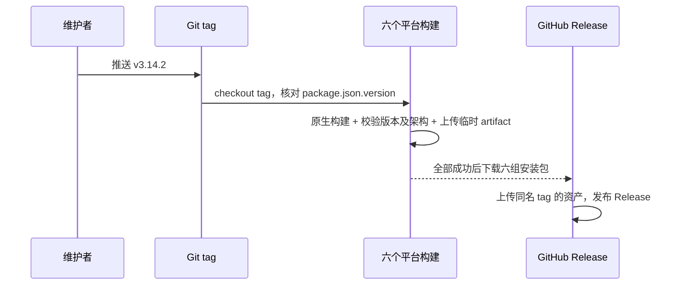

# GitHub Actions 桌面全平台发布

## 产品规则

1. 桌面发行版本只有根目录 `package.json` 的 `version` 一个所有者。首次发布为
   `3.14.2`；CLI 子项目的独立版本不随桌面版本改写。正式 tag 使用 `v<version>`。
2. 每次推送 `main` 构建六种本机目标：macOS/Windows/Linux 的 x64 与 arm64。
   分支构建只保留 Actions 构建产物；`v*` tag 的构建必须先验证 tag 和
   `package.json` 版本完全一致，禁止把旧源码打成新版本。
3. 发行矩阵复用 `pnpm bundle:desktop -- --os <os> --arch <arch>`。所有 job 使用
   `mise.toml` 指定的 Node/pnpm 版本，以 `pnpm install --frozen-lockfile` 安装依赖，
   保持 production 产品身份，并跳过不属于桌面安装包的远端预构建。
4. 每个构建只上传目标架构、目标版本的安装包；缺任何目标文件立即失败。
   仅当六个目标全部成功时创建/更新 GitHub Release 草稿；公开发布还需通过
   `readVerifiedNotices({ requireComplete: true })`。已知待复核项不得被基础校验掩盖。
5. Actions 的发行上传权限只给 Release job；构建 job 仅可读。发布使用 tag 自带的
   `GITHUB_TOKEN`，不借用开发者本地凭据。tag 推送由维护者在版本文件、许可证清单
   和验证提交后执行，不由 `GITHUB_TOKEN` 在工作流内自推 tag。
6. 无 Apple 签名和公证凭据时，macOS 构建必须标明未签名；不得宣称 Gatekeeper
   可直接通过。保持 electron-builder 原有 generic 更新服务配置，GitHub Release
   是下载安装包的分发面，不冒充应用内自动更新源。

## 所有者与事件顺序

`package.json` 拥有版本，Git tag 只是不可变的版本声明；现有 build-metadata 和
electron-builder 从它读取产物版本。GitHub Actions matrix 只持有当前 job 的短暂构建
文件；Release job 是唯一上传公开 Release 的路径。构建失败不发布，重试仅覆盖同一
tag 的已验证资产，不创建另一个版本。

## 验收

- `v3.14.2` 通过门禁，`v3.14.3` 与版本 `3.14.2` 不一致时失败。
- 6 个 target 各自只接收自己的安装包；缺失、错架构、错版本或重复文件名都失败。
- `main` 构建不创建 Release；任一目标失败或严格许可校验不通过时 tag 不创建公开 Release。
- 本地构建脚本版本元数据、安装包文件名、Release tag 一致。
