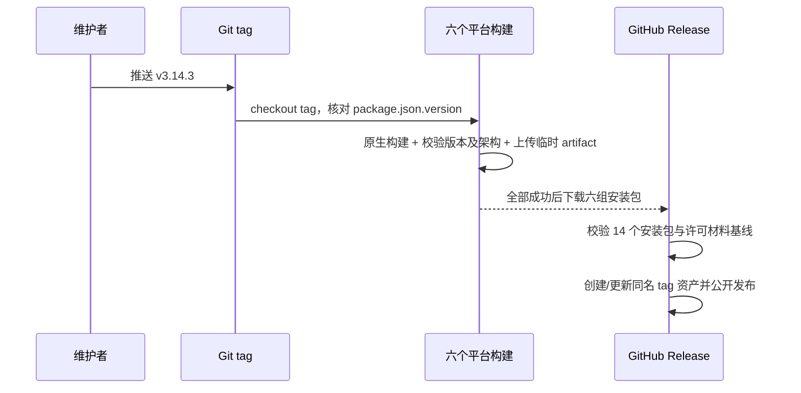

# GitHub Actions 桌面全平台发布

## 产品规则

1. 桌面发行版本只有根目录 `package.json` 的 `version` 一个所有者。首次发布为
   `3.14.3`；CLI 子项目的独立版本不随桌面版本改写。正式 tag 使用 `v<version>`。
2. 每次推送 `main` 构建六种本机目标：macOS/Windows/Linux 的 x64 与 arm64。
   分支构建只保留 Actions 构建产物；`v*` tag 的构建必须先验证 tag 和
   `package.json` 版本完全一致，禁止把旧源码打成新版本。
3. 发行矩阵复用 `pnpm bundle:desktop -- --os <os> --arch <arch>`。所有 job 使用
   `mise.toml` 指定的 Node/pnpm 版本。Linux x64 必须在依赖安装前用无第三方依赖的校验
   针对 checkout 中已提交的 `pnpm-lock.yaml` 与许可清单执行 NOTICE 基线验证；随后才以
   `pnpm install --frozen-lockfile` 安装依赖。平台安装器若临时改写工作区 lockfile，workflow
   必须先打印该 diff，再把这个单一输入恢复为已验证的 `HEAD` 内容，最后运行完整
   `pnpm test:release`。临时改写不得改变“提交输入是否新鲜”的结论，也不得靠重生成 NOTICE
   掩盖。构建保持 production 产品身份，并跳过不属于桌面安装包的远端预构建。
4. 每个构建只上传目标架构、目标版本的安装包；缺任何目标文件立即失败。
   仅当六个目标全部成功时才进入 GitHub Release job。Release job 必须先验证
   `THIRD-PARTY-NOTICES.md` 与 inventory 输入新鲜度，再要求当前 `reviewRequired`
   与 `third-party/release-review-baseline.json` 中显式登记的已知未解决项逐项一致；
   新增、删除、重复、理由变化或基线损坏都立即失败。该基线只是自动发布接受的
   已知材料债务，不代表许可材料完整，也不得被描述为合规证明。
   Linux 文件名由 electron-builder 各安装格式的原生架构命名决定：x64 的
   AppImage/RPM 为 `x86_64`、deb 为 `amd64`、pacman 为 `x64`；arm64 的
   AppImage/deb 为 `arm64`、RPM/pacman 为 `aarch64`。收集脚本按格式精确匹配
   `ZCode-<version>-linux-<native-arch>.<extension>`，不得将错误架构或旧版本
   的文件视为目标产物；其他平台保持现有 `<arch>` 命名。
5. Actions 的发行上传权限只给 Release job；构建 job 仅可读。发布使用 tag 自带的
   `GITHUB_TOKEN`，不借用开发者本地凭据。tag 推送由维护者在版本文件、许可证清单
   和验证提交后执行，不由 `GITHUB_TOKEN` 在工作流内自推 tag。
6. 无 Apple 签名和公证凭据时，macOS 构建必须标明未签名；不得宣称 Gatekeeper
   可直接通过。保持 electron-builder 原有 generic 更新服务配置，GitHub Release
   是下载安装包的分发面，不冒充应用内自动更新源。
7. Electron runtime 下载若在解包阶段精确表现为 `ENOENT` 且缺少
   `LICENSE.electron.txt`，视为下载/解包损坏而非源码错误：打包脚本最多在既有重试预算内
   切换一次官方 Electron runtime mirror 后重试。其它 afterExtract/NOTICE 错误不得重试，
   避免用镜像切换掩盖真实许可文件回归。

## 所有者与事件顺序

`package.json` 拥有版本，Git tag 只是不可变的版本声明；现有 build-metadata 和
electron-builder 从它读取产物版本。GitHub Actions matrix 只持有当前 job 的短暂构建
文件；仓库发布脚本拥有安装包格式到原生架构后缀的匹配规则，Release job 是唯一上传
公开 Release 的路径。`third-party/inventory.json` 拥有当前扫描得到的材料状态，
`third-party/release-review-baseline.json` 单独拥有自动发布已明确接受的已知未解决集合；
两者没有第二条写入路径。构建或发布前校验失败不创建 Release，重试仅覆盖同一 tag 的
已验证资产，不创建另一个版本。资产上传失败最多保留不可见的 draft；只有全部上传成功
才转为公开 Release，同 tag 重跑用 `--clobber` 幂等恢复。

## 验收

- `v3.14.3` 通过门禁，`v3.14.4` 与版本 `3.14.3` 不一致时失败。
- 6 个 target 各自只接收自己的安装包；缺失、错架构、错版本或重复文件名都失败。
- Linux 两种架构的四种格式分别按真实生成的后缀收集，x64 不接收 arm64/aarch64，
  arm64 不接收 x64/x86_64/amd64；既有非 Linux 命名与版本不改变。
- `main` 构建不创建 Release；任一目标失败、NOTICE/输入过期、当前材料复核项偏离显式
  release baseline 时，tag 不创建 Release。
- Linux x64 在 `pnpm install` 前验证 committed NOTICE 基线；安装后的平台临时状态
  不参与该输入哈希，恢复已提交 lockfile 后再跑完整 release contract。测试必须证明 workflow
  顺序不会因 Linux 的 pnpm lockfile 重写而误报过期。
- 当前材料复核项与显式 release baseline 完全一致时，`v<package version>` tag 在六目标
  成功后无需人工步骤，自动创建或更新同名 GitHub Release、上传全部 14 个安装包并公开。
- `node scripts/licenses.mjs check --strict` 仍保留“零未解决项”的更强人工门禁；自动发布的
  baseline-aware 校验不得改变它，也不得输出“许可完整”的结论。
- 本地构建脚本版本元数据、安装包文件名、Release tag 一致。
