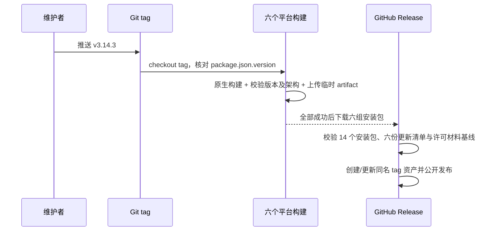
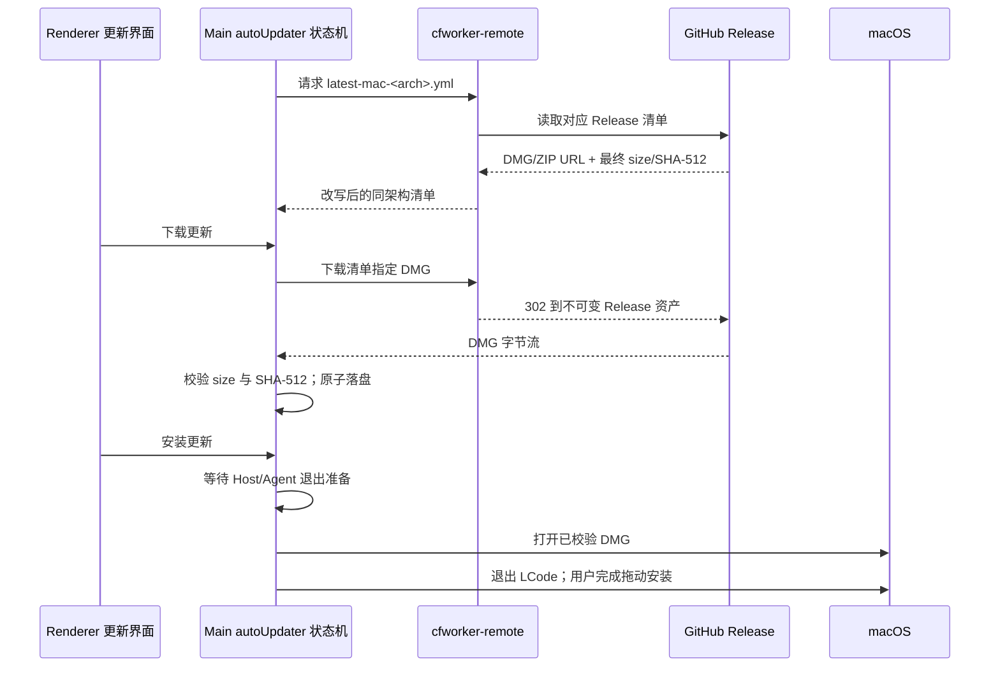

# GitHub Actions 桌面全平台发布

## 产品规则

1. 桌面发行版本只有根目录 `package.json` 的 `version` 一个所有者。首次发布为
   `3.14.3`；CLI 子项目的独立版本不随桌面版本改写。正式 tag 使用 `v<version>`。
2. 每次推送 `main` 构建六种本机目标：macOS/Windows/Linux 的 x64 与 arm64。
   分支构建只保留 Actions 构建产物；`v*` tag 的构建必须先验证 tag 和
   `package.json` 版本完全一致，禁止把旧源码打成新版本。
3. 发行矩阵复用 `pnpm bundle:desktop -- --os <os> --arch <arch>`。所有 job 使用
   `mise.toml` 指定的 Node/pnpm 版本。Linux x64 必须在依赖安装前用无第三方依赖的校验
   针对 checkout 中已提交的 `pnpm-lock.yaml` 与许可清单执行 NOTICE 基线验证；随后才以
   `pnpm install --frozen-lockfile` 安装依赖。平台安装器若临时改写工作区 lockfile，workflow
   必须先打印该 diff，再把这个单一输入恢复为已验证的 `HEAD` 内容，最后运行完整
   `pnpm test:release`。临时改写不得改变“提交输入是否新鲜”的结论，也不得靠重生成 NOTICE
   掩盖。构建保持 production 产品身份，并跳过不属于桌面安装包的远端预构建。
   electron-builder 在 dist 生成的更新清单（Windows `latest.yml`、macOS `latest-mac.yml`、
   Linux `latest-linux.yml`，内含安装包 sha512）是应用内更新服务的首选元数据来源：
   staging 脚本保留其 release notes 等扩展字段，但必须针对 staging 时的最终安装包重新
   计算 size 与 SHA-512，再按 `latest-<os>-<arch>.yml` 收集并上传到 Release；由此兼容
   在 staging 前完成且会改变归档字节的仓库外内签，源清单缺失或目标文件集合不匹配即失败。
   已知上游例外（2026-09-29 v3.16.2 CI 实证）：electron-builder 只为 Linux x64 生成
   `latest-linux.yml`。Linux arm64 staging 必须从本 job 已精确校验的四个安装包重新读取
   文件大小并计算 SHA-512（base64），生成等价的 `latest-linux-arm64.yml`；不得复制 x64
   清单、引用另一架构或让 Worker 以 404 退回手动更新。若后续 electron-builder 原生生成
   arm64 清单，则直接采用上游清单，不重复维护第二份内容。
4. 每个构建只上传目标架构、目标版本的安装包与对应更新清单；缺任何目标文件立即失败。
   仅当六个目标全部成功时才进入 GitHub Release job。Release job 必须先验证
   `THIRD-PARTY-NOTICES.md` 与 inventory 输入新鲜度，再要求当前 `reviewRequired`
   与 `third-party/release-review-baseline.json` 中显式登记的已知未解决项逐项一致；
   新增、删除、重复、理由变化或基线损坏都立即失败。该基线只是自动发布接受的
   已知材料债务，不代表许可材料完整，也不得被描述为合规证明。
   Linux 文件名由 electron-builder 各安装格式的原生架构命名决定：x64 的
   AppImage/RPM 为 `x86_64`、deb 为 `amd64`、pacman 为 `x64`；arm64 的
   AppImage/deb 为 `arm64`、RPM/pacman 为 `aarch64`。收集脚本按格式精确匹配
   `LCode-<version>-linux-<native-arch>.<extension>`，不得将错误架构或旧版本
   的文件视为目标产物；其他平台保持现有 `<arch>` 命名。
5. Actions 的发行上传权限只给 Release job；构建 job 仅可读。发布使用 tag 自带的
   `GITHUB_TOKEN`，不借用开发者本地凭据。tag 推送由维护者在版本文件、许可证清单
   和验证提交后执行，不由 `GITHUB_TOKEN` 在工作流内自推 tag。GitHub Release 的说明
   以 tag 指向提交的完整 commit message 为唯一内容来源，并在其后追加未签名安装包提示；
   同一 tag 重跑时也必须覆盖旧说明，不能继续使用固定模板取代本次提交内容。
6. 发布与更新清单门禁不得依赖 Apple/Windows 签名凭据；未配置凭据时六个平台仍须完成
   安装包、六份清单和 Release 构建。无 Apple 签名和公证凭据时，macOS 构建必须标明
   未签名，不得宣称 Gatekeeper 可直接通过；维护者可在仓库外以内签方式处理最终产物，
   但任何会改变归档字节的签名或重打包都必须在公开前重新生成对应清单校验和，禁止发布
   与最终下载物不一致的 manifest。运行时不关闭 macOS/Windows 的系统签名校验。
   应用内自动更新源为 cfworker-remote（`https://code.lemon.vin`）提供的
   更新清单服务：Worker 按 stable/preview 通道代理 GitHub Release 上的
   `latest-<os>-<arch>.yml`（改写文件 URL 指向自身下载代理），安装包经 302 回
   GitHub Release 资产；GitHub Release 仍是安装包与清单的唯一来源，Worker 无状态
   不落存储，不修改清单里的版本与校验和。
   六个原生构建目标各自拥有且只上传一份 `latest-<os>-<arch>.yml`；每份清单必须列出
   该目标所有受支持安装格式及最终 size/SHA-512，不能从另一架构复制，也不能依赖客户端
   猜测文件名。Windows 与 Linux 继续由 electron-updater 按当前安装格式下载并接管安装；
   macOS 不把 Squirrel.Mac 的签名 staging 当作未签名更新的前置条件，而是从同一份按架构
   清单中选择 DMG，经 cfworker-remote 下载并在 Main 进程按清单 SHA-512（及存在时的 size）
   校验后打开安装镜像，再执行正常退出。缺 DMG、缺/非法摘要、大小或摘要不匹配、打开失败
   都必须 fail-closed 并保留可重试入口；不得回退到未校验下载，也不得关闭 Gatekeeper。
   macOS 未签名更新因此是“校验下载 + 打开 DMG + 用户拖动安装”，不是静默替换应用。
7. Electron runtime 下载若在解包阶段精确表现为 `ENOENT` 且缺少
   `LICENSE.electron.txt`，视为下载/解包损坏而非源码错误：打包脚本最多在既有重试预算内
   切换一次官方 Electron runtime mirror 后重试。其它 afterExtract/NOTICE 错误不得重试，
   避免用镜像切换掩盖真实许可文件回归。

## 所有者与事件顺序

`package.json` 拥有版本，Git tag 只是不可变的版本声明；现有 build-metadata 和
electron-builder 从它读取产物版本。GitHub Actions matrix 只持有当前 job 的短暂构建
文件；仓库发布脚本拥有安装包格式到原生架构后缀的匹配规则，Release job 是唯一上传
公开 Release 的路径。`third-party/inventory.json` 拥有当前扫描得到的材料状态，
`third-party/release-review-baseline.json` 单独拥有自动发布已明确接受的已知未解决集合；
两者没有第二条写入路径。构建或发布前校验失败不创建 Release，重试仅覆盖同一 tag 的
已验证资产，不创建另一个版本。资产上传失败最多保留不可见的 draft；只有全部上传成功
才转为公开 Release，同 tag 重跑用 `--clobber` 幂等恢复。

桌面 Main 的 `autoUpdater.ts` 是运行时更新状态、取消令牌、就绪版本和安装入口的唯一所有者；
`ManifestUpdateProvider` 只读取 Worker 清单并解析文件 URL，不保存第二份更新状态。macOS DMG
下载器只产生经过清单校验的本地文件路径，并把进度交回同一状态机；Renderer 只消费
`UpdateStatePayload`，不能自行下载或决定安装包。

```mermaid
sequenceDiagram
  participant Maintainer as 维护者
  participant Git as Git tag
  participant Matrix as 六个平台构建
  participant Release as GitHub Release
  Maintainer->>Git: 推送 v3.14.3
  Git->>Matrix: checkout tag，核对 package.json.version
  Matrix->>Matrix: 原生构建 + 校验版本及架构 + 上传临时 artifact
  Matrix-->>Release: 全部成功后下载六组安装包
  Release->>Release: 校验 14 个安装包、六份更新清单与许可材料基线
  Release->>Release: 创建/更新同名 tag 资产并公开发布
```

```mermaid
sequenceDiagram
  participant UI as Renderer 更新界面
  participant Main as Main autoUpdater 状态机
  participant Worker as cfworker-remote
  participant Release as GitHub Release
  participant OS as macOS
  Main->>Worker: 请求 latest-mac-<arch>.yml
  Worker->>Release: 读取对应 Release 清单
  Release-->>Worker: DMG/ZIP URL + 最终 size/SHA-512
  Worker-->>Main: 改写后的同架构清单
  UI->>Main: 下载更新
  Main->>Worker: 下载清单指定 DMG
  Worker-->>Release: 302 到不可变 Release 资产
  Release-->>Main: DMG 字节流
  Main->>Main: 校验 size 与 SHA-512；原子落盘
  UI->>Main: 安装更新
  Main->>Main: 等待 Host/Agent 退出准备
  Main->>OS: 打开已校验 DMG
  Main->>OS: 退出 LCode；用户完成拖动安装
```

## 验收

- `v3.14.3` 通过门禁，`v3.14.4` 与版本 `3.14.3` 不一致时失败。
- 6 个 target 各自只接收自己的安装包；缺失、错架构、错版本或重复文件名都失败。
- Linux 两种架构的四种格式分别按真实生成的后缀收集，x64 不接收 arm64/aarch64，
  arm64 不接收 x64/x86_64/amd64；既有非 Linux 命名与版本不改变。
- `main` 构建不创建 Release；任一目标失败、NOTICE/输入过期、当前材料复核项偏离显式
  release baseline 时，tag 不创建 Release。
- Linux x64 在 `pnpm install` 前验证 committed NOTICE 基线；安装后的平台临时状态
  不参与该输入哈希，恢复已提交 lockfile 后再跑完整 release contract。测试必须证明 workflow
  顺序不会因 Linux 的 pnpm lockfile 重写而误报过期。
- 当前材料复核项与显式 release baseline 完全一致时，`v<package version>` tag 在六目标
  成功后无需人工步骤，自动创建或更新同名 GitHub Release、上传全部 14 个安装包与六份
  更新清单并公开；Linux arm64 即使上游不生成，也必须由 staging 确定性补齐。
- 不配置平台签名凭据时，发布契约、清单生成和 Worker 查询均保持可用；仓库外内签若改变
  安装包或 macOS ZIP 的字节，必须在替换 Release 资产前重算清单，客户端下载仍以最终
  manifest 的 SHA-512 为准。
- 六个 matrix target 的临时 artifact 均包含自己的架构清单；测试逐一解析六份清单，断言
  文件集合、原生架构后缀、size 与 SHA-512 都只来自本 target 的最终安装包。
- macOS x64/arm64 在无签名凭据时均能从各自清单选中 DMG；下载摘要或大小不符、清单只有
  ZIP、摘要非法时不进入 ready，合法 DMG 才能打开。Windows/Linux 的现有原生安装路径不变。
- `node scripts/licenses.mjs check --strict` 仍保留“零未解决项”的更强人工门禁；自动发布的
  baseline-aware 校验不得改变它，也不得输出“许可完整”的结论。
- 本地构建脚本版本元数据、安装包文件名、Release tag 一致。
