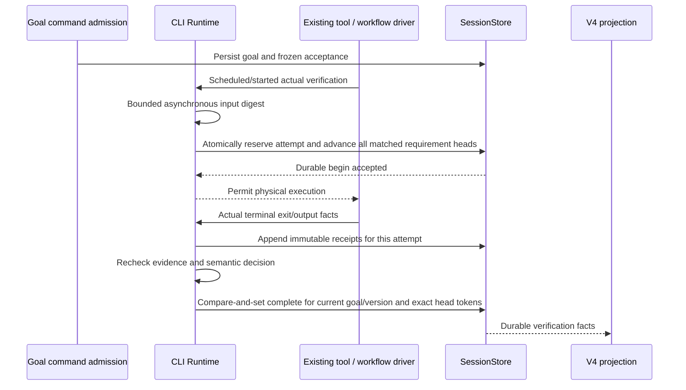
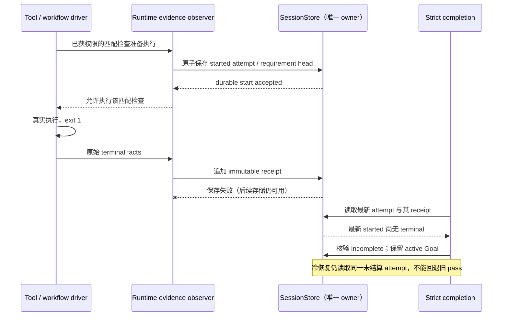

# Goal evidence and optional strict completion

## Product rules

- Existing goals and unspecified acceptance use `legacy`, including the existing verifier fail-open behavior. Strict acceptance is explicitly supplied with a new/replaced goal; pause/resume and fork preserve the accepted contract. An old execution implementation must reject a strict contract rather than ignore it.
- A strict contract has at most 16 named requirements. Each explicitly declares a `Bash` command or `world.run` executable/argv and 1–64 workspace-relative input files; optional required artifact files are checked after execution. The declared files must cover the requirement. Directories, absolute/parent paths, symlinks, inaccessible/oversized inputs and incomplete hashes are unknown, never success. No implicit test or process is launched.
- Actual tool/driver execution owns exit codes and outputs. Runtime captures input file bytes before execution and rechecks them after execution, then records artifact digests. A zero exit code passes that requirement only when content stayed unchanged and the required artifacts exist. Model text, tool summary text and restored cached world nodes are not new evidence.
- Evidence is append-only, bounded and idempotent by goal/contract/execution/requirement. Output records contain hashes, sizes, truncation and existing artifact references, not raw stdout/stderr. Evidence persists as session entries; live and cold reads derive the same summaries.
- Input and artifact digests use versioned, unambiguous per-file framing, including each path, byte length and content hash. The workspace root and every path ancestor are explicitly checked without following symlinks before and after reading. Successful and failed receipts both require current matching bytes; a failed check on old bytes becomes stale rather than triggering repair against a different version.
- A running check is frozen to the goal state revision. Pause/resume, replacement or rebinding before settlement, including while asynchronous file digests are read, discards its late receipt. Previously settled proof remains readable across pause/resume when its content and binding are still current.
- Strict completion requires current matching evidence for every requirement and a valid independent transcript verifier decision. Missing/stale/unknown evidence and verifier infrastructure/format errors yield verification-incomplete without `nextAction`; the existing continuation loop stops without marking complete. A valid semantic rejection may continue with its explicit next action. Cancellation preserves existing pause behavior.
- Completion uses an expected goal id, accepted contract hash, monotonic target state revision and mutation timestamp plus runtime branch/foreground generation. Evidence also binds the persisted workspace binding and conversation branch generation. A replaced/paused/rebound goal or late result cannot complete a new target. Rechecking a contract requires a new real execution; restart never replays settled effects to refresh evidence.
- The conditional completion predicate is enforced by the SQLite update itself, including target id, active status, expected state revision or legacy mutation timestamp, and exact accepted contract. Every business status transition advances the revision; heartbeat, title and ordinary usage metering that leaves status unchanged do not.
- Explicit strict retry via resume or a new user execution is allowed. There is no new autonomous retry loop. Existing provider admission retries remain bounded. Strict malformed output has no retry.

## Ownership and order

Tool permission/operation admission remains in CLI. Host services own checkout and execution-environment binding. File bytes are read through `FileSystemPort` in the target execution environment. Desktop continuous and mobile replayable streams consume the same facts. UI cannot create passed evidence.

## Interfaces and migration

`GoalAcceptance` and bounded evidence schemas are shared validated contracts. `SessionGoal.acceptance` is optional, with absence meaning legacy; SQLite adds nullable acceptance JSON and a monotonic state revision. `setTarget` accepts explicit acceptance and `updateTargetStatus` accepts an optional expected identity/version guard; strict completion additionally requires the complete set of expected requirement-head tokens from the same evidence snapshot. The final SQLite predicate verifies each current head and its matching passed receipt, so a new attempt admitted after the last digest cannot race completion. Creating strict complete goals and completing through run accounting are rejected. Goal commands preserve acceptance on pause/resume; a replacement uses its supplied contract or legacy. Strict busy commands are rejected until their contract can be safely preserved by the existing queue rather than silently downgraded. The legacy verifier-disable flag does not bypass an explicitly accepted strict contract.

`sendStrictGoalCommand` uses the same CommandInbox session admission, Host routing/owner guards and projected input byte budget as the legacy Goal command. Its distinct identity must not skip shared guard classification, even though busy strict queue admission is intentionally rejected.

`/goal strict <acceptance.json> <objective>` is an explicit local CLI entry (use `replace strict` to replace a goal). Paths resolve against the CLI invocation directory, and the config is capped at 64 KiB. V4 `sendStrictGoalCommand` is a distinct structured command with mandatory acceptance; old execution endpoints reject the unknown command instead of stripping a new optional field. Busy strict admission is rejected explicitly, never downgraded into a legacy queued goal. No default toggle changes already accepted goals. Documents/conversation tasks may use legacy; strict is for explicitly executable acceptance contracts.

Desktop/Web slash inputs using `strict` or `replace strict` file syntax are rejected before sending and preserve the editable draft, with a local CLI or structured strict command explanation. Their slash parser must not turn a local-only acceptance-file command into a legacy objective.

SessionStore atomically reserves at most 512 receipt slots, 512 requirement heads and 512 attempts per session before execution. Exhaustion, missing begin capability or failed start persistence rejects a matched strict execution before its physical side effect. A reserved but unsettled attempt is incomplete; terminal persistence failure cannot fall back to older proof. Repeated execution ids preserve the original result and time. Disabling observation does not remove history.

### Durable execution attempts and terminal write failure

`SessionStore` is the sole owner of strict execution attempt ordering. A matched check must persist its start and advance the requirement's durable attempt head before the tool/driver performs the physical execution. A terminal receipt is immutable and belongs to that exact attempt; it does not replace a prior receipt or refresh its timestamp. Current evidence is derived from the newest durable attempt, not from whichever terminal happened to save successfully. A started attempt with no terminal receipt, including after a terminal save failure or a process restart, yields incomplete and cannot borrow an older passing receipt. Failed start persistence prevents the strict matched check from executing through this path; no in-memory poison flag or UI state substitutes for the durable owner. Legacy tool execution remains compatible. One begin transaction persists every matched requirement head and the immutable attempt, using the current goal id, acceptance hash and state revision. Terminal writes never advance a head; duplicate terminal ids preserve the first receipt. Head tokens are independent of goal state revision, allowing parallel checks for different requirements. Settled proof remains readable across pause/resume; an in-flight capture still requires its original business revision. Missing input digests reject physical execution after durable start so temporary filesystem recovery cannot revive older proof. Unknown binding rejects physical execution without fabricating a binding hash. A failed goal-policy read also blocks execution because the observer cannot establish that the command is outside strict acceptance. A duplicate admitted execution id is not physically replayed; only repeated terminal delivery may reuse the first immutable receipt.

Additional admission acceptance: the real Runtime must invoke the physical ExecutionPort zero times after strict start-write failure, failed policy read, missing begin capability, unknown input/binding or duplicate execution id. Unknown input leaves a durable unsettled head, so restoring the file cannot revive older proof. The live workflow driver must also stop before execution on start persistence failure; legacy execution does not call strict begin. These newly saved regressions remain unexecuted while acceptance is paused.

Failure injection acceptance: a real Runtime executes an unchanged check twice against SQLite, with real subprocess exits 0 then 1. Only the second evidence receipt write fails once; subsequent reads and goal writes are available. Live and reopened-store summaries must be incomplete, the semantic verifier must not run, the Goal must remain active, and the original passing receipt and timestamp must remain unchanged.

Strict receipts written before durable heads were introduced lack current-attempt proof and become incomplete; they require an explicit new check. Cold recovery never replays external effects. The file-digest v2 framing rejects ambiguities in earlier NUL-delimited hashes. Previously persisted digests naturally become stale and require a new explicit real check; migration does not replay an old tool or workflow effect.

## Workflow integration

The workflow driver observes only live `world.run` calls. Engine passes run/site/ordinal identity; replay skips the driver. A verification is not final while actor writes are active. The run's actor-node version is checked at both execution boundaries; an actor launched or changed while the command is running requires a new explicit final check, even if it has already settled when the command returns. Input changes during or after a check invalidate its evidence. Advice remains non-blocking: bounded tasks use necessary roles; shared contracts have one writer; independent lanes join only before final integrated checks. No model, concurrency, script or scheduler defaults change.

## Acceptance and validation

1. Real command exit 0 + stable inputs + required artifacts passes; text-only claims and absent exit codes do not.
2. Editing uncommitted bytes with the same HEAD makes evidence stale; input mutation during the command does not pass.
3. Legacy malformed output/provider errors still fail open; strict errors return incomplete and stop automatic continuation.
4. Goal replacement, pause, branch generation change and late terminal facts cannot complete another goal.
5. Evidence save and replay deduplicate execution ids and preserve original times. Cached world.run is never re-executed or counted as new evidence.
6. Scope escape, symlink, unknown/missing file and budget overflow fail closed; no new permission path executes a command.
7. Local branch pass followed by integrated source changes is stale; final live integrated check supplies new evidence.
8. Strict contract survives SQLite reopen/fork, and V4 live/cold summaries agree. Existing legacy records remain readable.

Run focused contracts/runtime/storage/workflow/projection tests, CLI typecheck/lint, root typecheck/lint and changed architecture checks. UI derives existing verification markers and exposes evidence through the bounded goal read surface.
