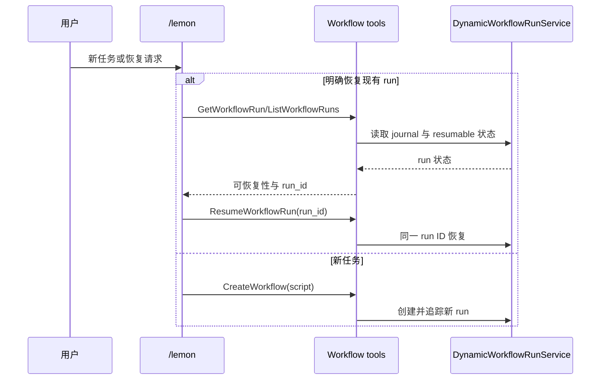

# Lemon Workflow 内置插件

## 目标

ZCode 的源码构建、桌面安装包、CLI SEA 和远端 Agent 资源必须内置一个默认启用的
`lemon-workflow` 内容插件。插件提供 `/lemon` 命令以及 `ponytail`、`caveman`、
`dynamic-workflows` 技能，不依赖用户目录 `~/.zcode` 中已有文件。

动态工作流能力缺省为 `alwaysOn`。远端配置或本地开发覆盖仍可显式设置
`disabled`，但配置缺失、非法或请求失败时不得让内置 `/lemon` 落入“命令存在、工具未装配”
的半可用状态。

## 产品规则

1. `lemon-workflow` 是纯内容型官方插件，首次启动默认启用，不启动独立进程，不新增 MCP。
2. 插件内容是构建和运行时的唯一来源。不得在启动时从 `C:\Users\Lemon\.zcode` 复制文件。
3. `/lemon [任务描述]` 使用参数作为目标；参数为空时使用当前对话中最新任务。
4. 新任务使用 `CreateWorkflow`，只传一个内联 `script` 来源。不得调用
   `EvalWorkflowSnippet`，不得同时传 `path`、`saved` 或其他 snippet 来源。
5. 当目标明确要求继续、恢复或唤醒现有 run 时，先使用 `GetWorkflowRun` 或
   `ListWorkflowRuns` 确认 run。仅对 `status === "stopped"` 且
   `stopReason !== "superseded"` 的同一 run 调用 `ResumeWorkflowRun`；`provider` 停止
   原因需先排除供应商故障。不得创建重复 run，不得恢复 superseded 或 errored run。
6. 用户明确要求修改原 workflow 时使用现有 `AmendWorkflow` 语义，不把脚本变化伪装成 resume。
7. `CreateWorkflow` 返回编译诊断时，修正完整脚本后重新调用 `CreateWorkflow`。不得把同一个无效
   调用重复提交，也不得退回 `EvalWorkflowSnippet`。
8. Ponytail 与 Caveman 保持各自上游 MIT 许可和署名；项目对 `/lemon` 与
   `dynamic-workflows` 的本地编排修改单独维护。

## 状态所有者与边界

- 官方插件 definition、默认启用集合和构建资源清单负责“插件是否随发布物存在”。
- `resolveDynamicWorkflowClientConfig` 负责动态工作流缺省开关；远端合法值和本地覆盖优先级不变。
- `DynamicWorkflowRunService`、run journal 与现有 workflow tools 继续唯一持有 run 状态、恢复判定、
  owner/lease、问题等待和后台追踪。
- `/lemon` 只提供模型执行约束，不持久化 run，不复制 journal，不建立第二条恢复路径。

## 分发接口

以下入口必须同时声明并校验 `lemon-workflow-plugin`：

- Bootstrap 官方插件 definition 与默认启用集合。
- Desktop `bundled-agents/<platform>/glm/packages` 生产资源。
- Desktop dev 与 production 共用的 `stage-agent-bundle.mjs` 资源暂存。
- CLI SEA 官方插件资产 manifest。
- Remote prebuild GLM 资源与开发态远端资源合同。
- pnpm workspace lockfile 与第三方许可证清单。

许可证生成器若在 Windows 的全 workspace `pnpm ls` 查询遇到 `EMFILE`，必须保留相同的
prod/lockfile 双图校验，通过逐 workspace 查询降低同时打开的文件数，不能跳过许可材料生成。

每条分发路径至少校验以下资产：

- `.zcode-plugin/plugin.json`
- `commands/lemon.md`
- `skills/ponytail/SKILL.md`
- `skills/caveman/SKILL.md`
- `skills/dynamic-workflows/SKILL.md`
- `skills/dynamic-workflows/examples.md`
- `skills/dynamic-workflows/patterns.md`

## 验收场景

1. 全新用户目录启动源码或安装包，无需 `/reload-plugins` 即可发现 `/lemon` 和三个技能。
2. 没有远端 dynamic workflow 配置时，session 仍装配 Create/Get/List/Resume 等 workflow tools。
3. 远端显式下发 `disabled` 时，workflow UI、tools 与 `/lemon` 入口按现有灰度边界关闭。
4. `/lemon 新任务` 只走 `CreateWorkflow(script=...)`，不调用 `EvalWorkflowSnippet`。
5. `/lemon 恢复 <run_id>` 先读取状态；未被取代的 stopped run 使用相同 ID 恢复，
   running/pending run 只报告进展，不创建新 run。
6. superseded、errored 或不存在的 run 不被恢复，命令返回现有工具诊断。
7. Desktop、SEA、remote staging 产物缺少任一必需资产时，构建立即失败。
8. Ponytail 与 Caveman 的 MIT 许可证进入 `THIRD-PARTY-NOTICES.md` 和 inventory。
