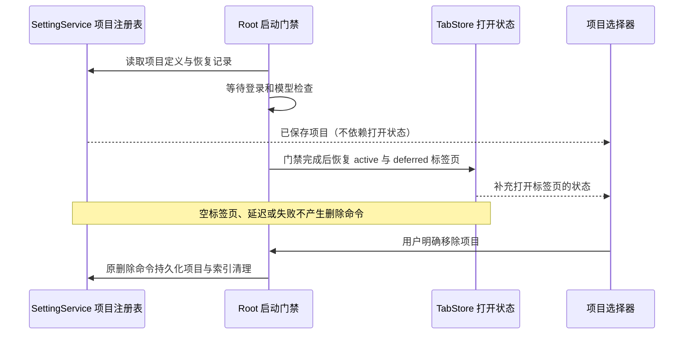

# 本地多文件夹项目

## 产品规则

- 会话输入框的工作区菜单将“打开文件夹”替换为“新建项目”。
- 本地项目由稳定 `id`、用户可见名称、一个主文件夹和一个或多个源文件夹组成。
- 创建项目时，第一个添加的文件夹是主文件夹；源文件夹去重，至少保留一个。
- 新会话以主文件夹作为 `workspacePath`、命令 cwd、Git 目标和项目级配置自动发现目录。
- 次要文件夹加入同一项目的文件搜索范围，并临时注入会话使用的 filesystem MCP 允许目录；不改变 `workspacePath`。
- 已存在的 `recentProjects` 和没有项目 id 的本地 tab 保持为隐式单文件夹项目，避免迁移后消失。
- 远程项目仍保持一个远程文件夹，不显示本地多文件夹创建流程。
- “不在项目中工作”继续使用 conversation backing workspace，不写入本地项目定义。

## 状态所有者与接口

- `AppSettings.localProjects` 是项目定义的唯一权威持久化来源。
- `TabStore` 只保存当前 tab 对应的 `localProjectId` 投影，用于恢复和展示关联；项目名称和文件夹列表始终从设置快照读取。
- 项目注册表不依赖窗口是否打开项目标签页。启动登录/模型检查、active-first 延迟恢复、关闭标签页、恢复失败或新窗口均不得删除项目定义；仅用户明确“移除项目”时沿现有删除命令清理该项目定义及其恢复索引。
- 项目选择器始终展示已保存项目；没有打开标签页时由项目定义投影名称、主目录和项目 ID，选择后沿现有打开项目命令创建标签页。不得把“未打开”当作失效记录。
- `workspaceIdentity?.trim() || workspacePath` 仍是会话、缓存和队列的隔离 key；本地项目不发明第二套 identity。
- `workspacePath` 始终是主文件夹，文件操作、cwd、Git 和路径展示继续使用该字段。
- UI 通过根级创建命令提交 `{ name, sourceFolderPaths }`；根级命令负责校验、持久化、打开 tab 和启动草稿。

```text
用户打开“新建项目”
  → Dialog 本地草稿（名称、源文件夹）
  → 名称/路径校验与去重
  → Root 创建命令
  → SettingService 写入 AppSettings.localProjects（唯一事实源）
  → TabStore 打开主文件夹并记录 localProjectId（派生投影）
  → 会话草稿使用主文件夹 workspacePath
      ├─ 文件搜索并行查询全部源文件夹
      └─ 建会话/恢复会话时把全部源文件夹注入 filesystem MCP
```

## 不变量与失败语义

- 项目名称去除首尾空白后必须非空，长度不超过 100 个字符。
- 项目至少有一个源文件夹，最多 20 个；相同规范化路径只保留一次。
- 同一个规范化主文件夹不能属于两个显式项目，避免运行时无法确定项目定义。
- 新建项目遇到已保存的同主目录项目时，无论它是否打开都拒绝重复创建，不自动移除或替换旧项目。
- 选择文件夹被取消时不改变弹窗草稿之外的任何状态。
- 设置写入失败时不新增 tab、不启动草稿，并保留弹窗内容供用户重试。
- filesystem MCP 未配置或某个次要目录已不存在时，不改写用户 MCP 配置；只跳过不存在的临时允许目录。
- 搜索某个次要文件夹失败时，本次项目搜索整体失败并显示现有文件搜索错误态，不把部分结果伪装成完整结果。
- 项目创建不启动或重建 Agent；Agent 仍按首次实际使用时的既有懒启动语义创建。

## 迁移与兼容边界

- 缺少 `localProjects` 的旧设置解析为 `[]`，不主动把历史 `recentProjects` 写成新项目。
- 旧的本地会话条目缺少 `localProjectId` 时继续按路径恢复。
- 删除或找不到项目定义时，带 `localProjectId` 的历史 tab 降级为普通单文件夹 tab；不得阻止会话恢复。
- Web/远控模式若不支持本地目录选择，则不显示“新建项目”；现有远程连接入口不变。
- 此次修复不引入自动历史恢复或新的持久化 owner。已被旧启动逻辑删除的记录可以在确认重启前快照后单独恢复；只合并丢失项目及其相关索引，保留当前设置、其他项目和当前激活索引，恢复前保存私有备份。



## 验收场景

1. 在本地桌面会话菜单选择“新建项目”，填写名称并依次添加两个文件夹；创建后菜单显示项目名称，当前会话 cwd 为第一个文件夹。
2. 项目创建后重启应用，项目定义和 tab 关联恢复；菜单仍按项目名称显示，而不是退回主文件夹 basename。
3. 在项目内搜索文件时，主文件夹结果使用相对路径，次要文件夹结果带文件夹前缀并使用绝对目标路径，避免同名路径冲突。
4. 建立或恢复会话时，filesystem MCP 参数包含全部仍存在的源文件夹，且不持久化改写用户 MCP 配置。
5. 名称为空、未选择文件夹、重复主文件夹或超过数量上限时，创建按钮不可提交或显示明确错误。
6. 取消目录选择、关闭弹窗或设置写入失败后，不新增项目/tab/会话草稿。
7. 旧 `recentProjects`、远程 workspace 和“不在项目中工作”入口行为保持不变。
8. 有已保存项目时，重启先停留在登录/模型检查门禁；项目注册表、recent 和恢复记录保持不变，门禁完成后恢复项目名称与 tab 关联。再次重启仍能恢复。
9. 已保存项目没有打开 tab，或 workspace 恢复失败时仍能在项目选择器看到并重新打开；同主目录新建不能替换其 ID、名称或源文件夹。
10. 明确移除项目后，重启不复活；同路径远程项目和其他项目不被该本地删除命令清理。

## 验证计划

- 共享层单元测试：设置默认值、项目校验、路径去重和主文件夹冲突。
- 服务层单元测试：filesystem MCP 对多个存在目录去重注入，不存在目录跳过。
- UI 单元测试：项目菜单投影合并显式项目、旧 tab 和远程 tab。
- Desktop 实机验收场景：打开菜单 → 新建项目 → 添加两个临时目录 → 创建 → 验证项目名、主目录和真实退出重启。浏览器回归复用生产 Root 启动门禁、恢复 hook、根级项目命令及真实 SettingService；实机退出重启仍需使用更新后的安装版核验。

## 2026-10-03 启动误删修复验证

- 删除 Root 启动时根据打开 tab 推断“无主项目”并清理设置的路径，同时删除对应清理函数。启动门禁尚未放行时，恢复 hook 的“无需恢复”完成态不能代表打开 tab 已完整恢复；更不能据此删除持久化项目。项目菜单从注册表展示未打开项目，同主目录新建始终拒绝重复，不再自动替换旧定义。
- `TSX_TSCONFIG_PATH=packages/ui/tsconfig.json node --import tsx --test packages/ui/src/localProjectLifecycle.test.ts packages/ui/src/workspaceProjectMenu.test.ts`：8 项通过。覆盖空 tab 下项目可选择、次要目录关联、远程同路径隔离、显式移除与无匹配移除不产生补丁。Windows 下由 PowerShell 设置环境变量。
- `node --test packages/web/test/local-project-persistence.test.mjs`：通过。使用本机 Chrome、1280px/390px，Root 真实启动门禁保持模型检查未完成；后续场景运行实际 `useTabPersistence`、active-first 恢复和根级项目命令。HTTP 测试桥访问真实 SettingService，设置写入本测试的临时 home；每轮重新创建服务实例读取同一设置文件。门禁中不删除项目、延迟恢复保留全部项目、重复创建未打开项目不替换、完整恢复及明确移除后再次重载均通过，页面错误 0。未连接真实模型，也未写入用户配置。
- `pnpm typecheck`、`pnpm lint`、`pnpm architecture:check --changed` 通过；Lint 0 警告/错误，架构 baseline 0、新增 0、总违规 0，ui/services 为当前策略中的未受管模块。桌面 `pnpm --filter @lcode/desktop build:no-runtime-assets` 通过，保留现有大 chunk 和插件耗时提示。
- 本机已确认丢失的 1 个项目另行恢复：使用设置服务相同的文件锁，在锁内重新读取当前配置，先保存私有备份，再仅合并该项目定义、最近项目及相关恢复条目。当前激活索引和其他配置保持原值，原源码目录未改动。此操作不是生产启动自动恢复功能，也没有覆盖安装版应用；需用新构建版本进行实机重启核验。
