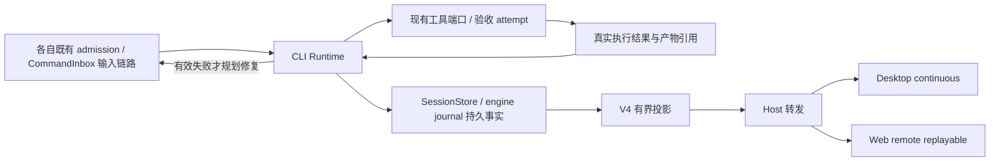
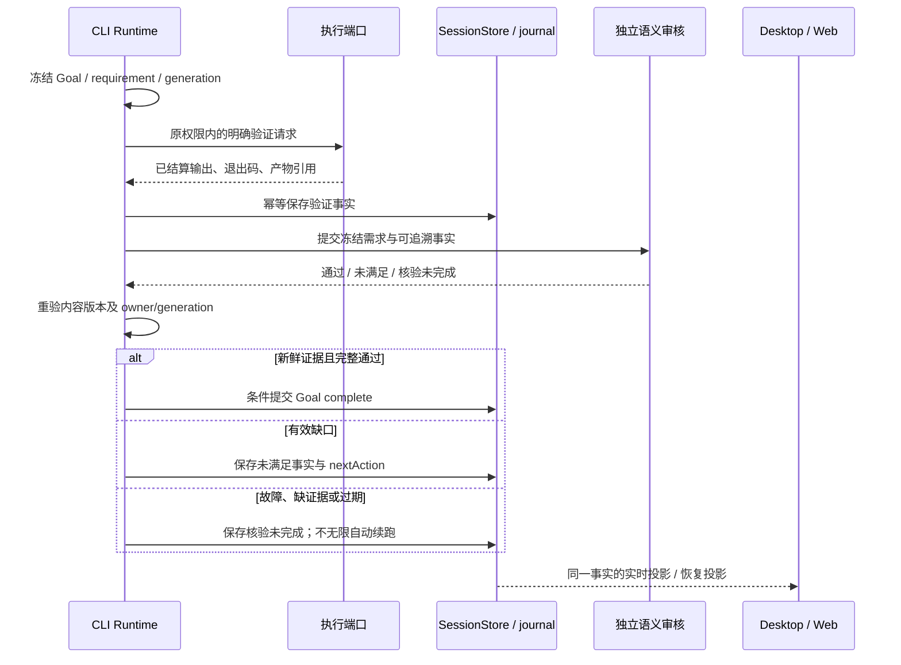
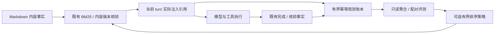

# Metis 能力吸收与渐进实施方案

- 日期：2026-10-09。
- 状态：**规划草案，尚未实现**。本次只新增本文，不改变代码、默认行为、权限或现有任务。
- 目标：借鉴 Metis 的验证、编排、学习与评测机制，提高 LCode 的交付可信度和任务效率。
- 本地参考：`E:\Biancheng\Ai\metis`，上一轮核对的 package 版本为 `1.4.9`。其重点测试因缺少 Vitest 未运行；本文不采用 README 的成功率作为效果证明。
- LCode 依据：当前检出的源码、`package.json`、`mise.toml`、架构策略与已有 spec。2026-10-09 本地 HEAD 为 `da1ea97`，包含任务开始前已有的未提交改动；HEAD 不能代替工作区内容版本。
- 文档性质：下文的接口、容量建议和新增 spec 名称都是实施提案。现有 spec 的已确定规则继续有效；涉及默认策略、硬门禁和自动学习的产品决定见第 10 节。

## 1. 实施结论与范围

优先完成验证事实与离线评测基础，再接入可选的严格验收。记忆先增加效果观测，得到评测证据后才试验排序。视频先实现元数据与精确抽帧；分支结果先复用现有 handoff 读取。

| 能力         | 当前已具备                                               | 本方案的增量                                       | 推荐批次 |
| ------------ | -------------------------------------------------------- | -------------------------------------------------- | -------- |
| 交付验证     | Goal 模型核验、核验生命周期持久化、V4 读面               | 需求与真实执行证据关联、证据版本、可选严格完成提交 | D0、D1   |
| 多代理编排   | 动态工作流、依赖、冲突 admission、选择性修订、最终审核   | 分级建议与统一验收事实；严格验收作为单独的可选契约 | D2       |
| 记忆质量     | BM25、内容版本核验、独立 AI 审核、CAS、journal、条件撤销 | 注入观测账本、有界质量统计、可选排序实验           | L0、L1   |
| 编程任务评测 | 会话检索基准、工作流配对与持续压力评测、CLI headless     | 独立任务夹具、机器验收、结果与费用统一 schema      | B0、B1   |
| 视频检查     | 原视频读取、模型能力校验、媒体投影与产物存储             | 可注入处理器、时间段与精确帧、裁剪、分镜           | V0、V1   |
| 分支结果回带 | 稳定 fork、`ReadSessionContext(handoff)`、会话引用       | 同 scope 显式回带入口；后续再评估持久摘要关联      | H0、H1   |

本轮不安排自动改写工具、hook、角色、权限、系统提示词；不重写调度器、另建手机 Agent 或远程 Host。学习技能的自动激活、Whisper 下载、跨工作区摘要导入均为后续独立决定。

## 2. 现状核对与现有契约

### 2.1 源码证据

| 领域              | 当前源码入口                                                                                                                                                                                                                                                                   | 实施含义                                                                                                                                              |
| ----------------- | ------------------------------------------------------------------------------------------------------------------------------------------------------------------------------------------------------------------------------------------------------------------------------ | ----------------------------------------------------------------------------------------------------------------------------------------------------- |
| Goal 核验         | [Runtime 核验](../apps/lcode-cli/packages/core/src/runtime/methods/target-completion-verification.ts)、[Goal 契约](../apps/lcode-cli/packages/contracts/src/tools/target.ts)                                                                                                   | 当前核验只读历史、禁工具；坏 JSON、请求错误等采用兼容 fail-open。严格模式必须新增明确策略，不能直接修改默认兜底。                                     |
| Goal 持久化与读面 | [session_target](../apps/lcode-cli/packages/adapters/src/storage/session-target.ts)、[持久事件](../apps/lcode-cli/packages/core/src/runtime/methods/events-durable.ts)、[V4 Goal 投影](../apps/lcode-cli/packages/bootstrap/src/lcode-protocol-v4/product-projection-goals.ts) | 复用现有写入与投影。核验生命周期与 `passed` 不等价，不能根据 `failed_closed` 字面判断当前 Goal 已被拒绝。                                             |
| 执行证据与恢复    | [Bash 输出契约](../apps/lcode-cli/packages/contracts/src/tools/bash.ts)、[world.run 恢复](../apps/lcode-cli/packages/dynamic-workflow/src/engine/engine-world.ts)                                                                                                              | 复用真实退出码、输出引用与截断信息；已结算效应不能为了刷新验证而静默重放。                                                                            |
| 记忆复盘          | [自动审核](../apps/lcode-cli/packages/core/src/memory/automatic-review.ts)、[独立核验](../apps/lcode-cli/packages/core/src/memory/review-verification.ts)、[召回入口](../apps/lcode-cli/packages/core/src/memory/recall/project-memory-recall.ts)                              | 审核、撤销和检索已存在。新增观测不能另造内容事实库或写入通道。                                                                                        |
| Headless          | [CLI 参数](../apps/lcode-cli/packages/cli/src/arguments.ts)、[prompt 执行](../apps/lcode-cli/packages/cli/src/prompt-command.ts)、[输出](../apps/lcode-cli/packages/cli/src/prompt-output.ts)                                                                                  | 复用 `-p/--prompt`、`--cwd`、`--output-format stream-json`；最终 `result` 与过程文字分开。`--memory-bench` 才显式启用 headless 记忆维护并等待 drain。 |
| 视频              | [Read 视频分支](../apps/lcode-cli/packages/core/src/tool/handlers/read-video.ts)、[adapter 装配](../apps/lcode-cli/packages/bootstrap/src/app/app-adapters.ts)                                                                                                                 | Core 当前不引入 FFmpeg。处理器必须经 contracts/port 注入，在 adapter 中执行；复用图像与产物预算。                                                     |
| 分支摘要          | [handoff 工具](../apps/lcode-cli/packages/core/src/tool/handlers/read-session-context.ts)、[稳定分叉](../apps/lcode-cli/packages/core/src/runtime/methods/session-fork.ts)、[来源 scope](../apps/lcode-cli/packages/core/src/session-context/workspace-session-scope.ts)       | 已有摘要能力。回带不复制活跃任务、权限、队列或 Goal，不把来源文件状态当作目标目录现状。                                                               |
| 已有上下文导入    | [session 事务](../apps/lcode-cli/packages/contracts/src/interfaces/session-store/session-transactions.ts)、[shared-context 线格式](../packages/shared/src/lcode-protocol-v4/shared-context-import.ts)                                                                          | 当前是新 session 的 share 导入，存在唯一上下文假设；不能直接用于给已有父会话追加多个本地分支摘要。                                                    |

### 2.2 必须衔接的 spec

| 现有文档                                                                                                         | 本方案遵循的规则                                                                                     |
| ---------------------------------------------------------------------------------------------------------------- | ---------------------------------------------------------------------------------------------------- |
| [工作流执行效率](workflow-execution-efficiency.md)                                                               | 单次 ask 有界、单写入者、真实依赖、最终版本集成验证、全局检查集中执行、小任务只用必要角色。          |
| [工作流脚本提交与修订](workflow-script-submission-and-revision.md)                                               | Orchestration advice 是非阻断建议，不改变编译、admission、顺序、模型或并发；不得自动改写已批准脚本。 |
| [Actor 控制与选择性修订](workflow-actor-controls-and-selective-revision.md)                                      | 保留 run/ask/attempt 陈旧结果防护、工具操作冲突 admission 与因果失效规则。                           |
| [记忆首版实施契约](workspace-memory-intelligence-implementation.md)                                              | 保留外部编辑器；不新增正文、来源、类型详情页；独立 AI 核验后自动安全应用，不逐条弹窗。               |
| [工作流效率评测](workflow-efficiency-benchmarks.md)、[会话召回评测](session-history-recall-benchmark.md)         | 保留失败样本、固定对照条件、真实验收与用量口径；压力指标不等于真实编程任务质量。                     |
| [工作区上下文隔离](session-context-workspace-isolation.md)、[稳定分叉](worktree-preparation-and-sidebar-fork.md) | identity-first、稳定 active transcript、原子 fork、command 幂等；不为回带放宽读取范围。              |
| [DESIGN.md](../DESIGN.md)                                                                                        | 新交互复用现有组件、字号、主题、国际化；同时验收桌面和窄屏 Web。                                     |

Metis 的参考模块为 `src/core/task-verifier.ts`、`performance-runtime.ts`、`adaptations/ledger.ts`、`tools/video.ts`、`compaction/branch-summarization.ts` 和 `adapters/terminalbench/metis_adapter.py`。借鉴机制时不复制固定 G0–G7 流程、文本收据判通过、统一覆盖率阈值、同步文件 IO 或独立业务状态文件。

## 3. 所有者、接口与公共不变量

| 状态或事实                              | 唯一所有者                                                             | 其他模块职责                                                   |
| --------------------------------------- | ---------------------------------------------------------------------- | -------------------------------------------------------------- |
| Goal、完成策略、核验 attempt 与完成决定 | CLI Runtime；现有 SessionStore 负责持久化                              | Host 路由与转发；UI 消费投影，不自行写完成状态。               |
| 命令执行、退出码、工具产物              | 现有工具执行端口与 adapter；Runtime 关联需求                           | 验证事实引用真实执行，不读取模型文本伪造退出码。               |
| 工作流因果、节点结算与恢复              | 现有 engine/journal 和 workflow driver                                 | 新验收消费这些事实，不重建调度队列。                           |
| checkout 与运行环境绑定                 | 目标 Host 的 WorktreeService/RuntimeEnvironmentService                 | 复用绑定与生命周期端口，不将普通工具权限归入 Host。            |
| 工具权限与跨 actor 文件冲突准入         | 既有 CLI permission/tool executor、workflow operation admission        | 沿用批准命令集及操作级冲突协调，不创建第二 admission。         |
| 验收源码/产物 digest                    | 目标执行环境的异步文件/Git adapter，经拟新增窄 port 提供               | Host 两服务当前不提供通用验收版本 API；该能力属于 D0 提案。    |
| 当前记忆正文                            | 原 Project Memory Markdown 与受控提交 adapter                          | 索引、账本、统计只派生；所有内容修正仍经过现有独立核验和 CAS。 |
| 记忆效果观测                            | Runtime 产生观测；窄 port 的 adapter 幂等保存                          | 不复制正文，不把任务成功直接归因为记忆有效。                   |
| 视频处理与缓存                          | 目标执行环境的媒体 adapter、既有 ArtifactStore                         | Core 做参数/权限/预算编排；UI 平台操作经 IPlatformService。    |
| 分支摘要来源与附加上下文                | CLI scoped transcript reader；后续 ContextCapsule 由 SessionStore 提交 | Renderer 只拥有可编辑草稿，不能提前接纳回带输入。              |
| Benchmark 生命周期与结果                | 独立 benchmark harness                                                 | 只管理自己创建的临时目录和进程，不控制生产任务。               |

公共不变量：

1. 身份 key 为 `workspaceIdentity?.trim() || workspacePath`；路径用于执行与展示。远程请求贯穿 `workspaceIdentity`、`remoteSessionId`，同路径不能串 scope。
2. 已接受的 busy/running 输入继续由 CommandInbox 串行 admission；其他命令沿用各自既有 owner/lease、admission 和 command guard，不迁入输入队列。Renderer 仅保留草稿和 pending overlay。
3. Desktop `desktop-continuous` 与手机 `web-remote-replayable` 使用同一业务事实，但分别验证实时与补齐语义；Main/relay 不存业务验收、记忆或摘要队列。
4. 异步文件/网络 IO、严格运行时 schema、公开跨包入口；Service 不引用 Runtime 具体实现。
5. 取消、旧 run/attempt、Goal 替换、工作树重绑的迟到结果不能改变新目标；不以超时延迟代替条件提交。
6. 对兼容客户端使用可选字段和能力协商；不认识严格验收的执行端不得接纳严格请求后静默降为兼容模式。



## 4. D0–D2：验证事实与严格交付

### 4.1 D0：先记录事实，保持完成行为

实施前拟新增 `specs/goal-evidence-verification.md`，定义需求覆盖、证据来源、状态、内容版本和完成提交条件。

首批仅支持能绑定到真实 Bash 或 `world.run` 执行结果的检查。普通调查、问候、仅要求 Markdown 方案的任务不强制运行编程测试；验收要求依据任务产物确定。

建议证据 v1 至少包含：

| 字段组     | 内容与约束                                                                                                       |
| ---------- | ---------------------------------------------------------------------------------------------------------------- |
| 身份       | schemaVersion、evidenceId、requirementId、sessionId、goalId、workspaceIdentity/path、执行绑定。                  |
| 执行来源   | toolCallId 或 workflowRunId/askId/attempt、执行 generation；通过真实结算事实解析，不接受模型自填通过。           |
| 结果       | passed、failed、not-run、cancelled、stale、unknown；保留原因码，缺失退出码不能填 0。                             |
| 内容版本   | requirement/contract hash、所验源码与产物 digest、处理器/验收器版本；涵盖相关未提交修改。仅 HEAD 或 mtime 不足。 |
| 输出       | 既有 stdout/stderr、产物引用、字节数、hash、截断信息；协议传摘要与引用，不广播全文或凭据。                       |
| 时间与幂等 | 原始开始/结算时间、操作 ID；恢复不刷新时间，相同执行事实不重复记账。                                             |

哈希范围要与验收覆盖一致：超出扫描预算、环境不支持或无法覆盖相关输入时标为 unknown。来源经过执行但没有明确验收标准，也不能仅因退出 0 标记所有需求通过。

建议在现有 contracts 内补窄契约，Runtime 归一事实，adapter 持久化，V4 投影有界摘要。D0 不改变 Goal 的兼容 fail-open，也不新增强制 reviewer 或自动执行未知仓库脚本。

### 4.2 D1：可选严格验收

建议策略为 `legacy` / `strict`，默认 `legacy`。严格策略绑定 Goal 创建或明确修订后的验收版本；运行中改默认设置不改变已接纳目标。

严格完成需要同时满足：所有必要需求有可覆盖的有效证据、证据仍对应当前内容、必要语义审核通过、未留未解决项。

- 有效否定结果：保留具体缺口与最小 nextAction，继续现有修复路径。
- provider 故障、坏 JSON、非法 tool-call 输出、缺证据或无法确认版本：核验未完成，保留成果，不提交 complete；不能据此无限续跑主模型。
- 同一验收版本的自动重试受预算约束；等待用户重试、环境恢复或明确的新验收节点。没有新的输入/证据时不反复触发相同故障。
- 保留底层 GoalStatus。优先复用 V4 已有 verified/notSatisfied/failed 读面；新增证据摘要，不把核验过程失败改成业务目标失败。
- 完成写入增加 expectedGoalId、验收版本、执行 generation 等条件；过期提交被拒绝。这是新接口要求，不作为已确认的现有 bug。
- 检查仍受现有工具权限、批准命令集和取消机制约束；验证器不获得独立的进程执行旁路。



冷恢复只读取原记录。旧 `world.run` 的 exit 0 不自动成为当前版本验证；代码已变化则标 stale。重新验证建立新的 attempt/明确节点，不重放历史效应。

### 4.3 D2：增量编排与集成验收

先增强现有非阻断 advice：

1. 短任务：主代理实施，执行与范围匹配的验证，不固定派满角色。
2. 串行复杂任务：按真实依赖推进，共享修改保持单写入者；审核独立于实现者的自述。
3. 可证明独立的任务：仅独立边界并行；沿用现有工具操作冲突 admission，不以 actor 声明推断已开始。
4. 集成后：对最终工作区版本统一验收，分支局部通过不等于集成通过。相关写入未结算时不能记录最终验证。

若后续将策略变成硬门禁，必须新增 opt-in run 契约、独立审核 actor/attempt 身份和完成证据规则。不得改当前 advice 的非阻断含义，也不自动改变模型、并发或已批准 workflow script。

## 5. B0–B1：真实编程任务评测

实施前拟新增 `specs/agent-task-quality-benchmarks.md`，并与现有性能评测口径对齐。

### 5.1 B0：离线 harness

- 拟在现有 bootstrap benchmark 边界中新增任务夹具、adapter、结果 schema 和机器验收器，先用 fake CLI/model 验证 harness。
- 每个 arm 使用独立临时工作区与隔离配置；不复用另一 arm 的会话、记忆、文件或输出。仅传入明确的合成任务材料。
- 复用当前 CLI 的 `--output-format stream-json`，读取最终 `type: result`；过程文字不能充当最终产物。
- headless 默认关闭维护；只有维护对照 arm 显式使用 `--memory-bench`，并等待 extraction drain 结算本 arm 的后台生命周期。当前 CLI 最终 `result.usage` 不保证包含 drain 期间的维护和完整子请求，不能将最终 result 当作全费用来源。
- B0 增加全物理请求只读观测契约，接入既有请求结算/UsageStore 边界；按 request ID、parent/root operation、main/actor/compact/memory 等分类记录终态，并核对全部已开始请求是否已结算。不复制新的生产用量事实库，也不扩散 sidecar 正文。观测覆盖缺失则标 usage/cost incomplete 或 null，不宣称费用完整。
- 区分 passed、task-failed、harness-error、timeout、cancelled、unverified。CLI exit 0 只表明进程正常退出，最终通过由独立验收器决定。
- 输出记录包含任务/arm ID、代码与构建版本、配置指纹、验收结果、耗时、修复次数和结算用量；usage 缺失为 null，不补 0。
- 父子物理请求按唯一 ID 去重；reasoning 不与 output 重复相加，cached 指标不重复计入总量；学习维护成本单列。
- 超时只取消该 arm 的请求与进程树；退出后清理自己持有的资源，保留匿名结果，不扫描或终止用户现有 Agent。

### 5.2 B1：显式真实模型对照

建议首轮固定 10–20 个合成编程任务，覆盖小修复、接口变更、状态/异步 bug、前端交互与集成失败。使用同模型、reasoning/speed、工具权限和硬预算，交错运行配对 arm。

对照分开进行，避免混杂：先测 legacy/strict，再测单代理/workflow，最后测记忆关闭/固定记忆/维护开启。每轮固定验收，不用减少需求、取消最终检查或重跑挑样本换取更好数据。

真实运行必须由拟新增 harness 的 `--real` 开关显式开启（非当前 CLI 参数），并设置每 arm 时间/输出/请求上限、总费用或 Token 上限；缺预算拒绝开始。本文不授权当前执行真实付费评测，也不新增调度任务。

报告成功率、首次有效交付、总成本、修复次数、配对中位数与范围；失败、首次结果及复测分别保留。小样本不宣称稳定 p95、统计显著性或生产收益。

## 6. L0–L1：记忆效果观测与排序实验

实施前在 `workspace-memory-intelligence-implementation.md` 追加增量契约，拟新增 `specs/workspace-memory-effect-observation.md`。保留现有自动应用、外部编辑器和总开关。

### 6.1 L0：只观测，不改变召回

在首个 provider 请求前冻结实际注入的条目引用、revision/hash、命中理由、注入量和 turn；轮次结算后关联真实验收结果及显式用户纠正。记录区分 recalled、injected、explicitly-corrected 与 verification-passed/failed/unknown，不能把“注入”称为“模型实际使用”。

- Runtime 产生观测；经 contracts 窄 port 与 adapter 异步保存。建议使用现有 memory-state 控制边界内独立版本化记录，不放入可召回 Markdown。
- 建议首版每 workspace 最多 500 个完成轮、总记录 4 MiB；这些是待冻结容量。容量前置检查，满额停止新增观测并暴露健康状态，不清理正文或既有 journal。
- 幂等 key 包含 workspace、session、turn、条目内容版本与事件类型；重连、重复完成和冷恢复不重复累计。
- 不存正文、完整工具输出、用户纠正原文或凭据；观测通过来源引用关联事实。具体敏感信息处理按已有日志规则。
- 账本写入故障不阻断正常 turn；有界失败诊断。观察层本身不发起模型请求。
- 关闭现有记忆功能或观测功能后停止新增观测；账本满额/故障只停止观察层，不关闭原提取。观察层始终零模型请求；只有关闭现有后台维护开关才要求零新维护请求。不新建空闲学习器、cron 或 Host。



### 6.2 L1：默认关闭的排序实验

必须在 L0 数据与 B1 配对评测可复核后实施。BM25 仍是相关性资格门槛，效果信号仅作有界加权，不能因任务成功给同轮所有记忆增加有效分。

- 显式用户要求、架构约束和稳定偏好不参与 holdout、负反馈淘汰或年龄降权。
- provenance 无法可靠确认的旧条目沿用原策略；仅对可追溯的自动学习经验实验。
- 负反馈绑定内容版本；记忆修正后不继承旧版本处罚。冲突正文交给现有独立核验与 CAS 修正。
- 首版“退役”仅是可回退的召回策略状态，不移动、删除正文，不宣称归档/恢复已交付。
- 独立关闭排序即可恢复原 BM25；保留观测供审查。达到何种阈值允许抑制召回，须先确定产品规则和对照证据。

Metis 的 helped/hurt 是启发式归因，不能当因果证明。学习技能提炼暂不列入交付：未审 draft 不得进入 `.lcode/skills`、`.agents/skills` 等活动扫描目录；自动激活与版本治理另立 spec，不能把记忆背景事实升级为指令。

## 7. V0–V1：本地视频精细分析

拟新增 `specs/video-inspection.md`，首先冻结时间单位、区间边界、最大帧数、尺寸/字节预算、裁剪坐标和能力缺失行为。

### 7.1 V0：元数据、帧和分镜

建议增加独立工具，保留原 Read 视频语义：

1. contracts 定义可注入 `VideoProcessorPort`；Node adapter 实现处理；bootstrap 在目标执行环境装配。
2. Core 校验路径、权限、参数、模型能力和输出预算；不直接启动 FFmpeg 或下载模型。
3. MVP 支持 inspect、指定 timestamps/区间抽帧、归一化 crop、storyboard。建议首版每次最多 12 帧，最终预算在 spec 中结合现有 image/media 上限冻结。
4. 输出使用现有 text/image 模型块、实际采样时间及 ArtifactStore 引用；手机不读取目标文件路径，也不接收无界 base64 广播。
5. 缓存包含 workspace identity、文件内容版本、区间/裁剪/帧参数和处理器版本；同路径换文件必须失效。
6. 取消终止本 operation 子进程并清理临时产物；已完成产物按原生命周期保留，不能依赖易失临时目录。缺组件、损坏文件、越界和预算不足明确返回能力/执行失败，不伪造成功。

```text
模型请求 → CLI 参数/权限/预算校验 → 目标环境 VideoProcessorPort
 → ArtifactStore 保存产物 → 工具结果持久化 → Host 转发
 → 桌面实时显示 / 手机重连恢复
```

### 7.2 V1：运动与字幕

motion 报告实际采样时间、稀疏程度和局部变化，不把像素变化直接当作动画流畅、相机运动或验收通过。transcript 先支持 sidecar/embedded subtitles；Whisper 下载、离线模型缓存、多平台打包及许可清单单独决定，首个工具调用不自动改变运行环境。

## 8. H0–H1：分支摘要显式回带

拟新增 `specs/session-branch-handoff.md`，保留当前 fork、rewind 和 scoped read 规则。

### 8.1 H0：复用现有引用与 handoff

- 仅支持当前读取规则允许的同 workspace 会话；用户在目标会话显式引用 `#sess_*`，复用 `ReadSessionContext(strategy=handoff)`。
- 若做“一键带回”，先生成可编辑 Composer draft，说明来源会话与目的；真正发送仍走原 CommandInbox。MVP 不在点击时立即启动新的摘要请求。
- H0 必须增加回带专用的稳定已提交边界选择，复用可确认的稳定完成元数据并筛除 pending/running 工具和未完成 assistant。当前 ReadSessionContext 没有完整提供这一保证，不能只接按钮即宣称支持；首版可只开放已结算来源。其他读取策略保持原兼容行为。
- Lite/fallback 生成完成后、返回回带结果前，再检查 source scope、有效分支与固定边界是否仍成立；现有 snapshot 的前置 metadata 重读不足以覆盖生成期间 rewind。失效结果拒绝回带，不自动改读新分支；保留引用、fallback 与截断标记。
- 不复制 Goal、队列、活动 run、权限决定，不自动执行摘要的下一步。源会话测试通过仅是历史事实，目标工作区仍需自行确认。
- 独立 Worktree/identity 不因父子关系绕过 scope 校验。跨 identity 回带先返回不支持，后续明确导入契约成立后再开放。

### 8.2 H1：持久摘要关联需独立契约

只有 H0 证明需要可重复使用的摘要卡后，才新增 additive ContextCapsule；它与新 session 的 shared-context share 导入分离。

建议持久化 source session、有效边界、message refs、内容 hash、策略/生成版本、截断标记、source workspace、target session、operationId。生成与 attach 分开，attach 前重验来源分支和目标 owner/lease；取消不 attach，重复命令/ACK 不重复关联。

来源在生成期间 rewind 时拒绝过期 attach，并按当前有效分支重新生成；只有另行定义且授权的历史版本读取契约成立后才允许采用旧版本，不能恢复已丢弃分支或自动当成当前事实。禁止伪造 shareUrl、依靠 parentID 推断重映射消息的共同前缀，或触发现有“已有任意 shared_context 即已 hydrated”的唯一性假设。

```text
用户来源引用/回带意图 → target CommandInbox admission
 → scoped handoff reader 选择稳定边界 → Lite/fallback
 → 生成后复核 source scope/branch/boundary → 原工具结果与背景上下文
 → Runtime 请求 → 持久投影与恢复

H1 扩展：生成候选摘要 → 用户发送 → 再验 source/target
 → SessionStore 原子关联 capsule 与 input → Runtime 消费背景上下文
```

## 9. 分期依赖、交付物与验收

### 9.1 推荐顺序

| 批次    | 前置                       | 交付物                                       | 退出条件                                                         |
| ------- | -------------------------- | -------------------------------------------- | ---------------------------------------------------------------- |
| D0 + B0 | 冻结需求/证据与结果 schema | 证据观测、离线 harness、对应 spec 和定向测试 | 真实执行关联、版本失效、恢复幂等、harness 失败分类均可复核。     |
| D1      | D0                         | 可选严格策略、条件完成写入、现有 V4 读面展示 | legacy 不变；strict 缺证据不通过、故障不无限续跑；两种链路一致。 |
| D2      | D0，硬门禁部分依赖 D1      | 非阻断分级 advice、最终版本验收关联          | 不改批准脚本；局部通过/集成失败准确显示；陈旧 attempt 不覆盖。   |
| L0      | 已有记忆契约               | 零新增模型调用的观测账本与健康读面           | 不影响正文写入/召回；取消、容量、重启与隔离可复核。              |
| B1      | B0、各对照功能可开关       | 固定任务集、匿名原始结果与配对报告           | 同条件对照、失败保留、费用完整、清理不影响生产。                 |
| L1      | L0 + B1                    | 默认关闭的有界排序实验                       | 显式规则不受实验影响；关闭恢复 BM25；有质量收益证据。            |
| V0 / H0 | 各自 spec 与可用端口/交互  | 视频 MVP / scoped handoff 回带               | 预算、取消、scope、平台与交互 E2E 通过。可独立排期。             |
| V1 / H1 | V0 / H0 的使用与测试证据   | 运动字幕 / additive capsule                  | 单独契约及产品决定明确；不扩大默认依赖或信任。                   |

不在缺少数据时承诺日历工期。按垂直切片逐批交付，每批先补行为测试，再实现，再运行验证；每批可独立停止和回退。

### 9.2 代表性验收场景（全部为计划，尚未执行）

| ID   | 前置与动作                                                      | 断言                                                                | 所需证据                                          |
| ---- | --------------------------------------------------------------- | ------------------------------------------------------------------- | ------------------------------------------------- |
| D-01 | strict 的必要命令退出 0，产物有效且需求覆盖完整                 | 条件提交 complete；普通“测试通过”文本不能替代事实                   | fake model + 执行/存储集成。                      |
| D-02 | 验证后编辑相关未提交源码，HEAD 不变                             | 证据 stale；新 attempt 后才能通过                                   | 临时 Git/文件 + digest。                          |
| D-03 | provider 错误、坏 JSON、非法工具输出                            | legacy 保持当前语义；strict 显示核验未完成，不无限续跑              | parser/runtime + UI E2E。                         |
| D-04 | 验收时 Stop、替换 Goal、重绑或旧 attempt 迟到                   | 不完成新目标；原取消语义保留                                        | 条件写入/事件顺序。                               |
| D-05 | 冷恢复旧 world.run、重复 ACK、手机断线补齐                      | 不重放检查、不重记证据；原时间与最终事实一致                        | engine/session + 两种订阅。                       |
| D-06 | 两分支局部通过，集成版本检查失败                                | 整体未通过；原始局部结果保留                                        | 集成工作区 + workflow projection。                |
| D-07 | 任务只要求方案文档；或测试环境不支持/已有失败                   | 验收按真实产物；未执行、已有失败不能写成 pass                       | 需求覆盖夹具。                                    |
| B-01 | CLI exit 0，但任务产物不合格                                    | task-failed；usage 缺失保持 null                                    | 离线 fake CLI/验收器。                            |
| B-02 | arm 超时、取消、有子进程                                        | 仅清理本 arm，失败保留，生产进程不受影响                            | harness 进程树测试。                              |
| B-03 | 维护 arm 有后台提取和子请求                                     | 全请求观测与 drain 后核对覆盖；维护费用单列，缺失标 incomplete/null | 全请求 observer + drain + 请求 ID 去重/终态覆盖。 |
| B-04 | 同任务的独立配对 arm 和首次失败复测                             | 不共享状态、不覆盖首次结果、不挑样本                                | 原始匿名结果与报告。                              |
| L-01 | 重复完成、冷恢复、同路径不同 identity                           | 逐版本幂等记账，无跨 scope 数据                                     | adapter + Runtime。                               |
| L-02 | 某记忆被注入，但任务失败原因与之无关                            | 不自动记有害；unknown 不记成功                                      | 归因规则测试。                                    |
| L-03 | 用户显式规则、来源不明旧记忆参与召回                            | 不参与 holdout/退役；来源不明沿用基线                               | provenance/排序夹具。                             |
| L-04 | 修改记忆正文后旧负反馈仍在账本                                  | 新 revision 不继承旧处罚；旧观测仍可追溯                            | 内容版本与排序。                                  |
| L-05 | 账本满额、写入失败或关闭功能                                    | 不阻断主 turn、不删正文；观察层零请求，维护开关另行控制             | 容量/错误/关闭测试。                              |
| V-01 | 精确时间戳、裁剪、中文及空格路径                                | 帧顺序与实际采样时间准确；结果有界                                  | 小视频 fixture + adapter。                        |
| V-02 | 缺组件、损坏视频、越界、模型缺能力                              | 可识别失败，无伪成功或静默换行为                                    | port/工具契约。                                   |
| V-03 | 同路径换内容、处理中取消、远程恢复                              | 缓存失效；本 operation 无残留；恢复产物可读                         | 缓存/进程/ArtifactStore。                         |
| H-01 | 同 scope 分支已结算并被显式引用                                 | 只回带有效已提交内容；不执行摘要下一步                              | scoped read + UI E2E。                            |
| H-02 | 来源未结算或生成期间 rewind、生成取消、来源与目标 identity 不同 | 无丢弃分支泄漏、无 attach、越 scope 拒绝                            | snapshot/scope 集成。                             |
| H-03 | 父会话 busy、owner/lease 变化、重复发送/重连                    | 原 admission；不重复上下文，不覆盖新草稿                            | CommandInbox + 双链路 E2E。                       |
| H-04 | H1 向已有目标追加两个独立摘要                                   | 各自来源和幂等关联；不借用 share 导入唯一假设                       | 新事务/恢复测试。                                 |

### 9.3 测试入口与验证要求

现有可扩展测试包括：

- Goal/投影：`apps/lcode-cli/packages/contracts/src/events/event-reducer-goal.test.ts`、`apps/lcode-cli/packages/bootstrap/src/lcode-protocol-v4/product-projection-state.test.ts`。
- Workflow：`apps/lcode-cli/packages/bootstrap/src/app/workflow-tool-operation-admission.test.ts`、`workflow-revision-causality.test.ts`、`packages/web/test/workflow-execution-progress.test.mjs`。
- Memory：`apps/lcode-cli/packages/core/src/memory/recall/project-memory-recall.test.ts`、`review-verification-safety.test.ts`、`apps/lcode-cli/packages/core/src/runtime/methods/turn-memory-recall.test.ts`、`apps/lcode-cli/packages/adapters/src/fs/project-memory-review.test.ts`。
- Handoff/fork：`apps/lcode-cli/packages/core/src/tool/handlers/read-session-context.test.ts`、`apps/lcode-cli/packages/bootstrap/src/lcode-protocol/sidebar-fork.test.ts`、`apps/lcode-cli/packages/adapters/src/storage/session-store/store-transactions.test.ts`。
- Harness：`apps/lcode-cli/packages/bootstrap/scripts/benchmarks/workflow-efficiency/pure.test.ts`、`driver.test.ts` 及同目录 `register.mjs`。

上述路径只是现有测试起点，不能算新功能已经覆盖；视频处理器、新证据契约和新回带交互需新增定向用例。

仓库没有统一 CLI 单测 script。实施时按目标 `package.json` 和真实文件执行，例如从根目录用 `pnpm exec tsx --test <已存在的目标测试文件>`；workflow-efficiency 离线用例加载其 `register.mjs`，不触发真实 provider。Web 的既有入口为 `pnpm --filter @lcode/web test`，新交互须新增真实组件/浏览器 E2E，覆盖桌面、390px、键盘、中英文与主题。

每次代码实施必须先使用 architecture-governance，运行 `pnpm architecture:check --changed`，读取目标模块 context；结束后运行 `pnpm typecheck`、`pnpm lint`、相关测试和再次架构检查。CLI 改动还需执行 `pnpm --dir apps/lcode-cli typecheck` 与 `pnpm --dir apps/lcode-cli lint`。格式按根脚本检查，所有失败区分既有、新增与环境限制。

## 10. 待冻结的产品决定与回退

| 决定                  | 推荐草案                                                          | 何时必须确定                     |
| --------------------- | ----------------------------------------------------------------- | -------------------------------- |
| strict 的适用面       | 先 opt-in Goal，默认兼容；workflow 硬门禁另行 opt-in              | D1 实施前。                      |
| 核验故障与重复尝试    | 显示未完成并停同版本无依据续跑；等待明确重试/新证据               | D1 spec 与 continuation 测试前。 |
| 需求与检查命令来源    | 来自任务/spec/明确批准的验收要求；模型建议经结构/权限校验后才执行 | D0 契约冻结前。                  |
| 观测容量与排序抑制    | 建议 500 完成轮/4 MiB；L0 不改排序，L1 默认关闭                   | L0 存储设计、L1 实验前。         |
| 学习技能激活          | 暂不交付；未审 draft 不进入活动目录                               | 独立技能治理立项时。             |
| FFmpeg 与本地语音模型 | 媒体 adapter 能力可检测；首版不自动下载 Whisper                   | V0 环境装配、V1 字幕扩展前。     |
| 跨 identity 摘要导入  | H0 不支持；H1 独立授权/来源契约，不放宽 scoped read               | H1 立项前。                      |

回退规则：

- D0 停新增观察但保留历史；D1 只改变下一次接纳策略，进行中的 strict Goal 不被静默降级，需明确修订或取消。旧客户端读面仍可恢复。
- D2 可关闭 advice，既有脚本、engine journal 与已接受节点继续原规则；不以回退重放外部效应。
- L0/L1 关闭后恢复原召回与提取规则，保留观测；不删正文、journal 或自动恢复已淘汰内容。
- B0/B1 停止仅影响当前 benchmark run，结果只追加；不修改 provider 生产配置。
- V0/V1 能力撤下后原 Read 保持原义，已持久产物按原生命周期可读。
- H0 撤下入口不改变已有引用消息；H1 保留 provenance 和历史 capsule，不在回退时截断 transcript。

## 11. 本次文档落地与证据限制

本次只新增本文，所有批次状态均为 planned；没有新增功能代码、迁移、测试夹具、后台任务或外部发布。

| 检查                                                    | 2026-10-09 实际结果                                                                                                                         |
| ------------------------------------------------------- | ------------------------------------------------------------------------------------------------------------------------------------------- |
| `node scripts/check-workspace-freshness.mjs`            | 新沙箱下 fetch 遇 Git 所有权限制；未改变全局 Git 配置。                                                                                     |
| `node scripts/check-workspace-freshness.mjs --no-fetch` | 使用本次进程的精确 safe.directory 配置通过：L-GO 与缓存 origin/L-GO 同步，相对缓存 origin/main ahead 9 / behind 0。未确认远端实时最新提交。 |
| 指定工具链                                              | 当前 `mise.toml` 为 Node 24.21.0、pnpm 10.34.6；本机本次可用 Node 24.14.1。未安装/更新工具链。                                              |
| `pnpm typecheck` / `pnpm lint`                          | 指定 pnpm 版本获取失败，脚本未成功启动；不能记作通过。                                                                                      |
| 同等本地 TypeScript 检查                                | 用现有 Node 24.14.1 与本地 TypeScript 执行根 typecheck 脚本相同的完整 `tsc -b` 包列表，退出 0；不是指定工具链验证。                         |
| 同等本地 Lint                                           | 本地 `oxlint` 退出 0；`legacyDiscard.integration.test.ts` 两条未使用类型警告仍存在，未修改。                                                |
| 文档核对                                                | 文件级 Oxfmt 格式检查通过；29 个内部 Markdown 链接与 15 个现有测试/注册文件引用存在，围栏成对、无行尾空白。                                 |
| 功能验收/真实效果                                       | 本次未执行新功能测试、双项目运行对照或真实模型评测；第 9 节均为后续验收计划。                                                               |

当前 feature-boundary graph 已有 memory recall、ReadSessionContext、conversation runtime、worktree 和两种传输边界。新增的严格证据验收、效果观测、视频处理 port 和 capsule 尚无实现；后续实现时只补经源码验证的节点和关系，本次不把规划写成已存在能力。
