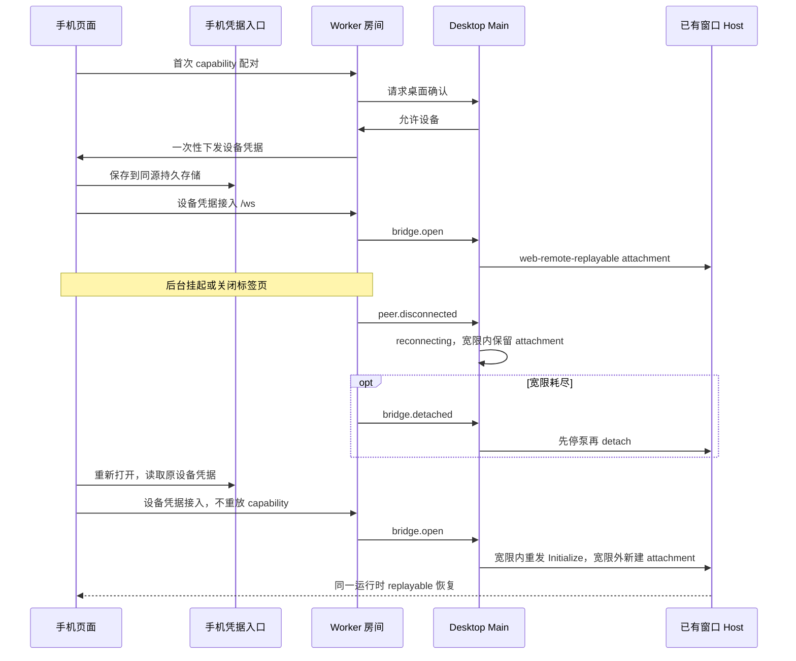

# 手机远控后台恢复与关闭页面后重连

## 产品规则

- 用户已选择记住已授权设备。首次配对仍需桌面确认，一次性 capability 仍 consume-once；成功后手机同源持久保存设备凭据，关闭标签页或浏览器后重新打开同一房间链接先用设备凭据连接。
- `pairingCredentialStore` 是手机凭据唯一读写入口；版本化 localStorage 键为 `lcode:remote-pairing:device:v1`，仅保存 roomId、deviceId、deviceCredential、grantedAt。旧 lcode/zcode sessionStorage 记录迁移后移除；持久存储不可用时降级到当前标签页的 sessionStorage，不伪称能够跨关闭恢复。凭据不得写入日志、示例、HTTP fragment 之外的页面地址或构建产物。
- 设备授权由桌面设备表与 Worker 哈希校验决定。网络闪断、心跳超时、busy、房间缺失/过期/作废与停止不等于设备撤销，不删除有效凭据；明确设备鉴权失败或吊销时清理对应记录及旧键，迟到失败不得清除新配对结果。
- 已授权设备重连的网络/房间错误不能退回已使用的 capability。只有设备鉴权失败、链接指向不同房间且提供 capability 时允许完整新配对；同房间已配对的旧链接不得重放。
- 未接管的建桥超时仍归当前配对页处理，不调用已接管镜像的整页重连监督者；连接已接管后才可刷新恢复，避免两个重试所有者互相打断。
- Main 是桌面连接状态唯一所有者。手机断连进入 `reconnecting`，不是配对失败；宽限内保留 attachment 并重发 Initialize，宽限外先停泵再 detach，之后已授权设备可建立新的 attachment。房间仍存活，镜像 target、owner/lease、workspaceIdentity 与 remoteSessionId 不变。
- Worker 已桥接房间的 room.ready.expiresAt=null 表示没有配对 TTL；Main 与共享运行时校验必须接受该既有语义，不能恢复已消费的二维码。`reconnecting` 不显示二维码，不自动新建房间。
- Desktop continuous 与手机 web-remote-replayable 继续使用已有 Host；此修复不另起 Agent，不放宽吊销、单房间桥槽或一次性链接校验。
- 本阶段只修复和验证；不推送桌面 tag、不推送 Worker 仓库或部署。后续发布前从修复后的源码重新构建手机资源，并分别发布桌面与 Worker。

## 所有者与事件顺序

存储仅拒绝写入时，当前标签页的版本化 sessionStorage 降级记录优先，不在读取时反向覆盖其它标签页的持久授权。清理时逐个载体比较房间和凭据；明确设备吊销则退休所有匹配凭据的副本，迟到失败不能清除其它房间的新恢复结果。

## 验收场景

1. 手机授权后关闭页面，在同一浏览器同源重新打开原链接，免二次确认恢复；旧 sessionStorage 可迁移，存储损坏/拒绝访问不崩溃。
2. 后台断线与超过宽限的重连均成功；Main 展示等待重连，不出现 BRIDGE_DETACHED 配对错误；不会停止房间或复用已 detach 的 port。
3. busy/网络重试耗尽与房间终态只显示对应原因，不请求 /ws/pair；设备凭据仍可用于后续有效房间。
4. 新房间允许已授权设备重连；凭据不被识别且具有新 capability 时仍可完成桌面确认。
5. 吊销后无法连接并清理持久及旧键；旧记录不能复活。旧连接失败不能清除新设备记录；停止房间不会擅自撤销设备授权。
6. room.ready.expiresAt=null 及 reconnecting 的状态快照通过严格校验，界面不显示已消费二维码；stale room/device 事件不能拆新桥。
7. 实际执行 Node 回归、桌面控制器回归、浏览器关闭/重新打开与失败分支 E2E、类型检查、Lint 和架构检查；真机后台杀进程与生产 Workers 部署未执行时明确报告。

## 本地验证（2026-10-08）

- 33 个 Web 纯逻辑回归、40 个 Desktop 控制器/隧道/界面回归、11 个浏览器测试均通过。
  浏览器测试运行真实配对组件与 WebSocket 客户端，仅模拟 Worker 网络边界，覆盖窄/宽屏
  关闭重开、心跳断线、busy 截止、撤销、停止后跨房间恢复和建桥超时。
- 根 `pnpm typecheck`、`pnpm lint`、changed 架构检查通过；Worker 类型检查及 27 个测试通过。
  根类型检查不包含 Desktop Main 的完整工程；额外检查与未修改基线对比为 94 → 85 个
  既有错误，无新增错误，不能描述为 Main 全量检查通过。
- `pnpm build:mobile-web` 与 Desktop `build:no-runtime-assets` 通过；本地 Worker public
  已更新为当前源码。两份任务外文件的 SHA-256 保持一致。
- 尚未在真机验证系统杀后台进程，也未部署 Worker 或发布新桌面安装包；本地构建产物不代表线上已更新。
