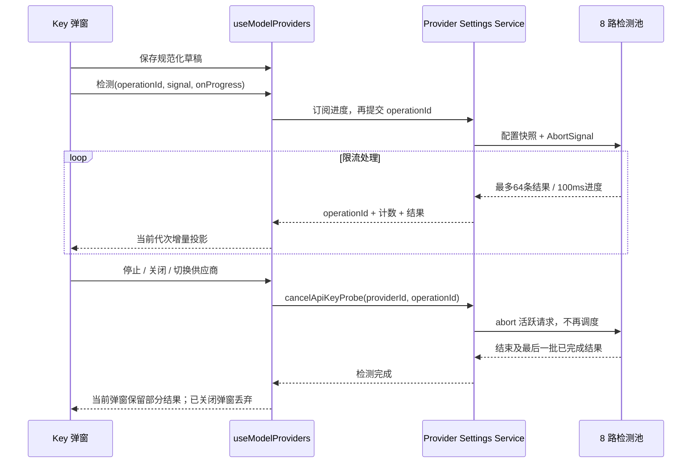
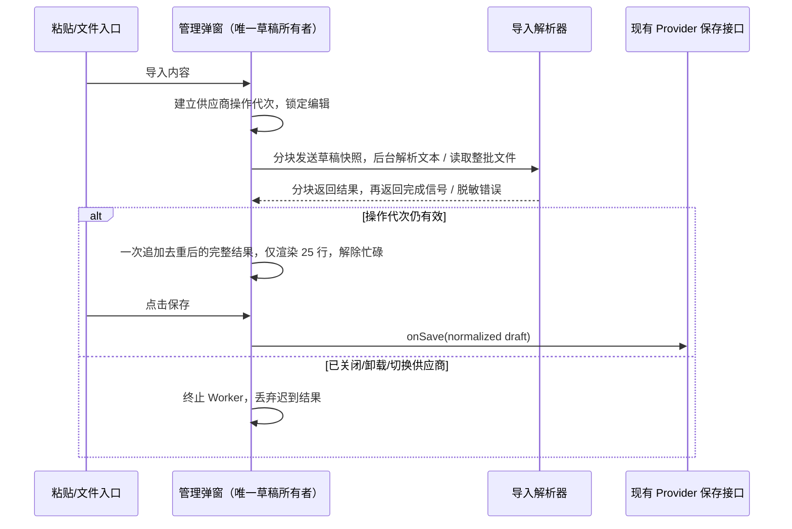

# 供应商 API Key 批量导入

## 产品规则

1. 设置 → 模型设置 → 管理 API Key 保留单条添加，并新增可展开的「批量导入」区域。用户可粘贴文本后点击「导入到列表」，选择文件，或把文件拖到管理弹窗内。
2. 三个入口复用同一解析器，自动识别纯文本和 JSON，不依赖 Key 前缀或文件扩展名。纯文本按空白（空格、Tab、回车/换行）、英文/中文逗号、英文/中文分号、顿号和竖线分隔；忽略空条目和 BOM，并支持单条 Key 外层引号。
3. JSON 支持字符串、字符串数组、对象及对象数组。Key 字段支持 `apiKey`、`api_key`、`key`、`token`；名称支持 `label` 或 `name`，启停使用布尔 `enabled`，默认启用。支持 `apiKeys`、`api_keys`、`keys`、`data`、`items`、`access`、`config` 包装，仅读取这些明确字段，不把名称、URL 或其他元数据当作 Key。同一对象同时包含多 Key 列表和兼容 `apiKey` 时，优先使用列表，避免只导入主 Key。JSON Key 字段是单条不透明字符串，不再次按分隔符拆分。
4. 去除 Key 首尾空白后，按大小写敏感的完整值与现有草稿及本批次去重。保留现有条目、草稿空行及状态；新条目按输入顺序追加。重复项不改变已有名称或启停状态，显示本次新增和跳过重复的数量。
5. 导入的外部 ID 不进入配置；每条新增记录生成独立 ID，单条新增与导入复用同一生成器，在局域网 HTTP 与 HTTPS/桌面环境均可用。ID 仅用于本地列表身份，不是密钥材料。没有名称的条目沿用 `API Key N` 默认命名。
6. 导入只更新当前弹窗草稿，保存仍复用现有 `onSave` → Provider Settings Service 个人覆盖层路径。取消丢弃尚未保存的导入；并发检测仍遵循原有先保存再检测语义。
7. 选择或拖拽可导入多个文本/JSON 文件，按文件顺序解析；一个文件失败则整批不更新草稿。支持一次导入十万及更多 Key，单批文本/文件总量上限为 128 MiB。空输入、无可识别 Key、损坏 JSON、无效 JSON 记录、二进制内容、超限和读取失败都有本地化提示。错误文案不得包含 Key 或解析器原始错误。
8. 导入、保存、探测互斥；文件读取过程中禁用编辑。关闭、卸载或切换供应商后，迟到读取结果失效。成功粘贴导入后清空粘贴内容；关闭或切换供应商后清除导入区域、反馈和敏感输入。选择同一文件可以再次触发读取。
9. Desktop 与手机 Web 复用浏览器 `File` / `input[type=file]`，不读取绝对文件路径，不新增 Native/Host/远端协议。手机支持粘贴和系统文件选择，桌面支持拖拽；弹窗在小屏可滚动，控件遵循主题、字号和中英文翻译规范。
10. 解析、JSON 校验、去重及保存前规范化在临时 Web Worker 中执行。草稿快照与结果每次最多搬运 2,000 条，主线程在块间让出事件循环；Worker 不拥有已接受的草稿，操作结束立即终止。Worker 不可用时提示失败，不回退到主线程同步处理十万条。
11. 超过 65,536 个字符的大段粘贴在 paste 事件中直接交给后台导入，不把巨量文本插入 textarea；同时提供「从剪贴板导入」一键入口。小文本仍可编辑后点击导入。剪贴板权限失败提示改用粘贴或文件，不泄露内容。
12. 列表固定每页 25 条，显示总条数、当前页和总页数，支持首页、上一页、下一页、末页及输入页码跳转；任意规模仅渲染当前页。新增跳到新增条目所在页，批量导入停留在首个新增条目所在页。删除后页码立即收敛到有效范围，空列表显示第 1/1 页。页码仅为弹窗展示状态，保存仍写入完整草稿。
13. 「删除全部」立即清空完整草稿及检测结果，不只删除当前页。「删除无效 Key」删除所有页中本次弹窗检测明确标记 `invalid`（401/403）的条目；未检测、有效、网络异常和手动禁用的 Key 保留。修改 Key 值后该 Key 的旧检测结果失效。没有可删除项时禁用操作。两项删除只修改草稿，保存后生效，取消可放弃。
14. 大导入与检测期间允许取消关闭；导入终止 Worker，检测通过操作 ID 取消活跃请求与后续调度，已接受保存保持原有提交语义。全部操作使用同一供应商代次，不通过定时延迟判断完成或同步状态。

## L-GO 集成边界

- 合并到已完成品牌迁移的 `L-GO` 时，组件与测试使用当前 `@lcode/provider`、`@lcode/services` 的公开入口及 `useLCodeIntl` 国际化接口，不恢复已移除的旧包名或兼容别名。
- 保留目标分支的模型同步、失效模型清理、配置保存代次及服务队列规则；本次仅扩展 API Key 弹窗草稿操作，沿现有保存与检测接口提交。
- 在干净的目标分支工作树重新执行类型、Lint、架构及导入/分页回归，并用实际弹窗验证浏览器交互与大批量处理。

## 状态所有者与接口

### 大列表检测修复

- 检测保留先保存规范化草稿的路径；服务一次读取配置快照，最多 8 路请求，单条请求 15 秒超时。禁止按十万条 Key 创建同数量的请求或 Promise。
- 服务拥有一次检测的 AbortController 和请求队列；UI 只拥有操作 ID、已完成结果和展示进度。进度事件按最多 64 条结果或每 100ms 分块发送，不传凭据，不在 RPC 返回中再次搬运全量结果。
- UI 显示已完成/总数、有效/无效/失败数量；检测中允许翻页、查看 Key、停止和关闭。编辑、导入、删除及保存与检测互斥。停止保留已经收到的结果，未检测项保持原状态；只有已确认 401/403 的 Key 自动禁用。关闭/切换供应商取消请求并废弃迟到事件；已接受的初始保存正常完成。
- 结果表和 invalid 集合由 hook 的当前操作增量更新，不为每个结果复制十万项。检测完成或停止后，后台 Worker 一次应用无效状态，再通过现有保存接口提交；关闭后不发起新的保存。分页始终仅渲染 25 行。
- 回归覆盖十万条时并发上限、慢请求超时、停止不再调度、取消真实 fetch、部分结果保留、空/禁用 Key、关闭/切换供应商丢弃结果，以及检测中分页和手机布局。
- Provider Runtime 释放时主动 abort 其 Service 拥有的检测池，不等待超时，也不留检测队列拖住退出。Desktop 既有退出预算不增加。

### 大配置启动与设置性能

- Personal Provider Repository 是配置快照缓存唯一所有者。异步 stat 同时检查正式文件与保存代次 sidecar 的 dev/ino/size/mtimeNs/ctimeNs；内容未变化时复用上次已校验快照，不每秒重读、JSON 解析、Zod 校验或全量 hash。前后文件签名不一致的读取不进入缓存；坏文件、外部原子替换、删除/恢复及 sidecar 变化维持原语义。
- 并发初始 read 复用同一在途读取；写操作仍使用原文件锁与原子写入，不能以缓存覆盖外部更新。dispose 清理缓存引用。
- Settings 表单投影共享只读配置字段，显式编辑继续通过对象补丁生成新值；不为每次权威 View 更新深拷贝两份十万 Key。未打开 Key 弹窗不复制 Key 草稿；Key 总数/启用数仅在列表引用变化时计算。
- 使用隔离的十万条合成配置验证重复读取/轮询无全量解析、外部变更正确通知、启动并发读取收敛、设置投影不遍历 Key；不修改真实用户配置。

- `ProviderApiKeyManagerDialog` 的 `useProviderApiKeyManager` 是 Key 草稿、分页、忙碌状态、错误、检测结果和本次导入统计的唯一所有者。
- `ProviderApiKeyImportPanel` 只拥有未提交的粘贴文本，通过 `onImportText` / `onImportFiles` 交给父弹窗处理，不拥有已接受的 Key 列表。
- `providerApiKeyImport` 负责纯解析、读取用户选择的文件以及与草稿合并；`providerApiKeyImportWorkerClient` 只管理一次性 Worker 与块传输，Worker 持有操作快照，不拥有业务状态，没有持久化或服务调用。
- 文件读取复用 `createProviderApiKeyOperationGuard` 的 scope + generation；现有 Provider 保存与个人覆盖层合并接口保持不变。

## 事件顺序

## 验收与 E2E 场景

- 粘贴混合空格、换行、Tab、`;`、`；`、`,`、`，` 分隔文本，一次导入多条；列表默认隐藏 Key，保存一次写入完整列表。
- 粘贴 JSON 字符串数组、含名称/禁用状态的对象数组及 `access.apiKeys` 包装；额外元数据不会进入 Key 列表。
- 导入与已有条目或本批次重复的 Key，反馈新增/重复数量，已有禁用条目不会被启用；外部重复 ID 不造成 React 行复用。
- 通过系统选择导入文本文件，再选择同一文件，第二次统计为重复；拖拽 JSON 文件到弹窗，同样导入并保留名称/禁用状态。
- 拖拽多个文件，其中任一文件损坏，全部不写入草稿，提示不暴露文件内容。改正后重试成功。
- 空输入、无 Key 的 JSON、数字/无效记录、损坏 JSON、二进制文件和超限内容报错，不改变已存在条目。
- 导入后取消并重新打开，看到保存前列表；导入后保存再重新打开，看到导入后的列表。
- A 文件读取中切换到 B，B 没有 A 的新增条目或反馈；关闭/卸载后的迟到结果同样被丢弃。
- 375px 手机视口可粘贴、选择文件并访问底部保存/取消按钮；中英文与浅色/深色主题可读。
- 一次导入 100,000 条文本 Key、120,000 条 JSON Key，以及重复 100,000 条：数量/顺序/去重正确，DOM Key 行数不超过 25；导入期间主线程持续响应，记录 Long Task 与浏览器耗时，不仅运行纯函数基准。
- 一键读取剪贴板或粘贴 100,000+ Key 时 textarea 不出现巨量内容，后台导入完成后可跳末页及输入页码；翻页不重新解析或遍历全部 Key。
- 在第二页删除全部，所有页全部清空；检测返回 invalid/valid/error 混合结果，删除无效只移除 invalid，手动禁用和网络异常均保留。删除最后一页的最后一项后页码有效。

## 验证入口

- 纯函数、分页、Worker 传输和文件读取回归：`pnpm exec tsx --tsconfig packages/ui/tsconfig.json --test packages/ui/src/settings/model-provider-section/providerApiKeyImport.test.ts packages/ui/src/settings/model-provider-section/providerApiKeyImportWorkerClient.test.ts packages/ui/src/settings/model-provider-section/providerApiKeyList.test.ts packages/ui/src/settings/model-provider-section/providerApiKeys.test.ts packages/ui/src/settings/model-provider-section/ProviderDraftSave.test.ts`。
- E2E 使用实际 `ProviderApiKeyManagerDialog` 与浏览器文件事件，保存接口使用隔离内存桩，不向真实供应商发送凭据或检测请求。

## 2026-10-02 验证结果

- 改动归属共享 `ui` 模块，无新增跨包依赖；16 个文件，新增 1,593 行、删除 214 行、净新增 1,379 行（含规范与测试）。Node 24.14.0；28 个回归测试通过；根目录 `pnpm typecheck`、`pnpm lint`、`pnpm architecture:check --changed` 通过，架构 baseline / new 均为 0。改动文件格式检查通过。
- 实际弹窗的 Vite 生产构建成功，11 个浏览器交互场景通过，覆盖粘贴、文件选择、重复选同一文件、拖拽、整批失败、保存/取消、Worker 取消和供应商隔离、中英文及 375px 手机布局。
- 大列表场景另验证了末页单行删除后页码收敛、220,000 条完整保存（内存桩接收全量而非当前页）、全部删除后取消还原，以及跨页删除 invalid 保留 error / 手动禁用、编辑凭据后废弃旧 invalid 检测。
- 以下为本机 Chromium 上的生产构建测试耗时，含浏览器自动化调度，不是跨设备性能保证。合计 220,001 条时最多渲染 25 行；这些操作均未观测到超过 50ms 的主线程 Long Task。保存接口与剪贴板接口使用隔离桩，实际 Host/RPC 持久化和系统剪贴板权限耗时不在此表内。

| 场景                              |  耗时 | 最大帧间隔 | DOM Key 行数 |
| --------------------------------- | ----: | ---------: | -----------: |
| 文件导入 100,000 条文本 Key       | 417ms |       17ms |           25 |
| 再次导入相同 100,000 条并去重     | 382ms |       13ms |           25 |
| 直接粘贴 120,000 条 JSON 记录     | 560ms |       17ms |           25 |
| 一键剪贴板导入 100,000 条重复 Key | 412ms |       13ms |           25 |
| 220,001 条列表跳末页              | 168ms |        4ms |            1 |
| 跳转第 4,000 页                   | 180ms |        8ms |           25 |
| 修改 220,001 条草稿中的一行       | 132ms |        4ms |           25 |
| 清空 8,800 页中的 220,000 条      | 205ms |        6ms |            0 |

## L-GO 合并验证（2026-10-02）

- 在 `L-GO` 的干净隔离工作树中适配 LCode 公开包入口与国际化接口，并保留目标分支现有模型设置规范。根 `pnpm typecheck`、`pnpm verify:pre-push`（Lint / 架构）通过，架构 baseline / new 均为 0；28 项定向回归、13 个任务独占源码/规范文件的格式检查通过。
- 实际弹窗的 Vite 生产构建与 11 项浏览器交互场景通过；另验证全量 220,000 条保存、末页删除后收敛、跨页仅删除明确 invalid、编辑凭据清除旧检测、删除全部后取消恢复。保存、检测与剪贴板使用隔离桩。
- 本机 Chromium 集成复测：100,000 条文件导入 514ms、重复去重 376ms、120,000 条 JSON 大粘贴 555ms、一键剪贴板导入 415ms；220,001 条时最多 25 行 DOM，以上操作未观测到超过 50ms 的主线程 Long Task。测量含自动化调度，实际 Host/RPC 持久化和系统剪贴板权限耗时未覆盖。

## 十万 Key 并发检测与配置卡顿修复验证（2026-10-02）

- 原实现为每条 Key 同时建立请求，没有超时或取消，并在全部完成前锁定分页及关闭。现在由 8 个消费者调度，单请求 15 秒超时，每批最多 64 个结果；停止、关闭、供应商切换和 Runtime 释放都取消活跃请求。进度只发送当前批次，UI 增量记录结果，流式调用不再次通过 RPC 返回全量结果。
- 未变更个人配置及保存代次文件通过文件身份缓存已校验快照；并发冷读取合并。外部替换、删除、无效文件恢复和相同内容重新保存的代次变化仍可观察。设置投影共享只读配置；端点编辑不再序列化全部 Key，关闭的管理弹窗不创建大草稿，当前页行组件复用。
- Node 24.14.0 下 51 项定向回归通过，覆盖导入、Worker、分页、保存、检测池、真实 HTTP 请求取消、配置缓存、外部轮询变化、配置迁移、连通性以及十万 Key Runtime 生命周期。根 `pnpm typecheck`、`pnpm lint`、`pnpm architecture:check --changed` 通过，架构 baseline / new 均为 0。
- 额外 Web 全量并行运行时 Git 发布与工作流场景各发生一次超时；这两个文件单独串行复测，32 项场景通过。该复测不代表全量并行套件通过。
- `packages/web/test/api-key-probe.test.mjs` 使用实际弹窗、Hook、Service、检测池和 fetch，本地网络拦截只返回合成响应。验证十万 Key 最多 8 个活跃请求、检测期间翻页、停止、关闭、切换、卸载；完整与部分 valid/invalid/error、跨页删除明确 invalid，以及 375px 关闭入口。开发构建定向运行通过；生产构建的同组场景通过，稳定检测期间翻页/停止没有观测到超过 50ms 的 Long Task（开发构建观测到 112ms）。保存接口为内存桩，实际 IPC 与持久化开销不在浏览器测量内。
- 下表对比同机、同一份 100,000 条合成 Key、37.57MB 配置，旧版为 `301f8c4` 源码，非真实用户数据。读取平均分别为 5 次旧实现和 20 次缓存命中；投影分别为 5 次旧实现和 100 次当前实现。

| 场景               | 修复前平均 | 修复后平均 |
| ------------------ | ---------: | ---------: |
| 未变更配置重复读取 |      299ms |    0.117ms |
| Settings 表单投影  |      245ms |    0.005ms |

- 合成 Provider Runtime 单独验证冷启动约 461ms，检测中 dispose 至请求结束约 5ms；随后创建新 Runtime 并加载同一配置成功，文件字节不变。并行回归负载下分别为 621ms / 7ms。这验证 Provider 生命周期，未验证安装版完整 Electron 启动和退出。
- 安装版只读排查发现配置约 37MB、最大列表 100,926 条 Key，渲染进程超过 3GB。最近退出日志约 4 秒完成清理；“关闭后打不开”完整场景尚未复现。此次没有修改真实用户配置或替换安装程序，源码合并后需要重新构建/更新安装版才能生效。

检测回归入口：`pnpm exec tsx --test packages/services/src/model-provider/providerApiKeyProbe.test.ts packages/services/src/model-provider/providerCatalogClient.test.ts packages/services/src/model-provider/providerSettingsApiKeyProbe.test.ts packages/services/src/model-provider/providerRuntimeLargeKeys.test.ts packages/provider-node/src/providerConfigSnapshotCache.test.ts`；浏览器入口：`pnpm --dir packages/web exec node --test test/api-key-probe.test.mjs`（可用 `LCODE_TEST_BROWSER_PATH` 指定本机浏览器）。

## 启动与模型删除的 RPC 大列表修复（2026-10-02）

- 安装版 `ac31bd72` 的 Host/数据库已就绪后，Renderer 仍反复接收并解析整份 Key 列表。Settings 的多层配置、模型选择、刷新响应和每次模型删除通知都携带大列表，缓存磁盘读取未消除这段开销。
- Settings Service 超过 250 条的列表现在只传数量、启用数量及 `apiKeysOmitted` 标记；模型选择只保留一个有效主 Key 及选择配置。执行 Registry 与磁盘仍保存完整列表。打开管理窗口才通过 `getApiKeysJson` 读取 JSON 文本，在 Worker 解析并按 2,000 条分块接收。加载可取消、关闭，失败禁止保存空草稿。
- 完整 Electron 复测还定位到通信层先对二进制消息执行 `Object.keys`，枚举数千万字节索引，单次阻塞 Renderer 约 1.4s。现在先辨识流控标记及状态，仅对合法流控对象检查字段数量；MessagePort 和远程帧泵保持原有非法消息校验。32MiB 二进制回归禁止枚举索引，流控、额外字段和非法状态校验均通过。
- 摘要表单保存显式请求保留现有个人 Key；Facade 在该供应商操作队列中读取当前事实，既保留完整列表，也避免旧主 Key 恢复已经清空的列表。显式提交空数组仍可删除全部。已冻结的内部列表在 Overlay 组合时复用，外部可变输入仍防御复制。
- 100,000 条合成 Key 的真实 RPC 编解码回归：Settings 响应约 52.4MB → 39.9KB，串行测量约 1,228ms → 2.54ms；模型删除约 832ms。响应、变更通知和模型选择均有体积上界断言，验证修改地址、删除模型不丢 Key，以及旧摘要不能恢复已删除凭据。
- 隔离 Electron、独立临时数据、同一配套 Agent 下，安装版代码的首次启动画面等待约 27.4s，修改后的代码约 5.3s（首次欢迎页场景）。配置工作方向后另测主工作区约 6.8s 可操作。完整 Desktop 生产构建通过；这些合成测量不代表所有用户机器的启动时间，正式安装程序未被替换。
- 最新完整 Desktop 复测十万 Key：工作区约 6.6s 可操作、模型设置约 7.3s 就绪。连续删除三个模型在后台约 4.7s 完成，期间仍能在约 144ms 打开管理窗口并关闭；随后读取完整列表约 679ms，最多 25 行 DOM，末页为第 4,000 页，磁盘仍保留 100,000 条。该交互段记录到 64ms 和 51ms Long Task，未再出现通信层约 1.4s 的阻塞。
- 实际浏览器验证延迟读取期间关闭、迟到结果丢弃、十万条 ID/标签/禁用状态保留、末页分页和加载失败禁止保存；并发检测回归继续通过。开发构建检测翻页/停止曾观察到 83ms Long Task，未声称全部操作零长任务。

新增回归入口：`packages/services/src/model-provider/providerSettingsLargeKeys.test.ts` 与 `packages/web/test/api-key-probe.test.mjs`。
