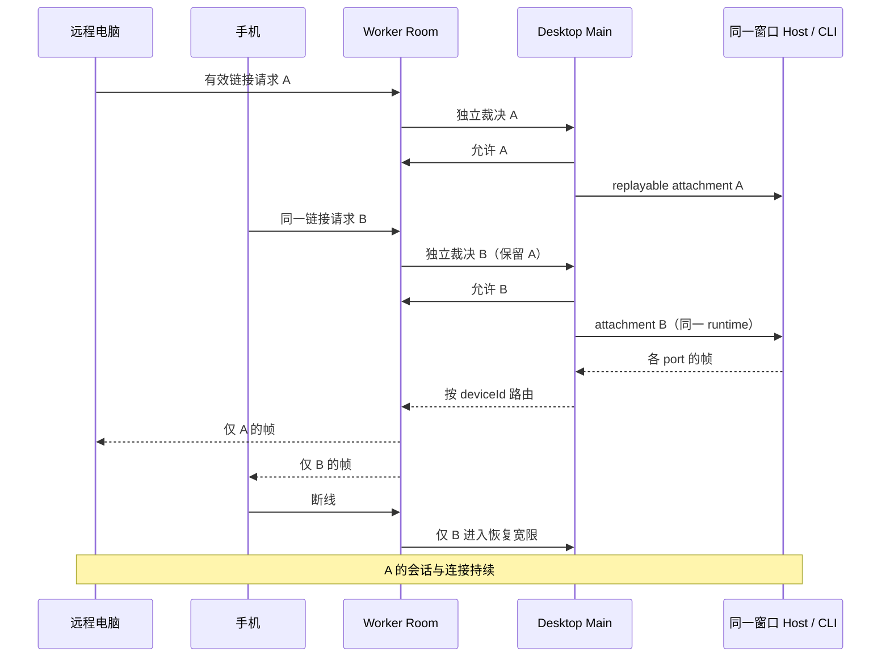

# 同一工作区的多设备远程控制

## 产品规则与所有者

- 一个房间绑定一个既有窗口 Host 和 mirror target，电脑浏览器、手机等设备可同时连接。
  每台新设备分别在桌面允许或拒绝；已授权设备继续凭记住的凭据恢复。
- 多设备链接在有效期内可产生多个独立请求，不在第一次请求时全局消费。链接到期仅
  阻止新请求，已连接设备和已提交的 120 秒裁决窗口保留；重复裁决只生效一次。
- 刷新二维码轮换 capability 和截止时间，保留房间与既有连接。切换 target、停止远控
  或禁用配置才关闭全部。拒绝、超时和“禁止新设备”不重建房间。
- 每设备拥有独立桥、socket generation、心跳、60 秒恢复宽限、帧泵、内存 transport
  缓冲和 Host attachment。断线、撤销、协议错误或初始化失败只影响该设备。同一设备
  凭据仍最多一条在线数据连接。旧 socket/port/房间回调不能拆新连接。
- 保留 64 台设备、1 MiB payload、64 KiB 控制帧上限和鉴权规则。活桥凭据不能被挤出，
  活桥满额时拒绝新增授权。保持 workspaceIdentity fallback、remoteSessionId 和 owner/lease。

| 所有者 | 权威状态 | 接口/投影 |
| --- | --- | --- |
| Worker Room | 鉴权、join deadline、独立请求、每设备 bridge/generation/心跳/宽限 | 既有配对/桥接事件，新增能力协商和指定设备帧路由 |
| Desktop Main controller | mirror target、每设备 attachment/帧泵、裁决投影 | IPlatformService 与 remotePairingStatePush |
| Desktop credential store | 配置、设备哈希表 | 串行原子 updateDevices，读取等待已提交写入 |
| 浏览器凭据入口 | 同源设备凭据 | 既有 localStorage v1 与 session fallback |
| Host / CLI runtime | 会话、队列、快照、replay、owner/lease | 各设备 web-remote-replayable attachment，共用同一 runtime |
| React hook/面板 | Main 状态的派生视图及按钮等待态 | start 结果不能覆盖更新的 Main 事件 |

Worker/Main 不增加任务业务状态，远程电脑浏览器也使用 replayable；桌面 Renderer 的
desktop-continuous 不变，不另建 Agent、Local Host 或远程会话。

## 协议与兼容

- 保留 proto:1，新 Main 在 room.create 请求 multiDevice:true，新 Worker 仅向协商房间
  回显该字段。未协商的旧房间保留单桥和一次性链接，旧的已消费链接不复活。新桌面
  遇到旧 Worker 保留单设备兼容行为，并如实展示服务尚未支持多设备。
- 多设备 Host↔Worker BINARY 信封：ASCII LCRM、version 字节 1、两字节大端 deviceId
  UTF-8 长度、1–256 字节 deviceId、原 SocketProtocol 帧。严格检查 magic/version/
  长度/UTF-8/控制字符与 payload 上限。Device↔Worker 仍用原帧，Worker 根据已鉴权
  socket 包装上行，不能接受客户端伪造收件人。两仓库 codec 用相同协议向量验证。
- Main 按 deviceId 选 port，Worker 按 deviceId/generation 选 socket；RPC 响应和
  Initialize 不广播给其他设备。每设备内存缓冲最多 32 帧/256 KiB，不持久化业务帧。
- 多设备 bridge.open 可带 connected/deviceName，区分待数据接入与在线。数据接入时
  幂等补发 bridge.open，Main 复用 port 并重发 Initialize，避免依赖 Worker 缓冲跨休眠存活。
- pairing.refresh 按 capHash 幂等更新，重复 room.create 不延长同一链接 TTL。
  bridge.close 仅关闭指定 transport；device.revoke 移除指定授权；room.stop 才关闭全部。

## 前端

- 快捷入口、弹框和设置统一“远程控制”；扫码标题“远程扫码连接”；引导为
  “用远程相机扫码，即可打开工作区。”。中英文其余手机专属提示统一为远程设备。
- 连接列表、独立待授权卡片、仍有效的共享二维码可同时展示；显示各设备在线/恢复状态。
  请求 B 不能覆盖 A 的连接或移除有效链接。内部 mobile-remote 文件/模式名保留。

## 验收与证据

1. 同一链接先电脑、再手机独立允许，二者同时在线；并发请求不覆盖，拒绝/超时只结束对应请求。
2. 重叠 RPC requestId、Initialize 和响应隔离；错误帧、未知设备、陈旧 generation 不串桥。
3. B 宽限内/外重连、撤销、初始化失败不影响 A；不新增 Host/Agent，重复 bridge.open 幂等。
4. 刷新链接不拆桥，旧 cap 失效；链接到期不拆桥，已提交请求仍按自己的截止裁决。
5. 并发授权/lastSeen/撤销不丢设备表；满额保留活桥；禁新设备和停房间遵守独立/全局边界。
6. legacy Desktop/Worker 互操作，本地/远程 identity/remoteSessionId、owner/lease 与两种 delivery 不变。
7. 窄/宽屏真实浏览器 E2E 验证文案、多人待授权和共享二维码；执行 Worker 网络状态机回归。
8. 执行根类型（含 Main）、Lint、架构、发行契约和独立 Worker 类型检查，重建 Web/桌面产物；
   两份任务外本地文件保持原 hash。未执行场景不声称通过。

根新增 pnpm test:remote-control，运行共享 codec、Main controller/tunnel/frame pump、
UI 请求卡与 Web 凭据/控制帧回归，并在 tag Actions 的源码检查阶段执行。独立 Worker
使用 npm ci、npm test、npm run typecheck 和 npm audit，包含实际 workerd 场景。
多设备实现由 Room 将协商房间委派给 MultiDeviceRoom；两模式共用一个 storage key，
互斥持有权威状态。单设备反压和 Host 断连以1013触发 replayable 传输恢复。

旧 consume-once 规则仅适用于未协商 multiDevice 的兼容房间；新协商规则以本文与
PROTOCOL.md 多设备条款为准。功能图保持已有 node ID，补充一对多/远程设备别名。

## 已执行验证（2026-10-08）

- 根 test:remote-control：75/75，包含独立授权/帧路由/并发落盘、初始化失败隔离与旧 socket 防护，以及在线时过期链接刷新。
- 浏览器：13/13，包含390px/1280px多请求裁决、有效二维码、刷新和原设备恢复。
- Worker：34/34，包含真正 workerd、多设备网络路由、到期裁决、Host恢复、活桥满额与legacy对照。
- 根 typecheck（含 Desktop Main）与 lint 通过；架构新增/基线违规均0。
- 发行契约43/43通过；Worker typecheck通过、npm audit漏洞0。
- 两份任务外本地文件 SHA-256 与任务开始前一致。
