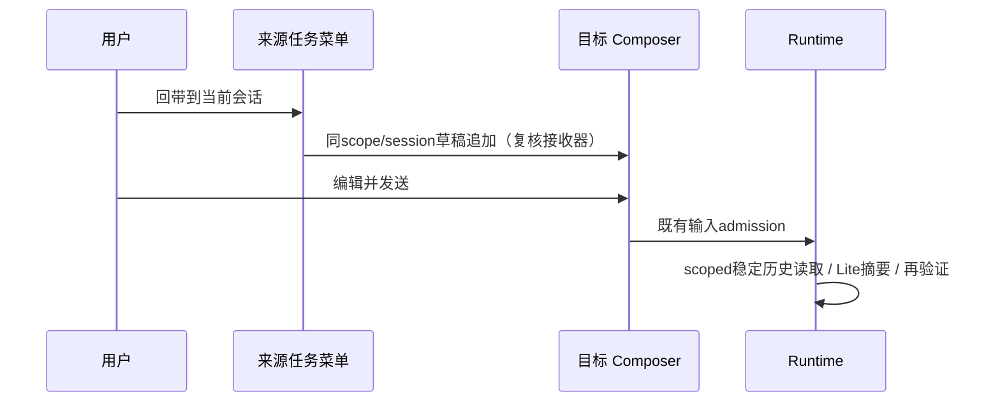
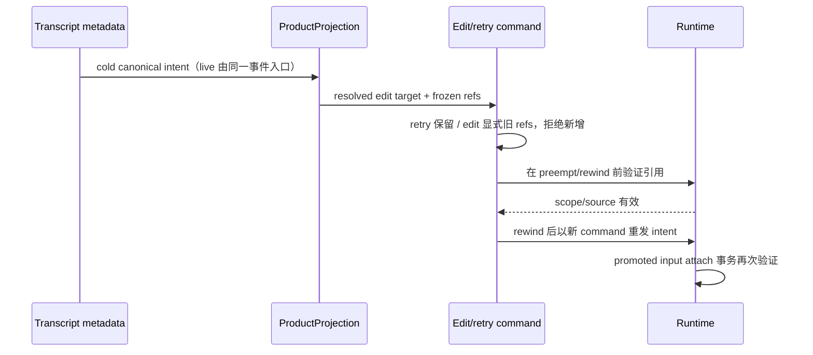

# 分支结果回带与持久上下文

- 状态：实施契约，2026-10-10。
- 范围：同 workspace scope 的稳定完成历史；跨 identity 导入、队列/Goal/权限转移不在范围。

## H0 UI 草稿入口

既有任务分叉菜单旁增加“回带到当前会话”。来源为菜单所属任务，目标为该 scope 当前已打开的另一会话。仅在目标 Composer 已挂载、可编辑且接收器仍属于同一 scope/session 时可点击；当前会话就是来源、没有目标、跨 identity 或只读时禁用。右键打开来源任务不导航、不创建新会话。

UI 复用现有 Composer 外部草稿接收器，仅追加 `#sess_*` 引用和 handoff 读取请求，保留已有输入、附件、模型。点击本身不调用模型、不提交命令、不复制文件。用户编辑并发送后沿现有 CommandInbox admission 处理。Desktop 与 Web 使用同一组件，窄屏可在已有更多菜单操作。

验收：保留已有草稿；点击不发RPC/模型；同路径不同identity隔离；切换/卸载接收器后旧菜单不误写；自引用禁用；桌面右键及390px更多菜单可操作；发送和重连沿既有continuous/replayable语义。

## H0/H1 后端边界

来源必须只包含 active branch 上已完成稳定边界，摘要后再次验证 scope、rewind边界与来源版本。忙碌尾部不进入摘要；取消或来源过期不返回旧分支内容。

ContextCapsule 是独立的附加上下文关联，不复用 shareURL/shared_context 首条唯一假设。生成与附加分开；附加需目标owner/lease、source boundary/hash有效，按targetSession+operation幂等事务提交。模型接收有界背景，不把来源文件/验收证据当作目标目录现状。后续读取/注入仍核验来源，不暴露rewind后废弃历史。

### 稳定读取实现规则

- 仅 `strategy=handoff` 使用已完成稳定 prefix，现有 relevant 查询含义不变。首选 Runtime 已保存的 completed boundary anchor；兼容历史要求 assistant 已完成、无错误、无 pending/running tool，排除 tool-call 中间响应。不存在完成边界时返回空的有界上下文，不把真实用户输入单独称为已完成成果。
- 摘要引用冻结 prefix。Lite/fallback 后重新读取来源 metadata/messages，复核 scope、active branch、prefix 内容 hash；新增尾部不影响原 prefix，但 rewind/编辑/重绑导致冻结内容不再可见时返回 failed/not_found 且不携带旧摘要或 refs。取消不返回迟到结果。
- Runtime reader 与 capsule 事务使用同一公开纯 selector，按 compact preserved segment 与 rewind 规则重建可见历史；冻结 ID 必须与当前稳定可见前缀逐条同序。不能仅从 ID Map 挑出旧条目后忽略插入或重排的历史。
- hash 使用内容、ID、完成边界及 workspace/directory/path/revert；HEAD、时间戳、父子关系和执行绑定不是 scope 判据。来源与目标绑定不同但scope相同时只能传背景结论，不能迁移文件验收事实。

### H1 有界持久 capsule

- `ReadSessionContext` 新增显式 `persistCapsule`（只支持 handoff）与 `capsuleId`（读取已生成 capsule）。默认仍只读，不自动保存历史正文；capsule 仅生成于用户已经编辑并发送的 target real-user turn。
- `SessionStorePort.commitContextCapsule` 是唯一写入口；同事务验证来源有效 prefix/version 与当前目标 real-user message/turn、保存独立 `runtime/context_capsule` ledger、给目标 input/message 加 provenance 关联。幂等键为 target session + tool operationId；不同内容不能用同一 operation 覆盖已有结果。
- 记录 source session/workspace/directory/path、稳定 boundary与message refs、source/content hash、策略/版本、truncated、target session/message/turn/operationId。内容最多48KiB UTF8、每session64个capsule；新handoff source最多5000条消息/2MiB结构化内容，在拼接JSON和生成hash之前检查字节上限。超限明确不可用，不假装完整摘要；不保存权限、Goal或队列事实。没有accepted real-user输入、目标turn已过期或缺事务能力时不保存。
- 生成当轮通过既有 tool-result 返回 capsule，恢复沿原 tool history/media hydration。后续 typed refs 由 prepareTurnInput 注入独立 `context_capsule` 有界背景，下一轮准备时移除上一轮的临时背景，不清除 `shared_context`。读取 capsule 必须属于当前target session并再次验证source scope/prefix/hash；多个capsule不会触发share首次上下文唯一假设，也不创建隐藏的持久synthetic user指令。
- 持久内容是指定来源版本的背景材料。修改来源后旧capsule不可用，用户可重新生成；本版本不提供跨scope历史导入，也不静默采用被rewind废弃版本。
- sendText的 `context_refs` 支持至多4个独立capsule加1个share。admission前只读校验明显stale/越target引用，拒绝时保留草稿；ACK accepted后到执行之间来源仍可能变化，此时promoted输入按原失败投影收口，可由用户重试，不能声称尚未发送或自动恢复草稿。
- prepareTurnInput在真实用户消息/input原子promotion之后调用唯一attach事务；再次检查input状态、promotedMessageID、最新active realUser与turn及source版本。busy guide携capsule转入原queue（明确fallback原因），不在现有turn内丢弃或旁路注入。事务体使用DatabaseSync同步原语，无await/yield；旁挂异步普通写入不会混入事务。
- attach 的 capsule IDs 与 promoted input 已冻结的 typed refs 必须同序、完整一致；不能用调用级选项静默丢弃或新增已接纳背景。取消和 target/source 变化都在写入前拒绝。
- 冷恢复保留独立capsule ledger、typed refs和当轮tool结果；临时 `context_capsule` provider背景不会自动重建为全部历史。复用/重试必须重新读取有效capsule；已完成旧turn的临时背景不会隐式继续到新turn。fork保留历史typed引用为来源事实，但child不迁移parent专属ledger或改写其target；child读取/重试parent引用明确拒绝，可编辑删除引用或重新handoff生成child自己的capsule。

### H1 显式生成与复用界面

任务菜单另提供“回带并保存摘要”，仅追加明确保存意图的可编辑草稿，仍由用户发送接纳。工具返回可复制的 `#capsule_<32位小写hex>`。用户将引用独占一行放入目标 Composer 时，显示摘要引用提示，发送时从冻结的正文提取最多4个去重引用并转成 typed `context_refs`。围栏代码中的示例和行内普通文本不解释为引用；超限拒绝发送并保留草稿。引用正文和ID由现有草稿持久化，不再创建副本状态。新会话不接纳已有目标专属 capsule；admission前发现失败/来源过期时由原命令拒绝链保留输入，ACK accepted后的竞态失败按原失败输入投影收口。

浏览器验收覆盖：保存入口不发RPC；真实Composer发送typed refs；失败保留输入；桌面/390px；重复引用去重，代码块不注入，超过4个不发送。

2026-10-11 复核补充：摘要 marker 仅在未处于围栏的顶层独占行解析，最多允许 3 个前导空格；4 个空格或 tab 缩进的代码示例不接纳。围栏只能由同类、足够长度且后面仅有空白的行关闭，围栏内的 `~~~example` 等内容不能提前结束代码块。Composer 提示与发送都读取点击时冻结的原正文，不能先 trim 丢失缩进后新增引用；编辑重试共用同一规则。

### H1 历史恢复、重试与编辑

持久化的 `conversationInputIntent.contextCapsuleRefs` 是已获 admission 引用的唯一事实。冷恢复从 transcript metadata 还原到同一 canonical fact、投影内部 edit target；live 与 cold 路径使用相同 resolver。背景正文仍由 capsule 原关联和来源版本核验读取，投影不复制或推断背景内容。

- retry 完整保留原 typed refs，不从历史正文重新解析。重发前再次校验 capsule 是否属于当前目标且来源有效；失效时在历史截断之前拒绝。
- edit 只保留新正文中仍显式独占一行、且存在于原 admitted 集合的 capsule refs。删除引用行即移除背景；正文没有引用行时不能隐式恢复旧背景。围栏内、行内文字不解释为引用。
- 编辑新增不在原 admitted 集合中的 capsule marker，或超过4个引用，必须在 preempt/rewind 前明确拒绝，用户需另发新输入来 admission，不能显示引用却静默不注入。保留引用也必须在同一前置阶段验证；ACK/执行间来源变化仍由 Runtime attach 事务二次核验。
- Composer 与 edit handler 共用 shared 的有界纯解析器。edit 与普通 send 一样保留用户正文和引用行，typed refs 决定冻结背景关联；代码示例和普通文字原样保留。

验收：从真实 transcript 合成事件与 live TurnStarted 分别构建投影，解析用户 edit 与 assistant retry 目标，再经真实命令 handler 捕获重发 intent；两条路径 refs 一致。retry 保留全部原引用；edit 删除/保留/围栏引用分别清除/保留/忽略；新增或失效引用拒绝时不停止当前运行、不 rewind、不发新输入。

### 后端验收

稳定读取测试覆盖忙碌尾部、pending/running工具、Lite期间rewind、scope变化、只新增尾部；capsule事务测试覆盖两个独立摘要、重复operation、篡改内容、source版本变化、target新输入、回滚和scope隔离。工具测试确认默认无写入、明确保存关联accepted turn、取消不commit与旧capsule不泄漏。
