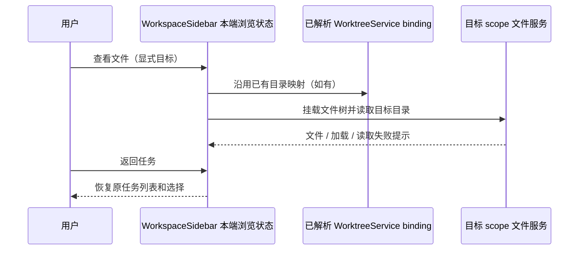

# 侧栏文件树不依赖当前会话恢复（2026-10-10）

## 产品规则与状态所有者

- 「查看文件」是显式目录浏览意图。只要侧栏已有文件目标，就挂载现有 WorkspaceFileTree；当前聊天会话执行目录 pending、读取失败或没有活动 runtime，不能阻止文件面板、加载/错误提示和「返回任务」入口出现。
- WorkspaceSidebar 继续唯一持有文件树打开态和目标；WorkspaceFileTree 通过 useWorkspaceServices 读取该目标的 fileService、fileWatcherService 和 gitService。文件读取失败沿用现有错误与刷新流程，不创建会话、不调用恢复会话、不修改任务选择。
- 保留 resolveWorktreeFileTarget 的已有映射：已解析的真实 WorktreeService binding 可以把同仓库目标映射到 checkout；外部目录、不同远端身份不被改写。显式文件目标使用自己的 workspacePath、workspaceIdentity 和 workspaceRemoteSessionId，不能因当前另一个项目的会话失败而被隐藏。
- 不改变 useActiveExecutionWorkspace 对 Git/终端的就绪约束，不增加目录状态副本、重试计时器、Agent 或 Host。桌面 desktop-continuous 与手机 web-remote-replayable 的会话链路保持既有 owner；文件浏览不参与消息恢复。
- 无协议、持久化或偏好迁移。任务列表和文件树的滑动切换、主题、语言及窄屏布局沿用现有组件。

## 验收与证据

1. 当前会话 readSession 返回 Session is not active：从项目行打开文件树仍显示目录、返回按钮，不要求新建任务；当前任务选择不变。
2. 返回后切换分组 / 项目 / 工作树并再次打开文件目标：每次都可浏览、返回，侧栏不残留空白层。
3. 已有真实工作树绑定但当前会话目录为空：仍读取 checkout；外部目录不映射到 checkout。
4. 同路径不同远端 identity：使用显式目标 attachment；远端断连显示既有文件读取失败，不读取本机同名目录；失败后可刷新或返回。
5. 1280px 桌面、390px 手机 Web、中英文以及明暗主题下完成以上交互；文件失败状态也保留返回入口。

使用 packages/web/test/sidebar-file-tree.test.mjs 的真实 WorkspaceSidebar / WorkspaceFileTree 浏览器回归以及 packages/ui/src/worktreeFileTarget.test.ts 的路径映射测试验证。根 typecheck、lint 和 changed 架构检查必须执行，实际结果另行记录。

## 验证记录

- 修复前，在会话读取失败的真实侧栏夹具中，1280px / 390px 的项目「查看文件」入口均无法显示返回按钮，已知工作树绑定场景也无法显示文件，确认是挂载门禁导致空白。
- 修复后，Node 24.21.0 / pnpm 10.34.6 下 `node --test packages/web/test/sidebar-file-tree.test.mjs` 6/6 通过（5 个子场景及父测试）：桌面中文暗色、手机英文亮色、视图切换、错误刷新、工作树绑定映射、pending 会话读取和同路径远端 attachment / 断连隔离。
- `node --import tsx --test packages/ui/src/worktreeFileTarget.test.ts` 3/3 通过；`pnpm typecheck`、`pnpm lint` 通过；`pnpm architecture:check --changed` 为 violations 0 / baseline 0 / new 0；本次文件格式检查通过。
- 生产源码改动只在 ui 模块的 WorkspaceSidebar，新增 5 行、删除 2 行（净增 3 行）；测试夹具属于 web 模块。可变状态所有者和事件顺序沿用上文，不引入跨模块接口。
- 浏览器回归使用真实 React 组件与隔离的文件/会话服务桩，没有重启或替换正在运行的已安装桌面包。
