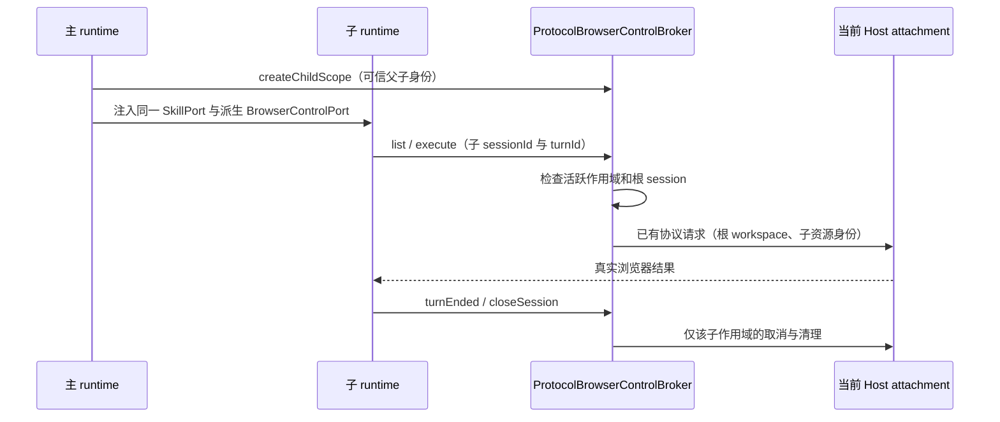

# 子代理与工作流的浏览器能力

## 产品规则

- 主会话、普通 `Agent` 子代理、动态工作流 actor 和既有脚本/专家工作流子运行时均可使用已启用的 Browser Use。它们加载同一安装项的 `browser-use:control-browser`，不需要复制技能文件、重新安装插件或另起浏览器 Host。
- 应用装配层只创建一个有效 `SkillPort`，包含配置根、已启用插件根以及用户禁用路径。工作流直接继承这个端口；普通子代理继续应用 profile 的技能白名单与独立 Computer Use 策略。Browser Use 不扩大 Computer Use 的子代理权限。
- 浏览器能力只能由父运行时从宿主注入的 `BrowserControlPort` 派生。没有宿主底座、插件被禁用或 profile 没有允许对应工具时保持不可用，不伪造 backend。
- 技能说明不再限定 Browser Use 为主代理专用。子代理仍必须读取技能、检查真实 backend/tab registry，并遵守同一页面操作约束。

## 所有者、接口与事件顺序

- `createLCodeApp` 拥有有效技能加载器。子运行时不重新扫描一份缺少插件根的配置。
- `ProtocolBrowserControlBroker` 拥有临时浏览器作用域。`BrowserControlPort.createChildScope({ parentSessionId, sessionId })` 只允许从当前活跃父作用域派生，拒绝重复活跃身份。作用域不写数据库，不从 session ID 格式、transcript 或冷 publisher 推断授权。
- CLI 账本、trace 和浏览器资源的 `sessionId` 保持子会话身份。协议 broker 使用登记关系找到活跃根会话，读取其真实 workspace/attachment 上下文，再通过已有 `interaction/browserList` 和 `interaction/browserExecute` 发送请求。协议 payload 不增加另一份任务状态。
- `workspaceIdentity?.trim() || workspacePath` 仍是 workspace key，`workspacePath`、`workspaceIdentity`、`remoteSessionId` 原样来自根会话。保留 `desktop-continuous` 与 `web-remote-replayable` 的 delivery kind，不把两条恢复链混合。
- Browser scope 在子 runtime 的首次工具调用前登记。子 turn 结束只取消自己的在途请求；子 runtime 关闭会撤销作用域并释放自己的 browser connections。父关闭也撤销其后代作用域。普通子代理执行结束、既有脚本/专家子代理结束和动态工作流 driver dispose 均进入 runtime 的同一关闭链，不关闭借用的 MCP、execution 或 session store。
- 活跃作用域不重复登记；关闭幂等。关闭立即阻止新请求并中止在途请求，迟到结果不能成为已关闭作用域的成功结果。旧作用域的重复关闭不能撤销同 ID 后续恢复的新作用域。未知/关闭子会话、失效根会话均返回明确失败，不能自动激活冷会话。
- 已结束 turn 的拒绝记录随根 runtime 生存，child 同 ID 恢复后也不接受旧 turn 的共享 MCP 请求；根 record 重建不继承这份临时记录。父关闭等待已经开始的后代清理，避免提前释放可复用身份。
- tab owner、request ID、turn ID、browser generation 和生命周期均按子会话隔离。子代理无权通过切换传入的 `sessionId` 关闭父或兄弟作用域；全局浏览器操作仍遵守既有 backend/tab 所有权校验。

## 验收与迁移边界

1. 主会话和工作流可加载插件技能的 qualified name；用户禁用某 SKILL.md 后，两者均不可发现/加载，项目技能仍可用。自定义注入的 SkillPort 保持同一实例。
2. 普通子代理和工作流使用共享 node_repl Browser bridge 能列出 backend、创建/操作自己的 tab，不再返回 `Skill not found`、`Browser is not available in subagent` 或仅因 child 没有协议 record 而返回 `Session is not active`。
3. 两个并发子代理的 browser list/execute 请求保留各自 sessionId、turnId。关闭其中一个只清理自己的连接，不影响主会话与另一个子代理。
4. 嵌套子作用域继承同一根 workspace；两个根会话的相同本地路径仍按不同远程 identity 隔离。桌面和手机 replayable attachment 请求都保留正确的 clientMode 与 remoteSessionId。
5. 子作用域关闭、父会话失活或重复登记后请求失败；关闭期间的在途请求被 abort，迟到结果丢弃。旧 scope 重复 close 不影响新代 scope。未知 child 不触发冷恢复。
6. 子代理 node_repl 可使用 Browser，但 Computer Use bridge 与官方 Computer Use 工具/技能仍执行原有拒绝策略；第三方 MCP 不能伪造官方授权。
7. 端到端回归从可信 node_repl metadata，经私有 broker socket、作用域路由、协议请求到 host executor，覆盖普通 subagent 与 workflow child 两种 runtime scope，并验证清理。真实 Electron 页面验证如未执行，必须明确报告。

修复不迁移会话持久化、不改变任务队列/投影、不重启用户当前任务；运行中的旧安装包需更新后才使用新装配。验证执行定向 Node/tsx 测试、相关 CLI 包类型检查、根 `pnpm typecheck`、`pnpm lint` 和 `pnpm architecture:check --changed`。

## 实际验证

- 39 项定向回归通过，包含 11 项新增场景；集成测试为 `apps/lcode-cli/packages/bootstrap/scripts/subagent-browser-bridge.test.ts`，通过私有 socket 转发真实协议格式到测试 executor，覆盖 Browser 的 `newTab` 与权限拒绝、Computer Use 子代理拒绝。
- `@lcode/core`、`@lcode/bootstrap`、`@lcode/node-repl-host` 类型检查，以及根 `pnpm typecheck`、`pnpm lint`、架构检查均通过。架构 baseline/new violation 均为 0；17 个改动 TypeScript 文件的格式检查通过。
- CLI 定向 `oxlint --no-ignore` 仍报告 `create-app.ts` 与 `browser-control.port.ts` 两处既有 `max-lines` 超限；不以根目录默认忽略 CLI 的 lint 通过替代这项结果。
- 用 HEAD 源文件在仓库临时目录复核，两处也分别超过 400 行上限，确认属于既有失败。既有源码与技能说明净增 140 行；新增 11 个回归场景和本 spec。状态所有者仍为 app 技能端口与协议 browser broker，不新增持久化 owner。
- 验证环境为 Node 24.14.1，仓库固定版本是 24.14.0；未进行真实 Electron 页面验证或替换运行中的应用资源。
