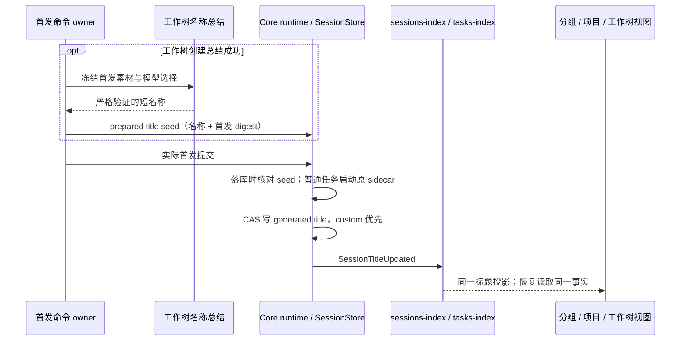

# 三个侧栏视图的任务自动命名

## 产品规则与所有者

- 「分组 / 项目 / 工作树」里的任务标题统一从 CLI SessionStore 的会话标题派生；分组名称和项目名称仍由原有所有者维护，视图不分别调用模型或保存自动标题。
- 首次实际用户输入按当前选择的模型生成核心动作和主要对象的简短名称，中文目标 8–16 字、英文 3–7 词，最多 24 个 Unicode 字符。输入只是命名素材，不能执行或回答；不提供工具。严格校验 JSON、非空标题、控制字符、长度和省略号，不把超长回复截成半句。
- 普通任务复用既有首轮标题 sidecar，收到结果后经现有 CAS、SessionTitleUpdated、sessions-index 和 tasks-index 同步所有视图。短输入保持可读原题；模型失败不阻塞用户任务，不抹除原题。
- 工作树创建已经成功总结的名称用于原分支，并作为可信的 prepared title seed 传给 runtime；seed 仅包含验证过的名称与原首发正文 SHA-256，不包含正文、不进入 RPC/Renderer，也不保存另一份 accepted 命名状态。实际首发落库时核验 digest，原子存储 title/source 后发同一标题事件；匹配 seed 不再调用第二次标题模型。失败默认分支名不冒充成功总结，标题仍走原 sidecar。
- SessionStore/core runtime 是标题写入唯一所有者。手动命名 custom 优先且保持 CAS；首发编辑、正文不匹配、恢复、父/子代理、非 interactive 会话不能使用旧 seed 覆盖标题。同树分叉沿用既有命名及历史复制规则，改任务标题不改冻结 Git 分支。
- 不批量重写既有手动或历史标题，不新增 Agent、Host 或公开协议命令。桌面 continuous 与手机 replayable 使用同一 owner/event，通过既有订阅和冷恢复得到相同标题。

## 验收

1. 长中文、多行请求和英文输入总结为完整短题，严格拒绝无效/超长/带工具结果；原正文保持完整。
2. 工作树只进行一次成功命名，任务题与原分支语义一致；数字冲突后缀只属于 Git 分支。
3. seed 正文不匹配、父会话、非 interactive 或 disabled 配置不能覆盖标题；无 seed 的普通任务继续自动命名。
4. 模型等待期间手动重命名或编辑首条消息，迟到结果被原 CAS/编辑校验拒绝。
5. 分组和项目视图显示同一普通任务更新后的题目；工作树视图显示其任务更新后的题目。切换视图、重载和冷恢复不退回旧首发题目，分支名不变化。

## 验证记录（2026-10-10）

- 共享校验、工作树名称、可信 seed 和真实 core runtime 回归共 16 个测试通过；包括普通首发总结、工作树无重复调用、手动命名、首发编辑及迟到结果。
- 本地侧栏服务夹具 E2E 在 1280px / 390px 通过，覆盖三个视图、标题更新与重载、冻结分支及删除隔离。夹具模拟持久标题投影，不等同于已安装桌面程序或实体手机实机验收。
- 根目录及 CLI 的 typecheck / lint 通过，架构检查 baseline 0、新增 0。CLI Turbo 仍提示工作区 lockfile closure 缺失；检查退出码为 0，未修改无关锁文件。
- 改动所有者为 shared 命名校验与 CLI core 标题；bootstrap 只提供可信 seed，UI 复用既有投影。已安装桌面包未替换，本行为需重新构建更新后使用。
