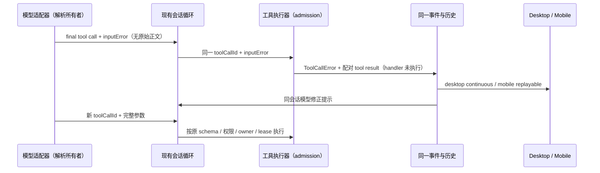

# 工具参数校验反馈

## 规则与已确认原因

`sess_6a7db596-f1f7-4555-9f2a-baf6506fcafe` 的工作流子代理 `submit_result` 曾漏传 schema 必填字段或多传 `positioning_note`；原校验正确拒绝，模型随后修正且所有对应提交均成功。不能删除必填项、剥离额外字段或伪造缺失结果来消除失败记录，也不能保证非严格解码模型永远不犯参数错误。

- typed `submit_result` 的描述从同一冻结 result schema 派生完整顶层 required 清单，提醒模型一次提交完整对象、不引入额外字段，不能仅补本次报错字段而漏掉上一版字段。通用声明仍由当前 ask 的 schema 指令负责，不冻结另一 ask 的形状。
- 首次模型输入校验失败的 provider-visible `modelContent` 已有明确字段/类型问题；executor 复用该内容生成有界可读的错误摘要，供现有事件、历史和 UI tooltip 消费。错误类别、原始验证错误、模型修复通道与失败态不变；不复制输入值或增加协议字段。
- Hook/权限修改后的输入校验失败不能冒充首次模型参数错误；仍用现有错误投影。handler 拒绝、权限反馈和 provider cause 的摘要语义不变。
- 不为兼容供应商擅自启用 strict 参数，不新增模型调用、自动重试、队列或缓存；实际引擎始终是结构化终态结果的唯一裁决者。

## 所有者与顺序

```text
冻结 actor result schema → 原 submit_result 工具声明 + required 清单
模型输入 → 原 executor 初次校验
         ├─ 无效 → 原 modelContent → 同一有界错误摘要/事件 → 模型同会话修正
         └─ 有效 → handler → 原 WorkflowSubmitPort/引擎裁决 → 接受才结束 turn
desktop continuous / mobile replayable ← 同一错误事件与历史，不新增消费事实
```

## 验收

1. 五字段 typed 结果遗漏字段或含额外字段仍拒绝；工具描述列出全部必填字段，原 schema 不修改。
2. 错误摘要明确包含缺失/额外字段路径，modelContent 与类别保留；无效提交不调用引擎、不挂停止信号。
3. 提交完整结果通过原 handler，普通工具、Hook/权限反馈和通用声明不回归；摘要保持现有 500 字符上限。
4. 根 typecheck、Lint、changed 架构检查及 CLI 相关检查执行并记录；测试不调用真实模型或写入用户会话。

## 2026-10-02 验证记录

- 影响模块为 `lcode-cli` 与 `services`：冻结 schema 与原 executor/工作流引擎仍是参数接受的唯一裁决路径；Git 纪要与审核共用现有消息校验器，不新增请求状态、自动重试或平台分支。Desktop continuous 与 Mobile replayable 仍消费同一结果/错误，不修改订阅顺序或恢复协议。
- 5 项 CLI 定向测试与 17 项服务测试通过，覆盖字段缺失/多余、完整重交提示、handler 前拒绝、有界错误摘要、权限反馈原文、Markdown 中文标题、审核失败后独立纪要、审核候选严格校验和隔离临时仓库的实际提交。未调用真实模型、修改用户会话或提交用户仓库。
- 根 `pnpm typecheck`、`pnpm lint`（0 warnings/errors）、Core 自有 TypeScript 类型检查、11 个本次触及文件格式检查与 `git diff --check` 通过；`pnpm architecture:check --changed` 为 baseline 0 / new 0。相对编辑前基线，本次代码和测试净增 166 行，不将共享工作树既有改动算作本轮改动。
- CLI 全包 `pnpm check` 因既有 Bash registry 生成物过期停在 registry 检查；单独 `pnpm typecheck` 的入口又受当前 CLI 本地 `turbo` 命令缺失影响。未为消除这些非本轮原因而生成无关文件或变更依赖；Core 直接使用其自有 TypeScript 检查已通过，不能将其写成全 CLI 检查通过。
- 现场 `submit_result` 的真实参数错误后来已自行修正并被接受；本次只改善后续提交提示和错误摘要，不抹除历史失败、不承诺模型永不产生无效参数。未构建或安装，新包真实任务验收留待后续构建。

## 模型参数 JSON 解析失败（2026-10-06）

### 产品规则与接口

- 已确认通用模型适配器曾把非法 JSON、JSON `null` 和原生 `null` 转成普通空对象，随后被误报成字段缺失；没有必填字段的工具还可能接受这个空对象。工作流 actor 与普通会话共用此路径，修复适用于所有本地执行工具。
- 模型适配器是模型参数解析结果的唯一所有者。`ModelToolCall` 增加可选 `inputError`，通过严格运行时 schema 表达 `{ code: "invalid_json" | "null_input", inputLength?: number }`。它只携带原因类别和原始字符数，不携带原始正文、JSON parser 的消息或猜测出的文件路径/内容。
- 解析失败的 `input: {}` 只作为已有模型历史、工具展示的安全占位；`inputError` 必须贯穿 streaming 与 non-streaming 的调用转换。执行器在初次输入校验阶段优先拒绝该调用，不允许 runtime schema 默认值、宽松 schema、Hook、权限确认或 handler 把它变成有效操作。
- provider-visible 错误明确说明参数为非法/不完整 JSON，或参数为 `null`；说明本次没有执行工具，要求重新提交完整 JSON 对象，大内容可拆分提交。真正的 `{}` 缺参仍使用原字段级校验提示。
- 不把所有解析失败归因为输出上限。`length`/`max_tokens` 与 `error` 保留原模型结束事实；仅依据 JSON 失败不能推断供应商中断、超出预算或服务端原因。
- 沿用现有 `ToolCallError`、有界错误摘要、配对 tool result、历史持久化和模型同会话修正路径。不得重放已执行的 sibling 工具，不新增自动重试、timeout、队列、协议消息或 UI 状态。未知工具与取消保持既有优先级。
- `inputError` 是内部模型/执行器契约的可选诊断元数据，不新增 Desktop stdio 或远控协议字段，也不修改数据库。失败的可读原因仍通过现有 `modelContent` 持久化，冷恢复沿用该反馈。

### 所有者与事件顺序



### 验收场景

1. streaming 的非法/未闭合 JSON 在 `finishReason=error` 和 `length` 下均保留 `invalid_json`；只生成一次安全诊断，不猜测截断原因，final call 去重与 input-end gate 不变。
2. non-streaming 的同类参数、JSON `null` 与原生 `null` 保留结构化失败；合法 JSON 对象、BOM、现有非字符串输入与真正无参数调用保持原行为。
3. 异常参数在所有工具（包括无必填字段的工具）上于 handler 前拒绝；不进入 Hook、权限或副作用 admission，UI 错误与模型反馈都说明格式问题而非必填字段缺失。
4. 修正后的调用只执行一次；真正缺参仍指出缺失字段，日志和反馈不包含原始正文或 parser 消息。
5. 定向测试覆盖适配器、执行器及会话调用转换；执行根与 CLI typecheck/Lint、changed 架构检查并记录真实结果。不修改真实会话和历史，不调用真实模型。

### 2026-10-06 验证记录

- 改动模块为 `lcode-cli`，实现源码净增 59 行（测试与 spec 另计）。适配器独占参数解析结果，runtime 只传递 `inputError`，执行器通过原初次校验 admission 拒绝；Desktop continuous 与 Mobile replayable 继续消费同一错误事件/历史，未改变 owner/lease、事件次序或恢复协议。
- 使用 `mise.toml` 指定的 Node 24.14.0 执行 29 项定向测试，全部通过。覆盖 error/length、JSON/null/BOM、日志脱敏、真实缺参、runtime schema/Hook 前拒绝、旧嵌套结果，以及三种执行模式下失败结果闭合和修正后恰好一次执行。
- 根 `pnpm typecheck`、`pnpm lint` 通过（0 warnings/errors）；CLI `pnpm --dir apps/lcode-cli typecheck` 与 `pnpm --dir apps/lcode-cli lint` 通过。CLI Lint 有 3 条既有警告，位于 `checkout-execution-port.test.ts` 与 `lint-fork-rewind.test.ts`，不计作本次新增或清零。
- CLI 检查通过任务进程 PATH 使用已有根目录 Turbo；未安装或修改依赖。Turbo 仍提示 CLI 本地安装/lockfile workspace 信息不完整，已执行的 27 项 build/typecheck 与 14 项 Lint 任务成功；不将工具环境提示写成源码错误或隐藏。
- 17 个触及的 CLI 文件格式检查、spec 格式检查与 `git diff --check` 通过；changed 架构检查为 violations 0 / baseline 0 / new 0。
- 未调用真实供应商、重放用户会话、修改历史失败或重新打包安装桌面应用；本次验证为源码与模拟会话链路，真实应用需使用包含修复的新构建。
