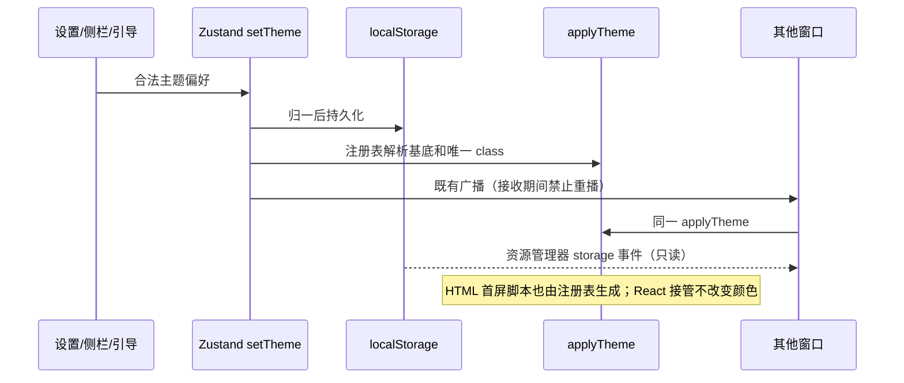
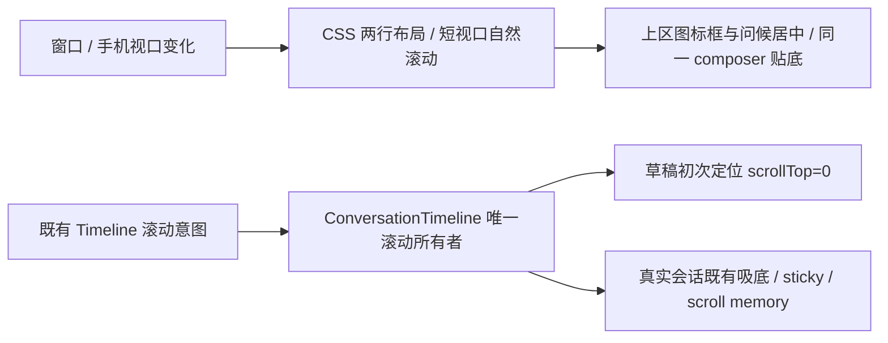

# 全局主题与组件品控

## 产品规则

参考 Trace-Browser 的七色主题和 desktop-admin-frontend-theme 品控要求，沿用 LCode 的语义 token、共享组件与 UI 字号体系。

| 持久化 id     | 中文     | 英文           | 基底    | 页面 / 文字 / 强调色        |
| ------------- | -------- | -------------- | ------- | --------------------------- |
| system        | 跟随系统 | System         | dynamic | 跟随暗夜黑 / 草木灰         |
| zai-dark      | 暗夜黑   | Night Black    | dark    | #0c0c0e / #fafafa / #8a99dd |
| zai-light     | 草木灰   | Botanical Gray | light   | #f8fafc / #1e293b / #1e293b |
| sepia-light   | 落晖黄   | Sunset Yellow  | light   | #faf7f2 / #44392c / #7a6349 |
| midnight-blue | 天空蓝   | Sky Blue       | light   | #eef7ff / #102d44 / #0c6098 |
| forest-dark   | 远山绿   | Mountain Green | light   | #f1f7ed / #1d3321 / #356e3b |
| cinnabar      | 朱砂红   | Cinnabar Red   | light   | #fff3ef / #3e1f1a / #b83a2f |
| inkpurple     | 烟墨紫   | Ink Purple     | dark    | #141019 / #f5effa / #a78bfa |

用户可见顺序同表。旧 id 保持有效；midnight-blue / forest-dark 的颜色与基底按本次产品要求升级为 Trace 风格浅色。legacy light / dark 仍归一为 zai-light / zai-dark。无效偏好回落 zai-dark，默认仍为深色。

## 唯一所有者、接口与边界

- packages/ui/src/themeConfig.ts 为纯主题注册表，拥有 id、基底、i18n key、色板、白名单和 legacy 归一；公开入口 @lcode/ui/theme-config。useTheme.ts 重导出既有接口。
- Zustand store/index.ts 的 theme / setTheme 是主窗口唯一运行时所有者，localStorage 的 lcode-theme 为持久化偏好；applyTheme 为 DOM 投影写点。设置、侧栏、引导入口均由 THEME_OPTIONS 派生，经既有 store 路径写入。
- Desktop / Web 入口在 React 渲染前复用 applyTheme；Web HTML 内联首屏脚本在 Vite transformIndexHtml 中由同一注册表生成，禁止另存手工白名单。CSS 加载前使用选中主题的真实色板作为背景、文字和 theme-color 种子。
- 资源管理器没有业务 store：复用 applyTheme，监听 storage；system 模式也响应 matchMedia 变化。它只读取偏好，不回写或参与业务广播。
- 主窗口广播仍由 applyingBroadcast 防回环；主题是 UI 偏好，不进入 Host/session/remote attachment 协议。
- 深基底挂 dark + 唯一 theme-id；浅基底仅挂 theme-id。dark utility 统一由根 dark 类控制，显式选择优先于 OS。局部强制浅色继续使用 theme-zai-light 完整变量块。
- 终端、代码、Mermaid、原生标题栏经 resolveTheme 折叠明暗；跟随系统、快捷键仍落 zai 对。办公室预览固定浅色的边界保持。

## 组件品控

- 主题选择器按用户反馈改为统一 Lucide 线性符号，移除三色月牙/圆点拼接。system/暗夜黑/草木灰/落晖黄/天空蓝/远山绿/朱砂红/烟墨紫分别用 Monitor/Moon/Sun/Sunset/CloudSun/Mountain/Flame/Sparkles。共享 ThemeSwatch 保持现有接口，统一 size-4、1.75 线宽与当前主题 foreground-subtle；符号只作装饰，完整主题名称和选中标记表达选择。设置页已选值、选项、侧栏和引导页共用同一组件；主题注册表、色板、状态写入与持久化不改变。
- 页面、结构区域、卡片、输入、菜单、popover、tooltip、toast、选中/悬停/错误/禁用状态均消费现有语义颜色，不复制组件规则。正文/辅助文字在常用 surface 上对比度至少 4.5:1；状态与主按钮文字也需验证。
- 不改变 Electron 透明根背景；Web 根背景、color-scheme 和 theme-color 跟随实际选中主题。
- 取消全局强制清除焦点的规则；base 提供键盘 focus-visible 兜底，组件自行使用语义 ring 或输入边框，forced-colors 使用系统 Highlight；不覆盖组件的焦点样式或浮层 shadow。
- Button/Input 使用 min-height 而非固定文字容器高度；大字号不能裁切控件文字。Textarea 复用 Input 的边框、背景、placeholder 和 focus token。
- 新会话问候与品牌图标进入普通文档流。按用户确认恢复大尺寸渐隐 Logo：复用 app-logo.svg，宽度取 60vw / 20rem / 32dvh 的最小值，保留浅色 0.24、深色 0.32 透明度与旧版向下渐隐遮罩；遮罩仅作用于图标，不能覆盖标题或 composer。欢迎标题使用限定此入口的 text-ui-greeting token，桌面 UI 字号 +16px（默认 30px），窄屏或手机触控界面 +10px（默认 24px），自然换行，不测量/缩放独立字号，不改变其它 UI 刻度。
- 320px 窄屏、短窗口和 20px UI 字号允许内部自然滚动，标题/图标不能被 composer 遮挡。中文/英文与 office/coding 的时间问候继续可用。
- 大标题保留 relaxed 行高容纳跨平台中文字体字形；≤500px 短视口收紧空态间距，保持大字和输入区域可达。
- 按用户最终确认，草稿采用两区布局：Logo 与问候在输入区上方剩余空间居中；composer（含推荐入口）贴底并保留 16px + 手机 safe-area 底部边距。取消固定 29dvh 顶部基准；两区共用当前 viewport 高度，上区高度不足时安全居中退为从顶部内部滚动，不允许输入框覆盖问候。既有 centerEmptyStateWithDock 是草稿布局入口，不新增状态或重新挂载 composer；真实会话保持既有 sticky/吸底语义。
- 大 Logo 保持原尺寸与渐隐，只用宽高比 3:2 的透明裁切框承接上部图形，收去渐隐尾部的空白占位；图标框至问候固定 8px。裁切与 mask 只作用于装饰图标，不覆盖文字，仍无测量/定位状态。
- 布局参照用户提供的 Codex 截图：上区的 Logo/提示语成组居中，与下方输入区之间保留剩余空白；不把输入框加入欢迎内容的居中组。既有 compact 参数仅收紧水平留白。

- 保持紧凑圆角、语义状态、清晰层级、减少动态效果；尊重 prefers-reduced-motion。共享组件修复影响 Desktop 和 Web。
- 普通 Button 默认单行，长文案换行仅由局部响应式布局选择；完整表单、浮层和状态验收遵循 frontend-component-quality.md。

## 验收

1. 设置、侧栏、引导均展示 system + 七色主题，中英文完整。连续切换不会残留 theme 类；刷新保持偏好；旧 id/无效值/legacy 值解析正确。
2. OS dark 下选浅色、OS light 下选深色，utility、原生控件、图标、代码/终端明暗与选择一致；system 随 OS 实时变化。
3. HTML 在应用 bundle 执行前获得准确背景和 class；三个入口复用共享解析，不存在主题白名单副本。
4. 资源管理器跟随 storage 与 system，主窗口双向同步无广播回环。
5. 浏览器 E2E 在 1440×900、1280×720、827×547、390×844、320×568，中英、14/20px、所有主题验证问候完整、logo 已加载且可见、无文档横向溢出。
6. 真实共享 Button/Input/Textarea、表格、菜单、弹窗、状态提示、主题选择器验证对比度、长文案、键盘焦点、disabled/selected、Escape 回焦与 reduced-motion。
7. 实际执行主题回归 E2E、pnpm typecheck、pnpm lint 和 pnpm architecture:check --changed，报告真实结果与环境限制。
