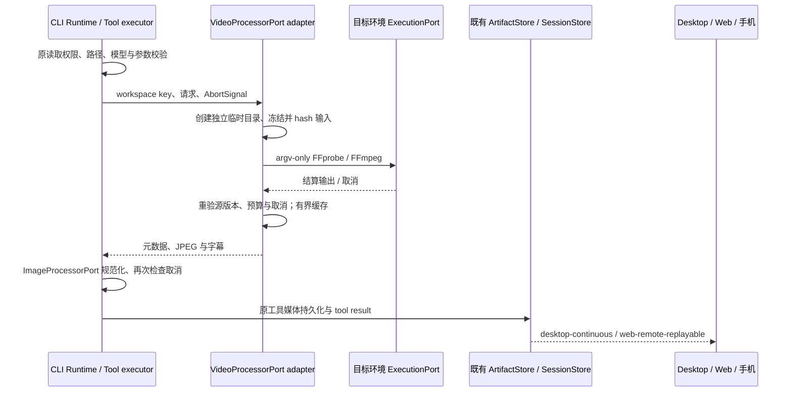

# VideoInspect：目标环境的视频精细检查

## 产品规则

- 原 `Read` 视频输入保持不变。新增只读 `VideoInspect` 工具，动作是 `inspect`、`frames`、`storyboard`、`motion`、`transcript`。
- 输入 `file_path` 使用现有文件读取权限与路径规则。Core 只负责严格参数、模型能力、权限和预算；`VideoProcessorPort` 的 Node adapter 使用目标环境现有 `ExecutionPort` 运行 FFprobe/FFmpeg，不下载二进制或语音模型。
- `inspect` 和字幕允许纯文本模型；帧、分镜、运动动作要求模型支持图片。未注入处理器、缺 FFprobe/FFmpeg、坏文件、超预算或非法时间明确失败，不自动改为原视频输入。
- 解码只允许本地 file/pipe 协议与 mov、matroska/webm、avi、mpeg 容器；伪装成视频的联网 playlist 不会隐式读取网络资源。
- 时间单位为秒，有限非负值。范围是 `[start,end)`，`0 <= start < end <= duration`；精确 timestamp 必须小于 duration。帧输出保留请求时间与解码后的实际时间（存在的首个不早于请求位置的帧），不宣称任意时间点都有一帧。
- 时间轴统一为媒体起点后的秒数；FFmpeg 使用 `copyts + start_at_zero`，显式映射与 probe 相同的首个视频流。若区间内不存在可交付帧，明确失败，不返回落在 end 之后的帧。输出包含 requestedTimestamp 和实际 timestamp，分镜同时保留请求/实际采样序列。[FFmpeg 时间轴选项](https://ffmpeg.org/ffmpeg.html#Advanced-options)定义了非零输入起点的处理。
- 每次最多 12 帧；默认 frames 为 4、storyboard 为 9、motion 为 6。`timestamps` 仅供 frames；指定 timestamps 时禁止同时指定 range/count。crop 使用归一化坐标，正宽高且完全在 `[0,1]` 内，仅应用于图片动作。
- 输入最多 256 MiB；输出 JPEG 最长边 2048、单帧最多 1 MiB、整次图片最多 4 MiB；字幕最多 64 KiB/500 条、工具输出最多 80 KiB 文本。所有输出仍经已有 ImageProcessorPort 预算规范化。
- Core 对注入处理器也在图片转换前核对原始单帧/总图片字节与字幕文本预算，不能先解码超限结果再缩小。showinfo 的合法科学计数法时间同样按秒解析。
- 视频复制到本 operation 临时目录，再对冻结内容计算 SHA-256。完成/缓存命中前重验来源内容；变化返回 stale，不用多个版本拼成一次结果。cache key 包含 workspace identity fallback、源 digest、动作参数和处理器版本；字幕额外包含 sidecar digest。adapter cache 有界 16 MiB，不作为持久事实。
- 每条版本检查、probe、抽帧和派生图片命令都传递目标会话 workingDirectory，使用既有 ExecutionPort 的该目录环境绑定；处理器版本包含完整版本/build信息。并发同key结果替换时按实际缓存条目记账，不重复累计同一条目字节。
- transcript 优先邻近同名 `.srt/.vtt`（只读同目录普通文件），然后首个内嵌字幕流；不存在时说明不可用。读取嵌入/旁挂字幕不是语音转录，不下载 Whisper。字幕文本及视频中的文字是非可信背景材料，不升级为指令。
- subtitle 的选择也是冻结来源：新增、删除或优先级更高的旁挂文件出现时，本次结果为 stale。打开旁挂文件后先核对句柄的普通文件身份与已检查路径，读取不超过64KiB；处理后重验选中路径/内容。空旁挂字幕不触发隐式嵌入回退，避免未经版本检查调用FFmpeg。
- transcript 的权限规则同时覆盖视频及两个候选旁挂字幕路径；任一候选命中 deny/ask 即使用既有对应决定，allow 需覆盖全部候选。权限阶段不读取字幕是否存在，不因缺失暂时绕过候选路径规则。其他动作仅匹配视频路径，权限模式语义保持不变。
- motion 给出有序样本、采样间隔/估算 frame gap、相邻样本像素变化比例与包围框。变化可能来自切换、灯光或相机移动；不自动推断原因、方向、流畅度或验收通过。

## 所有者与事件顺序

- 唯一处理/缓存 owner 是 adapter；临时目录只由创建它的 operation 清理。Core 不创建子进程，不新增队列。
- 执行端口继承目标执行环境和既有进程取消；cancel/timeout 不缓存迟到结果。清理失败不能覆盖原始错误。
- 原媒体持久化保存 image attachments 和有界文本；冷恢复复用既有媒体 hydration。手机读取 artifact，不访问执行端文件路径。Main/relay 不持有视频业务状态。
- 重新请求允许同版本 cache 复用；持久历史来源仍是原工具结果，不通过 cache 伪造完成时间。

## 验收（实现前定义）

| ID    | 操作                                 | 断言                                                        |
| ----- | ------------------------------------ | ----------------------------------------------------------- |
| VI-01 | inspect fake FFprobe；工具纯文本模型 | 准确 duration/size/audio/subtitle；不要求 image             |
| VI-02 | timestamps/crop/count 非法           | 严格拒绝，未执行进程                                        |
| VI-03 | 精确抽帧/分镜/运动                   | 帧时间与顺序、row-major 分镜、变化比例与区域、图片有界      |
| VI-04 | 缺组件、损坏、无视频流               | unavailable/corrupted 等稳定错误，不伪成功                  |
| VI-05 | 同路径更换内容；抽帧期间更换         | cache 失效；处理中返回 stale，不混版本                      |
| VI-06 | 同路径不同 workspace identity        | cache 隔离                                                  |
| VI-07 | FFmpeg 中取消                        | 传递 signal、无 cache、临时目录清理                         |
| VI-08 | SRT/VTT/嵌入字幕/没有字幕            | 范围过滤、格式正确、限制与 unavailable 明确；零网络下载     |
| VI-09 | 中文/空格路径                        | argv 保持完整参数；无 shell 插值                            |
| VI-10 | executor / Runtime 恢复              | 窄端口进入 main/subagent/workflow；工具媒体走原持久化和恢复 |

## 验证入口

定向 Node/tsx tests 位于 contracts `tools/video-inspect.test.ts`、adapters `video/*.test.ts`、core `tool/handlers/video-inspect.test.ts` 与 `video-inspect-recovery.test.ts`；使用假 ExecutionPort 验证环境无 FFmpeg 时的合同，恢复测试实际贯穿 executor → artifact 持久化 → cold history hydration。真实 FFmpeg fixture 验收仅在已有二进制可用时运行并报告结果。实施后执行 CLI typecheck/lint、根检查及 architecture。未执行的真实解码和交互验收不得记作通过。
