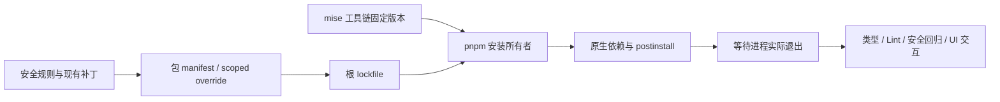

# Workspace 依赖安全修复与升级适配

## 授权范围与所有者

- 本次接续 `workspace-dependency-maintenance.md` 的第一轮维护。用户已确认允许必要的安全升级、固定版本调整和代码适配；第一轮仅限原有 manifest 范围的限制不再适用于本次安全修复。
- `mise.toml` 仍是工具链版本所有者；根项目及 CLI 的 `packageManager`、CLI engine、CI 和开发说明保持一致。采用 Node 24 LTS 与 pnpm 10 的维护版本，验证 Windows 正常并发的实际退出结果。
- 各包 manifest 管理直接依赖；根 `pnpm-workspace.yaml` 只为尚未更新安全子依赖的父包提供明确的 scoped override，记录理由；lockfile 固化结果。
- 保留 React overrides 和三个现有 SDK/RUM 补丁，不以丢失视频消息或监测补丁换取升级。没有发布修复版本时优先移除已证实未使用的依赖链，或为已确认原因提供有回归证据的本地补丁，不设置 audit ignore。
- tag 触发的六平台 GitHub Actions 构建属于本次验收范围：CI 固定版本与 manifest 对齐、lockfile frozen 安装、原生资源和桌面/CLI 产物验证、提交的第三方 notice/inventory 基线同步更新。无需创建或推送 tag 来完成本地验证。

## 修复边界

1. Electron 保持 41 主版本，升级到包含安全修复及新版下载/解压实现的维护版。MCP client 保持 2 主版本；遥测的 stable/experimental 包按同一发布系列一起更新；TUI ws 保持 8 主版本。
2. 对固定旧版 shell-quote、Tinypool、Undici、basic-ftp、linkify-it、selector parser、Moment、UUID、esbuild、provider-utils 的父依赖使用必要的安全版本。每个跨版本 override 必须通过父包实际使用 API 的验证。
3. KaTeX 升级后保持现有数学渲染接口、主题和布局；Jimp 保持 nut-js 当前 API，只适配其 file-type 的异步 ESM 检测入口，PNG/JPEG/BMP 读取结果保持一致。
4. RSA PKCS#1 v1.5 验证必须拒绝 DigestAlgorithm 中多余的 ASN.1 元素，并保留合法签名、CA 生成和现有证书持久化格式。只在 RSA 验证入口收紧结构，不全局改变 ASN.1 解析语义。
5. Oxlint 抑制注释迁移为受支持的规则名写法，保留原有例外的作用范围、中文理由与 400 行规则，不增加例外来掩盖新问题。删除未使用声明时必须核对实际引用。
6. Pierre 代码/Diff 查看器显式给出新泛型参数，保留当前 annotation、行选择和评论功能，不启用新的 caret 状态或改变事件所有者。
7. 保留 shadcn 作者工具的 components.json 配置链。Braces 尚无修复发行版时，为 parse/compile/expand 的嵌套深度提供一致的资源上限，深层输入以可控 SyntaxError 拒绝；正常文件 glob 展开和编译保持一致。
8. 第三方声明生成器从 `pnpm-workspace.yaml` 读取补丁，并将补丁文件及 hash 纳入输入新鲜度检查，不能继续读取已迁移走的 `package.json.pnpm` 字段。Node 24.21.0 的原始许可与来源必须随新运行时一并登记、打包。
9. CLI 各包 Lint 命令显式检查自身源码，不能被根项目针对独立 CLI 的 ignorePatterns 跳过；各包显式加载 `apps/lcode-cli/oxlint.config.json`，继承根规则并重置 ignorePatterns；使用非自动发现名称保持根 Lint 的原有范围。各包使用既有 core 包的 `--no-ignore` 策略，并将不受支持的 `--write` 修复参数改为 `--fix`。规则和已有例外不放宽。
10. 完整 README 许可段和版本固定的上游 LICENSE 按原文保存。Electron 下载器新增 `@electron-internal/extract-zip@1.0.5`、代理新增 `proxy-agent-negotiate@1.1.0` 缺少完整原始版权材料，必须保留为未解决项；`@hono/node-ws` 的同一既有缺口随版本变为 1.3.1。不得推断版权人、把标准许可条款当成原始上游文件，或静默扩大自动发行接受的材料基线。
11. electron-builder 与 CUA runtime manifest 必须消费同一个、从锁定安装的 Electron package 读取的精确版本。禁止在 builder 配置另存旧版本常量；六个平台只改变下载目标，不改变运行时版本。回归测试实际加载配置并验证打包版本与安装版本一致。
12. 用户在了解材料检查与付费授权、签名证书的区别后要求继续处理。本轮手动更新自动发行接受的材料基线：新增 extract-zip 1.0.5 和 proxy-agent-negotiate 1.1.0、将既有 Hono 条目更新至 1.3.1、移除已退出生产图的 keyv 4.5.4。保留完整来源和未解决理由；NOTICE 新鲜度、精确集合匹配、未知新条目拒绝和严格零债务门禁继续生效，无证书构建维持既有流程。

## 验收与失败语义

- 先添加可复现的安全/兼容测试再修改对应行为；新补丁必须证明恶意结构被拒绝、正常输入仍可用。
- 运行真实 workspace 安装下的根 `pnpm typecheck`、`pnpm lint`、CLI 类型与 Lint、架构检查，以及受影响的 MCP、遥测、查看器和既有 worktree/runtime-environment 回归。
- Windows frozen 安装必须检查退出码；仅输出 Done 不等同于成功，不将降低并发的临时绕过写成根因修复。
- 审计统计原样保留。若无上游修复版本，本地补丁导致版本号仍被报告，明确列出公告、补丁、测试和剩余限制，不把非零 audit 报告为零漏洞。
- 保留与本次任务无关的本地改动和第一轮已完成的修复。

## 当前验证结果（2026-10-08）

- 使用 Node 24.21.0 / pnpm 10.34.6，正常并发 frozen 安装退出码为 0。
- 根 typecheck、Lint、完整/changed 架构检查通过；CLI 27 个类型任务和 14 个 Lint 任务通过；本次修改文件格式检查通过。
- 66 个 worktree/runtime-environment 逻辑回归、23 个 Web 交互回归、43 个 MCP/遥测/checkout/fork 回归、11 个安全回归、8 个打包资产回归通过。
- Web、CLI 和 Desktop 生产构建通过。Windows x64 安装包生成成功，运行时闭包、mise、产品身份和 500 MiB 包大小门禁通过，产物约 202.1 MiB。
- 包内 Electron 与 CUA manifest 均为 41.10.7；包内第三方声明与仓库声明字节一致。使用真实打包后的 Electron 加载 PTY、SSH、node-forge 和三个遥测模块成功。
- tag 工作流新增安全回归、根与 CLI 类型/Lint、架构检查；打包配置实际加载测试证明旧 41.0.3 pin 失败，改为锁定安装版本后通过。v3.17.1 首次六平台 Actions 暴露 macOS DMG 隐藏文件源路径与 Linux CLI Turbo 入口问题；本地 CLI 缓存检查没有证明干净 CI 布局可用。后续修复及无缓存、全新安装验证见 `specs/github-actions-desktop-release.md`。
- 用户要求继续处理后，已手动登记材料基线的具体差异，发行契约 24/24 通过。新鲜度、未知新项拒绝、删除/理由变化拒绝和严格零债务检查的失败语义保持不变；具体差异见 `third-party/dependency-upgrade-review.md`。
- 原始 audit 目前为 2 high、0 critical/moderate/low：node-forge（GHSA-86w9-cpqp-85rv）与 Braces（GHSA-vfj7-8cjw-p6xm）没有上游安全发行版。对应本地补丁已生效且回归通过；未设置审计忽略，也不将版本扫描的结果描述为零。
