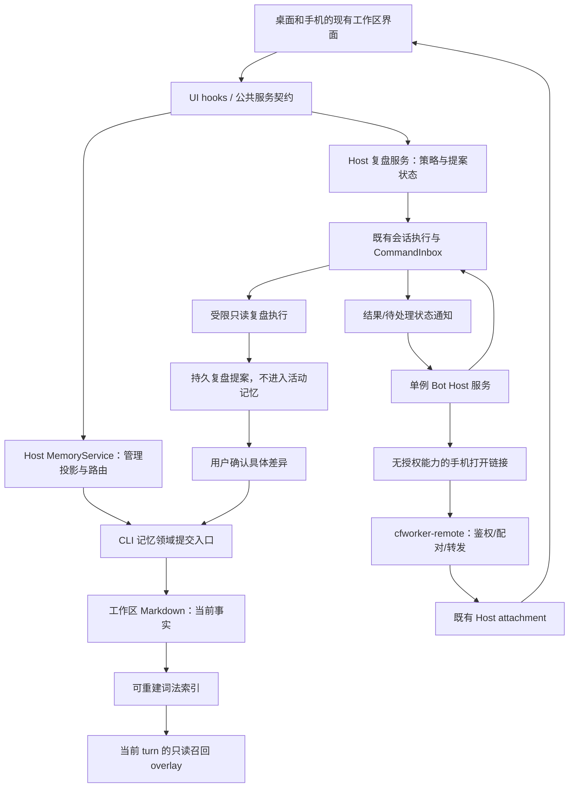

# LCode 工作区智能增强方案：记忆、复盘与机器人远控

- 日期：2026-10-02。
- 状态：**规划稿 / implementation-handoff，尚未实施**。本文中的新增接口、数据字段、页面与测试均是拟议契约，不代表仓库已提供。
- 目标：围绕 LCode 的编程工作区、动态工作流、既有 Host 和 `cfworker-remote` 做增量增强，而不是复制一个通用聊天机器人产品。
- 基线：`L-GO`，HEAD `75a5388d60995ef4ed3c0d2944693cb58645b00e`，包含现有未提交改动。freshness 检查通过；调查期间工作树仍有其他修改，实施前必须重新核对目标文件。
- 原交付为四份方案。2026-10-02 用户要求依次实施记忆治理、索引、复盘；排除应用内记忆正文/来源/类型详情查看，保留外部编辑器。随后明确复盘采用**无感AI校验与自动应用**，不逐条向用户确认，并关心token开销。旧审批制与默认关闭自动应用的规划已被这一决定覆盖；最新行为、增量预算和范围以 [实施契约](./workspace-memory-intelligence-implementation.md) 为准。机器人、Worker部署及平台级定时调度不在本次实现范围。

## 1. 推荐结论

选出四个有价值的方向，按“用户可见价值 + 风险依赖”组织，而不是按竞品功能数量组织：

| 方向             | LCode 已有                                        | 这次增强什么                                                      | 首版边界                                                      |
| ---------------- | ------------------------------------------------- | ----------------------------------------------------------------- | ------------------------------------------------------------- |
| 工作区记忆工作台 | Markdown 记忆、文件列表、轮后提取                 | 当前工作区准确选择、正文/来源预览、受控编辑、版本冲突、归档与恢复 | 先本地；远程无法接入时明确不可用，不回落到本地同路径          |
| 记忆索引质量     | BM25、中文 bigram、top-k、读取预算                | 可解释召回、索引健康、可靠失效、旧事实治理、可重复评测            | 不先引入向量数据库、图数据库或全仓扫描                        |
| 可审查的复盘     | 轮后记忆提取、cron、OffPeak、成果展示             | 跨会话复盘提案、来源/水位/预算、确认后应用、可撤销记录            | 不自动改代码、权限、系统提示词或技能                          |
| 机器人远控入口   | 手机完整镜像、Worker 隧道、已有 Host/CommandInbox | 机器人管理、通知、状态、安全打开手机；后续增加绑定会话短指令      | 默认单 provider；不替代手机完整界面，不在 Worker 保存业务任务 |

推荐交付顺序：**先把记忆看清楚，同时做机器人通知；再统一记忆提交并提高索引可靠性；然后上线只产提案的复盘；最后开放受限机器人指令。** 这样不必等全部后端完成才给用户收益，也不在写入一致性尚未建立时打开自动修改。

### 从CowAgent吸收什么，如何改成LCode自己的能力

- [记忆检索与整理](https://github.com/zhayujie/CowAgent/blob/986f44a19508b572d15d40dcb8bd5b2796559ec7/agent/memory/manager.py)：吸收来源/时效治理思路；LCode保留现有BM25和workspace identity，不迁移到另一套全局知识库。
- [Deep Dream整理](https://github.com/zhayujie/CowAgent/blob/986f44a19508b572d15d40dcb8bd5b2796559ec7/agent/memory/summarizer.py)与[演进执行](https://github.com/zhayujie/CowAgent/blob/986f44a19508b572d15d40dcb8bd5b2796559ec7/agent/evolution/executor.py)：吸收周期复盘和可撤销变更思路；LCode改为来源可核验的提案制，避免自动改工程环境。
- [渠道入口](https://github.com/zhayujie/CowAgent/blob/986f44a19508b572d15d40dcb8bd5b2796559ec7/channel/channel_factory.py)：吸收聊天触达与结果推送；LCode把复杂审批/编辑留给现有CF手机镜像，不在IM里再做第二个工作台。

这些是机制借鉴，不是对竞品质量/性能的实测背书。暂不优先做全功能知识图谱、个人微信非官方接入、云端任务队列和默认自动自改；凭据保护与写入边界作为上述各批的信任边界要求，而非借此再扩成一次全仓安全重构。

## 2. 对上一轮比较结论的必要修正

当前源码调查推翻了几处过于简化的说法，后续不能继续使用它们作为实现前提：

1. **不是“没有自动记忆固化”。** `scheduleProjectMemoryExtraction` 已在成功 turn 后触发；memory loop 已可写 Markdown。缺的是跨会话质量治理、提交记录、审核及可恢复的一致性。
2. **不是“memory agent loop 是唯一写入者”。** 普通 Write/Edit、memory loop、部分后台任务及外部编辑器都可能修改文件；当前串行调度主要是单 runtime 维度。
3. **不是“没有记忆索引”。** 项目记忆已有有界 BM25；历史会话还有独立的有界搜索和默认关闭的自动召回，两者不能合成一个开关或事实源。
4. **OffPeak 不是本机空闲检测。** 它依赖服务器票据、套餐资格、免费取号额度及模型限制，无保证开始时间；当前 OffPeak 派发还明确跳过轮后 memory extraction。不能用免费、定期、准时作为产品承诺。
5. **当前没有 Bot Channels 后端，但手机镜像已经存在。** 图中的机器人渠道作为新交互参考；“所有 IM 都不值得做”不是这次的取舍。值得做的是围绕现有工作区的轻量入口，不是复刻多渠道通用助理。
6. **不能声称仓库没有 E2E。** 当前 `packages/web/test` 存在测试和浏览器夹具，其中部分被忽略，不能自动算作新检出可执行的 CI 覆盖。
7. **安全边界不能靠关键词搜索证明。** 本方案不声称所有文件工具缺乏保护，也不把 Bash 字符串过滤称为完整沙箱。

## 3. 方案分册

- [工作区记忆与索引治理](./workspace-memory-governance.md)：事实源、身份、受控提交、索引、检索解释、UI、迁移与测试。
- [可审查的工作区复盘](./workspace-retrospective.md)：提案状态机、来源水位、调度、OffPeak、预算、受限工具与应用规则。
- [机器人管理与 cfworker-remote 集成](./bot-channel-remote-control.md)：截图落地、provider 分期、配对/绑定、命令准入、幂等、离线、Worker 扩展与测试。

分册之间的公共约束以本文为准；新行为仍须在实施批次中同步修订对应既有 spec，不能把这份规划当成旧实现已经满足的验收声明。

## 4. 总体架构与唯一事实源

### 状态所有者

| 状态                              | 唯一权威                                  | 其他组件只能做什么                              |
| --------------------------------- | ----------------------------------------- | ----------------------------------------------- |
| 工作区身份与可执行路径            | 现有 workspace/连接注册表；identity-first | UI 展示 label；不能以同路径猜远端身份           |
| 当前项目记忆内容                  | 对应 memoryRoot 下 Markdown               | 索引/前端/提案只读投影，不能成为第二份当前内容  |
| 受控记忆提交与审计                | CLI 记忆领域入口 + adapter 的共享提交协调 | Host 只提交命令；普通工具的受控路径复用同一入口 |
| 召回结果                          | 当前 runtime 的派生索引和 turn overlay    | 不回写会话历史或复盘提案                        |
| 历史会话                          | SessionStorePort                          | 按身份和有效分支取有界证据，不另建聊天历史库    |
| 复盘策略、运行关联与提案          | Host 复盘服务及其 Repo                    | 调度仅负责触发；UI 不维护第二条运行队列         |
| 已接受的输入                      | CLI/runtime CommandInbox 与 admission     | Bot/Renderer 只保留投递回执与未提交意图         |
| Bot 实例、绑定、传输去重/通知账本 | 唯一被分配的已有 Host 中 Bot 服务         | Main 仅持 owner 路由与 generation，不解析任务   |
| 手机配对与 attachment 生命周期    | Desktop Main + Worker 房间协议            | Bot 不能凭聊天身份直接签发手机设备凭据          |
| Worker                            | 认证、配对、心跳、短期传输元数据          | 不存记忆、会话快照、提示词或待执行任务          |

“唯一入口”只涵盖已纳管的应用写入。外部 IDE、任意 shell/插件直接改文件不是被神奇消除的写入者，必须检测冲突并诚实说明防护范围。

## 5. 所有分册必须保持的规则

1. 身份 key 使用 `workspaceIdentity?.trim() || workspacePath`。身份隔离与执行路径分离；远程路由保留 `remoteSessionId`、owner/lease、generation、stale-run 检查。
2. UI 经 hooks 和公共服务；平台能力经 `IPlatformService`。Service 不引用 Runtime 具体实现，跨包不深导入；拟议新领域接口先在 contracts/shared 声明并做运行时校验。
3. 手机保持完整镜像和同等会话控制权限；Bot 是另一种受限渠道，不能拿 Bot 的限制去削减手机。保持 `desktop-continuous` 与 `web-remote-replayable` 两种语义。
4. 文件事实、持久提案、审计记录、派生索引、UI 草稿、turn overlay 分开建模。索引损坏不能导致记忆丢失，提案不能提前被自动召回。
5. 所有新增后台策略默认关闭，设置页明确模型/费用/数据发送范围。复盘建议自动化不等于本轮授权创建自动化。
6. 不让记忆内容、Bot 消息、网页内容成为高优先级指令；模型不能自封“用户已批准”。批准事实由已认证 UI 动作和服务端记录产生。
7. 不自动写 `AGENTS.md`、系统提示词、权限、凭据、技能注册、生产代码；相关建议只能另发用户可审查的工作项。
8. 日志不输出原始消息、凭据、记忆正文、配对链接或真实路径；诊断用计数、耗时、稳定原因码和不可反推的标识。

## 6. 实施批次与依赖

工作量使用 S/M/L：S 表示单领域受控变化，M 表示跨两三层，L 表示跨进程/迁移/对外渠道。不承诺未经估算的人日。

| 批次                | 可独立交付的结果                                        | 依赖                                   | 规模 | 完成标准                                                   |
| ------------------- | ------------------------------------------------------- | -------------------------------------- | ---- | ---------------------------------------------------------- |
| P0 基线收口         | 复现并修正远控恢复帧契约；确认检查入口；记录现存失败    | 无                                     | S–M  | 新回归先失败后通过；根与 Worker 检查分开报告               |
| M1 记忆可见         | 本地当前工作区选择、递归目录/正文/来源预览、目录健康    | P0源码基线，不依赖Bot                  | M    | 同名身份隔离、嵌套条目、读取限额与切换竞态通过             |
| B1 机器人通知       | 单provider管理、双向绑定、脱敏通知与手机链接            | P0远控契约及Host权威通知源；可与M1并行 | M    | Renderer关闭仍有新通知；全部查询existing-only；token不回读 |
| M2a 受控记忆治理    | 单条create/replace、条件撤销、审计、索引失效/解释与评测 | M1                                     | L    | 两writer、崩溃、外部编辑、跨身份测试通过                   |
| M2b 归档与恢复      | 明确archiveVersionId与含absent的恢复矩阵                | M2a                                    | M    | 归档先落盘再移除活动文件，逐断点恢复无丢失                 |
| R1 手动复盘         | 有界证据、禁可执行hook、提案与确认后单项应用            | M2a；归档应用另依赖M2b                 | M    | 文件与hook副作用为零；来源可查；旧revision拒绝             |
| R2a 定期复盘        | 明确模型的cron、预算与水位去重                          | R1                                     | M    | 忙时跳过，不补跑积压，不隐式提取                           |
| R2b 单次OffPeak复盘 | 调度前持久绑定用途/策略/预算；票据失效本attempt终止     | R1、专用票据契约                       | M    | 缺用途关联不派发，不自动续票、不转付费                     |
| B2 机器人短指令     | 绑定已有会话的sendText/stop；sendText空闲才准入         | B1、执行边界能力检查                   | L    | busy不steer/queue；离线不启动runtime；迟到stop不影响新run  |
| B3 第二 provider    | 飞书/Lark；企业微信智能机器人按官方能力验证             | B1/B2 契约稳定                         | M    | 独立凭据/租户/平台错误与限流场景通过                       |
| B4 可选 CF webhook  | 独立 Bot ingress 路由，不复用手机单桥                   | 有公网回调实际需求与秘密托管批准       | L    | 验签、短响应、Host 不在线、重复事件与代数切换验证          |
| R3 低风险自动应用   | 仅明确 opt-in 的来源可核实记忆类型                      | R1/R2 的真实质量数据 + M2 稳定         | L    | 独立放行决策；不得因达到阶段时间就自动开启                 |

B1与M1可以并行，因为它们不共享写入实现。R1不能绕过M2a；归档应用另等M2b。R2a先接明确模型的cron，R2b再接可信用途和续票规则完整的单次OffPeak。B2首版忙时拒绝，不向已有高权限轮次steer；B4不是B1前置，不为了“结合CF”把现有隧道改成任务服务器。

## 7. 前置问题与实施时的决定

### 7.1 已验证的远控跨仓库契约不一致

Worker 已桥接房间重连时可发送 `room.ready.expiresAt = null`，shared schema 当前仅接受正整数。注入帧的 schema 复现返回 `Invalid input: expected number, received null`；Tunnel 路径触发 `close(4003, "unknown control frame")`。这是本地确定性复现，不是本轮生产手机故障观测。

实施 P0 时：允许该帧准确表达“已桥接房间没有等待配对 TTL”，保留未配对过期、房间认证及 generation 守卫，补 Worker 产生帧到 Desktop 解析的契约测试。不得泛化为所有过期字段都可为 null，也不得用超时重连掩盖解析失败。

### 7.2 既有 spec 漂移

`mobile-remote-control-cf-workers.md` 的部分旧时序仍使用 `/connect/client`、30 秒、停止等于永久吊销、无生产调用方等说法；当前源码为 `/ws/pair` 与 `/ws`、默认五分钟、stop/revoke 语义不同，并已接线 attachment。实施远控批次时先同步这些事实，不恢复旧代码。

### 7.3 首版已作的产品取舍

- 主动自动写改为后期单独 opt-in；不阻断已有普通轮后提取，先纳管其写入一致性，再以显式设置选择审核策略。
- 记忆首版本地可用；跨主机同步、知识图谱、embedding、团队共享库暂缓。
- Bot 技术 MVP 默认 Telegram。若目标环境无法直连 Telegram 而已有企业飞书应用，按同一契约切换首个 adapter，不同时摊开四个平台。
- 微信明确拆成“企业微信智能机器人”和“个人微信”。只把前者放入可实现候选；本轮未取得个人微信通用官方机器人契约。
- 无可靠来源的经验、跨项目推断、包含秘密/第三方个人数据的候选不自动晋升。

## 8. 关键验收矩阵

| 场景                         | 必须证明什么                                           | 证据层                     |
| ---------------------------- | ------------------------------------------------------ | -------------------------- |
| 本地 A 与远端 B 使用同一路径 | 不共享记忆、提案、绑定或去重键                         | 服务/协议/临时文件         |
| 两会话同时修改同一记忆       | 后者得到冲突，不能静默覆盖                             | adapter 并发测试           |
| 编辑期间进程崩溃             | 重启能判定未应用/已应用/需人工恢复，不制造半旧索引事实 | 故障注入 + 文件 hash       |
| 复盘模型输出“已获用户批准”   | 不能产生 apply 事实                                    | 执行能力与提案 validator   |
| OffPeak 无资格/取号失败      | 不改用普通付费模型、不增加常驻轮询调度                 | provider fake + Repo       |
| Bot 重复事件或重连重放       | 相同 commandId 最多准入一次；回执能区分未知与已完成    | adapter + CommandInbox     |
| Bot 链接被转发               | 不能获得设备授权或直接执行命令                         | Web/Host 鉴权测试          |
| 手机正常断线恢复             | 保持完整镜像与 replayable 行为，不依赖 Bot             | Worker/Desktop 合同 + 真机 |
| 两个窗口争用同一机器人       | 一个连接执行者，旧 generation 的事件无效               | Host/Main 注入桩           |
| 用户关闭增强功能             | 不删记忆/提案，不重写历史；既有人工工作流继续可用      | 回归与 UI                  |

## 9. 验证记录（本轮规划，不等于方案已验收）

实际已执行的只读/基线检查：

- `node scripts/check-workspace-freshness.mjs`：通过。
- `pnpm typecheck`：通过；`pnpm lint`：通过，0 warnings / 0 errors（调查时 2676 files）。
- `pnpm --dir cfworker-remote typecheck`：通过。
- `TSX_DISABLE_CACHE=1 pnpm --dir cfworker-remote test`：27/27 通过。
- `TSX_DISABLE_CACHE=1 pnpm exec tsx --test packages/desktop/src/main/desktopRemoteControlController.test.ts packages/desktop/src/main/desktopRemoteControlTunnel.test.ts packages/desktop/src/main/desktopRemoteControlFramePump.test.ts`：40/40 通过。
- 当前 Node 为 24.14.1，`mise.toml` 指定 24.14.0。未擅自修改环境。
- 本轮重跑 `pnpm --dir apps/lcode-cli check`：退出码1，`Generated Bash command registry is stale. Run pnpm --dir apps/lcode-cli registry:generate.`；后续CLI类型检查未执行。本轮不修复与文档任务无关的已有基线失败，根typecheck不能替代它。
- 四份新文档的31处本地Markdown引用与代码块配对校验通过；格式使用仓库oxfmt仅处理这四份新文档，不运行全仓自动修复。
- 方案经过独立复核并修订：归档/恢复拆分M2b；复盘禁可执行hook；OffPeak可信用途和续票拆分R2b；Bot忙时拒绝；所有Bot读写访问existing-only；补Host权威通知源；M1补递归scoped读取。复核的是设计约束，不代表新功能已经运行验收。

这些测试由调查代理实际执行，没有生产凭据、真实 provider 消息或 Worker 部署。没有执行本方案的新测试，因为本方案尚未实现；没有实测真实手机、Bot 账号、并发 DO、费用、记忆质量提升或端到端安全绕过。

### 实施时必须执行

根 `pnpm typecheck`、`pnpm lint`、`pnpm architecture:check --changed`；CLI `pnpm --dir apps/lcode-cli check`；改动领域的实际测试。Worker 是独立嵌套仓库，必须另跑自己的 typecheck/test，不能被根检查通过代替。UI 交互必须补真实可运行 E2E/fixture，且将测试文件纳入正确仓库，不能依赖当前被忽略的本机文件。

## 10. 当前源码证据与图谱维护交接

- 根目录隔离：[project-root.ts](../apps/lcode-cli/packages/core/src/memory/project-root.ts:10)。
- 自动提取：[project-memory-extraction.ts](../apps/lcode-cli/packages/core/src/runtime/helpers/project-memory-extraction.ts:32)。
- 受限 memory loop：[memory-agent-loop.ts](../apps/lcode-cli/packages/core/src/memory/memory-agent-loop.ts:41)。
- 项目召回：[project-memory-recall.ts](../apps/lcode-cli/packages/core/src/memory/recall/project-memory-recall.ts:29)。
- 当前只读管理接口：[memory.ts](../packages/services/src/memory/memory.ts:24)。
- 现有历史自动召回规范：[session-history-auto-recall.md](./session-history-auto-recall.md)。
- OffPeak 真实派发：[host/index.ts](../packages/desktop/src/host/index.ts:536)。
- 调度所有者：[automationService.ts](../packages/services/src/session/automationService.ts:141)、[scheduler/index.ts](../packages/desktop/src/scheduler/index.ts:87)。
- 手机生命周期：[desktopRemoteControlController.ts](../packages/desktop/src/main/desktopRemoteControlController.ts:148)。
- Worker 路由与房间：[index.ts](../cfworker-remote/src/index.ts:112)、[room.ts](../cfworker-remote/src/room.ts:91)。
- 命令准入：[command-inbox.ts](../apps/lcode-cli/packages/bootstrap/src/lcode-protocol-v4/command-inbox.ts:78)。

`feature-boundary-planner` 图谱中的现有 memory/recall/mobile 节点可继续作为起点。已确认的 drift 候选是记忆目录/读取服务、自动化实际主视图入口、OffPeak 独立 owner；Bot 与复盘提案属于新规划，不得伪装成已存在节点。后续对应实现批次只增补已落地、可验证的节点与一跳关系，并验证 YAML、ID、端点和公开符号；本轮不改共享图谱。
