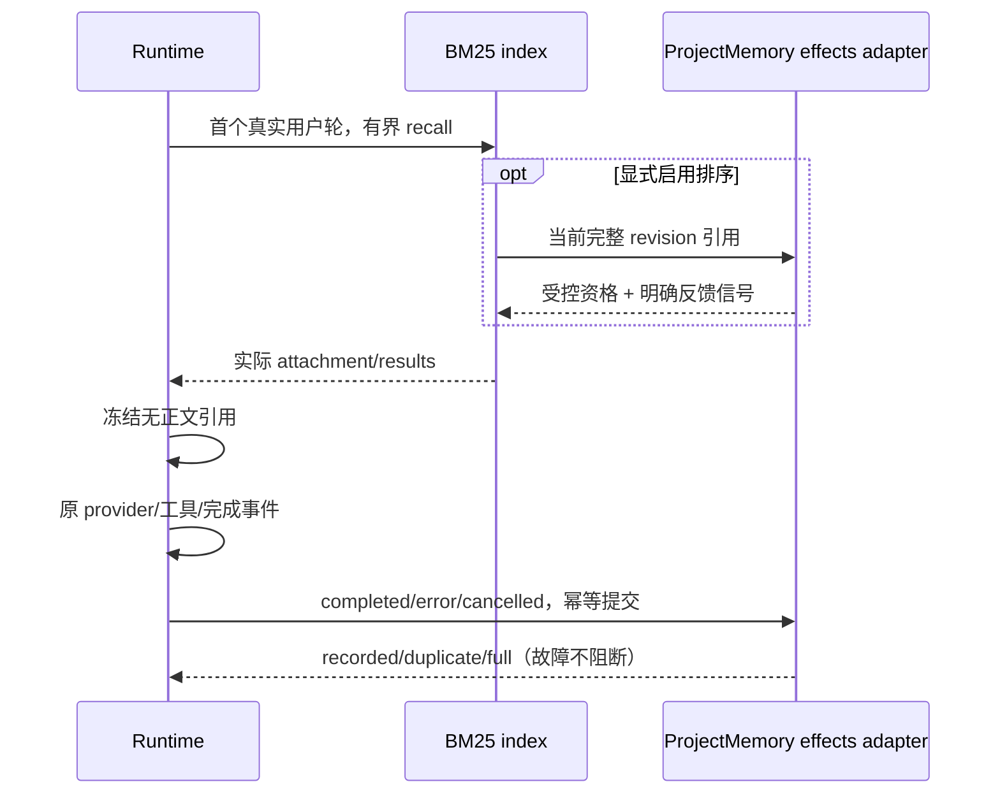

# 工作区记忆效果观测与排序实验

日期：2026-10-10。L0/L1 实施契约；遵循 `workspace-memory-intelligence-implementation.md` 的内容所有者、外部编辑器、独立审核、CAS 与自动维护开关。

## 产品规则与所有者

- 原 Markdown 是内容事实，SessionStore/执行事件是完成与验收事实。Runtime 冻结实际注入引用，Node Project Memory adapter 在同一根的 writer lock 下幂等保存观测；不增加正文写入路径、详情页或模型请求。
- `memory.observationEnabled`、`memory.rankingExperimentEnabled` 均默认 false，可通过已有 JSON 配置开启；仅新建/冷恢复 Runtime 物化配置。关闭观察停止新增记录；关闭排序立即恢复新 Runtime 的原 BM25。关闭观察不会停止原自动提取，原维护开关仍控制维护请求。
- 首个真实用户轮召回后只记录实际 attachment 中的最多 4 个条目，保存相对路径、完整原始字节 hash 或 unknown、匹配数量、注入字符量。没有完整 hash 的条目可观察，但不能参与排序。不保存正文、query、纠正原文、命中词或工具输出。
- 命中数量是有界计数，超过 4000 时饱和为 4000；大查询与完整读取的大记忆不能因命中词数量超限而丢失整轮注入观测。注入字符量仍是实际 attachment 的字符数。
- 完成、失败、取消分别记录；普通完成不是验收通过。verification 缺省 unknown，真实核验需独立事件引用，标明 model/strict-evidence 依据；legacy 请求故障默认放行仍为 unknown。Goal 核验晚于普通完成时追加独立记录，read 派生当前核验状态，不改首次观测。重复完成、冷恢复不重记；相同 session/turn 的冲突数据被拒绝，不覆盖。
- 每根最多 500 条完成轮记录、500 个反馈、500 个核验关联、总序列化 4 MiB；容量满停止新增，不删正文、journal 或旧观测。损坏、权限和观察写失败只给有界脱敏诊断，不阻断主轮或回退整库召回。
- `MemoryHistory(action=effects)` 是只读诊断；`feedback` 是按实际注入记录和内容版本给出的显式 relevant/irrelevant/correction 反馈，必须获得每次用户应答（alwaysAsk、approvalSource=user），不允许自动化/子代理/无审批客户端调用。此批准只表示该条反馈，不改变已有无感记忆维护规则。
- 不把所有召回条目分摊任务成功/失败。L1 仅消费明确 relevant/irrelevant/correction；负反馈绑定当时版本，不继承给新内容；关闭 L1 保留记录。

## 排序资格与保护

- BM25 正相关是资格门槛，实验仅在原分数上乘 `[0.8, 1.2]` 的有界因子，不删除/holdout/退役条目。
- 排序资格由受控 committed journal、已保存独立审核的 accepted item 和 `rankingEligibleItemIds` 共同证明，并要求完整 hash 对应当前文件；正文自填 provenance/approved 不授信。旧审核缺此字段默认不参与。
- 独立审核在现有第二次请求中可选标注非指令、非偏好、非显式项目/架构约束的可复用观察经验；不新增请求。仅 `metadata.type=reference` 可获资格，user/feedback/project、无类型、未知来源永远维持原分数。
- eligible 分类仍是 AI 判断，不能保证绝对语义正确；显式否定分类、类型保护、版本校验和默认关闭共同收窄作用。此实验不证明因果提升，效果需独立配对 benchmark；未做真实付费评测时不得报告收益。

## 接口与事件顺序

`FileSystemPort.projectMemory.effects?` 是可选窄端口：recordTurn、recordVerification、read、recordFeedback、rankingSignals。旧 adapter 无能力时继续 BM25/主轮。scope key 沿用 identity-first 规则后仅存 hash；根的 owner 记录拒绝跨 scope。

Desktop continuous 与 Web remote replayable 仍消费原完成事实；效果记录发生在目标 CLI 根，不新增 Renderer/Host/relay 队列。远端自动提取支持范围不扩大。观察控制文件不进入 recall，旧 memory-state 目录兼容增加单一 `effects.json`，无数据库 migration。

## 验收场景

1. 同轮重复/新 adapter 重读为 duplicate；同路径不同 identity 拒绝；不同 memory root 独立。
2. record 满额/字节超限/取消/损坏/写失败保留旧文件与正文；主轮继续，观察零模型请求。
3. attachment 有截断/完整 hash 缺失时只观察；普通 completed 与工具失败都不自动记 helped/hurt。
4. 仅已独立审核 reference 经验且 committed revision 一致可加权；伪造正文 metadata、普通 Write、旧审核、user/project/feedback、不匹配 query 不获资格。
5. 同一反馈命令重复不重计；反馈目标不在该轮实际注入中拒绝；模型/自动化不能绕过用户应答；新 hash 不继承旧处罚。
6. 关闭开关/旧 port 不发生观测或排序 IO；故障退回原 BM25；取消与错误收尾可记录但不误记验收通过。

定向测试使用临时独立目录与 fake model，不访问生产记忆或供应商。实际执行结果在交付时记录；本契约不声称已完成质量收益评测。
