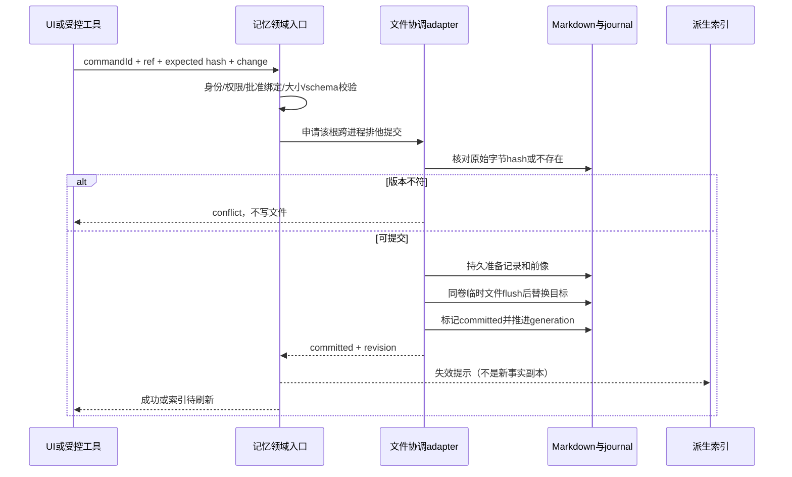

# 工作区记忆与索引治理

状态：原完整规划；本轮按 [首版实施契约](./workspace-memory-intelligence-implementation.md) 有序落地。2026-10-02 用户排除内置正文/来源/类型详情，保留外部编辑器，并将复盘改为无感AI确认自动应用，不逐条用户批准。本文相关旧UI与审批条目由最新实施契约替代；归档、跨机等后续批次不因此标记已完成。总路线见 [工作区智能增强方案](./workspace-intelligence-roadmap.md)。

## 1. 产品目标与不做事项

用户应能回答四个问题：“这个工作区记住了什么？为什么记住？本轮为什么召回它？过时或错误时怎样修正？”

首版不做云端记忆同步、团队共享库、向量数据库、知识图谱、扫描所有历史会话、把所有项目记忆注入提示词。workspace-scoped 的 `user` 类型也仍属于该工作区，不因为名字叫 user 就自动升级为跨项目全局偏好。

### 首批用户故事

- 打开当前工作区的记忆面板，看到正文、类型、来源、更新时间与索引状态，不再猜哈希目录对应哪个项目。
- 修正一条错误经验时先看差异；另一会话已修改则收到冲突，不覆盖对方结果。
- 看到本轮使用的记忆条目及匹配理由；能标记不相关，不能让这次负反馈悄悄删除长期事实。
- 复盘发现过时结论时生成替换/归档提案，用户确认后才改变活动记忆。

## 2. 当前实现与差距

| 已有事实                                       | 证据                                                                                            | 本方案采取的动作                           |
| ---------------------------------------------- | ----------------------------------------------------------------------------------------------- | ------------------------------------------ |
| 根目录按 identity 优先、path fallback 解析     | `core/src/memory/project-root.ts:10`                                                            | 复用解析函数，不造第二套工作区 hash        |
| `MEMORY.md` 有界指针索引，topic 是正文         | `runtime/methods/context.ts:168`、`memory/index-content.ts:13`                                  | 兼容旧文件，保留有界上下文                 |
| 普通 Write/Edit 与后台提取均能写记忆           | `tool/executor/memory-file-permission.ts:19`、`runtime/helpers/project-memory-extraction.ts:32` | 纳管受控写入，不宣称已有唯一 writer        |
| 提取调度按 runtime 串行，cursor 在内存         | `memory/extraction.ts:85`                                                                       | 工作区提交协调与复盘水位分开补齐           |
| 召回递归扫 topic，不靠 MEMORY.md 枚举          | `memory/recall/manifest.ts:60`                                                                  | 不让索引页维护错误直接决定事实存在与否     |
| BM25、metadata boost、中文 bigram、top4 已存在 | `memory/recall/ranking.ts:9`、`project-memory-recall.ts:29`                                     | 先改质量与可观察性，不替换检索栈           |
| mtime 参与缓存复用，索引页主要在初始化读取     | `project-memory-recall.ts:62`、`context-refresh.ts:21`                                          | 增加内容版本核验及下一轮刷新契约           |
| 管理接口只 list/read 本地 profile              | `packages/services/src/memory/memory.ts:24`                                                     | 加作用域明确的新接口，保留旧接口兼容       |
| UI当前只有文件目录和外部编辑器入口             | `MemorySettingsViewer.tsx:92`、`SettingsPage.tsx:1825`                                          | M1复用稳定读取实现，增加递归scoped读取契约 |

上述 CLI 相对路径均在 `apps/lcode-cli/packages/` 下；UI 位于 `packages/ui/src/`。现有规则参照 [memory-recall-topk-injection.md](./memory-recall-topk-injection.md)、[session-context-workspace-isolation.md](./session-context-workspace-isolation.md)、[session-history-auto-recall.md](./session-history-auto-recall.md)。

## 3. 身份与作用域

### 3.1 拟议输入契约

以下为语义草案，实施时复用已存在的 workspace/ref 类型，不创建同义类型体系。

```ts
interface MemoryWorkspaceRef {
  workspacePath: string;
  workspaceIdentity?: string;
  remoteSessionId?: string;
}

interface MemoryEntryRef {
  workspace: MemoryWorkspaceRef;
  relativePath: string; // 仅 owner 校验后的 memoryRoot 内 Markdown
}
```

`workspaceIdentity?.trim() || workspacePath` 只作为公共身份规则；memoryRoot 的实际目录名仍由现有 `resolveProjectMemoryRoot` 得出。不得让 Renderer 提交绝对 memoryRoot，也不能把 `ProjectMemoryWorkspaceSummary.id` 的旧目录名冒充 workspaceIdentity。

### 3.2 首版规则

1. 工作区入口带精确 ref，owner 解析当前本地 memoryRoot；默认选当前工作区。
2. 全局设置保留“本机全部记忆目录”浏览，旧目录无法可靠映射时显示“未关联”，用户可只读查看；禁止靠 slug/显示名称反推身份或自动合并。
3. 本地有 identity 的项目改路径不改变逻辑归属；无 identity 的搬迁必须显式迁移预览，原目录不自动删除。
4. 远程目标在 M1/M2 未接入新能力时显示 `unsupported/offline`，不能读本地同路径目录。支持远程后的解析和读写发生在目标 owner 机器，不把远端路径交给本机 FS。
5. 子代理的 `agent-memory` user/project/local 根不在本轮迁移范围；其现有隔离保持不变。

## 4. 内容与元数据：兼容 Markdown，不制造第二事实库

### 4.1 内容模型

保持一条可复用经验一个 topic 文件、`MEMORY.md` 只保留索引的原则。现有 `name/description/metadata.type` 继续有效。新字段放入版本化的 `metadata.lcode` 命名空间，示例如下：

```yaml
---
name: sample-project-rule
description: 这条经验在什么情况下相关
metadata:
  type: project
  lcode:
    schemaVersion: 1
    memoryId: "<generated-id>"
    provenance: explicit-user
    createdAt: "<ISO-8601>"
    verifiedAt: "<ISO-8601>"
    validUntil: null
    tags: [build]
---
```

- 示例不是真实用户数据。旧文件缺少新字段时正常读取，显示 `legacy/unverified`；不自动重写全库。
- `memoryId` 在首次受控提交时分配，重命名保持稳定；旧条目在未迁移前仍可用相对路径定位。
- `type` 沿用 user/feedback/project/reference。`provenance` 区分用户明确陈述、受控提取、已审复盘、外部编辑；它是来源描述，不是权限。
- `validUntil` 仅用于时效事实。稳定偏好、经验与架构约束不统一按30天衰减，更不按文件修改时间静默删除。
- 模型写入 `provenance: approved` 或类似文本不构成批准。批准者、批准来源、before/after hash、commandId 由 owner 审计记录绑定；正文不能自授信任。
- 来源定位记录 sessionId、有效分支/边界 messageId、相对文件与 revision、已执行检查引用；不复制完整会话、秘密或真实第三方个人数据。
- 解析失败的新受控提交返回结构化错误；旧文件可按纯文本预览，但不能在未校验后被自动晋升。

### 4.2 状态位置

```text
项目作用域目录/
  memory/                 当前活动 Markdown；沿用现有真实根目录
    MEMORY.md
    *.md
  memory-state/           拟议、与 memory 同级；不进入召回枚举
    journal/              操作记录与恢复状态
    preimages/            有界、受访问控制的撤销前像
    archive/              明确归档的非活动条目
```

这是逻辑布局，实际根由 owner 派生，不允许调用者拼接。journal 是审计/恢复依据，不成为当前正文查询事实源；前像和归档不注入模型。复盘提案由复盘服务持久化，不能放进活动 `memory/` 等待批准。

默认仅保留最近30天且最多100次受控变更、总前像上限20 MiB；这是拟议初始上限，实施测试可调整并公开。清理不能删活动正文、未决冲突或未完成恢复所需前像；空间不足时拒绝新受控修改并给出原因，不静默丢失可撤销保证。用户可显式导出后清理。

## 5. 写入一致性：先单文件，再考虑多文件事务

### 5.1 最小受控提交契约

M2a 首版只交付 create/replace、条件撤销和索引治理，每次提交一个条目。archive/restore 独立为 M2b，须先补齐本节的归档版本与恢复矩阵；未完成前复盘归档候选只展示，不开放应用。选中多个复盘候选时逐项返回结果，不声称整批原子成功。

```ts
type ExpectedMemoryRevision = { kind: "absent" } | { kind: "sha256"; value: string };

interface MemoryMutation {
  commandId: string;
  entry: MemoryEntryRef;
  expectedRevision: ExpectedMemoryRevision;
  operation: "create" | "replace"; // M2a；归档/恢复在M2b独立契约中声明
  content: string;
  proposalId?: string;
}

type MemoryMutationResult =
  | { status: "committed"; changeId: string; revision: string; indexState: "ready" | "stale" }
  | { status: "unchanged" }
  | { status: "conflict"; currentState: ExpectedMemoryRevision }
  | { status: "rejected"; code: string }
  | { status: "recovery-required"; changeId: string };
```

hash 是完整原始文件字节的 SHA-256，不是仅 mtime+size，不声称 OS 提供跨外部程序 CAS。应用侧身份、路径、权限、命令去重、审批 revision 均须由 owner 校验。

### 5.2 接线原则

- 在 `@lcode/contracts` 新增记忆领域 port/DTO，core 定义规则与命令，adapters 实现文件/journal/跨进程协调；通过已有 DI 注入，Service 不 import Runtime 实现。
- Host `IMemoryService` 扩展管理接口并经公开 CLI workspace-memory 请求调用同一领域入口。首版写入要求目标现有 workspace CLI 可用；没有连接时只读浏览仍可用，写按钮说明需打开工作区，不偷偷创建 Agent 会话。
- 主代理、memory loop、普通后台执行器的受控 Write/Edit 若目标是 Project Memory，统一路由到该领域入口；普通代码文件仍走原端口，不把整个文件系统重构为记忆数据库。
- memory loop 的受控写入不再执行裸 `Bash rm`。M2a只交付create/replace，删除意图返回“归档尚不可用”并保留原文件，不中断主turn；M2b再接入有恢复记录的领域归档操作。这是明确的提取工具行为变更，实施时须同步原spec与测试，不声称与旧删除行为完全相同。同条目多个tool call按调用顺序串行，不能 `Promise.all` 竞争覆盖。
- headless CLI 通过相同port + adapter运行，不依赖Electron服务。不同进程共享同一根时必须参与相同的提交协调。
- 提取器的“本轮已直接写记忆则跳过”与水位推进应消费真实committed/unchanged结果，而非仅看出现过Write/Edit调用；失败调用、删除尚不可用、冲突不能伪装成已固化成功。该调整须补 extraction 回归，保留已完成快照/分支边界。

### 5.3 提交顺序



协调实现必须选可证明的单写者机制，不用“锁超时到了就抢”的启发式。首版采用每根短临界区的跨进程排他锁；持锁者身份和进程退出检查用于恢复，进程暂停/存活不等于死亡。Windows 的 PID 重用、junction/大小写/文件占用需测试；无法证明原 owner 已退出则返回忙/需恢复，不强抢。网络共享文件系统不承诺同等锁语义，首版拒绝受控并发写或只读。

任何 file-lock 实现都必须在将来编码前核对现有依赖和 adapter 能力；优先复用已经能满足这些条件的实现，不为规划预先安装库。

### 5.4 崩溃、撤销与外部修改

- M2a journal的beforeState为 `absent | sha256`，afterState为正文sha256；create的beforeState是absent，不能用空字符串hash代替。
- 准备记录存在、目标仍符合beforeState：判定尚未提交；目标不存在时只对create成立，replace目标意外消失则进入需恢复。
- 目标等于after hash：补结算记录与generation，不重复写。
- 目标既非 before 也非 after：标记 `recovery-required`，保留各方内容，不盲目覆盖或回滚。
- Windows rename/replace 因文件占用失败时明确失败；受控记忆提交不得使用现有“rename失败后 O_TRUNC 原地覆盖”退路。
- 撤销是新命令，仅在当前内容仍等于被撤销变更的after hash时应用前像；否则冲突预览。M2a只允许撤销replace；撤销create会使活动文件不存在，须等M2b具备归档/删除恢复矩阵后开放。撤销不删除审计事件。
- 外部编辑器不遵守锁，任意 Bash/MCP/脚本也可能绕过端口。这些是外部写入，重新读取并标记外部变更；首版**不保证零竞争窗口或可撤销所有外部修改**。
- 对无人监督复盘/受控 memory loop，通过能力白名单去掉绕过写路径；对用户显式全权限会话不能靠命令黑名单伪造沙箱。若将来要求真正强制所有写入，另做 OS 隔离设计，不夹带进此批次。

### 5.5 M2b归档与恢复的契约

M2b是独立批次，不能凭“归档只是rename”跳过验收。拟议归档命令携带 `commandId/entry/expectedRevision`；恢复命令额外携带不可变 `archiveVersionId` 和活动路径的预期状态，首版恢复只允许活动路径absent，不覆盖同名新文件。journal明确记录 `beforeState/afterState = absent | sha256`，以及归档副本hash。

- 归档：持排他提交锁核验活动hash；先将原文写入同级非召回archive的不可变版本并flush；写准备记录；再移除活动文件；标记committed并推进generation。必须先有可验证副本再移除，失败不得丢失唯一正文。
- 崩溃时归档副本存在、活动文件仍为before hash：判定尚未移除，不对外报已归档；活动已absent且副本hash正确：补结算；活动出现其他hash：保留双方，进入recovery-required。
- 恢复：校验archiveVersionId确属同scope且副本hash匹配，确认活动路径absent；临时文件原子替换后补结算，保留归档历史。活动路径已有文件即冲突，禁止覆盖。
- 归档前像、移除动作、MEMORY.md指针清理并非一个OS事务；运行中的召回在根提交临界区内不读取，或检测未决提交后跳过，不能将过程中的副本重复视作活动事实。外部编辑仍属于不遵守锁的边界。
- M2b测试必须覆盖上述每个断点、same-path新文件、跨scope archiveVersionId、Windows占用与撤销create。未完成前归档按钮禁用，复盘候选仅可查看。

### 5.6 MEMORY.md 的兼容处理

不把 topic 写入和 MEMORY.md 的更新假装成一个文件系统事务。topic 是当前正文事实，指针索引是有界投影：

1. M1 只显示索引缺项/断链，不改文件。
2. M2 用户明确启用“维护索引”后，仅维护生成区块；既有人工文本原样保留，不能覆盖未知用户内容。
3. topic 成功后再更新有界指针；索引更新失败返回 `committed + indexState:stale`，下次可修复，不回滚正确正文。
4. 项目召回继续扫描活动 topic，不因 MEMORY.md 指针遗漏丢失事实。
5. 上下文索引的更新只在下一 turn 构建时生效，不在同一 provider 请求中途修改 prefix，也不改 canonical history。
6. 重命名首版不开放一键操作；用经过审批的显式迁移实现，避免同时更新多个 `[[name]]` 链接时承诺不存在的多文件原子性。

## 6. 索引治理与检索解释

### 6.1 保留当前边界

沿用最多200文件、每文件64 KiB、4 MiB候选总预算、读取并发8、top4、单项4000字符、总附件12000字符的初始上限；实施时以当前 `constants.ts` 再校准并同步 spec。上限不是“最多可以拥有200条记忆”，超出时 UI 必须显示“部分索引”，不能显示完整健康。

### 6.2 正确性优先的失效规则

- 受控提交推进 root generation，当前 runtime 收到事件仅做失效；其他 runtime 下次召回也核验持久 generation。事件丢失不能永久保留旧事实。
- M2 基线方案：每个符合条件的真实用户 turn，对有界候选做内容读取/hash复核，正文 hash 相同才复用解析结果。不把相同 mtime 视为相同内容。
- 读取前后核对root generation及未决提交标记；写入尚未推进generation时也不能把中间状态当稳定快照。索引读取与根提交临界区协调，发现pending mutation就跳过受影响条目；提交完后最多重读一次，仍变动则本轮不注入并报告原因，不用超时返回旧正文。
- 文件新增/删除/归档、权限变更、无效链接、超预算分别有计数；错误/过期条目不能继续注入旧缓存。
- watcher 和文件 stat 只能作为性能提示，不能作为外部编辑正确性的唯一依据。若基准显示全量有界 hash I/O 超预算，再在不削弱上述语义的前提下引入 adapter 提供的可靠版本能力。
- “重建索引”只是清除并重建派生数据，不改活动 Markdown。首版诊断/重建针对选定 ready runtime，界面显示其观察版本；不能暗示一个按钮同步修好了所有离线进程。

### 6.3 排名增强

1. 先复用 BM25/tokenizer，补充正确的 schema/type/description/tags 输入，不新增 embedding 服务。
2. 对 positive lexical match 才允许有限 pin/metadata 加权；置顶不是每轮强制注入，也不是更高优先级指令。
3. `validUntil` 过期条目默认不自动注入，面板仍可查看并提交重新验证提案。普通稳定条目不按更新时间衰减。
4. `[[name]]` 首期只用来发现断链、冲突和帮助浏览，不把一跳关联无条件带入 prompt。是否扩展召回必须先有离线评测。
5. 同一事实存在矛盾候选时不让模型静默选胜者；复盘生成带来源的冲突提案。搜索结果可并列显示“待澄清”，自动注入仍遵守状态和预算。

### 6.4 可解释结果（拟议）

返回 `entryRef/revision/matchedTerms/metadataMatches/score/rank/truncated/indexedCount/scanLimitReached`；不返回凭据路径。UI 展示“命中文件名/描述/正文、条目状态、来源”。对真实 turn 的回顾只留条目ID、revision和计数，不把正文复制到长期 telemetry。

“无帮助”反馈由用户主动提交，先存为反馈事件；单次未使用不删除记忆，也不靠模型自评分直接改变权重。

## 7. UI 与服务接口

### M1：读为主

在已有 MemorySettingsSection 上增加工作区内入口；宽屏为列表+详情，窄屏为列表点入详情，返回保留检索与滚动位置。详情含正文、frontmatter解释、来源定位、当前/未关联 scope、索引健康。复用既有 Markdown 展示、Button、Dialog、DiffViewer，不另建组件库。

M1复用现有稳定读取和路径保护实现，但新增受scope校验的 `listEntries/readEntry` 公共接口，支持有界递归的relativePath。旧 `listProjectMemories/readProjectMemoryFile` 仅枚举顶层并拒绝带路径分隔符的fileName（`memoryService.ts:139–155、205–211`），保留给旧调用者，不能直接承诺它能展示递归召回的全部条目。新接口先校验ref→root映射，再规范化relativePath、拒绝链接逃逸，递归预算与召回一致；截断时显示范围和原因。

M1的“健康”只指目录/schema/索引页断链检查；实际runtime的召回统计和重建能力在M2a交付前显示“未观测”，不伪装成全库健康。快速切换工作区时按请求identity丢弃过期响应，不以timeout掩盖竞态。Web/手机第一阶段保持现状的平台门禁；待workspace-scoped服务装配到replayable Host后再开放相同只读面板，不把本机全profile目录暴露给远程目标。

### 按批次新增的公共接口

以下名字均为新增，不是已有API。`resolveWorkspaceMemory/listEntries/readEntry`随M1交付；索引观察、apply/undo随M2a交付；archive列表/操作随M2b交付：

| 操作                                                          | 验证与结果                                         |
| ------------------------------------------------------------- | -------------------------------------------------- |
| `resolveWorkspaceMemory(ref)`                                 | owner 返回能力、scope、只读原因；无 scope 不猜目录 |
| `listEntries(ref, cursor)`                                    | 有界列表、archive过滤、完整性/分页状态             |
| `readEntry(ref)`                                              | 稳定读取、原始revision、preview上限                |
| `getIndexStatus(ref)` / `previewRecall(ref, query)`           | ready runtime 的派生观察；不调用模型               |
| `applyMutation(change)`                                       | 严格身份、授权、hash、幂等；受控写单一入口         |
| `listChanges(ref)` / `undoChange(changeId, expectedRevision)` | 元数据审计、条件撤销，无凭据明文                   |
| `invalidateIndex(ref)`                                        | 不改事实，不启动新Agent或全库模型摘要              |

协议经 `packages/shared/src/lcode-protocol/index.ts` 和对应 CLI contracts/handlers 扩展并做 schema 校验；UI 通过 hooks，client/服务代理按公开入口接线。管理应用不深导入 `ProjectMemoryRecallIndex`。

## 8. 分批文件落点

| 批次          | 修改已有文件/模块                                                                             | 拟新增内容                                          |
| ------------- | --------------------------------------------------------------------------------------------- | --------------------------------------------------- |
| M1 scope/预览 | `services/src/memory/{memory,memoryService}.ts`；UI `MemorySettingsSection/Viewer` 与hooks    | scoped递归list/read契约、详情UI、范围/切换/读取测试 |
| M2a提交       | CLI `contracts`、`core/src/memory`、`adapters/src/fs`、工具Write/Edit、memory loop            | 单条mutation port、journal/锁adapter、冲突/恢复测试 |
| M2b归档       | 同一记忆领域port、adapter、管理UI                                                             | archiveVersionId、absent状态、归档/恢复矩阵         |
| M2 索引       | `memory/recall/{document,manifest,ranking,project-memory-recall}.ts`、runtime context refresh | 状态解释/版本核验、失效事件、评测fixture            |
| M2 管理接线   | shared协议、services/client、UI diff/历史                                                     | 拟议apply/undo/index公共接口与schema测试            |

实现前运行 architecture check 并读取目标模块 context；不跨包深导入 core 私有文件，不因功能横跨多层另建平行 state store。

## 9. 验收与测试

全部为计划验收，未实施即不得标记通过。

| ID     | 前置/动作                             | 必须断言                                            | 类型         |
| ------ | ------------------------------------- | --------------------------------------------------- | ------------ |
| MEM-01 | 两个同名工作区、相同路径不同identity  | scope/目录/条目不串用；未关联目录不猜归属           | 服务+协议    |
| MEM-02 | 快速从A切到B，A读取晚返回             | B页面不展示A正文或索引状态                          | UI E2E       |
| MEM-03 | 旧frontmatter/未知字段/坏YAML         | 可预览旧内容，坏新提交拒绝，未知字段不丢失          | parser       |
| MEM-04 | 两个进程基于相同hash写同文件          | 一次提交、一次冲突，无覆盖                          | adapter并发  |
| MEM-05 | 预期不存在的文件被他人创建            | create返回冲突，不覆盖新文件                        | adapter      |
| MEM-06 | journal准备后/替换后杀进程            | 重启按hash确定结算；第三方变化进入需恢复            | 故障注入     |
| MEM-07 | Windows文件占用、junction、大小写别名 | 不O_TRUNC，不越根，不双重锁身份                     | Windows集成  |
| MEM-08 | 外部编辑保持mtime/size                | 下次有界hash核验看到变化；撤销旧提交冲突            | 索引/adapter |
| MEM-09 | topic提交成功、MEMORY.md更新失败      | 事实仍可召回，显示索引待刷新，不假报整批失败/全成功 | 集成         |
| MEM-10 | 候选超过200/4MiB，文件过大/无权限     | 有界IO与明确部分索引，无旧正文泄漏                  | 单测         |
| MEM-11 | 归档/过期/待批准提案                  | 不自动召回；能在管理页查看非活动记录                | 集成         |
| MEM-12 | compact/failover/同turn工具步         | overlay不进入历史/摘要，不重复搜索，原预算不回归    | runtime      |
| MEM-13 | 关闭增强/旧版本读取                   | 活动Markdown可读、旧开关语义不变、无强制迁移        | 兼容         |
| MEM-14 | 顶层与嵌套topic、路径遍历和symlink    | M1有界递归展示真实条目，读取不逃逸，截断可见        | 服务+UI      |
| MEM-15 | M2b归档各断点、恢复时同名新文件       | archiveVersionId可验证，不丢唯一正文，不覆盖新文件  | 故障注入     |
| MEM-16 | M2a收到提取器删除意图或归档提案       | 返回能力不可用且保留原文，不执行Bash删除            | tool+runtime |

### 已有测试入口（本轮没有执行这些记忆测试）

```bash
pnpm --dir apps/lcode-cli exec node --import tsx --test packages/core/src/memory/extraction.test.ts packages/core/src/memory/recall/project-memory-recall.test.ts packages/core/src/runtime/methods/turn-memory-recall.test.ts
pnpm --dir apps/lcode-cli exec node --import tsx --test packages/core/src/session-context/session-history-search-snapshot.test.ts packages/adapters/src/storage/session-store/transcript-snapshot.test.ts
pnpm --dir apps/lcode-cli bench:session-recall
```

先按目标包 manifests 建好必要依赖与公开包产物；不能拿旧 dist 的通过代替源码验证。现有 session recall bench 只证明历史搜索，不证明项目记忆增强；需新增独立的项目记忆fixture和benchmark入口并纳入manifest。

拟议项目记忆评测集：不少于40条中英文人工标注查询，覆盖路径/标识符/无匹配/过期/冲突/注入文本；固定 seed 与人工相关性标签，不用被评模型自评分。初始门槛为 precision@4 ≥0.80、无关查询误注入率 ≤0.10、跨身份命中为0。记录200文件/4MiB上限语料的冷/热路径p50/p95/p99；目标为参考机热路径p95 ≤150ms、p99 ≤300ms，并披露硬件与冷启动。该目标是拟议验收，不是本轮性能实测。

## 10. 迁移、回退与边界

- M1 无正文迁移；M2 按首次受控修改懒迁移新元数据，迁移前留前像。
- 关闭增强保留Markdown、提案与审计；停止新增后台写入，不删除用户知识。
- 老版本不理解sidecar时仍能使用活动Markdown；归档文件不放在原召回目录。不能降级时自动把全部前像还原。
- 跨主机同步、rename全图更新、多个文件强原子事务、对任意shell强制写保护均明确暂缓；不以这些未实现能力作为首版正确性的隐含前提。
