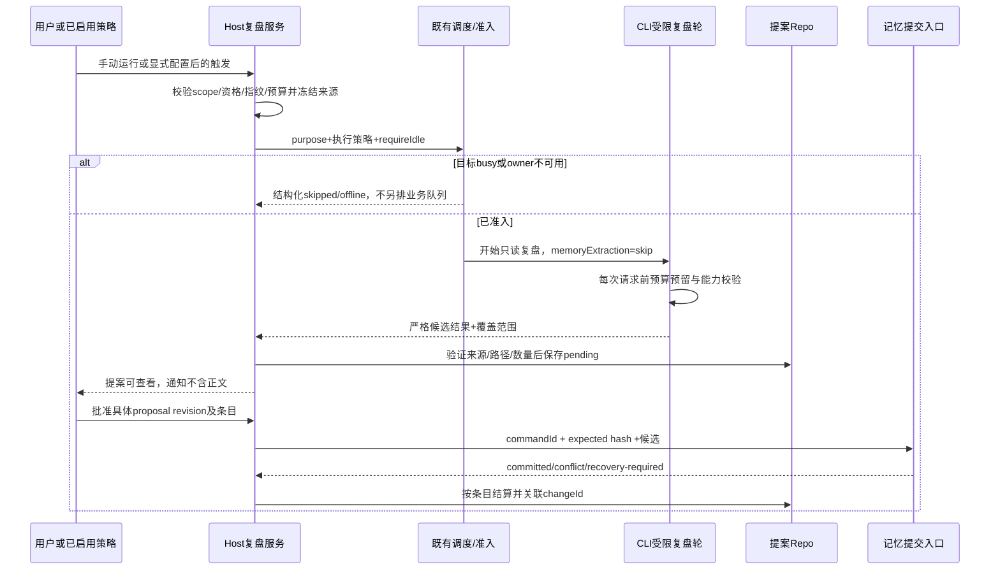

# 可审查的工作区复盘与有限自我改进

状态：2026-10-02 用户最新决定覆盖本文旧审批设计：改为会话结束后无感整理、独立AI校验、通过统一记忆入口自动应用，不逐条让用户批准。最新有效规则以 [首版实施契约](./workspace-memory-intelligence-implementation.md) 为准；本文旧“requireApproval/用户批准/默认关闭自动应用”章节仅作历史规划，不得作为当前实现依据。外部编辑器保留，cron/OffPeak平台调度与归档恢复仍后续。

## 1. 给用户的能力，不使用模糊的“自动进化”承诺

首版提供“整理这个工作区的近期经验”：从明确范围的真实会话和当前记忆中，找出可复用经验、重复/过时记忆和未完成事项，生成可追溯提案。用户确认后才应用到记忆。代码、配置、技能、权限、系统提示词的变化只生成建议，不直接执行。

三类能力必须分开：

| 能力                       | 当前/拟议          | 写入规则                                                             |
| -------------------------- | ------------------ | -------------------------------------------------------------------- |
| 成功 turn 后的自动记忆提取 | 已存在             | 继续受现有开关控制，逐步接入统一提交协调；不是本方案新建的“自我进化” |
| 手动或调度的跨会话复盘     | 本方案新增         | 只读证据，输出提案，默认需要用户批准                                 |
| 自动应用低风险候选         | 后续可选，默认关闭 | 单独产品开关与硬规则，不由复盘模型自己决定                           |

本方案不为了新增“安全模式”静默关掉原有功能。迁移时分别显示“轮后提取”和“跨会话复盘”，说明已有轮后提取可能直接写记忆；启用提案制复盘不会自动批准任何写入。

## 2. 当前可复用实现及不能假设的能力

- `runtime/helpers/project-memory-extraction.ts:32`：已有轮后调度、分支快照、最多5轮提取；`memory/extraction.ts` 的cursor与pending属于单runtime。
- `runtime/methods/turn-complete.ts:117`：已有 `modelExecution.memoryExtraction='skip'` 控制，可用于复盘轮防止二次隐式提取。
- `packages/desktop/src/host/index.ts:536`：OffPeak 已显式设置 skip；普通 cron 分支 `:932` 当前未设置。
- `AutomationService/AutomationRepo`：已有定时定义、运行台账、认领、重试和错过处理。
- `OffPeakTaskService/Repo`：独立服务器票据队列，有资格、额度、模型限制；不等同 cron，也不是“本地电脑闲置”。
- `CommandInbox` 和 `admitPrompt(requireIdle)`：已有幂等/准入；仅能原子证明目标session状态，不能证明整个电脑或所有Host都空闲。
- 当前自动轮次工具门控不能当复盘安全边界。名单中的旧 `Workflow` 名称不覆盖所有现用工作流工具，普通文件工具也不因此只读。
- 当前 `IMemoryService` 只有 list/read，没有提案、批准或应用接口；Diff/Artifact 可复用展示，但不是现成记忆审计库。

## 3. 数据来源、有效证据与候选类型

### 3.1 输入范围

由可信Host指定scope、来源引用和预算，CLI通过SessionStorePort及现有有效分支投影生成有界证据快照，经新增严格的review snapshot公共协议返回/引用；Host服务不直接读取CLI数据库或import Runtime实现。模型只能使用冻结证据，不自行扫描整个磁盘：

1. 当前 workspace identity 的活动记忆快照，使用有界读取和明确revision。
2. 用户选择的会话，或调度策略覆盖范围内自上次水位后的有效会话分支。
3. SessionStore 中用户可见的输入/输出、可引用的工具结果摘要和实际检查结论；排除 reasoning、隐藏消息、synthetic回合、已撤回分支。
4. 不自动纳入其他项目、子代理私有记忆、凭据、环境变量、完整日志、未授权远端workspace。
5. 失败工具的“尝试”不能被学成成功经验；assistant声称测试通过不等于真实工具退出码通过。

首版默认范围为用户最近7天内、该工作区最多8个候选会话；每会话最多12,000字符、总计64,000字符，再按本次模型的token预算继续裁剪。上限达到显示 `partial`，不能把没读到的内容写成“没有未完成事项”。窗口和上限是拟议产品默认值，不照搬为当前搜索实现。

按每个session的有效分支/消息边界记录消费水位，而不是一个全局最新时间。被跳过/截断的较早会话不能被高水位吞掉；有界候选采用稳定排序和轮转cursor，积压在UI可见。分支重写后原证据失效，产生新的fingerprint，不沿用旧批准。

### 3.2 输出类型

- **经验候选**：明确用户偏好、已证实的项目约束、可复用故障原因/验证方式。
- **合并/归档候选**：重复内容、已过期事实、相互矛盾的记忆；不默默丢弃旧来源。R1只能应用create/replace，归档及多条合并中的删除步骤在M2b验收前仅展示建议；不能通过直接shell删除绕过。
- **待办候选**：会话明确未完成的事项，仅显示供选择；不自动建立任务/cron/OffPeak。
- **工程建议候选**：测试/工作流/技能模板改善，附代码位置与证据；不自动改源文件。

候选必须含来源定位、建议理由、before hash（新建则absent）、完整差异/新正文、目标relativePath、风险标签及证据覆盖状态。模型置信分不能单独决定是否自动应用。

## 4. 所有者与持久状态

### 4.1 拟议服务

在既有 Host 的 memory 领域增加 `IWorkspaceRetrospectiveService`（拟议名），对外只有能力查询、手动运行、策略设置、提案列表/详情、批准/拒绝、取消。实现通过公开Agent客户端协议调用CLI，不引用Runtime实现。

- AutomationService继续拥有cron定义与调度时间，OffPeakTaskService继续拥有服务器票据。
- 复盘服务只拥有用途策略、证据快照索引、提案、预算台账以及与既有run/session的关联，不建立第二个后台执行队列。
- CLI/runtime继续拥有已准入执行和每轮能力；记忆领域提交入口拥有应用事实。
- UI仅持表单/筛选/未提交审批草稿；刷新读取服务事实。

### 4.2 拟议记录

复用本地profile既有数据库访问/迁移体系，增加领域Repo；不将提案写进活动memory目录。表名是草案，实施时按当前迁移约定落地：

```ts
interface ReviewPolicy {
  workspace: MemoryWorkspaceRef;
  enabled: boolean; // 默认 false
  trigger: "manual" | "cron";
  automationId?: string; // 调度时间仍以AutomationRepo为准
  execution: "selected-model" | "offpeak-ticket"; // 后者仅R2b能力就绪且手动单次授权时可选
  modelSelection: unknown; // 实施复用现有严格ModelSelection schema
  sourceWindowDays: number;
  requireApproval: true; // R1/R2固定为true
  policyRevision: number;
}

interface ReviewProposal {
  proposalId: string;
  workspace: MemoryWorkspaceRef;
  runId: string;
  inputFingerprint: string;
  sourceWatermarks: unknown[]; // 实施定义有界session/branch/message/hash schema
  policyRevision: number;
  status:
    | "pending"
    | "applying"
    | "applied"
    | "partially-applied"
    | "rejected"
    | "stale"
    | "cancelled"
    | "failed";
  items: unknown[]; // 实施定义有界MemoryMutation候选schema
  revision: number;
}
```

上例 `unknown` 仅说明规划期要复用/补齐的类型，不允许直接进入生产协议。实施必须是严格判别联合、长度/数量/版本校验；跨进程同时更新shared schema与CLI contracts。R1/R2a仅允许selected-model；R2b首版只允许manual + offpeak-ticket，拒绝cron + offpeak-ticket组合，避免类型草案暗示已支持周期取号。

指纹由 workspace身份、确切来源水位/分支、记忆revision集合和policy版本确定；相同输入默认返回已有结果，不反复消费模型。用户明确“重新分析”可生成新attempt，但保留前次结果和费用关联。

已读水位、成功产出提案水位、已应用变更必须分开。用户拒绝提案后记录拒绝及原因，输入无变化不重复提示；新证据出现可以形成新提案，但旧拒绝不是自动允许。

## 5. 一次复盘的完整执行过程



### 状态机

运行状态：`requested → admitted → running → proposed | no-change | failed | cancelled | budget-exhausted`；准入失败为 `skipped-busy / unavailable / ineligible`，不是已经运行失败。R2b的票据失效另记 `ticket-expired`，不以普通failed触发自动续票。

提案状态与运行状态独立：`pending → applying → applied/partially-applied/stale/failed`，或 `pending → rejected/cancelled`。部分条目应用成功不可被一个布尔failed掩盖；已提交结果也不能因通知失败回滚。

批准必须是已认证桌面/手机UI对具体提案revision的动作。Bot只发送待处理提醒和打开链接，首版不提供聊天内批准。批准时重新验证scope、来源有效分支和各目标hash；等待批准期间变化即stale，重新生成或由用户手动解决。

## 6. 硬执行边界

### 6.1 purpose不是权限

增加可信Host生成的turn用途与执行策略，和 `automationId/offPeakTaskId` 正交。模型/Renderer传字符串 `purpose='memory-review'` 不能获得任何额外权限。策略只收窄原权限，绝不把只读会话升成yolo。

首版复盘执行只提供准备好的不可变证据包与受限读取，不需要Bash：

- 允许有界读取已选来源和指定memory条目。
- 禁止 Write/Edit/删除、Bash/解释器/REPL、网络、MCP、Agent、SendMessage、CreateWorkflow/AmendWorkflow/ResumeWorkflowRun、Cron和OffPeak创建/修改。
- 需要额外证据时输出“证据不足”，不能临时扩大scope。
- 采用现有模型调用/解析设施，结果经领域schema验证；模型不能直接写提案Repo，也不能拿通用Write把文件伪装成提案。
- 拒绝在实际执行边界生效，且在可能有副作用的hook前；目录隐藏、prompt约束、plan模式都不够。
- 在专用复盘session首次创建、恢复和首个模型请求之前，禁用用户、工作区及插件的可执行hook，包括 SessionStart、UserPromptSubmit、Pre/PostToolUse、Stop、compact等生命周期。合法Read也不得触发这些hook；固定的内部只读诊断不因此关闭。这是复盘执行策略，不修改普通会话/普通cron的hook配置。
- 原因与落点：`core/src/runtime/methods/hooks.ts:20–103` 的生命周期hook独立于工具执行器；`core/src/hooks/configured-runner-callback.ts:26–64` 可直接调用ExecutionPort。须在两条执行边界统一检查策略，而非仅拦模型工具调用。
- 批量调用、流式工具、桥接工具、重试/恢复都继承同一策略；禁止允许名称别名绕过。

### 6.2 契约落点

- CLI `core/src/runtime/types.ts` 的 ExecuteTurnOptions、contracts `events/session.events.ts` 的归因；若intent可持久恢复，同步 `contracts/interfaces/session.port.ts`。
- `packages/shared/src/model-execution.ts`、`lcode-protocol-v4/command.ts` 和 `lcode-protocol/index.ts` 的严格schema。
- `core/src/tool/executor/call-runner.ts` 统一执行门禁与 ToolExecutionContext；不在每个新UI按钮里独立维护权限。
- 普通cron复盘分支传冻结的modelSelection及 `selectionScope:'execution', memoryExtraction:'skip'`，不修改用户会话持久模型或权限模式。

## 7. 调度、忙时和OffPeak

### R1 手动

用户点“复盘”，使用明确模型和成本提示。采用单workspace关联的专用复盘session，不挤进用户当前聊天历史；新增taskType须排除出普通历史自动召回。该session存在不代表新建一个Host，仍在原CLI/runtime中执行。

同一workspace同时最多一个复盘run；Repo以输入指纹/活跃run作原子认领。target session的busy由CLI原子判断；用户主动任务优先。观察到同owner workspace内用户会话忙时可跳过，但不声称跨Host/整机idle；出现竞态时仍靠准入/预算保证安全。

### R2a 可选定期：先只接明确模型的cron

用户在设置中显式选择cron时刻、普通模型和成本策略后才创建关联automation。默认忙时跳过、不补跑积压；manual返回忙碌并保留重试入口。Host须将复盘专用的busy结构化为skipped，不沿用普通任务的transient指数重试去争抢资源。

电脑退出、Host不可用、系统休眠时不能保证执行；不新建OS常驻守护进程。错过时刻沿用已定义cron规则，不做“每次打开应用就补跑过去30次”。

### R2b 单次OffPeak：先补可信用途与续票契约

OffPeak选项在R2b验收前不可选，不作为R1/R2a的隐式后备路径。当前 `OffPeakTaskService.createTask` 可能在创建后立即唤醒调度，`ensureFreshTicket` 还会在票据过期后重新取号（`offPeakTaskService.ts:225–256、449–485`）。所以“先建普通任务，再补一条复盘关联”或“复用默认续票”都不满足本方案。

R2b必须完成：

1. 先冻结reviewRunId、workspace scope、policyRevision、只读capability、hook禁用策略、预算与inputFingerprint；在任务可被claim之前，通过受信服务API将用途关联同task记录原子持久化。缺失/无效关联则fail-closed，不派发普通yolo轮。
2. 若服务器取号先成功、本地事务失败，必须以现有可用结算/取消接口或明确的有界补偿处理孤立票据；不能遗留可被调度的普通任务。具体服务器补偿能力须在R2b实施前核实，未具备时此选项不开放。
3. scheduler dispatch及Host恢复都重新读取可信关联，不接受prompt中的用途标签；跨进程派发DTO增加reviewRunId/策略版本，预算ledger不随attempt恢复而重置。
4. 每个复盘attempt只允许一次取号。票据失效则该attempt终止为ticket-expired，关闭复盘任务的自动续票路径；用户明确重试才新建attempt并重新检查资格/配额。普通OffPeak任务的续票语义不改。
5. 无资格、额度耗尽、票据失效或等待过长均不静默改普通付费模型。无保证开始时间，也不承诺整条链无限次免费。
6. 不提供“每天自动免费复盘”的首版快捷开关，不让OffPeak模型轮递归建任务。取消不能保证已发provider请求费用归零；已取消run不能形成可应用提案。

复盘仍不依赖OffPeak默认yolo或现有工具denylist；专用硬能力策略与 `memoryExtraction:skip` 始终有效。

“本机空闲N分钟后自动运行”暂不作为首版触发。若将来需要，另通过平台能力采集明确idle信号，并定义跨平台/休眠/前台优先语义，不用没有输入的计时器假称整机空闲。

## 8. 预算与隐私

拟议初始上限：每workspace每日最多一个自动复盘attempt；单次最多3个模型请求、累计估算输入24k tokens、累计输出4k tokens、最多10条候选、总候选正文64k字符。来源读取还受上文独立字符/条目上限限制。

每次provider请求前由owner预留剩余额度并设置max output；请求后按实际usage结算。超预算不再发新请求。compact、重试、failover、辅助请求都算在同一ledger，不能换模型重置计数。价格未知时不显示伪精确人民币预算；明确显示token边界和费用估算性质，provider计数差异及最后一个在途请求可能造成有限偏差。

5分钟墙钟上限仅用于发出abort并等待真实清理，不等于按时成功，也不能在请求仍运行时释放执行锁并启动第二轮。超时、用户取消、进程退出产生不同终态；恢复时先查询已有run状态，不重复发送。

用户开启前展示会把哪些本地记忆/会话片段发给哪个模型服务。默认不含工具原始大日志、认证材料、真实第三方个人数据；疑似秘密候选直接隔离并让用户选择，不依靠模型自己承诺脱敏。脱敏检测是辅助防线，不宣称能发现一切秘密。

## 9. 提案UI与“自我改进”闭环

在记忆面板增加“复盘提案”页签，复用现有Markdown/Diff展示；自动化页只链接已有run/history，不复制提案状态。

每条显示：建议类型、来源按钮、适用范围、before/after、验证状态、为什么值得保存。用户可以逐条批准/拒绝/改写；改写pending候选须按proposal revision做CAS并生成新revision，旧批准令牌随即无效。批量操作也逐条CAS结算。批准按钮明确作用对象，键盘可达；手机窄屏将diff切换成单列，而不是隐藏关键确认内容。

闭环是：**有据可查的提案 → 明确批准 → 受控提交 → 后续召回解释 → 用户反馈/离线评测**。不把“模型觉得更聪明”作为指标，也不以大量增加记忆条数为成功。

指标只记录聚合事实：候选数、采纳/拒绝率、版本冲突率、重复提醒率、token与运行时间、召回fixture质量。真实会话“是否有帮助”由用户反馈，不从模型自评推断。

## 10. R3 自动应用的进入条件

不是首版内容。只有M2和R1/R2的恢复、权限及质量测试通过，并获得独立产品决定后才允许开启。允许范围也应极窄：

- 用户明确表达且可定位的稳定偏好或已有事实的无语义修正。
- 不能跨项目、不能删除/归档矛盾事实、不能从失败尝试提炼成功规则。
- 不改变AGENTS.md、skills、命令许可、代码、配置或模型选择。
- 每次自动应用有changeId、来源、撤销入口和通知，仍需hash/CAS；同输入只能应用一次。

未达到上述条件时一直停留提案模式，不因已完成某个迭代就自动放宽权限。

## 11. 验收用例

全部为计划，未执行。

| ID     | 输入/动作                                                    | 断言                                                          |
| ------ | ------------------------------------------------------------ | ------------------------------------------------------------- |
| REV-01 | 功能关闭                                                     | 不扫描会话、不调用模型、不创建cron/OffPeak                    |
| REV-02 | 同路径不同identity或撤回分支                                 | 不读其他scope，不使用已撤回来源                               |
| REV-03 | 输入超预算/超过候选数                                        | 有界读取与显式partial，不跳过未消费水位                       |
| REV-04 | 重复触发同指纹，两个窗口同时点                               | 一个run，其余返回已有结果/忙碌，不重复取号                    |
| REV-05 | 模型输出Write/网络/MCP/新工作流调用                          | executor在副作用hook前拒绝；文件/网络未变                     |
| REV-06 | 模型文本声称用户已批准                                       | 仅pending，不产生批准或apply                                  |
| REV-07 | 成功生成提案                                                 | 活动memory、代码、索引未变化；轮后extraction仍skip            |
| REV-08 | 用户批准后目标已被手动修改                                   | 返回stale/conflict，保留新文件不覆盖                          |
| REV-09 | 多条提案其中一条失败                                         | 已应用项与失败项分别显示，可按changeId撤销                    |
| REV-10 | cron目标busy、Host离线、错过时刻                             | 结构化跳过，不无限重试，不新建隐藏队列                        |
| REV-11 | OffPeak无资格/额度耗尽/取消                                  | 不付费fallback、不递归建任务、不应用取消后结果                |
| REV-12 | failover/compact/重试耗尽预算                                | 统一计数，不能从新模型重新获得全部额度                        |
| REV-13 | 进程在生成后/批准后崩溃                                      | 状态可恢复、同command不重复apply，未知结果先查询              |
| REV-14 | 桌面与手机同时审批同revision                                 | 一次成功，另一次看到最新状态；Bot不能代批                     |
| REV-15 | 拒绝后输入无变化                                             | 不重复提醒；新证据会生成独立可追溯候选                        |
| REV-16 | 配置可执行SessionStart/Read/Stop/compact hook，运行/恢复复盘 | 零工具调用或合法Read时hook调用次数均为0；普通会话hook保持原状 |
| REV-17 | OffPeak可立即ready、用途关联缺失或票据过期                   | 调度前用途/策略/预算已落盘；缺失拒绝；本attempt不自动续票     |
| REV-18 | R1产出归档候选但M2b能力不可用                                | 可查看不可应用，不借删除工具绕过                              |

已有准入/分支相关测试可作为回归入口，不代表新功能覆盖：

```bash
pnpm --dir apps/lcode-cli exec node --import tsx --test packages/bootstrap/src/lcode-protocol-v4/command-inbox-contract.test.ts packages/bootstrap/src/lcode-protocol-v4/v4-gateway-contract.test.ts packages/core/src/runtime/methods/prompt-admission-promotion.test.ts packages/core/src/memory/extraction.test.ts
```

新实现需添加fake provider、可控clock、临时Repo与临时memoryRoot测试；UI需有真实审批操作E2E。测试不能使用真实用户会话或消耗真实OffPeak票据。根、CLI与目标包检查分别报告，单测通过不替代调度/执行/写入的集成验收。

## 12. 迁移与回退

- 默认关闭；不自动创建新任务，不修改现有cron/OffPeak定义。
- 已有轮后提取保持当前用户设置，只将受控写路径逐步纳入记忆协调；其语义修改另列spec与回归。
- 关闭复盘停止新准入；运行中取消按真实执行终态结算，pending提案仍可读但不自动应用。
- 表/记录迁移必须可兼容旧版本；不得通过删除用户会话或重建任务表实现回退。
- 方案不承诺“无新协议”：purpose、capability、提案审批、预算和状态回执确实需要公共契约扩展，须作为独立可审查批次完成。
