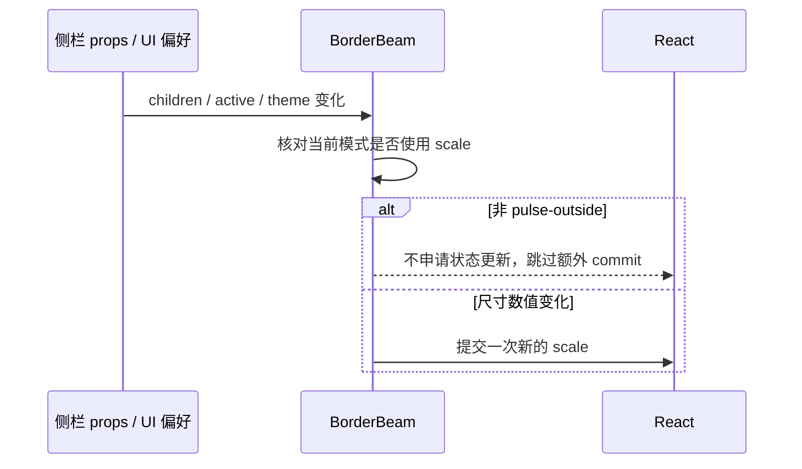

# 工作区侧栏动效更新边界

## 已确认故障

2026-10-09 的 workspace-sidebar 错误日志和对应构建的 sourcemap，将 React #185 的状态写入点映射到 border-beam 1.4.1：非 pulse-outside 模式的 effect 依赖 children，却每次写入新的 `{x:1,y:1}`。侧栏使用 line 模式，包括 inactive 的本地项目行；子树变化因此引入额外 commit，生产更新链中触发嵌套更新上限。主题切换不是已确认的独立致错点。

## 产品规则、所有者与接口

- 保留现有工作区行、重连状态、line 动效和主题视觉。远端重连 active 状态仍由现有 Host/侧栏 props 持有；不引入新缓存、计时器或状态 owner。
- BorderBeam 的 scale 仍由依赖组件持有，仅 pulse-outside 使用它；其它模式不得申请无意义的 scale 状态更新。尺寸变化的 pulse-outside 路径保留原幂等更新和测量规则。
- 用仓库已有 pnpm patchedDependencies 发布此修复，绑定已验证的 1.4.1；ESM 和 CJS 保持一致，禁止仅修改 node_modules。依赖锁及补丁随安装、Web、Electron renderer 构建生效。
- Desktop、Web 和 Windows/macOS/Linux 共用同一修复；手机 replayable 与桌面 continuous 不增加同步操作或协议变化。

## 验收

1. 真实依赖的 inactive line 模式在 children 持续变化时不产生额外状态 commit；不能靠延时、错误边界重试或隐藏行掩盖循环。
2. 接通实际 WorkspaceSidebarItem，覆盖本地行、远端重连、失败/断连/连接状态，主题与字号切换后菜单和折叠仍可操作，错误边界不出现。
3. 浏览器验证七色主题、宽屏与手机宽度；production 构建使用补丁后的依赖。
4. 根 typecheck、lint、架构检查，报告基线与新增违规，并记录未实机验证的平台。

## 验证记录

- 红灯：真实依赖在 60 次连续 children 更新后产生 60 次额外 commit。移除非 pulse-outside 的无效 scale 写入后，稳态更新只有预期的 60 次 commit；可见性初始化单独按浏览器事实结算。
- 两项浏览器回归通过，实际工作区行覆盖 5 种状态 × 7 个主题 × 2 个宽度，共 70 组状态/主题组合；还验证真实重连按钮、字号 20、折叠和菜单，未出现错误边界或浏览器异常。
- 根目录 typecheck、lint、定向 fixture 类型检查和定向 lint/格式检查通过；架构 baseline=0/new=0。状态所有者与事件顺序见上图，未引入 UI/Host 的第二条状态写入路径。
- pnpm frozen lockfile 检查通过。桌面生产构建成功，已核验生成的 renderer sourcemap 使用修复后的 ESM，安装依赖的 CJS 同样包含修复。构建仍有原有大 chunk 与无效动态 import 警告，不记为新的失败。
- 新回归及 fixture 共 318 行，依赖配置/锁和测试诊断辅助变更为 +12/-5，另有 4 条回归入库白名单与 9380 字节的依赖补丁。主题与运行环境的其它本地改动保留。
- 浏览器验证在本机 Windows 执行；未做 macOS/Linux 或手机原生实机验收。没有替换 D 盘已安装程序；需要将本次依赖补丁打包后更新安装，旧包刷新无法获得源码修复。
