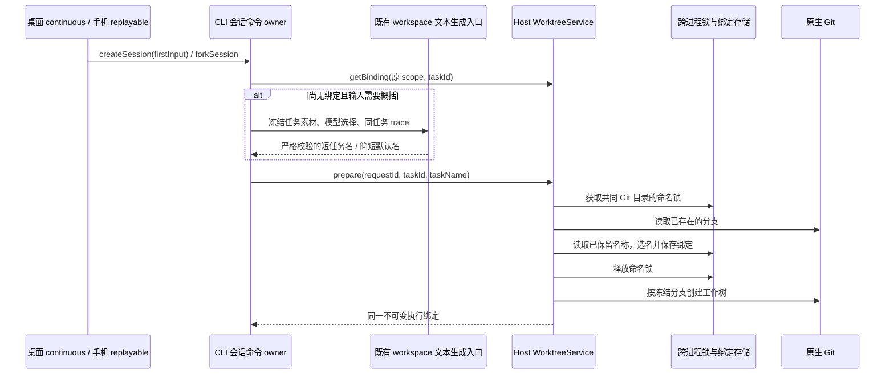

# 工作树任务分支命名

## 产品规则

- 新建工作树分支以 `lcode/task-` 为前缀，先从首次提交的任务文本概括核心动作和主要对象，保留用户语言和重要技术名称，不逐项拼接操作。例如包含多个删除操作的任务可概括为 `lcode/task-清理帮助与问题上报入口`。
- 已经简短的单行任务名（最多 16 个 Unicode 字符，仅文字、数字、空格及短横线）直接使用；其他非空输入在创建前经 CLI 的既有 `generateWorkspaceText` 模型入口生成名称。使用首发选择的模型，缺省读取 Environment 的默认选择；中文目标 8–16 字，英文目标 3–7 词，生成结果不得超过 24 个 Unicode 字符。模型只概括有界任务素材（最多 1200 个字符，包含换行后的内容），不回答或执行任务，不携带工具。
- 生成结果必须通过严格 JSON 和长度校验，不把超长响应再次硬截断。缺少模型、模型失败、超时或无效结果使用 `新会话`，空创建同样使用 `新会话`；新工作树分叉优先概括来源会话标题，缺少标题或概括失败使用 `分叉会话`。失败仅记录安全原因，不记录正文或模型响应，不阻止任务创建。
- Host 对已经概括的名称统一 Unicode，移除 Git ref 不允许的字符、控制字符及路径分隔符；空白和标点转换为短横线，名称主体最多 24 个 Unicode 字符。该字符上限仍是协议兼容和 Git 安全边界，不承担语义概括。
- 同一仓库中名称已被 Git 分支或持久绑定占用时，依次追加 `-2`、`-3` 等数字。并发创建也不能生成相同分支。
- WorktreeService 在仓库共同目录对应的跨进程命名锁内选名并保存绑定。保存后名称冻结；重试、重连、归档和恢复沿用原分支，任务重命名不触发 Git 分支重命名。旧绑定及其已有分支保持兼容。
- checkout 目录、bindingId、taskId、requestId、远程身份及执行路径继续使用原规则。可读名称只用于 Git 分支和既有路径展示，不承担身份、路由或幂等职责。
- 成功生成的名称同时交给 core 首发标题落库，所有侧栏视图复用同一任务标题；失败默认名不作为摘要。可信 seed、正文核验、手动名称保护与失败语义见[任务自动命名](task-summary-titles.md)，不新增公开协议字段或第二次工作树命名请求。

## 所有者与接口

CLI 从冻结的 firstInput 或来源会话标题提供可选的 `taskName`。原始输入只通过 CLI 内部创建 contract 传给命名入口，不扩大已有跨进程 `taskName` 字段（最多 256 个 UTF-16 单元）。WorktreeService 拥有最终分支名，domain 只负责纯文本规范化，app 通过现有 Git/store ports 分配名称和保存事实。无名称的旧调用仍可创建工作树。

命名入口在请求模型前按原 workspacePath、workspaceIdentity 和 commandId 派生的 taskId 查询 Host 绑定；存在任何绑定时不再概括，由原 prepare 路径复用或拒绝该绑定。查询失败必须向上冒泡，不能误判为不存在。CLI 不缓存第二份已接受名称。模型生成沿已有 Registry、请求鉴权、trace、用量与资源关闭路径；单次命名使用 15 秒 deadline，属于模型资源边界，不是等待状态同步。命名只使用既有临时 workspace 文本生成资源，完成或失败均关闭；不借用其他会话的 runtime，不污染其流与用量归属，不登记新聊天会话，也不启动额外 Agent/Host。

新名称在 Host 命名锁内保存后成为唯一事实；同一命令的并发/重放仍由既有 CommandInbox/Host 锁收敛。生成迟到结果不会改写已经创建的绑定。桌面 continuous 和手机 replayable 都发送相同 createSession 命令并读取 Host 的同一分支，不在 Renderer 增加命名状态或修改流恢复规则。

新工作树分叉在命名前和命名完成后都校验来源会话空闲；来源在等待模型时开始运行则拒绝分叉，不把异步等待前的状态当作当前事实。真正文件快照仍由 Host checkout permit 与已有原生 Git 校验保护。

命名锁嵌套于既有 task binding 锁内，不获取 checkout writer permit；相同任务的重试先读取原绑定，不重新选名。外部 Git 操作不受应用锁管理，检出时若外部创建了同名分支，沿用既有失败及人工对账语义，不覆盖外部分支或偷偷改名。

## 验收场景

1. 中文首条任务经过 V4 命令、CLI/Host 准备协议后生成可读分支，真实 Git `check-ref-format` 通过，执行目录仍为稳定 ID。
2. 连续及不同 Service 实例并发创建同名任务，依次得到原名、`-2`、`-3`；原有 Git 分支和未完成的绑定均占用名称。
3. Git 特殊字符、路径、emoji、换行、超长 Unicode 名称不会生成无效 ref；空名称使用中文默认值。
4. 创建失败后重试、进程重建、归档恢复及旧随机分支绑定保持原名，既有重试/许可边界不变。
5. 分叉概括来源标题；本地目录不请求命名模型或创建分支。桌面和手机沿现有协议显示 Host 返回的同一分支，不新增 UI 本地命名状态。
6. 多行、多项操作的长输入和首行超过 256 字的任务，概括素材仍包含后续主要对象；生成一个完整短任务名，再经真实 Git 创建验证。不得回退为原正文前 24 字。
7. 已存在绑定（包括失败、取消、归档及旧名称）和显式准备重试不调用命名模型；绑定查询失败不创建新名称。无模型、超时、异常、工具调用、非 JSON、空名称及超长响应均使用简短默认名，且释放临时 workspace 资源。
