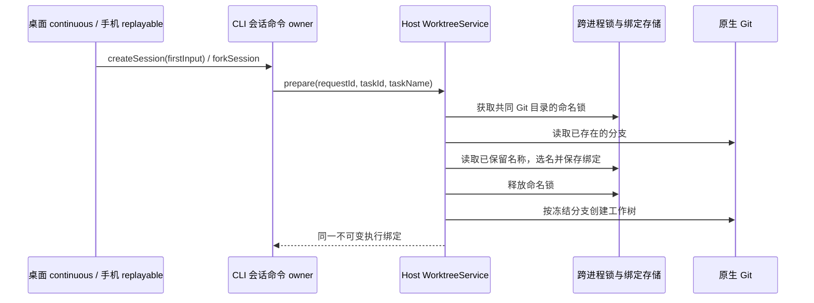

# 工作树任务分支命名

## 产品规则

- 新建工作树分支以 `lcode/task-` 为前缀，名称来自首次提交的任务文本，保留中文。例如 `lcode/task-修复模型切换`。不用绑定 ID、随机串或额外模型请求生成名称。
- 只取任务首行的有界内容，统一 Unicode，移除 Git ref 不允许的字符、控制字符及路径分隔符；空白和标点转换为短横线，名称主体最多 24 个 Unicode 字符。无法提取名称或显式空创建时使用 `新会话`；新工作树分叉优先使用来源会话标题，缺少标题时使用 `分叉会话`。
- 同一仓库中名称已被 Git 分支或持久绑定占用时，依次追加 `-2`、`-3` 等数字。并发创建也不能生成相同分支。
- WorktreeService 在仓库共同目录对应的跨进程命名锁内选名并保存绑定。保存后名称冻结；重试、重连、归档和恢复沿用原分支，任务重命名不触发 Git 分支重命名。旧绑定及其已有分支保持兼容。
- checkout 目录、bindingId、taskId、requestId、远程身份及执行路径继续使用原规则。可读名称只用于 Git 分支和既有路径展示，不承担身份、路由或幂等职责。

## 所有者与接口

CLI 从冻结的 firstInput 或来源会话标题提供可选的 `taskName`。共享 ExecutionIntent、工作树准备协议及服务 contract 严格校验该字段（最多 256 个 UTF-16 单元）。WorktreeService 拥有最终分支名，domain 只负责纯文本规范化，app 通过现有 Git/store ports 分配名称和保存事实。无名称的旧调用仍可创建工作树。

命名锁嵌套于既有 task binding 锁内，不获取 checkout writer permit；相同任务的重试先读取原绑定，不重新选名。外部 Git 操作不受应用锁管理，检出时若外部创建了同名分支，沿用既有失败及人工对账语义，不覆盖外部分支或偷偷改名。

## 验收场景

1. 中文首条任务经过 V4 命令、CLI/Host 准备协议后生成可读分支，真实 Git `check-ref-format` 通过，执行目录仍为稳定 ID。
2. 连续及不同 Service 实例并发创建同名任务，依次得到原名、`-2`、`-3`；原有 Git 分支和未完成的绑定均占用名称。
3. Git 特殊字符、路径、emoji、换行、超长 Unicode 名称不会生成无效 ref；空名称使用中文默认值。
4. 创建失败后重试、进程重建、归档恢复及旧随机分支绑定保持原名，既有重试/许可边界不变。
5. 分叉使用来源标题；本地目录不创建分支。桌面和手机沿现有协议显示 Host 返回的同一分支，不新增 UI 本地命名状态。
