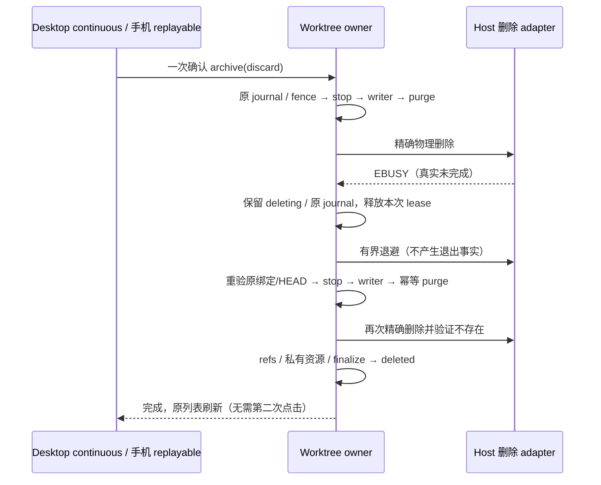
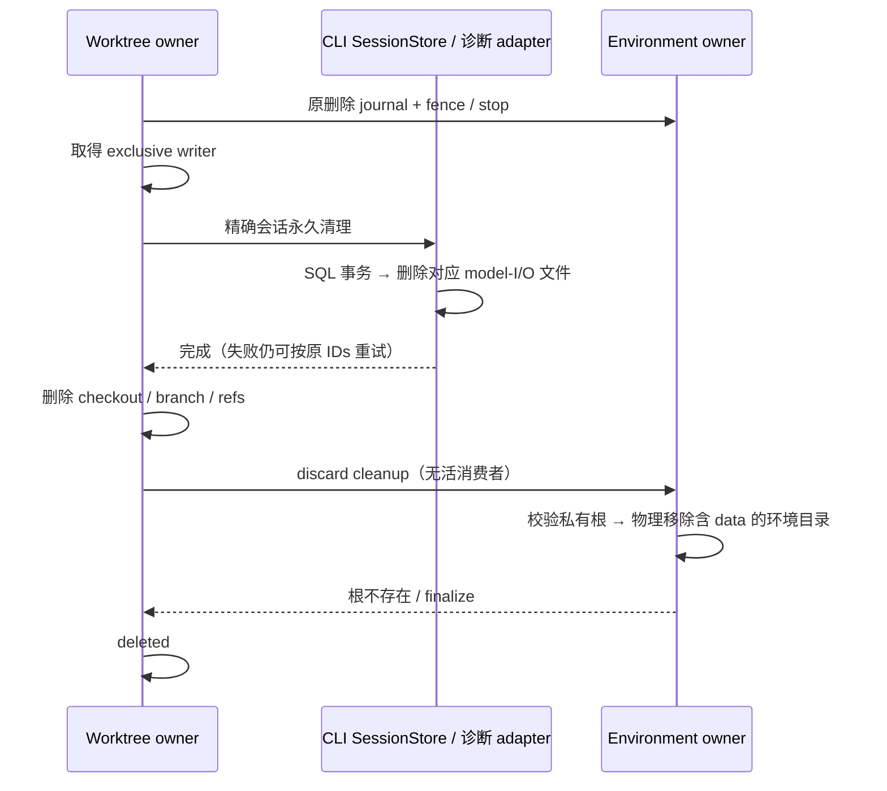
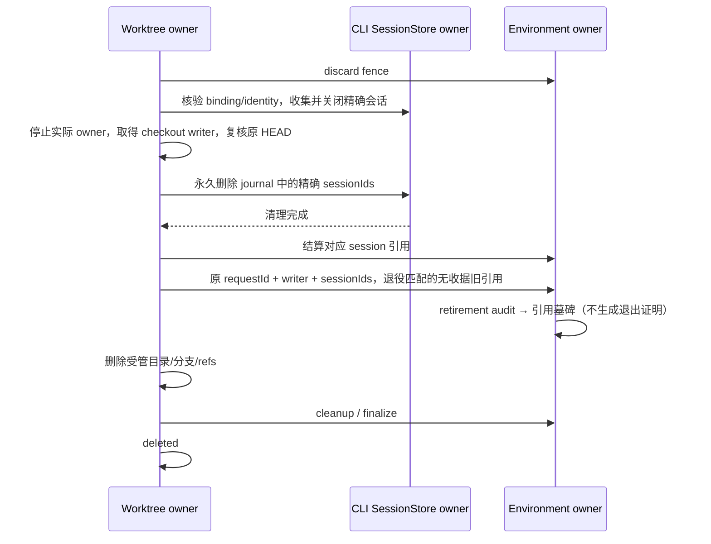
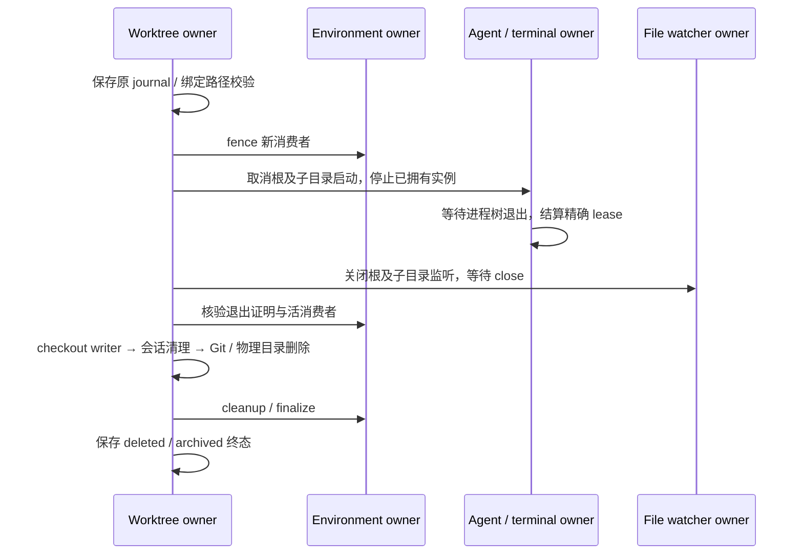
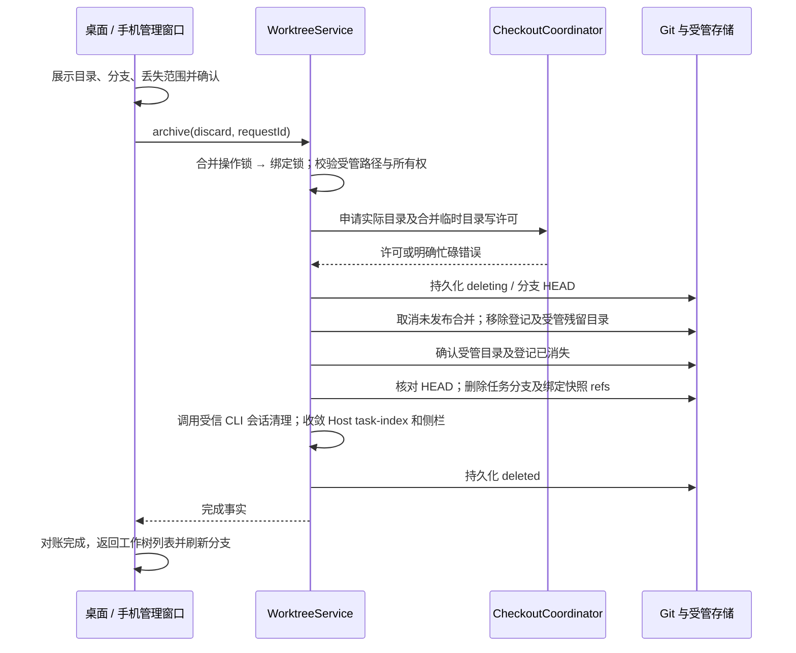
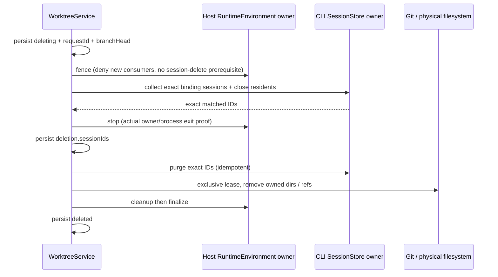
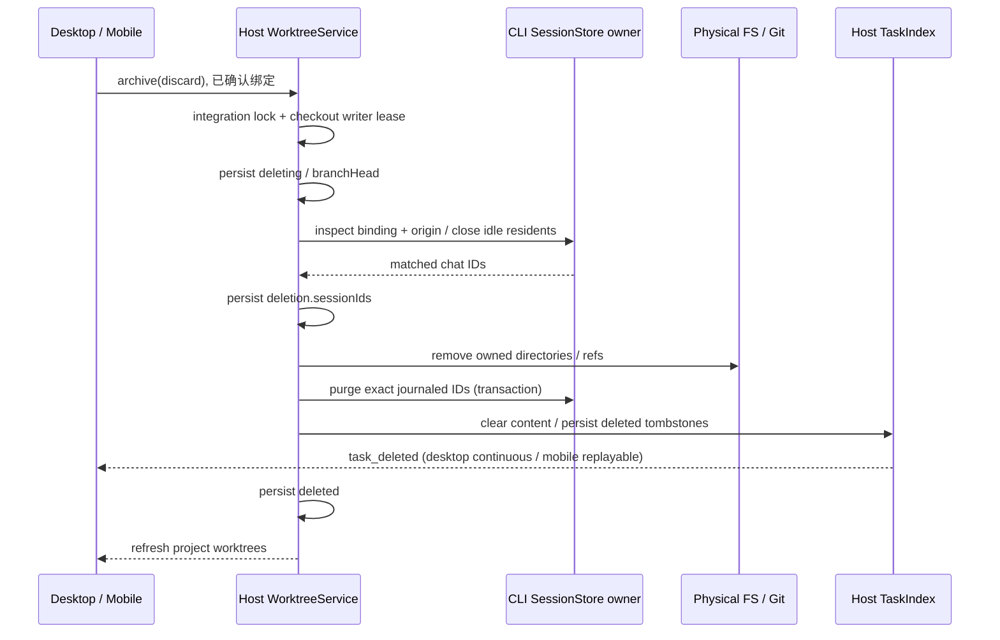
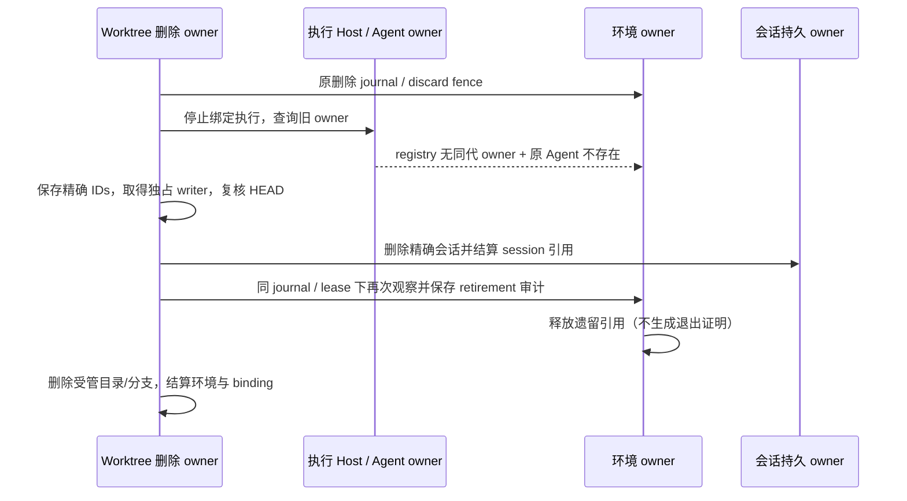
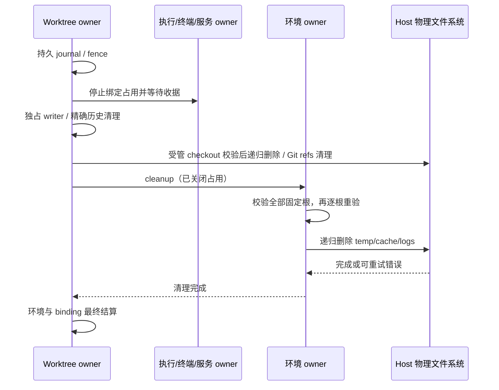

# 工作树归档与删除

## 产品规则

### 2026-10-11：普通归档复用同一套瞬时文件锁重试

保留快照的归档同样要物理移除 checkout，`git worktree remove --force` 与受管 `rm` 都可能在 Windows 上撞到持续数十秒的外部句柄（实测为持有 checkout 根目录 cwd 的进程）。此前只有确认删除有自动重试，归档中断后必须由用户再次确认。

- 归档沿用同一套有界重试：只有结构化 `EBUSY` / `ENOTEMPTY` / `EPERM` 才重试，1 秒起步、指数增长至每次最多 8 秒、单次确认最多累计等待 120 秒。不可重试的故障（身份、权限、仓库归属、分支变动、传输/数据库错误）立即原样失败。
- 重试只继续已持久化的原归档：复用 `archiveOperation.requestId`，每次重新进入原归档编排并重验绑定、受管路径、分支 HEAD、登记与 owner/lease。状态不再是 `archiving` 或 journal 不匹配时立即原样失败，绝不因任意瞬时文件锁接受新的归档范围。
- 已保存的快照是用户工作的唯一留存。重试不得用部分删除后的残缺目录覆盖它：快照已存在时只核对当前树仍与该快照一致，不一致即 fail closed，保留原快照与 `archiving` 状态，交由用户检查后重新确认。
- 等待期间不新增 UI 队列、确认或后台任务；Host 被终止时 journal 保留，后续重入继续原事务。删除与归档共用同一个等待 port `transientRetryWait`（日志事件 `worktree.transient-lock.retry`）。

### 2026-10-10：一次确认自动完成临时文件锁的删除重试

研究会话确认同一 checkout 的 Windows `EBUSY` 持续约一分钟，用户需手动点击五次才完成。已停止执行 owner 不代表外部文件句柄立即消失；具体外部占用者尚未确认，不能凭等待时长认定退出或按路径猜测并杀进程。

确认删除后的 Worktree owner 在同一次 `archive(discard)` 调用内自动重试有结构化 `EBUSY` / `ENOTEMPTY` / `EPERM` 错误码的文件操作。复用已持久化的 deletion requestId、branchHead、sessionIds；每次重新进入原删除编排，重验绑定、受管路径、分支 HEAD、integration 与 owner/lease，重新停止本绑定执行，重新收集并幂等清理精确会话及资源。不可重试的身份、权限业务规则、未知 owner、checkout writer 冲突、传输/数据库错误立即原样失败；不按错误文案识别暂时文件锁。

重试只有在持久状态为 `deleting` 且原确认的 binding/branch/checkout 一致时允许。等待由 Host adapter 提供，1 秒起步、指数增长至每次最多 8 秒，单次确认最多累计等待 120 秒；这是有界文件操作重试，不改变停止证明、checkout lease 和删除成功判据。耗尽保留最新结构化错误及原 journal，可继续原事务；不因耗尽预算宣告成功。等待前释放上一尝试的锁与 lease，持久 deletion fence 阻止新执行，下一尝试重新获取真实许可。Host 被终止时 journal 保留；后续重入继续原事务，本次不新增启动扫描或后台定时任务。

UI 和手机远控只发送一次已有确认命令，并保持原 pending 状态至操作完成，不在 Renderer/relay 中新增重试队列、确认或选择事实。仅在 checkout / Git 登记 / 分支 refs、精确会话历史和私有环境资源全部完成后返回 `deleted`，沿用刷新后的项目工作树列表。Host 日志记录原 binding/request、结构化错误码、尝试号和等待时长，便于识别自动重试。

验收：一个确认调用跨越模拟一分钟的文件占用后返回 deleted，过程中 requestId/HEAD/IDs 不变且无第二次确认；每次重入先收口 owner；持续占用耗尽预算后仍是 deleting；一般故障不自动重试；等待期间新分支/重定向/仓库变动必须拒绝，不能删除新内容；其他工作树、原项目、共享 store 和未知外部进程保持原状。Node 与 Electron original-fs 均走同一个 Worktree owner，Desktop 与手机复用原 RPC 调用。

验证：重试/真实 Git/owner 与物理删除 9 项通过，已有删除、会话、私有资源和历史引用回归 30 项通过；共享桌面/手机确认流程 4 项通过。Windows 实测真实子进程 cwd 目录锁在持有者退出后由同一次确认清理成功；持续占用的真实 120 秒等待预算也已执行并保持失败事实。根目录 typecheck、lint 通过，架构 baseline/new 均为 0。测试仅使用临时受管目录，没有删除用户实际工作树；macOS/Linux 未作实机验证。

### 2026-10-10：确认删除必须释放本绑定的私有数据与会话诊断文件

用户确认“删除工作树”用于彻底释放空间；沿用一次确认，不新建快照、提交、合并或推送。除 checkout、任务分支、绑定快照 refs、同树聊天外，还删除精确运行环境的整个私有 resources/<environmentId> 根（含 data），以及已清理会话的 model-I/O 文件。共享工具/package store、其他绑定及原项目保持不变；最小删除墓碑和退出审计保留用于拒绝旧请求。

WorktreeService 仍是删除编排唯一 owner：原 journal/fence → 真实执行停止 → exclusive checkout writer → CLI 精确会话事务删除及会话诊断文件清理 → checkout/refs → 环境私有资源 → finalize → deleted。环境 owner 只有在 discard cleanup、binding/scope/revision/digest 匹配、无活消费者且服务退出已确认后可移除 data。归档、升级、候选取消、普通 release 和 GC 继续只清理可重建资源，不获得 data 删除权限。旧版 released 环境也要在明确 discard 的 cleanup 中检查私有资源，不能只因逻辑 released 跳过物理清理。

模型诊断文件由 CLI adapter 使用与写入相同的文件名规则清理；只处理 SessionStore 已核验并永久清理的精确 sessionIds，不扫描或匹配其他会话文件。会话私有的 `cli/agents/<id>`、`cli/artifacts/<id>`、`cli/exec/<id>` 一并移除；公共媒体缓存和多会话日志不按文本匹配删除。固定根和全部精确会话目标先校验路径与重定向，不能跟随链接清理其他目录。文件清理失败向原删除命令传播，保留原 journal；数据库中的 ID 已消失时仍可幂等重试。关闭 resident 和等待实际执行停止先于清理，防止迟到写入重建会话文件。

物理删除不跟随后代链接；所有固定私有根和祖先预检完成后才移除环境根，根重定向、仍有消费者或持续 EBUSY 保留失败状态和原 requestId。删除返回成功必须核实目标根消失。Desktop continuous 与手机 replayable 沿用同一个 Host 删除命令和既有对账。

验收：含私有数据库的明确删除清空全部私有根而保留共享 store；活 session/进程/服务不得进入 data 删除；归档仍保留 data；EBUSY 和诊断文件删除失败沿原 journal 重试；会话已从 DB 消失后仍清理原文件；其他会话文件与后代链接目标保留；确认界面准确区分删除与保存快照。

真实数据另确认：早期删除只删除带 `runtime/worktree_binding` 的主会话，未保存该条目的子代理会话仍以 `parent_id` 指向已删除主会话并保留正文。SessionStore 查询从已核验绑定根及原 journal 中已不存在的根 ID 出发，递归收集同执行目录、同 identity key 的后代；有外来最新 binding、其他目录或 identity 的后代连同其子树受保护。仅有相似路径、没有父子链的会话不属于该范围。

Host 重试收集时通过可选 `seedSessionIds` 传递原 journal 的 ID，不能覆盖它；`sessionIds` 仍只表示永久清理，`seedSessionIds` 只用于范围核验/收集。每次重试先核实并关闭当前完整集合，Worktree owner 在 purge 前将新增后代合并进原 journal，再删除 SQL 和诊断文件。这样即使主会话已消失或诊断文件删除失败，后续重试仍保有所有子会话 ID；不得在 purge 之后才发现并记录它们。

验收补充：主会话存活/已删除时都收集递归子代理；同路径另一 identity、另一 binding、独立目录分叉与无亲缘会话保留；外来存在 seed 拒绝；完整子 IDs 在 SQL purge 前持久化；主/子正文、parts、输入及对应诊断文件一起清理，失败沿原 requestId 和 IDs 重试。

### 2026-10-09：Bash 隐式后台服务不得逃逸执行所有权

真实故障确认：当前 Agent 已正常退出，但先前 Bash 子 shell 派生的 Server/Vite 仍运行并持有 checkout 子目录。环境 consumer 墓碑只说明协议引用已结算，不代表这些未被登记的历史进程退出。

修复在 CLI ExecutionAdapter 的唯一启动/结算入口，详见 [Bash 派生进程结算](background-bash-lifecycle.md)。新 Bash execution 的 root 返回前后保持 OS 所有权，只有派生服务退出才发布完成并移除清理责任；close 失败可重试且保持启动 fence。原 Worktree stop → writer → purge → remove 顺序和一次确认交互继续复用。不能新增按目录名、端口或裸 PID 猜测进程归属的删除分支。

旧版本没有 OS 所有权记录的遗留进程不能自动认领；已确认的历史故障经独立核对会话、创建时间、父子关系后处理。该边界不得弱化现有跨 Host / identity / owner / lease 校验。

- 侧栏「工作树」分类提供每树独立的管理与删除入口，项目菜单导航到此分类；内部沿用现有项目工作树管理弹框，在里面确认“删除工作树”，详情复用同一操作。分类规则见 [工作树侧栏](worktree-sidebar.md)，不使用“强制删除”文案。删除会话后遗留的工作树也可从分支占用说明进入管理，无须打开或订阅已删除会话。
- 归档保留 HEAD、暂存区和非忽略的工作文件；忽略目录按目录记录省略范围，不能枚举 node_modules 中的所有文件。仍需确认忽略内容不会保存在快照中。
- 用户界面统一称“保存快照并释放目录”，避免与会话归档混淆；内部 `archive` 命令及 `archived` 阶段保持兼容。此动作只修改工作树，不修改任何会话的归档状态，也不把工作树放到会话归档列表。快照仍保存在“项目工作树”管理中，列表显示“目录已释放，快照可恢复”，详情展示快照提交和保存时间，并提供“恢复工作树目录”。同一工作树的所有会话共享快照与目录释放状态，恢复后才可继续执行。
- 强制删除不要求生成快照、提交或合并，不受未合并提交、未暂存文件或忽略文件限制。确认窗口显示工作树目录、任务分支和关联合并临时目录，说明内容无法恢复、使用同一工作树的分叉会话也受影响。取消不产生写操作。
- 删除移除受管目录、任务分支及此绑定拥有的快照 refs，并永久清理此工作树的全部会话聊天记录（包含同工作树分叉和已从列表删除的会话）。绑定删除墓碑仍保留，防止旧请求重建工作树。原项目目录、其他工作树会话、独立工作树分叉和已合并到目标分支的提交不受影响。
- 正在写入的目录由同一 checkout lease 裁决。必须先停止任务；不能靠 UI 的忙碌状态证明可删除。等待审核或冲突的合并可随强制删除取消，已经发布的目标提交不回滚。
- checkout 许可只作短暂接纳等待，活跃 writer 应明确返回忙碌；含大量依赖的目录移除使用独立的长文件操作预算，避免普通 Git 命令 15 秒预算中断清理。界面始终显示进行中状态，操作期间禁止重复提交。
- Git 移除工作树可能先解除登记、再因目录非空或文件占用而失败。生命周期 owner 在同一 checkout lease 内重新核对登记，清理受管路径中没有 `.git` 标记的残留目录；不能只因登记已缺失就宣告成功或永久阻止重试。清理必须复核目录 ID、受管根和路径未重定向，不能移除重新出现的仓库或原项目。
- 删除重试使用持久删除记录证明清理范围；旧版归档失败留下的快照也可在再次明确确认删除后清理。无删除记录、无快照且登记缺失的现存目录继续拒绝删除。普通归档中断后有快照、登记缺失时，核对任务分支仍为快照 HEAD，再继续清理并完成归档。
- 目录或登记仍存在时保留失败/进行中状态，不通知列表删除成功。暂时文件占用使用文件系统有限重试，持续占用仍报错并保留可重试阶段，不以延时假装状态同步。
- Desktop Host 的受管物理目录删除通过注入的原生文件系统执行。Electron 会将 ASAR 文件视为虚拟目录，不能用经过 ASAR patch 的递归删除去遍历 `node_modules/electron/dist/resources/default_app.asar`。Desktop 只在此删除适配器使用 `original-fs`；Node Server 使用原生 Node 文件系统，不修改全进程 `process.noAsar`，也不调用其他 Shell 删除。
- 删除完成条件同时包含目录/登记/分支清理和会话历史清理。会话清理由 CLI SessionStore 按持久 `runtime/worktree_binding.executionBindingId` 与原项目 identity 严格匹配，事务删除正文、parts、entries、输入及相关运行记录；不是只隐藏 task。没有任何会话也可删除工作树。清理失败保持 `deleting`，保存具体错误并允许重试；再次请求必须继续清理历史，不因目录或分支已消失而提前返回成功。
- 归档成功显示分支占用已释放。项目工作树弹框在删除命令确认完成并对账后自动返回重新读取的列表，删除项不再出现，无需返回后再删除一次；独立详情入口保留成功反馈。失败保留确认窗口、具体原因和重试按钮。
- 从分支选择器进入管理并删除工作树时，删除结果通过现有 `onDeleted` 通知选择器刷新；被删除的草稿基线按原删除处理回到 HEAD，不能继续保留不存在的分支。
- 删除后不能恢复或重建相同会话的工作树；再次创建任务会分配新的绑定，释放的分支名称可以复用。普通归档恢复允许在任务分支已被删除时从快照 HEAD 重新创建分支，绝不移动已变化的同名分支。

## 所有者与接口

### 2026-10-09：确认删除时自动结算旧版遗留引用

用户已明确选择在现有删除操作中完成恢复，不增加按钮、确认步骤或公开协议字段。`archive` 的显式 `discard` 确认同时授权本绑定旧版 process 引用的退役；保存快照、升级、候选取消、普通环境 release 和 GC 不获得此权限。

适用范围仅限：同 environment/binding/current revision；consumer 是旧桥接格式 `process`（`runtime-agent-<UUID>` owner，ID 为 `[精确 sessionId, app incarnation UUID]`）；sessionId 来自 CLI 按 binding/origin identity 核验并收集的列表；该 ID 没有持久 owner 收据。任何持久 owner 收据（含缺退出证明）、其他 kind/owner/格式、其他会话/identity/revision 继续阻塞，不能将缺 owner 的任意引用当作旧记录清空。

删除仍先 fence、关闭精确 resident、停止实际受管实例。stop 阶段只允许上述已收集的旧引用暂留，不写退出事实、不放宽服务退出证明。Worktree owner 随后保存原 requestId/branch HEAD/sessionIds，取得真实 exclusive checkout writer 并复核分支，永久删除精确会话历史；这一步成功且对应 session 引用均已结算后，Host-only `retireLegacyRuntimeConsumers` 才可退役匹配的旧引用。收据以 `reason=confirmed-worktree-discard` 保存到私有 `consumer-retirements/`，明确是用户确认删除下的旧数据迁移，不伪造 `exitConfirmedAt`。先保存精确 retirement 收据，再保存 released 引用；失败沿原 journal 幂等重试。目录/分支/refs/环境 finalize 全部完成后才写 deleted。

验收：复现旧版真实 ID 形状，现有一次删除完成；stop/writer/会话清理失败不退役；新 owner 活引用、外来会话/identity、异常引用仍阻塞；归档/升级/GC 不退役；收据或引用写失败可用原 requestId/HEAD/IDs 重试；desktop continuous 与手机 replayable 使用同一既有删除命令，三平台规则相同。

本次验证：真实 Git / 环境 / 删除编排回归 49 项通过，最终迁移与收据回归 11 项通过（有重叠）；共享桌面/手机 Web 交互 37 项通过，沿用一次确认和原 requestId 重试。根目录 typecheck、lint、变更文件格式检查通过，架构 baseline/new 均为 0。新增迁移用例、领域判定、夹具及集成测试四文件共 424 行，接口/编排/存储增量另见 diff；所有者与时序见上图。Windows 执行真实 Git/checkout writer，规则位于共享 Host；macOS/Linux 未做实机验证。对用户报告的旧记录只读检查确认精确会话范围及旧引用匹配，没有直接改用户引用、删除数据或替换安装包。本次已把恢复并入原删除，安装包需由本次源码重新构建并重启 Host 生效。

### 2026-10-09：停止子目录执行实例与文件监听器

WorktreeService 持续拥有原删除 journal、绑定和路径校验。Host 注入的 `stopWorktreeExecution(binding)` 在环境 fence 后、checkout writer 与目录移除前执行；本机策略和尚未分配环境的绑定也走此入口。会话收集只关闭精确绑定的 resident，不再附带另一条 Agent 释放路径。

上述所有者、顺序和失败语义适用于 Windows、macOS、Linux；共享 Host 服务实现停止，平台差异仅保留在既有进程树与物理文件系统适配器中，不能仅在 Windows 分支补逻辑。

Agent owner 根据本 Host 已拥有的进程与在途启动作用域，停止 checkout 根和真实子目录的 chat、plugin、MCP 控制面实例。必须同时核对 binding 身份和 canonical 路径，排除同路径其他 identity、相似前缀目录及指向树外的链接。已从复用池退休但尚未完成退出结算的实例仍在 owner 的追踪集合中；重试等待这些实例的真实进程树退出及精确 consumer lease 释放，不因复用池为空而跳过。停止中的启动先取消 admission、推进代际，再等待启动结算，不能留下迟到实例。

Agent owner 保存受管停止范围的 admission fence；后续启动向 Worktree owner 重读原 binding 状态，只有同一绑定、路径、身份已恢复 ready 才解除 fence。该 fence 不另存 binding 状态，也不由超时、UI 返回或目录存在解除，防止删除中后台查询重新启动子目录 Agent。

文件监听 owner 在 Git 移除前关闭 checkout 内监听器并等待 `close`，物理残留清理前再次收口。监听器只按已由 Worktree owner 校验的物理目录清理，不终止进程；树外监听器保持原状。Windows `EBUSY` 的有限文件系统重试保持原预算，持续外部占用保留错误和原 journal；重试复用首次 requestId、branch HEAD 和已结算的 sessionIds。不能通过扩大超时、泛杀进程或清空未知 owner 引用伪造成功。

验收覆盖：子目录实例与三条泳道停止；在途启动取消；退休实例退出结算失败后可重试；其他 identity / 相似路径 / 树外链接保留；监听 close 前不进入目录移除；首次 EBUSY 后重试原 journal 成功；未知 owner 仍阻塞。桌面 continuous 与手机 replayable 均调用目标 Host 的同一生命周期命令，不在 UI 或 relay 新增停止/重试事实。

本次验证记录：

- 共享生命周期回归 71 项通过；owner、终端、监听和三平台路径规则回归 25 项通过（含与前组重叠的终端/监听测试）。最后一次 owner/真实子目录进程/EBUSY 集成 6 项通过。测试使用临时受管目录，不清理用户实际工作树或历史 consumer。
- Electron 物理 ASAR 删除及真实共享 Web 组件流程共 38 项通过，含桌面/手机宽度的删除失败重试、成功后列表对账、归档/恢复和其他工作树保护。
- Windows 实测真实 Node 子进程 cwd、进程树退出、文件监听与 Electron utility Host；macOS/Linux 的 POSIX 路径规则有单测，未在这两个平台实机执行。缺少历史退出证明的 consumer 和持续外部占用仍按既有合同阻塞，不声称历史锁占用者已被确认或已完成迁移。
- 根目录 `pnpm typecheck`、`pnpm lint` 与变更文件格式检查通过；架构检查 baseline / new 均为 0。改变的模块为共享 services、worktree 与 runtime-environment；事实 owner 和事件顺序见上图。生命周期源码/测试相对 HEAD 为 +884/-129，净增 755 行，相关 spec/合同另行更新；其他主题/UI 本地改动保留。
- 本次未构建或替换已安装桌面包；共享 Host 需要用修复后的源码构建并重启，旧删除记录随后经原入口重试。

WorktreeService 是目录、绑定状态、快照和删除过程的唯一所有者。复用 `archive` 生命周期命令：默认保存快照；显式 `discard: { branch, checkoutPath }` 是确认过的删除。严格校验确认范围与绑定一致。Host 注入物理目录删除和会话清理端口，工作树模块不导入 Agent/runtime 具体实现。CLI SessionStore 独占聊天数据，Host task-index 独占列表投影；CLI 返回已删除的会话 ID 后，Host 用既有 task_deleted 事件收敛 Desktop continuous 与手机 replayable 的侧栏。默认保存快照仍保留聊天记录。

保留 `deleting` / `deleted` 墓碑及首次删除捕获的分支 HEAD。目录移除后的重试只删除该 HEAD 的分支；后续外部修改不得误删。墓碑不出现在项目工作树目录中，但 `getBinding` 继续返回它，阻止运行时将不存在的工作树误当成本地会话。

桌面 continuous 与手机 replayable 只影响聊天投影；此生命周期命令由目标 Host 执行，不依赖 session subscribe。未执行强制删除时保留原行为；旧绑定无需迁移，旧省略列表继续可读。之前已经删除的会话不自动清理文件，用户通过管理入口选择归档或强制删除。

## 2026-10-06 环境单写者结算合同（P4-04）

此节替代早期图中“先目录后聊天”的顺序：`deleting` + 稳定 `deletion.requestId` → 环境 fence（不等待 session 删除）→ `collectDiscardSessions(closeSessions: true)` 关闭精确绑定 Agent → 环境 stop 确认服务/进程停止 → journal 精确 CLI session IDs → checkout 独占许可 → purge 精确 IDs → 目录/refs → 环境 cleanup/finalize → `deleted`。任何缺少停止证明、端口或 cleanup 失败保留 deleting/error，重试沿原 requestId 和 sessionIds。环境引用存在而端口缺失必须 fail closed。目录移除前 purge 失败不得先删文件；purge 回复丢失可重入精确 IDs。

`environmentPolicy: managed` 只表示该绑定要求托管环境，不表示环境一定分配过。准备在环境阶段之前结束（例如 checkout 后取消，或取消调用本身失败但持久取消墓碑已生效）时，环境从未创建，绑定不会有 `environmentRef`，环境 owner 也没有对应记录。此时没有任何可释放的资源，release 必须按「无引用即跳过」返回成功，让删除/归档继续走到 `deleted`；不能因为策略是 managed 就抛错。该判定与 `discard` 自身的端口检查一致（仅在有引用时才要求端口存在），也符合本节「环境引用存在而端口缺失才 fail closed」的方向。反向约束同样成立：只要有 `environmentRef`（含 revision=0 的清理引用），就必须调用 release 并对账，不得跳过。

普通归档使用独立 `archiving` / `archiveOperation` journal，不复用永久 deleting：稳定 requestId → fence → stop 精确 owner（不 purge、不释放 session refs）→ snapshot → 目录 → 可重建资源 cleanup/finalize → archived。保留聊天、session 引用及不可重建私有数据；环境 owner 不得把归档当永久删除。故障仍可重新取得 checkout 许可并按 journal 继续。恢复成功清除本次归档 journal，后续归档可以创建新的操作；恢复环境与 session CAS 的统一收口见 `worktree-session-execution.md`。

验收新增 fence 在任何 collect/close 之前、stop 失败不 purge/删目录、purge 失败仍保留目录、丢回复重试稳定 IDs、资源 finalize 失败保留 tombstone 进行中、archive 保留 session/private data、缺环境端口 fail closed、restore 两条 Git 快路径都重建环境且 CAS 失败不 ready。

## 验收

1. 20 MB 以上的依赖忽略清单按目录压缩，归档能成功，真实 index 不改变，恢复文件状态正确。
2. 未合并提交、暂存 / 未暂存 / 未跟踪 / 忽略文件均可通过确认后的强制删除清理；原目录和目标分支不变，任务分支不再占用。
3. 没有可订阅会话时仍能清理；无需提交与合并审核。取消确认不调用服务。
4. live writer、目录重定向、范围不匹配、所有权变化拒绝删除并保留文件。
5. 删除中断后重试收敛；分支在中断后变化时拒绝删除新内容；重复请求无额外副作用。
6. 同工作树分叉读取同一删除墓碑，不回退到原项目执行；新的任务仍可创建新的工作树。
7. 已归档分支手动删除后可从快照恢复；同名分支变化时拒绝覆盖。
8. 桌面与窄屏共享确认窗口、成功反馈、失败重试和占用刷新行为。
9. 模拟 Git 解除登记后返回 Directory not empty，单次确认仍清理残留并完成删除/归档；跨进程重试不再被“登记缺失”卡住。
10. 旧删除记录和旧归档快照的残留目录可清理；无清理证据、重定向目录、新出现的 `.git` 标记、变化的分支 HEAD 均拒绝误删。
11. 项目工作树删除成功后自动显示刷新后的列表，桌面和窄屏都无需点击返回或第二次删除；失败后列表不误移除，重试成功后仅通知一次。
12. 保存快照并释放目录后，项目工作树列表保留带明确状态的条目，关闭重开仍可查看快照并恢复；不调用会话归档接口，没有忽略文件时也展示快照。
13. Electron utility Host 下，包含真实 ASAR 和大量依赖的临时目录能一次删除；物理删除不把 ASAR 当目录，不修改全局 ASAR 行为。纯 Node 使用相同受管路径校验。
14. 删除工作树永久清理根会话和同工作树分叉的正文、附件引用、输入和执行记录；已经隐藏的会话也清理。其他 identity、其他绑定、独立工作树分叉保留。清理后重开应用不复活。
15. 会话清理失败时不报告删除完成；目录已消失也可在重启后重试，成功后再写 deleted。归档仍保留历史。

## 2026-10-04 验证记录

- 工作树删除、部分目录移除、归档恢复、checkout 安全与共享会话绑定的真实 Git 回归共 27 项通过。
- `pnpm typecheck`、`pnpm lint`、`pnpm architecture:check --changed` 和 `pnpm verify:pre-push` 通过，架构 baseline / new 均为 0。
- 浏览器场景已补充确认成功自动返回列表、失败重试、释放目录后查看快照与关闭重开恢复、没有忽略文件时显示快照；仅做脚本语法检查。本轮按用户要求不构建桌面包、不运行界面回归，由用户构建验收。

## 删除执行接口（2026-10-05）

Host 注入 `removeDirectory(path)`，Desktop 使用 `original-fs.promises.rm`，Node Host 使用 Node fs。仅 Store 在 canonical 路径及 `.git` 校验后调用。
Host 注入 `collectDiscardSessions(binding)` 和 `discardSessions(binding, ids)`；前者从 CLI SessionStore 查询同绑定及同源身份的会话并关闭该执行空间 Agent，后者永久删除记录并广播 `task_deleted`。
`session/worktreeCleanup` 为严格校验的 Host → CLI 维护接口：无 `sessionIds` 时查询，`closeSessions` 收口同绑定的空闲 resident 并释放句柄；有 ID 时逐一校验持久绑定后事务删除，允许已删除 ID 幂等重入，禁止清理范围外的 ID。不使用关闭会话接口冒充永久删除。接口复用只读 Agent 启动，不依赖供应商/模型配置，也不为清理恢复会话。
会话 ID 在删除目录前写入 `deletion.sessionIds`，解决 SQL 提交成功但回复或索引更新失败后的重试。旧 `deleting` 记录首次重试补写，普通快照释放不调用此接口。CLI 清理 message/part/entry/input/usage 及所属运行记录；Host 删除投影并保留最小删除墓碑。

Host tasks DB 的新增冻结迁移 `0004_task_history_deletions` 记录永久删除的 workspace key / task ID。在清空内容的同一事务写墓碑；后续迟到 stream、snapshot、seed 或恢复请求均不能重新写入该任务的正文投影。旧软删除与归档保持原语义，历史迁移 checksum 不修改。

验证入口：`worktreeDiscardSessions.integration.test.ts`、CLI `worktree-cleanup.test.ts` / `worktree-session-cleanup.test.ts`、`taskIndexHistoryDeletion.test.ts`、真实 Electron utility Host 的 `worktree-physical-removal.test.mjs`，以及 Web `worktree-ui.test.mjs` 的 deletion 场景（1280 / 390 宽度）。不需要构建桌面包。

## Host 重启后遗留执行引用（2026-10-09）

已确认：本次删除绑定保留了有完整 owner 收据的 process 引用；对应旧 Agent 根进程已不存在，旧 Host 却未保存整棵进程树的退出确认。旧版无收据迁移不能处理它，因此每次删除都在 stop 阶段报 `execution owner has not confirmed exit`。当前本机没有 mise 进程，不能将此故障归因于 mise 常驻。

复用原确认删除事务和唯一 retirement 写入路径：执行 Host 通过注入的 owner 注册表及本机进程观察，识别本次精确会话中已不存在的旧 Agent owner。仍在注册表中的 owner、存在的 PID（包括可能复用的 PID）、缺失 PID、无观察能力或观察错误均继续阻塞。观察只表示原 Agent 不存在，不是进程树退出证明，禁止据此写 `exitConfirmedAt`。不能停止原项目共享 Agent或按裸 PID 杀进程。

只有原 journal、绑定、环境 revision/digest、consumer 完整 owner/generation/lease 一致，已持久 discard fence、真实执行停止成功、取得独占 checkout writer 并完成精确历史删除后，才再次观察并行政退役该遗留引用。私有 retirement 收据先落盘，记录原 processOwner 和观察时间，再释放引用；正常归档、升级和通用 release 不适用。观察变化、writer 或历史清理失败均保留引用；重启重试沿用原 request/HEAD/session IDs。

mise 按工具准备操作短暂执行，环境变量及工具路径作为执行上下文传给子进程，无需常驻激活进程。命令子进程由命令 owner 收回；用户显式启动的持续服务及终端由环境/终端 owner 管理，删除时停止并等待，不随每轮聊天结束擅自关闭。

验收：有现代收据的已消失原项目 Agent 能一次完成确认删除，审计保留原 owner 且没有退出证明；live/unknown owner、外来会话或旧 lease 阻塞；停止、writer、purge 失败不退役；第二次观察发现 owner 存在不退役；重启重试幂等；真实进程在 Windows/macOS/Linux 使用同一观察语义，平台实机结果分别报告。

本轮验证（Windows x64，Node 24.21.0）：23 项唯一回归用例通过，覆盖真实进程退出、原项目 owner 恢复、注册表各 lane、权限错误及删除重试；根 `pnpm typecheck`、`pnpm lint` 和 changed 架构检查通过，baseline/new 均为 0。未修改实际用户删除记录或聊天数据，未更新正在运行的安装包；macOS/Linux 实机未执行。

生产复核修正（2026-10-09）：20:56 的安装包已包含恢复代码，仍因分类器将现代 `runtimeInstanceId` 错当 UUID 而拒绝实际 `agent-<UUID>` 收据；此前使用裸 UUID 的测试没有覆盖真实格式。现代 owner 身份按不透明字符串处理，授权仍须精确 receipt 元组、实际 owner 和两次 absent 观察，禁止新增格式猜测。仅无收据的旧迁移保留原 UUID 格式边界。回归使用当前 Agent manager 生成的真实身份；继续保护 live/unknown、外来 scope、旧 lease 和不同生命周期。

重启 admission 修正：日志确认 `deleting` 工作树的 `packages/server` 在新 Host 启动后又被 Agent 占用。原内存 stop fence 只覆盖执行过 stop 的 Host，重启即丢失。WorktreeService 提供 Host-only `assertExecutionAdmission(scope)`，从受管 checkout 路径定位唯一 binding 并重读持久状态；删除中、已删除、已归档绑定拒绝启动。Agent 各 lane 在已有两次 spawn admission 中调用同一 owner，不通过 UI 状态或另存缓存判断。原项目 maintenance lane 保持可用，以便原删除事务清理历史。

定位只读取目标 checkout ID 的一条 binding，不遍历文件树或全部绑定；canonical 路径及 identity 与停止范围复用同一个实现，树外链接、相邻目录和其他 identity 不归本绑定。新的 Host 同样拒绝后台只读请求重新 spawn，已删除路径的最近存在祖先也须核对。公开 Worktree RPC 不包含此入口。失败删除后的跨 Host 重试先通过已有停止 port 收口，再取得 writer；恢复 ready 后才可执行。

本次生产修正验证（Windows x64）：49 项相关回归通过，包含生产 manager 的真实 `agent-<UUID>` 身份、完整 discard、重启后的后台只读 admission、其他 identity/树外链接保护、归档恢复、终端和 watcher 停止、EBUSY 重试；根 typecheck/Lint、修改文件格式与架构检查通过（baseline/new=0）。真实 4 条 deleting 记录仅做只读 admission 检查，均拒绝重新启动，耗时 1–8ms。CPU 采样只观察到界面/GPU/主进程的短时负载，尚未复现持续高峰，不能报告为已修复。

生产身份的 Windows x64 安装包 `packages/desktop/dist/LCode-3.17.6-win-x64.exe` 已生成；核对内部 Host 包含身份修正和持久 admission，安装包 SHA-512 与发布元数据一致。未覆盖正在运行的安装，未执行真实用户数据删除；macOS/Linux 未实机验证。执行顺序为原 journal/fence → 关闭绑定执行 → writer/精确清理 → retirement/物理删除；新 Host spawn 同时向 Worktree owner 读取该持久 fence，仍保持原项目 maintenance 可用。

变更归属为 runtime-environment、worktree 及 Services 组合/执行 owner；本会话相关未提交源码与测试累计新增 2661 行、删除 119 行、净增 2542 行（包含此前修复）。Worktree owner 持有删除 journal/状态，环境 owner 持有 consumer/retirement，Agent owner 持有真实进程集合；本轮没有增加第二份持久执行状态。

## 关闭占用后直接物理删除（2026-10-09）

用户确认继续简化删除。最新运行证据：一个 checkout 已删除成功，另一个 checkout 目录也已不存在，但绑定仍因环境 `clearRebuildable` 在扫描/逐项删除共用 2 秒预算而停留 deleting。checkout 原本已使用异步物理递归删除；修正对象是环境旁路的 temp/cache/logs 清理。

保留原 journal、绑定/HEAD、身份、退出收据、独占 writer 和精确历史清理顺序。环境 owner 在真实占用已收口后，先校验全部三个固定可重建根的受管归属及祖先没有重定向，再在每次删除前重验对应根并调用 Host 注入的物理递归删除 port。仅检查根及祖先，不预遍历所有后代，不使用资源扫描预算驱动删除。后代软链/目录联接由物理文件系统删除链接自身，不跟随到树外；根或祖先重定向仍拒绝。Desktop 使用 original-fs，Node/远端使用 Node fs，同一执行 owner/身份边界不变。

私有 data、共享 package/tool stores 及其他环境不在删除目标内。扫描/工具 GC 继续保持原预算和未知资源保护。物理删除失败保留原 journal 与 releasing/deleting 状态，成功返回后才结算；重复删除把不存在目录当作已清理，不额外询问用户。原生文件系统仍需逐项处理文件，但不重复执行 JS 全量扫描和每个文件的祖先验证。

验收：超出扫描时间/数量预算的清理仍能完成；只向物理 port 提交三个固定根，不遍历后代；嵌套 ASAR 和内部链接可清理且不影响外部目标；顶级根/祖先链接拒绝；EBUSY 后同 journal 重试完成；data、共享 stores 和其他环境保留；真实 Electron utility Host 验证物理 fs 接线。

本轮结果（Windows x64）：资源扫描/GC/直接删除 28 项、使用真实资源 adapter 的完整删除与重试 10 项、真实 Electron utility Host 1 项通过，共 39 项，无跳过。根 typecheck、Lint、修改文件格式和 changed 架构检查通过，baseline/new 为 0。生产构建及 Windows x64 安装包完成，包内确认资源和 checkout 共用 original-fs port，lifecycle 清理不再包含扫描预算/全量 entries 列表，安装包散列与元数据一致。macOS/Linux 未实机执行；实际用户数据未由本轮脚本修改，运行安装尚未自动覆盖。

本轮修改 runtime-environment adapter/Host contract、Services 与 Desktop 组合接线及相应测试；状态 owner 和删除事件顺序保持不变。相关修复源码/测试累计未提交统计新增 2913 行、删除 152 行、净增 2761 行（包含此前修复及本轮 Desktop 接线）。

## 2026-10-05 验证记录

- 真实 Electron utilityProcess 复现：普通 fs 将 `default_app.asar` 判为目录，递归删除未完成；注入 `original-fs` 后同样结构一次删除完成，全局 `process.noAsar` 未变化。
- 工作树删除 / 部分移除 / 安全和快照回归 26 项通过；CLI 数据清理、协议与 Host 永久删除 / 旧库迁移 5 项通过。真实正文、parts、输入历史、队列与 entries 均清空，范围外会话保留。
- Web 删除流程 1280 / 390 宽度通过：确认文案包含删除聊天；错误可重试，成功返回刷新列表，不重复确认。快照释放场景仍保留条目与历史语义。
- 根目录 `pnpm typecheck` / `pnpm lint` / `pnpm verify:pre-push` 通过；架构 baseline / new 为 0。CLI contracts 构建、adapters / bootstrap 类型检查通过。CLI lint 通过，bootstrap 原有 `checkout-execution-port.test.ts` 存在 1 条 optional chaining 警告，本次文件无新增警告。变更文件格式检查通过。
- 未构建桌面包，未修改当前运行的旧 Host 或用户实际聊天数据；安装新版并重启后，旧 `deleting` 记录可经同一删除入口继续清理。
