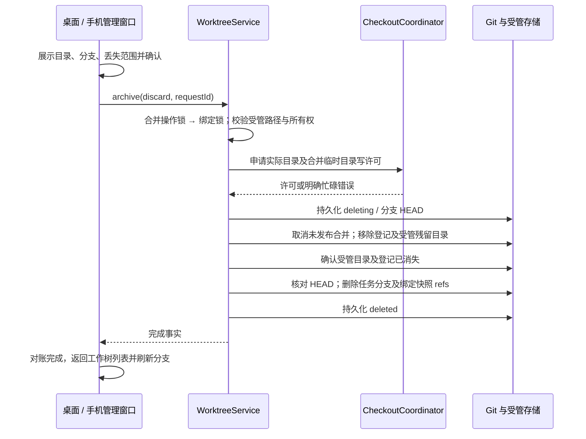

# 工作树归档与删除

## 产品规则

- 沿用现有项目工作树管理弹框，每个工作树行可点击删除图标，在里面确认“删除工作树”；详情中复用同一操作。不增加外部导航入口，不使用“强制删除”文案。删除会话后遗留的工作树也可从分支占用说明进入管理，无须打开或订阅已删除会话。
- 归档保留 HEAD、暂存区和非忽略的工作文件；忽略目录按目录记录省略范围，不能枚举 node_modules 中的所有文件。仍需确认忽略内容不会保存在快照中。
- 用户界面统一称“保存快照并释放目录”，避免与会话归档混淆；内部 `archive` 命令及 `archived` 阶段保持兼容。此动作只修改工作树，不修改任何会话的归档状态，也不把工作树放到会话归档列表。快照仍保存在“项目工作树”管理中，列表显示“目录已释放，快照可恢复”，详情展示快照提交和保存时间，并提供“恢复工作树目录”。同一工作树的所有会话共享快照与目录释放状态，恢复后才可继续执行。
- 强制删除不要求生成快照、提交或合并，不受未合并提交、未暂存文件或忽略文件限制。确认窗口显示工作树目录、任务分支和关联合并临时目录，说明内容无法恢复、使用同一工作树的分叉会话也受影响。取消不产生写操作。
- 强制删除移除受管目录、任务分支及此绑定拥有的快照 refs，保留聊天记录和删除墓碑。不会删除原项目目录或目标分支，也不自动终止正在写入目录的进程。
- 正在写入的目录由同一 checkout lease 裁决。必须先停止任务；不能靠 UI 的忙碌状态证明可删除。等待审核或冲突的合并可随强制删除取消，已经发布的目标提交不回滚。
- checkout 许可只作短暂接纳等待，活跃 writer 应明确返回忙碌；含大量依赖的目录移除使用独立的长文件操作预算，避免普通 Git 命令 15 秒预算中断清理。界面始终显示进行中状态，操作期间禁止重复提交。
- Git 移除工作树可能先解除登记、再因目录非空或文件占用而失败。生命周期 owner 在同一 checkout lease 内重新核对登记，清理受管路径中没有 `.git` 标记的残留目录；不能只因登记已缺失就宣告成功或永久阻止重试。清理必须复核目录 ID、受管根和路径未重定向，不能移除重新出现的仓库或原项目。
- 删除重试使用持久删除记录证明清理范围；旧版归档失败留下的快照也可在再次明确确认删除后清理。无删除记录、无快照且登记缺失的现存目录继续拒绝删除。普通归档中断后有快照、登记缺失时，核对任务分支仍为快照 HEAD，再继续清理并完成归档。
- 目录或登记仍存在时保留失败/进行中状态，不通知列表删除成功。暂时文件占用使用文件系统有限重试，持续占用仍报错并保留可重试阶段，不以延时假装状态同步。
- 归档成功显示分支占用已释放。项目工作树弹框在删除命令确认完成并对账后自动返回重新读取的列表，删除项不再出现，无需返回后再删除一次；独立详情入口保留成功反馈。失败保留确认窗口、具体原因和重试按钮。
- 从分支选择器进入管理并删除工作树时，删除结果通过现有 `onDeleted` 通知选择器刷新；被删除的草稿基线按原删除处理回到 HEAD，不能继续保留不存在的分支。
- 删除后不能恢复或重建相同会话的工作树；再次创建任务会分配新的绑定，释放的分支名称可以复用。普通归档恢复允许在任务分支已被删除时从快照 HEAD 重新创建分支，绝不移动已变化的同名分支。

## 所有者与接口

WorktreeService 是目录、绑定状态、快照和删除过程的唯一所有者。复用 `archive` 生命周期命令：默认保存快照；显式 `discard: { branch, checkoutPath }` 是确认过的强制删除。严格校验确认范围与绑定一致。Host 装配和 RPC 复用现有接口，桌面和手机通过同一 hook 发送命令，不在 UI 执行 Git 或文件删除。

保留 `deleting` / `deleted` 墓碑及首次删除捕获的分支 HEAD。目录移除后的重试只删除该 HEAD 的分支；后续外部修改不得误删。墓碑不出现在项目工作树目录中，但 `getBinding` 继续返回它，阻止运行时将不存在的工作树误当成本地会话。

桌面 continuous 与手机 replayable 只影响聊天投影；此生命周期命令由目标 Host 执行，不依赖 session subscribe。未执行强制删除时保留原行为；旧绑定无需迁移，旧省略列表继续可读。之前已经删除的会话不自动清理文件，用户通过管理入口选择归档或强制删除。

## 验收

1. 20 MB 以上的依赖忽略清单按目录压缩，归档能成功，真实 index 不改变，恢复文件状态正确。
2. 未合并提交、暂存 / 未暂存 / 未跟踪 / 忽略文件均可通过确认后的强制删除清理；原目录和目标分支不变，任务分支不再占用。
3. 没有可订阅会话时仍能清理；无需提交与合并审核。取消确认不调用服务。
4. live writer、目录重定向、范围不匹配、所有权变化拒绝删除并保留文件。
5. 删除中断后重试收敛；分支在中断后变化时拒绝删除新内容；重复请求无额外副作用。
6. 同工作树分叉读取同一删除墓碑，不回退到原项目执行；新的任务仍可创建新的工作树。
7. 已归档分支手动删除后可从快照恢复；同名分支变化时拒绝覆盖。
8. 桌面与窄屏共享确认窗口、成功反馈、失败重试和占用刷新行为。
9. 模拟 Git 解除登记后返回 Directory not empty，单次确认仍清理残留并完成删除/归档；跨进程重试不再被“登记缺失”卡住。
10. 旧删除记录和旧归档快照的残留目录可清理；无清理证据、重定向目录、新出现的 `.git` 标记、变化的分支 HEAD 均拒绝误删。
11. 项目工作树删除成功后自动显示刷新后的列表，桌面和窄屏都无需点击返回或第二次删除；失败后列表不误移除，重试成功后仅通知一次。
12. 保存快照并释放目录后，项目工作树列表保留带明确状态的条目，关闭重开仍可查看快照并恢复；不调用会话归档接口，没有忽略文件时也展示快照。

## 2026-10-04 验证记录

- 工作树删除、部分目录移除、归档恢复、checkout 安全与共享会话绑定的真实 Git 回归共 27 项通过。
- `pnpm typecheck`、`pnpm lint`、`pnpm architecture:check --changed` 和 `pnpm verify:pre-push` 通过，架构 baseline / new 均为 0。
- 浏览器场景已补充确认成功自动返回列表、失败重试、释放目录后查看快照与关闭重开恢复、没有忽略文件时显示快照；仅做脚本语法检查。本轮按用户要求不构建桌面包、不运行界面回归，由用户构建验收。
