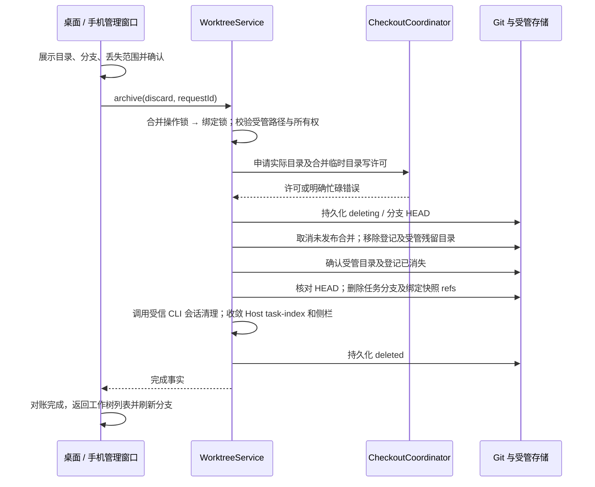
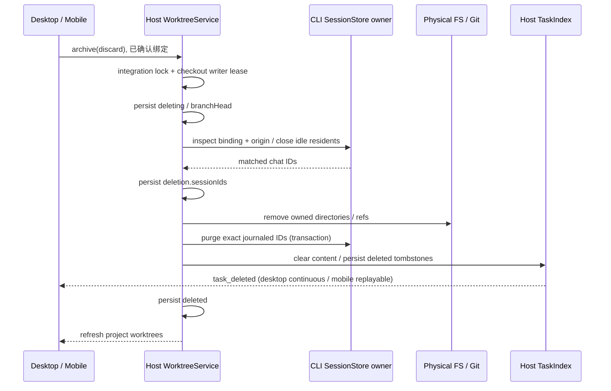

# 工作树归档与删除

## 产品规则

- 沿用现有项目工作树管理弹框，每个工作树行可点击删除图标，在里面确认“删除工作树”；详情中复用同一操作。不增加外部导航入口，不使用“强制删除”文案。删除会话后遗留的工作树也可从分支占用说明进入管理，无须打开或订阅已删除会话。
- 归档保留 HEAD、暂存区和非忽略的工作文件；忽略目录按目录记录省略范围，不能枚举 node_modules 中的所有文件。仍需确认忽略内容不会保存在快照中。
- 用户界面统一称“保存快照并释放目录”，避免与会话归档混淆；内部 `archive` 命令及 `archived` 阶段保持兼容。此动作只修改工作树，不修改任何会话的归档状态，也不把工作树放到会话归档列表。快照仍保存在“项目工作树”管理中，列表显示“目录已释放，快照可恢复”，详情展示快照提交和保存时间，并提供“恢复工作树目录”。同一工作树的所有会话共享快照与目录释放状态，恢复后才可继续执行。
- 强制删除不要求生成快照、提交或合并，不受未合并提交、未暂存文件或忽略文件限制。确认窗口显示工作树目录、任务分支和关联合并临时目录，说明内容无法恢复、使用同一工作树的分叉会话也受影响。取消不产生写操作。
- 删除移除受管目录、任务分支及此绑定拥有的快照 refs，并永久清理此工作树的全部会话聊天记录（包含同工作树分叉和已从列表删除的会话）。绑定删除墓碑仍保留，防止旧请求重建工作树。原项目目录、其他工作树会话、独立工作树分叉和已合并到目标分支的提交不受影响。
- 正在写入的目录由同一 checkout lease 裁决。必须先停止任务；不能靠 UI 的忙碌状态证明可删除。等待审核或冲突的合并可随强制删除取消，已经发布的目标提交不回滚。
- checkout 许可只作短暂接纳等待，活跃 writer 应明确返回忙碌；含大量依赖的目录移除使用独立的长文件操作预算，避免普通 Git 命令 15 秒预算中断清理。界面始终显示进行中状态，操作期间禁止重复提交。
- Git 移除工作树可能先解除登记、再因目录非空或文件占用而失败。生命周期 owner 在同一 checkout lease 内重新核对登记，清理受管路径中没有 `.git` 标记的残留目录；不能只因登记已缺失就宣告成功或永久阻止重试。清理必须复核目录 ID、受管根和路径未重定向，不能移除重新出现的仓库或原项目。
- 删除重试使用持久删除记录证明清理范围；旧版归档失败留下的快照也可在再次明确确认删除后清理。无删除记录、无快照且登记缺失的现存目录继续拒绝删除。普通归档中断后有快照、登记缺失时，核对任务分支仍为快照 HEAD，再继续清理并完成归档。
- 目录或登记仍存在时保留失败/进行中状态，不通知列表删除成功。暂时文件占用使用文件系统有限重试，持续占用仍报错并保留可重试阶段，不以延时假装状态同步。
- Desktop Host 的受管物理目录删除通过注入的原生文件系统执行。Electron 会将 ASAR 文件视为虚拟目录，不能用经过 ASAR patch 的递归删除去遍历 `node_modules/electron/dist/resources/default_app.asar`。Desktop 只在此删除适配器使用 `original-fs`；Node Server 使用原生 Node 文件系统，不修改全进程 `process.noAsar`，也不调用其他 Shell 删除。
- 删除完成条件同时包含目录/登记/分支清理和会话历史清理。会话清理由 CLI SessionStore 按持久 `runtime/worktree_binding.executionBindingId` 与原项目 identity 严格匹配，事务删除正文、parts、entries、输入及相关运行记录；不是只隐藏 task。没有任何会话也可删除工作树。清理失败保持 `deleting`，保存具体错误并允许重试；再次请求必须继续清理历史，不因目录或分支已消失而提前返回成功。
- 归档成功显示分支占用已释放。项目工作树弹框在删除命令确认完成并对账后自动返回重新读取的列表，删除项不再出现，无需返回后再删除一次；独立详情入口保留成功反馈。失败保留确认窗口、具体原因和重试按钮。
- 从分支选择器进入管理并删除工作树时，删除结果通过现有 `onDeleted` 通知选择器刷新；被删除的草稿基线按原删除处理回到 HEAD，不能继续保留不存在的分支。
- 删除后不能恢复或重建相同会话的工作树；再次创建任务会分配新的绑定，释放的分支名称可以复用。普通归档恢复允许在任务分支已被删除时从快照 HEAD 重新创建分支，绝不移动已变化的同名分支。

## 所有者与接口

WorktreeService 是目录、绑定状态、快照和删除过程的唯一所有者。复用 `archive` 生命周期命令：默认保存快照；显式 `discard: { branch, checkoutPath }` 是确认过的删除。严格校验确认范围与绑定一致。Host 注入物理目录删除和会话清理端口，工作树模块不导入 Agent/runtime 具体实现。CLI SessionStore 独占聊天数据，Host task-index 独占列表投影；CLI 返回已删除的会话 ID 后，Host 用既有 task_deleted 事件收敛 Desktop continuous 与手机 replayable 的侧栏。默认保存快照仍保留聊天记录。

保留 `deleting` / `deleted` 墓碑及首次删除捕获的分支 HEAD。目录移除后的重试只删除该 HEAD 的分支；后续外部修改不得误删。墓碑不出现在项目工作树目录中，但 `getBinding` 继续返回它，阻止运行时将不存在的工作树误当成本地会话。

桌面 continuous 与手机 replayable 只影响聊天投影；此生命周期命令由目标 Host 执行，不依赖 session subscribe。未执行强制删除时保留原行为；旧绑定无需迁移，旧省略列表继续可读。之前已经删除的会话不自动清理文件，用户通过管理入口选择归档或强制删除。

## 验收

1. 20 MB 以上的依赖忽略清单按目录压缩，归档能成功，真实 index 不改变，恢复文件状态正确。
2. 未合并提交、暂存 / 未暂存 / 未跟踪 / 忽略文件均可通过确认后的强制删除清理；原目录和目标分支不变，任务分支不再占用。
3. 没有可订阅会话时仍能清理；无需提交与合并审核。取消确认不调用服务。
4. live writer、目录重定向、范围不匹配、所有权变化拒绝删除并保留文件。
5. 删除中断后重试收敛；分支在中断后变化时拒绝删除新内容；重复请求无额外副作用。
6. 同工作树分叉读取同一删除墓碑，不回退到原项目执行；新的任务仍可创建新的工作树。
7. 已归档分支手动删除后可从快照恢复；同名分支变化时拒绝覆盖。
8. 桌面与窄屏共享确认窗口、成功反馈、失败重试和占用刷新行为。
9. 模拟 Git 解除登记后返回 Directory not empty，单次确认仍清理残留并完成删除/归档；跨进程重试不再被“登记缺失”卡住。
10. 旧删除记录和旧归档快照的残留目录可清理；无清理证据、重定向目录、新出现的 `.git` 标记、变化的分支 HEAD 均拒绝误删。
11. 项目工作树删除成功后自动显示刷新后的列表，桌面和窄屏都无需点击返回或第二次删除；失败后列表不误移除，重试成功后仅通知一次。
12. 保存快照并释放目录后，项目工作树列表保留带明确状态的条目，关闭重开仍可查看快照并恢复；不调用会话归档接口，没有忽略文件时也展示快照。
13. Electron utility Host 下，包含真实 ASAR 和大量依赖的临时目录能一次删除；物理删除不把 ASAR 当目录，不修改全局 ASAR 行为。纯 Node 使用相同受管路径校验。
14. 删除工作树永久清理根会话和同工作树分叉的正文、附件引用、输入和执行记录；已经隐藏的会话也清理。其他 identity、其他绑定、独立工作树分叉保留。清理后重开应用不复活。
15. 会话清理失败时不报告删除完成；目录已消失也可在重启后重试，成功后再写 deleted。归档仍保留历史。

## 2026-10-04 验证记录

- 工作树删除、部分目录移除、归档恢复、checkout 安全与共享会话绑定的真实 Git 回归共 27 项通过。
- `pnpm typecheck`、`pnpm lint`、`pnpm architecture:check --changed` 和 `pnpm verify:pre-push` 通过，架构 baseline / new 均为 0。
- 浏览器场景已补充确认成功自动返回列表、失败重试、释放目录后查看快照与关闭重开恢复、没有忽略文件时显示快照；仅做脚本语法检查。本轮按用户要求不构建桌面包、不运行界面回归，由用户构建验收。

## 删除执行接口（2026-10-05）

Host 注入 `removeDirectory(path)`，Desktop 使用 `original-fs.promises.rm`，Node Host 使用 Node fs。仅 Store 在 canonical 路径及 `.git` 校验后调用。
Host 注入 `collectDiscardSessions(binding)` 和 `discardSessions(binding, ids)`；前者从 CLI SessionStore 查询同绑定及同源身份的会话并关闭该执行空间 Agent，后者永久删除记录并广播 `task_deleted`。
`session/worktreeCleanup` 为严格校验的 Host → CLI 维护接口：无 `sessionIds` 时查询，`closeSessions` 收口同绑定的空闲 resident 并释放句柄；有 ID 时逐一校验持久绑定后事务删除，允许已删除 ID 幂等重入，禁止清理范围外的 ID。不使用关闭会话接口冒充永久删除。接口复用只读 Agent 启动，不依赖供应商/模型配置，也不为清理恢复会话。
会话 ID 在删除目录前写入 `deletion.sessionIds`，解决 SQL 提交成功但回复或索引更新失败后的重试。旧 `deleting` 记录首次重试补写，普通快照释放不调用此接口。CLI 清理 message/part/entry/input/usage 及所属运行记录；Host 删除投影并保留最小删除墓碑。

Host tasks DB 的新增冻结迁移 `0004_task_history_deletions` 记录永久删除的 workspace key / task ID。在清空内容的同一事务写墓碑；后续迟到 stream、snapshot、seed 或恢复请求均不能重新写入该任务的正文投影。旧软删除与归档保持原语义，历史迁移 checksum 不修改。

验证入口：`worktreeDiscardSessions.integration.test.ts`、CLI `worktree-cleanup.test.ts` / `worktree-session-cleanup.test.ts`、`taskIndexHistoryDeletion.test.ts`、真实 Electron utility Host 的 `worktree-physical-removal.test.mjs`，以及 Web `worktree-ui.test.mjs` 的 deletion 场景（1280 / 390 宽度）。不需要构建桌面包。

## 2026-10-05 验证记录

- 真实 Electron utilityProcess 复现：普通 fs 将 `default_app.asar` 判为目录，递归删除未完成；注入 `original-fs` 后同样结构一次删除完成，全局 `process.noAsar` 未变化。
- 工作树删除 / 部分移除 / 安全和快照回归 26 项通过；CLI 数据清理、协议与 Host 永久删除 / 旧库迁移 5 项通过。真实正文、parts、输入历史、队列与 entries 均清空，范围外会话保留。
- Web 删除流程 1280 / 390 宽度通过：确认文案包含删除聊天；错误可重试，成功返回刷新列表，不重复确认。快照释放场景仍保留条目与历史语义。
- 根目录 `pnpm typecheck` / `pnpm lint` / `pnpm verify:pre-push` 通过；架构 baseline / new 为 0。CLI contracts 构建、adapters / bootstrap 类型检查通过。CLI lint 通过，bootstrap 原有 `checkout-execution-port.test.ts` 存在 1 条 optional chaining 警告，本次文件无新增警告。变更文件格式检查通过。
- 未构建桌面包，未修改当前运行的旧 Host 或用户实际聊天数据；安装新版并重启后，旧 `deleting` 记录可经同一删除入口继续清理。
